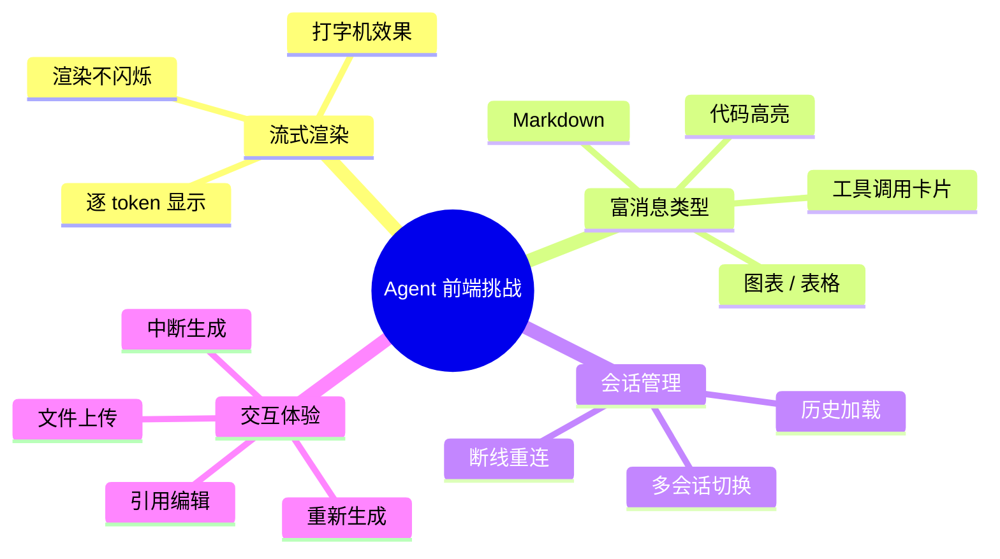
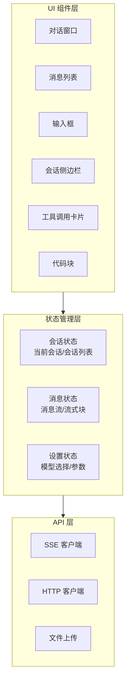
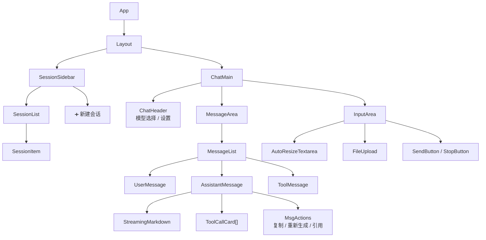

# 55 · Agent 前端集成架构

> 阶段：4 生产化 · 难度：⭐⭐⭐ · 预计：2 天
> 前置：[54 Agent SDK 与客户端工程](54-Agent%20SDK与客户端工程.md)
> 产出：掌握 Agent 前端集成的完整方案——SSE 渲染、会话管理、工具调用展示

---

## 你将学会

- Agent 前端的核心挑战与架构模式
- SSE 流式渲染：逐 token 打字效果
- 富消息渲染：Markdown / 代码高亮 / 工具调用卡片
- 会话列表、消息历史、断线重连的前端实现

---

## Agent 前端的核心挑战

传统前端是 **请求→等待→渲染完整响应** 的模式。Agent 前端需要处理：



---

## 知识讲解

### 1. Agent 前端架构



### 2. SSE 流式渲染（TypeScript/React）

```typescript
// hooks/useAgentChat.ts — Agent 对话 Hook

import { useState, useCallback, useRef } from 'react';

interface ChatChunk {
  type: 'token' | 'tool_call' | 'usage' | 'done' | 'error';
  text?: string;
  toolCall?: { name: string; args: any; result?: string };
  usage?: { promptTokens: number; completionTokens: number };
  error?: string;
}

interface Message {
  id: string;
  role: 'user' | 'assistant' | 'tool';
  content: string;
  toolCalls?: any[];
  streaming?: boolean; // 标记正在流式接收
  usage?: { promptTokens: number; completionTokens: number };
}

export function useAgentChat(apiKey: string, sessionId: string) {
  const [messages, setMessages] = useState<Message[]>([]);
  const [isStreaming, setIsStreaming] = useState(false);
  const abortRef = useRef<AbortController | null>(null);

  /**
   * 发送消息（流式）
   */
  const send = useCallback(async (text: string) => {
    // 1. 添加用户消息
    const userMsg: Message = { id: crypto.randomUUID(), role: 'user', content: text };
    // 2. 创建 assistant 消息占位（streaming=true）
    const assistantId = crypto.randomUUID();
    const assistantMsg: Message = { id: assistantId, role: 'assistant', content: '', streaming: true };

    setMessages(prev => [...prev, userMsg, assistantMsg]);
    setIsStreaming(true);

    // 3. 建立 SSE 连接
    abortRef.current = new AbortController();

    try {
      const resp = await fetch('/api/v1/chat', {
        method: 'POST',
        headers: {
          'Content-Type': 'application/json',
          'Authorization': `Bearer ${apiKey}`,
        },
        body: JSON.stringify({ sessionId, messages: [...messages, { role: 'user', content: text }], stream: true }),
        signal: abortRef.current.signal,
      });

      // 4. 解析 SSE 流
      const reader = resp.body!.getReader();
      const decoder = new TextDecoder();
      let buffer = '';

      while (true) {
        const { done, value } = await reader.read();
        if (done) break;

        buffer += decoder.decode(value, { stream: true });
        const events = buffer.split('\n\n'); // SSE 事件分隔符
        buffer = events.pop() || ''; // 最后一个可能不完整，保留

        for (const event of events) {
          const chunk = parseSseEvent(event);
          if (!chunk) continue;

          // 5. 更新 assistant 消息内容
          setMessages(prev => prev.map(m => {
            if (m.id !== assistantId) return m;
            return applyChunk(m, chunk);
          }));
        }
      }

      // 6. 标记完成
      setMessages(prev => prev.map(m =>
        m.id === assistantId ? { ...m, streaming: false } : m
      ));
    } catch (err: any) {
      if (err.name === 'AbortError') {
        // 用户主动中断
        setMessages(prev => prev.map(m =>
          m.id === assistantId ? { ...m, streaming: false, content: m.content + '\n\n[已中断]' } : m
        ));
      } else {
        setMessages(prev => prev.map(m =>
          m.id === assistantId ? { ...m, streaming: false, content: '❌ 错误: ' + err.message } : m
        ));
      }
    } finally {
      setIsStreaming(false);
    }
  }, [apiKey, sessionId, messages]);

  /**
   * 中断生成
   */
  const stop = useCallback(() => {
    abortRef.current?.abort();
  }, []);

  /**
   * 重新生成最后一条
   */
  const regenerate = useCallback(async () => {
    const lastUser = [...messages].reverse().find(m => m.role === 'user');
    if (!lastUser) return;

    // 移除最后一条 assistant 消息
    setMessages(prev => {
      const idx = prev.findLastIndex(m => m.role === 'assistant');
      if (idx === -1) return prev;
      return prev.slice(0, idx);
    });

    await send(lastUser.content);
  }, [messages, send]);

  return { messages, isStreaming, send, stop, regenerate };
}

/**
 * 解析单个 SSE event
 */
function parseSseEvent(raw: string): ChatChunk | null {
  let type = 'token';
  let data = '';

  for (const line of raw.split('\n')) {
    if (line.startsWith('event:')) type = line.slice(6).trim();
    if (line.startsWith('data:')) data = line.slice(5).trim();
  }

  if (!data) return null;

  try {
    const parsed = JSON.parse(data);
    return { type, ...parsed };
  } catch {
    return { type, text: data };
  }
}

/**
 * 将 chunk 应用到消息
 */
function applyChunk(msg: Message, chunk: ChatChunk): Message {
  switch (chunk.type) {
    case 'token':
      return { ...msg, content: msg.content + (chunk.text || '') };
    case 'tool_call':
      return { ...msg, toolCalls: [...(msg.toolCalls || []), chunk.toolCall!] };
    case 'usage':
      return { ...msg, usage: chunk.usage };
    default:
      return msg;
  }
}
```

### 3. 流式 Markdown 渲染

流式输出时 Markdown 是不完整的——半个代码块、半个表格。需要增量渲染：

```typescript
// components/StreamingMarkdown.tsx

import ReactMarkdown from 'react-markdown';
import { Prism as SyntaxHighlighter } from 'react-syntax-highlighter';

interface Props {
  content: string;     // 可能不完整的 Markdown
  streaming?: boolean; // 是否正在流式接收
}

export function StreamingMarkdown({ content, streaming }: Props) {
  // 检测未闭合的代码块
  const codeBlockCount = (content.match(/```/g) || []).length;
  const hasUnclosedCode = codeBlockCount % 2 !== 0;

  // 如果有未闭合代码块，临时补全
  const safeContent = hasUnclosedCode && streaming
    ? content + '\n```'  // 临时闭合
    : content;

  return (
    <div className="streaming-markdown">
      <ReactMarkdown
        components={{
          code({ node, className, children, ...props }) {
            const match = /language-(\w+)/.exec(className || '');
            const isInline = !match && !String(children).includes('\n');

            if (isInline) {
              return <code className="inline-code" {...props}>{children}</code>;
            }

            return (
              <div className="code-block-wrapper">
                <div className="code-block-header">
                  <span>{match?.[1] || 'code'}</span>
                  <button onClick={() => navigator.clipboard.writeText(String(children))}>
                    📋 复制
                  </button>
                </div>
                <SyntaxHighlighter language={match?.[1] || 'text'} PreTag="div">
                  {String(children).replace(/\n$/, '')}
                </SyntaxHighlighter>
              </div>
            );
          },
        }}
      >
        {safeContent}
      </ReactMarkdown>
      {streaming && <span className="cursor-blink">▊</span>}
    </div>
  );
}
```

### 4. 工具调用卡片

```typescript
// components/ToolCallCard.tsx

interface ToolCall {
  name: string;
  args: Record<string, any>;
  result?: string;
  status: 'running' | 'success' | 'error';
  duration?: number; // 毫秒
}

export function ToolCallCard({ toolCall }: { toolCall: ToolCall }) {
  const icon = getToolIcon(toolCall.name);

  return (
    <div className={`tool-card tool-card--${toolCall.status}`}>
      <div className="tool-card-header" onClick={() => toggleExpand()}>
        <span className="tool-icon">{icon}</span>
        <span className="tool-name">{formatToolName(toolCall.name)}</span>
        {toolCall.status === 'running' && <Spinner />}
        {toolCall.status === 'success' && <span>✅ {toolCall.duration}ms</span>}
        {toolCall.status === 'error' && <span>❌</span>}
      </div>

      {expanded && (
        <div className="tool-card-body">
          <div className="tool-args">
            <label>参数</label>
            <pre><code>{JSON.stringify(toolCall.args, null, 2)}</code></pre>
          </div>
          {toolCall.result && (
            <div className="tool-result">
              <label>结果</label>
              <pre><code>{toolCall.result}</code></pre>
            </div>
          )}
        </div>
      )}
    </div>
  );
}

function getToolIcon(name: string): string {
  if (name.includes('search')) return '🔍';
  if (name.includes('database') || name.includes('query')) return '🗄️';
  if (name.includes('email') || name.includes('send')) return '📧';
  if (name.includes('file') || name.includes('read')) return '📄';
  return '🔧';
}
```

### 5. 会话管理

```typescript
// hooks/useSessionManager.ts

export function useSessionManager() {
  const [sessions, setSessions] = useState<Session[]>([]);
  const [currentSessionId, setCurrentSessionId] = useState<string | null>(null);

  // 加载会话列表
  const loadSessions = useCallback(async () => {
    const resp = await fetch('/api/v1/sessions');
    const data = await resp.json();
    setSessions(data.sessions);
  }, []);

  // 切换会话
  const switchSession = useCallback(async (sessionId: string) => {
    setCurrentSessionId(sessionId);
    // 加载历史消息
    const resp = await fetch(`/api/v1/sessions/${sessionId}/messages`);
    const data = await resp.json();
    // 设置到消息状态
  }, []);

  // 新建会话
  const newSession = useCallback(async () => {
    const resp = await fetch('/api/v1/sessions', { method: 'POST' });
    const data = await resp.json();
    setSessions(prev => [data.session, ...prev]);
    setCurrentSessionId(data.session.id);
  }, []);

  // 删除会话
  const deleteSession = useCallback(async (sessionId: string) => {
    await fetch(`/api/v1/sessions/${sessionId}`, { method: 'DELETE' });
    setSessions(prev => prev.filter(s => s.id !== sessionId));
    if (currentSessionId === sessionId) {
      setCurrentSessionId(null);
    }
  }, [currentSessionId]);

  return { sessions, currentSessionId, loadSessions, switchSession, newSession, deleteSession };
}
```

---

## 前端组件树



---

## 常见坑

- ❌ **流式渲染闪烁** → 每次 token 到达重新渲染整个 Markdown 导致闪烁。用 key 稳定 + 虚拟化
- ❌ **Markdown 不完整渲染报错** → 未闭合代码块/表格导致解析器崩溃。需要补全逻辑
- ❌ **中断后无法重新发送** → AbortController 清理不当，导致后续请求被阻止
- ❌ **长对话卡顿** → 消息列表过长导致渲染卡顿。需要虚拟滚动
- ❌ **重新生成把用户消息也删了** → 只删 assistant 消息，保留 user 消息
- ❌ **移动端 SSE 断连** → 移动端切后台时 SSE 连接被系统杀死。需要重连机制

---

## 验收检查

- [ ] 流式对话能逐 token 显示（打字机效果）
- [ ] Markdown 和代码高亮正确渲染
- [ ] 工具调用以卡片形式展示（名称/参数/结果/耗时）
- [ ] 可以中断正在生成的回复
- [ ] 可以重新生成最后一条回复
- [ ] 多会话切换正常，历史消息能加载
- [ ] 移动端布局正常

---

## 下一步

→ 下一篇：[56 Agent 语音对话工程化](56-Agent语音对话工程化.md)
