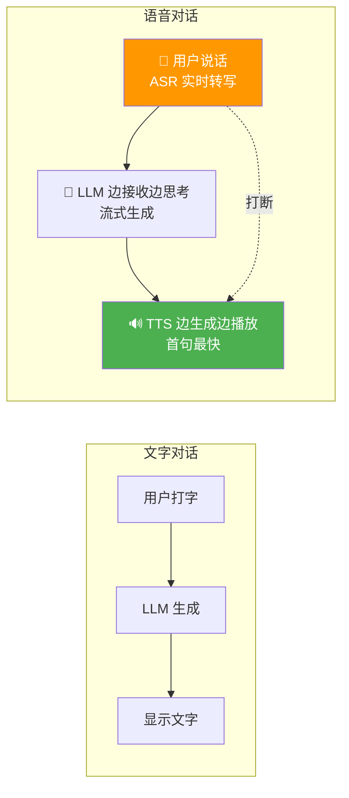
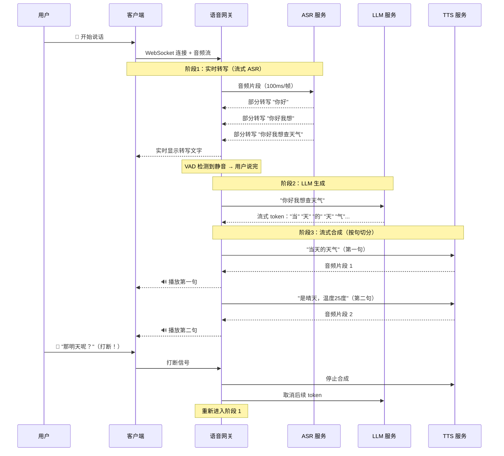
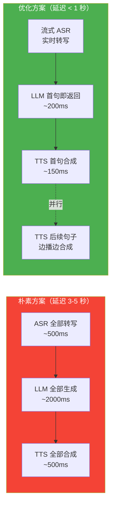

# 56 · Agent 语音对话工程化

> 阶段：4 生产化 · 难度：⭐⭐⭐⭐ · 预计：3 天
> 前置：[55 Agent 前端集成架构](55-Agent前端集成架构.md)
> 产出：掌握 ASR → LLM → TTS 全链路语音对话的工程化方案

---

## 你将学会

- 语音对话的三段链路（ASR → LLM → TTS）
- 实时语音流的双工通信（WebSocket）
- 端点检测（VAD）：判断用户何时说完
- 语音对话的延迟优化策略

---

## 为什么语音对话很难

文字对话是 **请求→生成→返回** 的串行流程。语音对话需要全双工——**边听边说**：



关键挑战：

| 挑战 | 说明 |
|------|------|
| 端到端延迟 | 用户说完到听到第一个字，目标 < 1 秒 |
| 端点检测（VAD） | 判断用户是停顿还是说完了 |
| 打断处理 | 用户中途说话需要立即停止 TTS |
| 音质 vs 延迟 | 高质量 TTS 需要更多计算时间 |

---

## 知识讲解

### 1. 语音对话全链路



### 2. VAD 端点检测

```java
package demo.demo04.voice;

/**
 * Voice Activity Detection — 端点检测
 * 判断音频流中什么时候是语音、什么时候是静音
 */
public class VadDetector {

    private final double energyThreshold;   // 能量阈值（dB）
    private final int silenceDurationMs;     // 静音持续时间判定说完
    private final int minSpeechMs;           // 最短语音时长（过滤噪声）

    // 状态
    private boolean inSpeech = false;
    private long speechStartMs = 0;
    private long silenceStartMs = 0;

    public VadDetector() {
        this(30.0, 700, 300); // 默认：30dB阈值，700ms静音判定说完，最短300ms语音
    }

    /**
     * 处理一帧音频，返回状态
     */
    public VadState process(byte[] audioFrame, int sampleRate) {
        double energy = calculateEnergy(audioFrame);
        boolean isVoice = energy > energyThreshold;

        long now = System.currentTimeMillis();

        if (isVoice && !inSpeech) {
            // 静音 → 语音：开始说话
            inSpeech = true;
            speechStartMs = now;
            return VadState.SPEECH_START;
        }

        if (!isVoice && inSpeech) {
            // 语音 → 静音：可能说完了
            if (silenceStartMs == 0) {
                silenceStartMs = now;
            }

            long silenceMs = now - silenceStartMs;
            long speechMs = silenceStartMs - speechStartMs;

            if (speechMs >= minSpeechMs && silenceMs >= silenceDurationMs) {
                // 确认说完
                inSpeech = false;
                silenceStartMs = 0;
                return VadState.SPEECH_END;
            }
            return VadState.IN_SPEECH_PAUSE; // 说话中的停顿
        }

        if (isVoice) {
            silenceStartMs = 0; // 重置静音计时
            return VadState.SPEAKING;
        }

        return VadState.SILENCE;
    }

    /**
     * 计算 PCM 音频帧的能量（dB）
     */
    private double calculateEnergy(byte[] frame) {
        // 16-bit PCM, mono
        long sum = 0;
        int samples = frame.length / 2;
        for (int i = 0; i < frame.length; i += 2) {
            short sample = (short) ((frame[i + 1] << 8) | (frame[i] & 0xFF));
            sum += (long) sample * sample;
        }
        double rms = Math.sqrt((double) sum / samples);
        if (rms < 1) return 0;
        return 20 * Math.log10(rms);
    }

    public enum VadState {
        SILENCE,           // 静音
        SPEECH_START,      // 开始说话
        SPEAKING,          // 正在说话
        IN_SPEECH_PAUSE,   // 说话中停顿
        SPEECH_END         // 说完（端点）
    }
}
```

### 3. 语音对话网关

```java
package demo.demo04.voice;

import org.springframework.stereotype.Component;
import org.springframework.web.socket.*;
import org.springframework.web.socket.handler.*;

import java.io.*;
import java.nio.ByteBuffer;
import java.util.*;

/**
 * 语音对话 WebSocket 处理器
 * 全双工：接收音频 → ASR → LLM → TTS → 发送音频
 */
@Component
public class VoiceChatHandler extends AbstractWebSocketHandler {

    private final AsrClient asrClient;
    private final TtsClient ttsClient;
    private final VoiceOrchestrator orchestrator;

    @Override
    public void afterConnectionEstablished(WebSocketSession session) {
        var ctx = new VoiceSessionContext(session.getId());
        session.getAttributes().put("ctx", ctx);
    }

    /**
     * 处理二进制消息（音频帧）
     */
    @Override
    protected void handleBinaryMessage(WebSocketSession session, BinaryMessage message) {
        var ctx = (VoiceSessionContext) session.getAttributes().get("ctx");
        byte[] audioFrame = message.getByteArray();

        // 1. VAD 端点检测
        VadDetector.VadState vadState = ctx.vad.process(audioFrame, 16000);

        if (vadState == VadDetector.VadState.SILENCE) return;

        // 2. 发送到 ASR 实时转写
        if (vadState == VadDetector.VadState.SPEAKING
            || vadState == VadDetector.VadState.SPEECH_START) {
            asrClient.sendAudio(ctx, audioFrame);
        }

        // 3. 端点：用户说完
        if (vadState == VadDetector.VadState.SPEECH_END) {
            String finalText = asrClient.finalize(ctx);
            // 发送最终转写给客户端
            sendText(session, "{\"type\":\"transcript\",\"text\":\"" + finalText + "\"}");

            // 4. 启动 LLM + TTS 流水线
            orchestrator.processUtterance(ctx, finalText, session);
        }
    }

    /**
     * 处理文本消息（控制指令）
     */
    @Override
    protected void handleTextMessage(WebSocketSession session, TextMessage message) {
        var ctx = (VoiceSessionContext) session.getAttributes().get("ctx");

        // 客户端发送 {"type":"interrupt"} 表示用户打断
        if (message.getPayload().contains("interrupt")) {
            orchestrator.cancelCurrent(ctx);
            // 停止 TTS 播放
            sendText(session, "{\"type\":\"tts_stop\"}");
        }
    }

    @Override
    public void afterConnectionClosed(WebSocketSession session, CloseStatus status) {
        var ctx = (VoiceSessionContext) session.getAttributes().get("ctx");
        if (ctx != null) {
            ctx.cleanup();
        }
    }

    private void sendText(WebSocketSession session, String text) {
        try {
            session.sendMessage(new TextMessage(text));
        } catch (IOException e) {
            // 连接断开
        }
    }
}
```

### 4. 语音编排器

```java
package demo.demo04.voice;

import org.springframework.ai.chat.client.ChatClient;
import org.springframework.web.socket.*;
import reactor.core.publisher.*;

import java.util.concurrent.*;

/**
 * 语音编排器：LLM 流式生成 + TTS 按句切分合成
 */
public class VoiceOrchestrator {

    private final ChatClient chatClient;
    private final TtsClient ttsClient;
    private final ExecutorService pool = Executors.newCachedThreadPool();

    /**
     * 处理一轮用户话语
     */
    public void processUtterance(VoiceSessionContext ctx, String userText, WebSocketSession session) {
        ctx.currentFuture = pool.submit(() -> {
            try {
                // LLM 流式生成
                StringBuilder sentenceBuffer = new StringBuilder();

                chatClient.prompt()
                        .user(userText)
                        .advisors(spec -> spec.param("conversation_id", ctx.sessionId))
                        .stream()
                        .content()
                        .doOnNext(token -> {
                            sentenceBuffer.append(token);

                            // 按标点切句（句号/问号/感叹号/换行）
                            if (isSentenceEnd(sentenceBuffer.toString())) {
                                String sentence = sentenceBuffer.toString().trim();
                                sentenceBuffer.setLength(0);

                                // 流式 TTS 合成并发送
                                sendTtsAudio(sentence, session, ctx);
                            }
                        })
                        // 处理最后剩余的文本
                        .doOnComplete(() -> {
                            if (sentenceBuffer.length() > 0) {
                                sendTtsAudio(sentenceBuffer.toString().trim(), session, ctx);
                            }
                            sendText(session, "{\"type\":\"tts_done\"}");
                        })
                        .blockLast();

            } catch (Exception e) {
                if (!(e.getCause() instanceof CancellationException)) {
                    sendText(session, "{\"type\":\"error\",\"message\":\"" + e.getMessage() + "\"}");
                }
            }
        });
    }

    /**
     * 取消当前生成
     */
    public void cancelCurrent(VoiceSessionContext ctx) {
        if (ctx.currentFuture != null) {
            ctx.currentFuture.cancel(true);
        }
    }

    /**
     * 合成并发送 TTS 音频
     */
    private void sendTtsAudio(String text, WebSocketSession session, VoiceSessionContext ctx) {
        if (text.isEmpty()) return;

        byte[] audio = ttsClient.synthesize(text, ctx.voiceConfig);

        try {
            // 发送音频二进制帧
            session.sendMessage(new BinaryMessage(ByteBuffer.wrap(audio)));
        } catch (Exception e) {
            // 连接断开
        }
    }

    private boolean isSentenceEnd(String text) {
        char last = text.charAt(text.length() - 1);
        return last == '。' || last == '？' || last == '！'
            || last == '.' || last == '?' || last == '!'
            || last == '\n' || last == ',';
    }

    private void sendText(WebSocketSession session, String text) {
        try {
            session.sendMessage(new TextMessage(text));
        } catch (Exception e) { }
    }
}
```

### 5. 延迟优化策略



| 优化手段 | 效果 | 说明 |
|---------|------|------|
| 流式 ASR | -300ms | 边说边转写，不需要等说完 |
| 首句即响应 | -1500ms | LLM 输出第一个完整句立即合成 |
| 并行 TTS | -500ms | 当前句播放时，下一句已在合成 |
| 流式 TTS | -200ms | TTS 流式输出，不等完整句 |
| 模型就近部署 | -100ms | ASR/LLM/TTS 与网关同 Region |
| 预热连接 | -50ms | WebSocket 长连接，避免每次握手 |

---

## 动手实践

### Step 1：搭建 WebSocket 语音网关

```java
@Configuration
@EnableWebSocket
public class VoiceConfig implements WebSocketConfigurer {

    @Override
    public void registerWebSocketHandlers(WebSocketHandlerRegistry registry) {
        registry.addHandler(voiceChatHandler(), "/api/voice/chat")
                .setAllowedOrigins("*");
    }

    @Bean
    public VoiceChatHandler voiceChatHandler() {
        return new VoiceChatHandler();
    }
}
```

### Step 2：ASR 客户端

```java
@Component
public class WhisperAsrClient implements AsrClient {

    private final WebClient webClient;

    /**
     * 发送音频片段（流式）
     */
    @Override
    public void sendAudio(VoiceSessionContext ctx, byte[] audioFrame) {
        // 发送到流式 ASR 服务（如 Whisper Streaming）
        webClient.post()
                .uri("/asr/stream")
                .body(BodyInserters.fromValue(audioFrame))
                .retrieve()
                .bodyToFlux(String.class)
                .subscribe(partial -> {
                    // 实时转写结果
                });
    }

    /**
     * 获取最终转写
     */
    @Override
    public String finalize(VoiceSessionContext ctx) {
        // 请求最终结果
        return webClient.post()
                .uri("/asr/finalize")
                .retrieve()
                .bodyToMono(String.class)
                .block();
    }
}
```

### Step 3：TTS 客户端

```java
@Component
public class TTSC ttsClient {

    /**
     * 合成语音
     */
    public byte[] synthesize(String text, VoiceConfig config) {
        return webClient.post()
                .uri("/tts/synthesize")
                .body(Map.of(
                    "text", text,
                    "voice", config.voice(),
                    "speed", config.speed(),
                    "format", "pcm_16000"
                ))
                .retrieve()
                .bodyToMono(byte[].class)
                .block();
    }
}

record VoiceConfig(String voice, double speed, String format) {}
```

---

## 常见坑

- ❌ **VAD 阈值太高** → 说话声音小被当成静音，用户体验差
- ❌ **VAD 阈值太低** → 环境噪声被当成说话，不断触发 ASR
- ❌ **打断后 TTS 继续播放** → 打断信号必须立即停止 TTS 输出和音频播放
- ❌ **句子切分太细** → 每个逗号都触发 TTS，导致语音不自然
- ❌ **句子切分太粗** → 等整段话生成完才合成，首字延迟暴增
- ❌ **PCM 格式不匹配** → ASR 和 TTS 的采样率/位深度不一致，音频变形

---

## 验收检查

- [ ] 用户说话能实时转写并显示
- [ ] VAD 能正确判断用户说完
- [ ] LLM 生成后能在 1 秒内听到第一个字
- [ ] 用户打断时 TTS 立即停止
- [ ] 长回复能按句切分流式合成
- [ ] 音质清晰，无明显卡顿

---

## 下一步

→ 下一篇：[57 Agent 插件系统设计](57-Agent插件系统设计.md)
