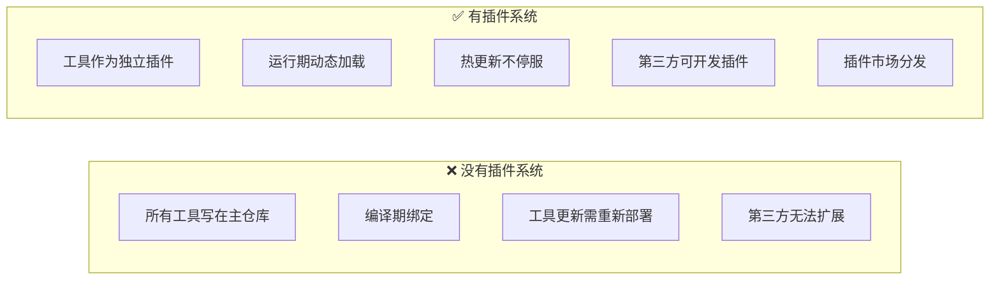
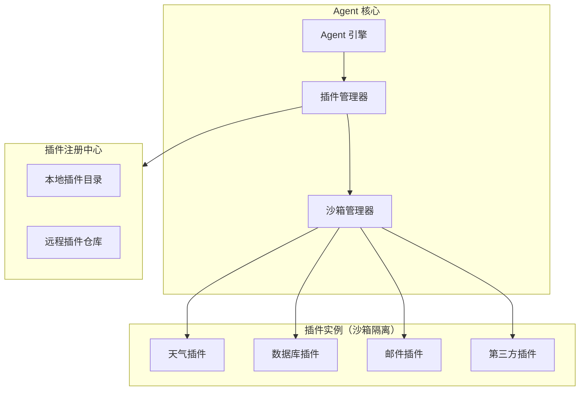
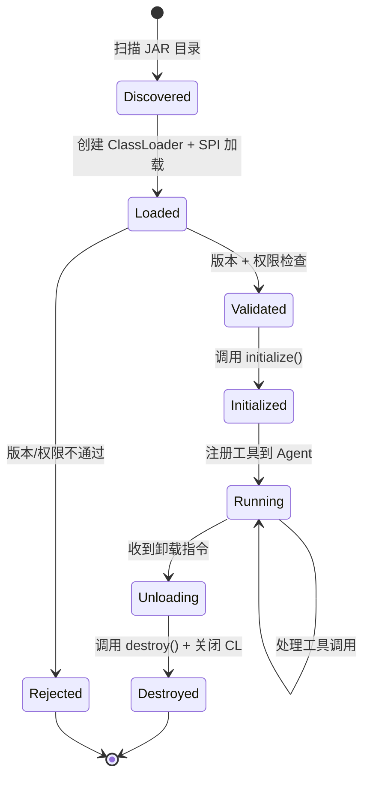

# 57 · Agent 插件系统设计

> 阶段：4 生产化 · 难度：⭐⭐⭐⭐ · 预计：3 天
> 前置：[01 Agent 循环](../阶段3-Agent工程化/01-Agent循环.md)
> 产出：设计并实现一个可扩展的 Agent 插件系统——动态加载工具、沙箱隔离、生命周期管理

---

## 你将学会

- 插件系统架构设计（SPI / 动态加载 / 沙箱）
- 插件生命周期管理（发现 → 加载 → 初始化 → 运行 → 卸载）
- 插件沙箱隔离（权限控制、资源限制）
- 插件市场与分发机制

---

## 为什么需要插件系统

Agent 的核心价值在于工具调用。随着工具越来越多，问题浮现：



---

## 知识讲解

### 1. 插件系统架构



### 2. 插件 SPI 规范

```java
package demo.demo04.plugin.spi;

import java.util.*;

/**
 * Agent 插件接口 — 所有插件必须实现
 */
public interface AgentPlugin {

    /**
     * 插件元数据
     */
    PluginMetadata metadata();

    /**
     * 插件提供的工具列表
     */
    List<ToolDefinition> tools();

    /**
     * 初始化（加载配置、建立连接等）
     */
    void initialize(PluginContext context) throws PluginException;

    /**
     * 销毁（释放资源）
     */
    void destroy();

    /**
     * 健康检查
     */
    default HealthStatus health() {
        return HealthStatus.UP;
    }
}

/**
 * 插件元数据
 */
record PluginMetadata(
    String id,              // 唯一标识：weather-plugin
    String name,            // 展示名称：天气查询插件
    String version,         // 语义化版本：1.2.0
    String author,          // 作者
    String description,     // 描述
    String minAgentVersion, // 最低 Agent 版本要求
    List<String> tags,      // 标签：weather / utility
    String icon,            // 图标 URL
    Permissions permissions // 权限声明
) {}

/**
 * 工具定义
 */
record ToolDefinition(
    String name,
    String description,
    String jsonSchema,     // 参数 JSON Schema
    boolean requiresConfirmation // 是否需要用户确认
) {}

/**
 * 权限声明
 */
record Permissions(
    boolean networkAccess,   // 是否需要网络访问
    boolean fileSystemAccess,// 文件系统访问
    boolean envVarAccess,    // 环境变量访问
    Set<String> allowedDomains // 允许的网络域名（白名单）
) {}

enum HealthStatus { UP, DEGRADED, DOWN }
```

### 3. 插件管理器

```java
package demo.demo04.plugin;

import demo.demo04.plugin.spi.*;
import org.springframework.stereotype.Component;

import java.io.*;
import java.net.*;
import java.nio.file.*;
import java.util.*;
import java.util.concurrent.*;

/**
 * 插件管理器
 * 负责：发现 → 加载 → 初始化 → 注册 → 卸载
 */
@Component
public class PluginManager {

    private final Map<String, AgentPlugin> loadedPlugins = new ConcurrentHashMap<>();
    private final Map<String, PluginClassLoader> classLoaders = new ConcurrentHashMap<>();
    private final Path pluginsDir;

    public PluginManager() {
        this.pluginsDir = Paths.get(System.getProperty("user.home"), ".agent", "plugins");
    }

    /**
     * 扫描并加载所有插件
     */
    public void loadAll() {
        if (!Files.exists(pluginsDir)) {
            return;
        }

        try (var jars = Files.list(pluginsDir)) {
            jars.filter(p -> p.toString().endsWith(".jar"))
                .forEach(this::loadPlugin);
        } catch (IOException e) {
            throw new RuntimeException("扫描插件目录失败", e);
        }
    }

    /**
     * 加载单个插件 JAR
     */
    public synchronized void loadPlugin(Path jarPath) {
        try {
            // 1. 创建独立 ClassLoader（插件隔离）
            URL jarUrl = jarPath.toUri().toURL();
            PluginClassLoader cl = new PluginClassLoader(
                    new URL[]{jarUrl},
                    getClass().getClassLoader()
            );

            // 2. 通过 SPI 机制发现插件实现
            ServiceLoader<AgentPlugin> loader = ServiceLoader.load(AgentPlugin.class, cl);
            Iterator<AgentPlugin> it = loader.iterator();

            if (!it.hasNext()) {
                throw new PluginException("JAR 中未找到 AgentPlugin 实现: " + jarPath);
            }

            AgentPlugin plugin = it.next();
            PluginMetadata meta = plugin.metadata();

            // 3. 版本兼容性检查
            if (!isVersionCompatible(meta)) {
                throw new PluginException("插件 " + meta.id() + " 需要更高版本 Agent");
            }

            // 4. 权限审核
            validatePermissions(meta.permissions());

            // 5. 初始化插件
            PluginContext ctx = new PluginContext(meta.id(), pluginsDir.resolve(meta.id()));
            plugin.initialize(ctx);

            // 6. 注册
            loadedPlugins.put(meta.id(), plugin);
            classLoaders.put(meta.id(), cl);

        } catch (Exception e) {
            throw new PluginException("加载插件失败: " + jarPath, e);
        }
    }

    /**
     * 卸载插件
     */
    public synchronized void unloadPlugin(String pluginId) {
        AgentPlugin plugin = loadedPlugins.get(pluginId);
        if (plugin == null) return;

        // 1. 调用销毁钩子
        try {
            plugin.destroy();
        } catch (Exception e) {
            // 即使销毁失败也要继续卸载
        }

        // 2. 移除注册
        loadedPlugins.remove(pluginId);

        // 3. 关闭 ClassLoader
        PluginClassLoader cl = classLoaders.remove(pluginId);
        if (cl != null) {
            cl.close();
        }
    }

    /**
     * 获取所有已加载插件提供的工具
     */
    public List<ToolDefinition> getAllTools() {
        return loadedPlugins.values().stream()
                .flatMap(p -> p.tools().stream())
                .toList();
    }

    /**
     * 按插件 ID 获取插件实例
     */
    public Optional<AgentPlugin> getPlugin(String pluginId) {
        return Optional.ofNullable(loadedPlugins.get(pluginId));
    }

    /**
     * 版本兼容性检查
     */
    private boolean isVersionCompatible(PluginMetadata meta) {
        // 简化：实际比较版本号
        return true;
    }

    /**
     * 权限审核
     */
    private void validatePermissions(Permissions perms) {
        // 生产环境：根据安全策略审核
        if (perms.fileSystemAccess()) {
            // 检查是否允许文件系统访问
        }
    }

    public List<PluginMetadata> listPlugins() {
        return loadedPlugins.values().stream()
                .map(AgentPlugin::metadata)
                .toList();
    }
}
```

### 4. 插件类加载器（隔离核心）

```java
package demo.demo04.plugin;

import java.net.*;

/**
 * 插件专用 ClassLoader
 * 每个插件一个独立实例，实现类隔离
 */
public class PluginClassLoader extends URLClassLoader {

    public PluginClassLoader(URL[] urls, ClassLoader parent) {
        super(urls, parent);
    }

    /**
     * 插件类优先从自己的 JAR 加载（child-first）
     * 避免插件依赖与主应用冲突
     */
    @Override
    protected Class<?> loadClass(String name, boolean resolve) throws ClassNotFoundException {
        // 1. 检查是否已加载
        Class<?> loaded = findLoadedClass(name);
        if (loaded != null) return loaded;

        // 2. 先从插件 JAR 加载（child-first）
        try {
            Class<?> cls = findClass(name);
            if (resolve) resolveClass(cls);
            return cls;
        } catch (ClassNotFoundException e) {
            // 3. 插件 JAR 没有，委托父加载器
            return super.loadClass(name, resolve);
        }
    }

    /**
     * 安全关闭
     */
    @Override
    public void close() {
        try {
            super.close();
        } catch (Exception e) { }
    }
}
```

### 5. 插件沙箱

```java
package demo.demo04.plugin;

import demo.demo04.plugin.spi.*;

import java.security.*;
import java.util.concurrent.*;

/**
 * 插件沙箱管理器
 * 限制插件的资源使用和权限
 */
public class PluginSandbox {

    private final ExecutorService sandboxPool;

    public PluginSandbox() {
        // 每个插件分配独立的线程池（限制并发）
        this.sandboxPool = Executors.newThreadPoolExecutor(
                4, 16,
                60L, TimeUnit.SECONDS,
                new LinkedBlockingQueue<>(100),
                r -> {
                    Thread t = new Thread(r, "plugin-sandbox");
                    t.setDaemon(true);
                    return t;
                }
        );
    }

    /**
     * 在沙箱中执行插件工具调用
     */
    public String executeTool(AgentPlugin plugin, ToolDefinition tool, String args) {
        // 设置 SecurityManager（限制文件/网络访问）
        // 注意：Java 17+ SecurityManager 已废弃，生产环境用容器隔离或 WASM

        Future<String> future = sandboxPool.submit(() -> {
            try {
                // 通过反射调用插件的工具方法
                return invokeTool(plugin, tool, args);
            } catch (Exception e) {
                throw new CompletionException(e);
            }
        });

        try {
            // 超时控制
            return future.get(30, TimeUnit.SECONDS);
        } catch (TimeoutException e) {
            future.cancel(true);
            return ToolResult.error("工具执行超时（30s）").toJson();
        } catch (Exception e) {
            return ToolResult.error("工具执行失败: " + e.getMessage()).toJson();
        }
    }

    private String invokeTool(AgentPlugin plugin, ToolDefinition tool, String args) {
        // 简化：实际通过反射调用插件注册的方法
        return "";
    }
}
```

### 6. 插件示例

```java
package com.example.plugins.weather;

import demo.demo04.plugin.spi.*;

import java.util.*;

/**
 * 天气查询插件示例
 */
public class WeatherPlugin implements AgentPlugin {

    private WeatherApi api;

    @Override
    public PluginMetadata metadata() {
        return new PluginMetadata(
            "weather-plugin",
            "天气查询",
            "1.0.0",
            "Demo Team",
            "查询全球城市天气",
            "1.0.0",
            List.of("weather", "utility"),
            "🌤️",
            new Permissions(true, false, false, Set.of("api.weather.com"))
        );
    }

    @Override
    public List<ToolDefinition> tools() {
        return List.of(
            new ToolDefinition(
                "getWeather",
                "查询指定城市的当前天气",
                """
                {
                  "type": "object",
                  "properties": {
                    "city": { "type": "string", "description": "城市名称" }
                  },
                  "required": ["city"]
                }
                """,
                false
            ),
            new ToolDefinition(
                "getForecast",
                "查询指定城市未来 7 天天气预报",
                """
                {
                  "type": "object",
                  "properties": {
                    "city": { "type": "string", "description": "城市名称" }
                  },
                  "required": ["city"]
                }
                """,
                false
            )
        );
    }

    @Override
    public void initialize(PluginContext context) throws PluginException {
        // 从配置中读取 API Key
        String apiKey = context.getConfig("api_key");
        this.api = new WeatherApi(apiKey);
    }

    @Override
    public void destroy() {
        // 释放资源
    }
}
```

---

## 插件生命周期



---

## 常见坑

- ❌ **类加载器泄漏** → 卸载插件时未关闭 ClassLoader，导致内存泄漏。必须显式 close
- ❌ **插件依赖冲突** → 插件 A 依赖 Jackson 2.15，插件 B 依赖 2.17。child-first CL 可缓解但非根治
- ❌ **没有超时控制** → 插件工具调用卡死整个 Agent。沙箱必须有超时
- ❌ **权限声明只是摆设** → 插件声称只访问 `api.weather.com`，实际偷偷请求其他域名。生产环境用网络层防火墙强制
- ❌ **热更新并发问题** → 卸载旧版本时正好有请求在执行。用引用计数或读锁保护
- ❌ **插件间依赖未处理** → 插件 A 的工具依赖插件 B 的工具。需要声明依赖链和加载顺序

---

## 验收检查

- [ ] 插件 JAR 放入目录后能自动发现并加载
- [ ] 插件提供的工具能注册到 Agent 并被 LLM 调用
- [ ] 卸载插件后工具不再可用，且无内存泄漏
- [ ] 插件工具调用有超时保护
- [ ] 插件元数据（版本/权限/描述）能正确读取
- [ ] 第三方开发者可以按 SPI 规范开发插件

---

## 下一步

→ 下一篇：[58 Agent 迁移与升级工程](58-Agent迁移与升级工程.md)
