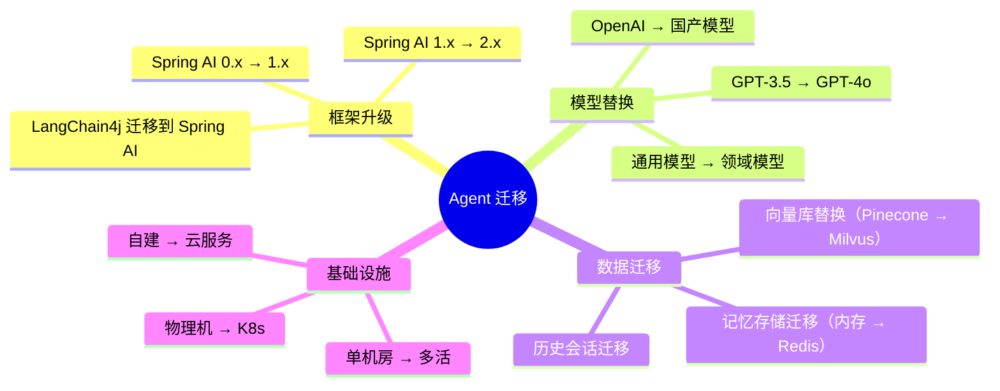
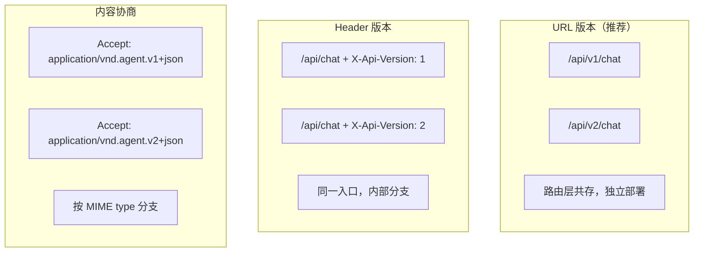
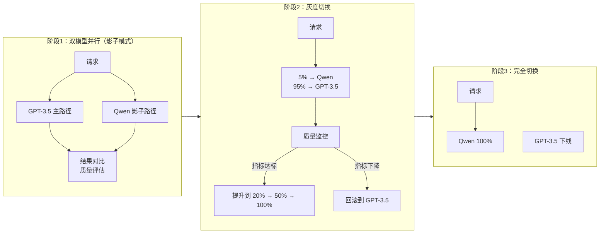
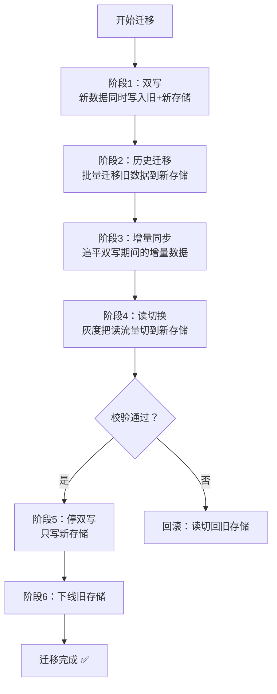
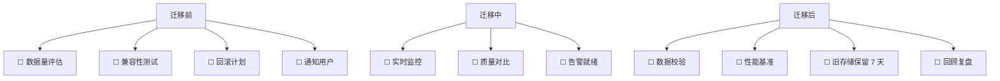

# 58 · Agent 迁移与升级工程

> 阶段：4 生产化 · 难度：⭐⭐⭐ · 预计：2 天
> 前置：[23 Agent 版本兼容性管理](23-Agent版本兼容性管理.md)
> 产出：掌握 Agent 系统的全量迁移与版本升级工程——数据迁移、API 兼容、回滚策略

---

## 你将学会

- Agent 系统迁移的三大场景（框架升级 / 模型替换 / 数据迁移）
- API 版本兼容策略（URL 版本 / Header 版本 / 内容协商）
- 零停机迁移方案（蓝绿 / 影子 / 双写）
- 数据迁移的 ETL 管线设计

---

## 迁移场景全景



---

## 知识讲解

### 1. API 版本兼容策略



### 2. 版本兼容矩阵

```java
package demo.demo04.migration;

import org.springframework.stereotype.Component;
import org.springframework.web.servlet.*;

import java.util.*;

/**
 * API 版本管理器
 */
@Component
public class ApiVersionManager {

    // 支持的版本列表
    private static final List<ApiVersion> SUPPORTED = List.of(
        new ApiVersion(1, "2026-01-01", "2027-01-01", true),
        new ApiVersion(2, "2026-06-01", null, true)  // v2 当前版本
    );

    /**
     * 检查版本是否受支持
     */
    public VersionCheck check(String version) {
        ApiVersion v = findVersion(version);
        if (v == null) {
            return VersionCheck.unsupported("不支持的版本: " + version);
        }

        if (!v.active) {
            return VersionCheck.deprecated("版本 " + version + " 已弃用，请升级到 v2");
        }

        if (v.sunsetDate != null && v.sunsetDate.before(new Date())) {
            return VersionCheck.unsupported("版本 " + version + " 已下线");
        }

        return VersionCheck.ok(v);
    }

    /**
     * 版本路由：根据版本选择不同的 handler
     */
    public Object dispatch(String version, String path, Object request) {
        return switch (version) {
            case "1" -> handleV1(path, request);
            case "2" -> handleV2(path, request);
            default -> throw new IllegalArgumentException("Unsupported version");
        };
    }

    /**
     * V1 → V2 的请求适配器
     */
    public V2Request upgradeRequest(V1Request v1) {
        return new V2Request(
            v1.getMessage(),           // message → query（重命名）
            v1.getSession(),           // session → sessionId
            "gpt-4o",                  // 新增默认 model
            0.7,                       // 新增默认 temperature
            Map.of()                   // 新增默认 metadata
        );
    }

    /**
     * V2 → V1 的响应降级器
     */
    public V1Response downgradeResponse(V2Response v2) {
        return new V1Response(v2.text(), v2.sources()); // 丢弃 v2 独有字段
    }

    // 简化方法...
    private ApiVersion findVersion(String v) {
        return SUPPORTED.stream().filter(av -> av.version == Integer.parseInt(v)).findFirst().orElse(null);
    }
    private Object handleV1(String p, Object r) { return null; }
    private Object handleV2(String p, Object r) { return null; }

    record ApiVersion(int version, Date releaseDate, Date sunsetDate, boolean active) {}
    record VersionCheck(boolean ok, String error, boolean deprecated) {
        static VersionCheck ok(ApiVersion v) { return new VersionCheck(true, null, false); }
        static VersionCheck deprecated(String msg) { return new VersionCheck(true, msg, true); }
        static VersionCheck unsupported(String msg) { return new VersionCheck(false, msg, false); }
    }
}
```

### 3. 模型替换迁移

从 OpenAI GPT-3.5 迁移到国产模型（如通义千问）是常见场景：



```java
package demo.demo04.migration;

import org.springframework.stereotype.Component;

import java.util.*;
import java.util.concurrent.*;

/**
 * 模型迁移管理器
 */
@Component
public class ModelMigrationManager {

    private final Map<String, String> sessionModelBinding = new ConcurrentHashMap<>();
    private volatile double qwenTrafficPercent = 0.0; // 0% → 100% 渐进

    /**
     * 路由决策：决定当前请求用哪个模型
     */
    public String selectModel(String sessionId) {
        // 1. 会话亲和：同一会话保持同一模型（避免风格跳变）
        String bound = sessionModelBinding.get(sessionId);
        if (bound != null) {
            return bound;
        }

        // 2. 按百分比灰度
        double random = Math.random();
        String model = random < qwenTrafficPercent ? "qwen-max" : "gpt-3.5-turbo";

        // 3. 绑定到会话
        sessionModelBinding.put(sessionId, model);
        return model;
    }

    /**
     * 提升灰度比例
     */
    public void promote(double newPercent) {
        // 安全检查：只能递增
        if (newPercent < qwenTrafficPercent) {
            throw new IllegalStateException("灰度比例只能递增，回滚请用 rollback()");
        }
        this.qwenTrafficPercent = newPercent;
    }

    /**
     * 紧急回滚
     */
    public void rollback() {
        this.qwenTrafficPercent = 0.0;
        sessionModelBinding.clear();
    }

    /**
     * 影子模式：主路径用 GPT，同时异步发 Qwen 做对比
     */
    public ShadowResult shadowCompare(String userQuery, String gptResponse) {
        // 异步调用 Qwen
        CompletableFuture<String> qwenFuture = CompletableFuture.supplyAsync(() -> {
            return callQwen(userQuery);
        });

        try {
            String qwenResponse = qwenFuture.get(10, TimeUnit.SECONDS);
            double similarity = calculateSimilarity(gptResponse, qwenResponse);
            return new ShadowResult(gptResponse, qwenResponse, similarity);
        } catch (Exception e) {
            return new ShadowResult(gptResponse, null, -1);
        }
    }

    private String callQwen(String query) { return ""; }
    private double calculateSimilarity(String a, String b) {
        // 简化：实际用 BLEU / ROUGE / 语义相似度
        return 0.85;
    }

    public record ShadowResult(String primary, String shadow, double similarity) {}
}
```

### 4. 向量库迁移

从 Pinecone 迁移到 Milvus：

```java
package demo.demo04.migration;

import org.springframework.stereotype.Component;

import java.util.*;
import java.util.stream.*;

/**
 * 向量库迁移器
 * Pinecone → Milvus
 */
@Component
public class VectorStoreMigrator {

    private final PineconeSource source;
    private final MilvusTarget target;

    /**
     * 全量迁移
     */
    public MigrationReport migrateAll(int batchSize) {
        long total = source.count();
        long migrated = 0;
        long failed = 0;
        List<String> failedIds = new ArrayList<>();

        String lastId = null;
        while (true) {
            // 分批拉取
            List<VectorRecord> batch = source.fetchBatch(batchSize, lastId);
            if (batch.isEmpty()) break;

            // 适配格式（Pinecone → Milvus 字段映射）
            List<VectorRecord> adapted = batch.stream()
                    .map(this::adapt)
                    .toList();

            // 批量写入目标
            BatchResult result = target.batchInsert(adapted);
            migrated += result.success();
            failed += result.failed();
            if (!result.failedIds().isEmpty()) {
                failedIds.addAll(result.failedIds());
            }

            lastId = batch.get(batch.size() - 1).id();
            log("迁移进度: %d/%d (%.1f%%)".formatted(migrated, total, 100.0 * migrated / total));
        }

        // 校验
        long targetCount = target.count();
        boolean verified = targetCount == migrated;

        return new MigrationReport(total, migrated, failed, failedIds, verified);
    }

    /**
     * 增量同步（迁移期间双写）
     */
    public void incrementalSync() {
        // 消费 Pinecone 的变更日志（或 CDC），增量同步到 Milvus
        // 直到追上实时数据，再切换读流量
    }

    /**
     * 字段适配
     */
    private VectorRecord adapt(VectorRecord pinecone) {
        // Pinecone: {id, values, metadata: {text, source, ...}}
        // Milvus:   {id, embedding, text, source, ...}
        return new VectorRecord(
            pinecone.id(),
            pinecone.values(),
            (String) pinecone.metadata().get("text"),
            pinecone.metadata()
        );
    }

    private void log(String msg) { System.out.println(msg); }

    record VectorRecord(String id, float[] values, String text, Map<String, Object> metadata) {}
    record BatchResult(int success, int failed, List<String> failedIds) {}
    record MigrationReport(long total, long migrated, long failed, List<String> failedIds, boolean verified) {}
}
```

### 5. 零停机迁移方案



---

## 迁移检查清单



---

## 常见坑

- ❌ **大爆炸式迁移** → 一次性切换所有流量，出问题全量受影响。必须灰度
- ❌ **没有回滚方案** → 迁移后发现新存储性能差，但旧存储已停写。必须保留旧存储至少 7 天
- ❌ **API 不兼容导致客户端报错** → v2 接口改了字段名，旧 SDK 全挂。需要适配层
- ❌ **模型输出差异未评估** → GPT-3.5 换 Qwen 后，同一 prompt 输出格式变了，下游解析失败
- ❌ **迁移期间数据不一致** → 双写时旧存储写成功、新存储写失败，导致数据丢失。需要分布式事务或对账
- ❌ **向量维度不匹配** → Pinecone 用 1536 维，Milvus 迁移时用了 768 维。维度必须一致

---

## 验收检查

- [ ] API 支持多版本共存（v1 + v2）
- [ ] 模型替换有灰度切换方案
- [ ] 向量库迁移有数据校验机制
- [ ] 迁移过程零停机
- [ ] 有完整的回滚方案
- [ ] 迁移后有性能基准对比报告

---

## 下一步

→ 下一篇：[59 Agent 内容审核与安全过滤](59-Agent内容审核与安全过滤.md)
