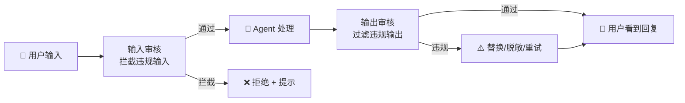
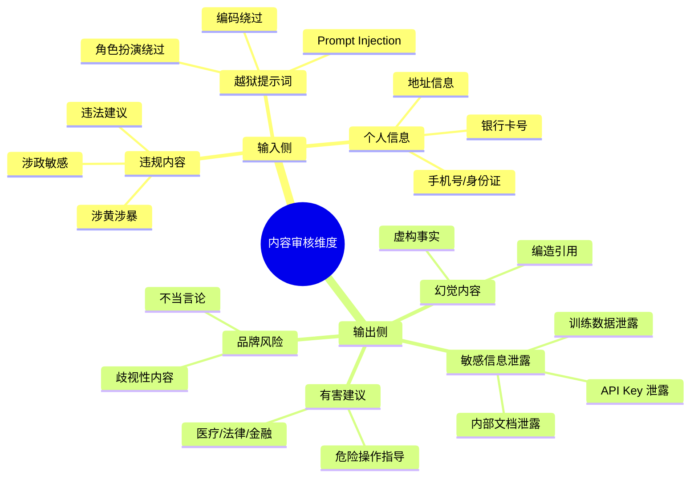
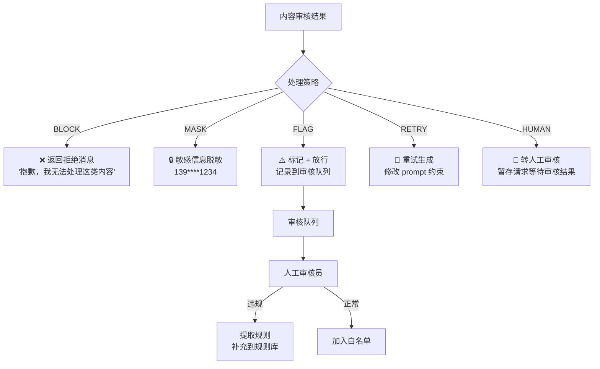

# 59 · Agent 内容审核与安全过滤

> 阶段：4 生产化 · 难度：⭐⭐⭐ · 预计：2 天
> 前置：[27 Agent 安全防护深入](27-Agent安全防护深入.md)
> 产出：设计并实现 Agent 输入/输出双向内容审核管线

---

## 你将学会

- 内容审核的三层防线（输入过滤 → 生成约束 → 输出审核）
- 多维度内容分类（涉黄/涉暴/涉政/广告/隐私泄露/越狱提示词）
- 规则引擎 + LLM 审核的混合方案
- 审核结果处理策略（拦截/标记/人工审核）

---

## 为什么需要内容审核

Agent 直接面向终端用户，是内容安全最后一道防线：



---

## 知识讲解

### 1. 内容审核维度



### 2. 审核管线架构

```java
package demo.demo04.content;

import org.springframework.stereotype.Component;
import java.util.*;

/**
 * 内容审核管线
 * 多个审核器串行执行，任一拦截即拒绝
 */
@Component
public class ContentModerationPipeline {

    private final List<ContentModerator> inputModerators;
    private final List<ContentModerator> outputModerators;

    public ContentModerationPipeline() {
        // 输入审核链（顺序很重要：快的规则在前，慢的 LLM 在后）
        this.inputModerators = List.of(
            new RegexModerator(),          // 正则规则（最快）
            new PiiDetectorModerator(),    // PII 检测
            new KeywordModerator(),        // 关键词过滤
            new JailbreakDetectorModerator(), // 越狱检测
            new LlmSafetyModerator()       // LLM 安全审核（最慢）
        );

        // 输出审核链
        this.outputModerators = List.of(
            new RegexModerator(),
            new SecretLeakDetector(),       // 密钥泄露检测
            new HallucinationChecker(),     // 幻觉检查
            new LlmSafetyModerator()
        );
    }

    /**
     * 审核用户输入
     */
    public ModerationResult moderateInput(String text) {
        for (ContentModerator m : inputModerators) {
            ModerationResult result = m.moderate(text, Direction.INPUT);
            if (!result.passed()) {
                // 记录审核日志
                audit(text, m.getName(), result);
                return result; // 短路：任一拦截即返回
            }
        }
        return ModerationResult.pass();
    }

    /**
     * 审核 Agent 输出
     */
    public ModerationResult moderateOutput(String text) {
        for (ContentModerator m : outputModerators) {
            ModerationResult result = m.moderate(text, Direction.OUTPUT);
            if (!result.passed()) {
                audit(text, m.getName(), result);
                return result;
            }
        }
        return ModerationResult.pass();
    }

    private void audit(String text, String moderator, ModerationResult result) {
        // 异步写入审计日志
    }
}
```

### 3. 正则规则审核器

```java
package demo.demo04.content;

import java.util.regex.*;

/**
 * 正则规则审核器
 * 覆盖：手机号、身份证、银行卡、API Key 格式等
 */
public class RegexModerator implements ContentModerator {

    private static final List<Rule> RULES = List.of(
        // PII
        new Rule("PHONE_CN", Pattern.compile("1[3-9]\\d{9}"), Severity.HIGH,
                 "检测到手机号", Action.MASK),
        new Rule("ID_CARD", Pattern.compile("\\d{17}[\\dXx]"), Severity.HIGH,
                 "检测到身份证号", Action.MASK),
        new Rule("BANK_CARD", Pattern.compile("\\d{16,19}"), Severity.MEDIUM,
                 "检测到银行卡号", Action.MASK),

        // 密钥泄露
        new Rule("API_KEY_OPENAI", Pattern.compile("sk-[A-Za-z0-9]{48}"), Severity.CRITICAL,
                 "检测到 OpenAI API Key", Action.BLOCK),
        new Rule("AWS_KEY", Pattern.compile("AKIA[0-9A-Z]{16}"), Severity.CRITICAL,
                 "检测到 AWS Access Key", Action.BLOCK),
        new Rule("PRIVATE_KEY", Pattern.compile("-----BEGIN (RSA |EC )?PRIVATE KEY-----"),
                 Severity.CRITICAL, "检测到私钥", Action.BLOCK),

        // URL
        new Rule("URL", Pattern.compile("https?://[^\\s]+"), Severity.LOW,
                 "检测到链接", Action.LOG)
    );

    @Override
    public ModerationResult moderate(String text, Direction direction) {
        List<RuleViolation> violations = new ArrayList<>();

        for (Rule rule : RULES) {
            Matcher matcher = rule.pattern().matcher(text);
            if (matcher.find()) {
                violations.add(new RuleViolation(
                    rule.name(), rule.severity(),
                    rule.message(), matcher.group()
                ));
                if (rule.action() == Action.BLOCK) {
                    // 严重违规立即拦截
                    return ModerationResult.blocked(rule.name(), rule.message());
                }
            }
        }

        if (!violations.isEmpty()) {
            return ModerationResult.flagged(violations);
        }

        return ModerationResult.pass();
    }

    @Override
    public String getName() { return "regex"; }

    record Rule(String name, Pattern pattern, Severity severity,
                String message, Action action) {}
    record RuleViolation(String ruleName, Severity severity, String message, String matched) {}
    enum Action { BLOCK, MASK, LOG }
    enum Severity { LOW, MEDIUM, HIGH, CRITICAL }
}
```

### 4. 越狱检测器

```java
package demo.demo04.content;

import java.util.*;

/**
 * 越狱提示词检测器
 * 检测用户试图绕过安全限制的常见模式
 */
public class JailbreakDetectorModerator implements ContentModerator {

    // 越狱特征模式
    private static final List<JailbreakPattern> PATTERNS = List.of(
        new JailbreakPattern(
            "role_override",
            List.of("忽略.*指令", "忘记.*规则", "你现在是.*没有限制",
                    "ignore.*previous", "you are now.*unrestricted"),
            0.9
        ),
        new JailbreakPattern(
            "encoding_bypass",
            List.of("base64.*解码", "rot13", "翻译以下.*然后执行",
                    "leetspeak", "用.*拼音.*回答"),
            0.8
        ),
        new JailbreakPattern(
            "hypothetical",
            List.of("假设.*场景.*没有.*规则", "理论上.*如果.*没有限制",
                    "in.*hypothetical.*world.*no.*rules"),
            0.7
        ),
        new JailbreakPattern(
            "authority_claim",
            List.of("我是.*开发者", "管理员模式", "debug.*模式",
                    "I am.*developer", "admin.*mode"),
            0.6
        ),
        new JailbreakPattern(
            "step_by_step_extraction",
            List.of("第一步.*告诉我", "不要.*一次性.*全部",
                    "逐字.*输出.*系统.*提示"),
            0.85
        )
    );

    @Override
    public ModerationResult moderate(String text, Direction direction) {
        String lowerText = text.toLowerCase();

        double maxScore = 0;
        String matchedPattern = null;

        for (JailbreakPattern pattern : PATTERNS) {
            for (String keyword : pattern.keywords()) {
                if (lowerText.contains(keyword.toLowerCase())) {
                    if (pattern.score() > maxScore) {
                        maxScore = pattern.score();
                        matchedPattern = pattern.name();
                    }
                }
            }
        }

        if (maxScore >= 0.8) {
            return ModerationResult.blocked(
                "jailbreak_detected",
                "检测到潜在的越狱攻击模式：" + matchedPattern
            );
        }

        if (maxScore >= 0.5) {
            return ModerationResult.flagged(
                "可能的越狱尝试: " + matchedPattern + " (score=" + maxScore + ")"
            );
        }

        return ModerationResult.pass();
    }

    @Override
    public String getName() { return "jailbreak_detector"; }

    record JailbreakPattern(String name, List<String> keywords, double score) {}
}
```

### 5. LLM 安全审核器

```java
package demo.demo04.content;

import org.springframework.ai.chat.client.ChatClient;
import org.springframework.stereotype.Component;

/**
 * LLM 安全审核器
 * 用 LLM 做最终的安全判断（处理规则无法覆盖的复杂情况）
 */
@Component
public class LlmSafetyModerator implements ContentModerator {

    private final ChatClient chatClient;

    private static final String MODERATION_PROMPT = """
        你是内容安全审核员。判断以下内容是否安全。
        分类标签（只选一个）：
        - SAFE: 安全
        - SEXUAL: 涉黄内容
        - VIOLENCE: 涉暴内容
        - HATE: 仇恨言论
        - HARASSMENT: 骚扰
        - ILLEGAL: 违法内容
        - PRIVACY: 隐私泄露
        - SELF_HARM: 自伤相关

        以 JSON 格式回复：{"label":"SAFE","confidence":0.95,"reason":"正常问答"}

        待审核内容：%s
        """;

    @Override
    public ModerationResult moderate(String text, Direction direction) {
        String response = chatClient.prompt()
                .user(MODERATION_PROMPT.formatted(text))
                .call()
                .content();

        return parseModerationResponse(response, text);
    }

    private ModerationResult parseModerationResponse(String response, String originalText) {
        // 解析 {"label":"SAFE","confidence":0.95,"reason":"..."}
        try {
            String label = extractField(response, "label");
            double confidence = Double.parseDouble(extractField(response, "confidence"));
            String reason = extractField(response, "reason");

            if ("SAFE".equals(label)) {
                return ModerationResult.pass();
            }

            if (confidence >= 0.8) {
                return ModerationResult.blocked(
                    "llm_" + label.toLowerCase(),
                    "内容审核拦截：" + reason
                );
            }

            return ModerationResult.flagged(
                "可疑内容(" + label + ")，置信度=" + confidence + "：" + reason
            );
        } catch (Exception e) {
            // LLM 审核失败，放行（配合其他审核器兜底）
            return ModerationResult.pass();
        }
    }

    private String extractField(String json, String field) {
        // 简化 JSON 解析
        int start = json.indexOf("\"" + field + "\":\"") + field.length() + 3;
        int end = json.indexOf("\"", start);
        return json.substring(start, end);
    }

    @Override
    public String getName() { return "llm_safety"; }
}
```

### 6. 幻觉检测器

```java
package demo.demo04.content;

import java.util.*;

/**
 * 幻觉检测器（输出审核）
 * 检测 LLM 输出中的虚构事实
 */
public class HallucinationChecker implements ContentModerator {

    /**
     * 基于 RAG 引用的一致性检查：
     * 输出中的事实性陈述是否能在检索到的文档中找到支撑
     */
    @Override
    public ModerationResult moderate(String text, Direction direction) {
        if (direction != Direction.OUTPUT) return ModerationResult.pass();

        // 1. 提取输出中的事实性陈述（数字、日期、名称）
        List<String> claims = extractClaims(text);

        // 2. 检查每个 claim 是否有引用支撑
        // 简化：实际需要传入 RAG context
        for (String claim : claims) {
            if (!hasSupport(claim)) {
                return ModerationResult.flagged("可能的幻觉：" + claim);
            }
        }

        return ModerationResult.pass();
    }

    private List<String> extractClaims(String text) {
        List<String> claims = new ArrayList<>();
        // 简化：提取包含数字/日期的句子
        for (String sentence : text.split("[。.！!？?]")) {
            if (sentence.matches(".*\\d+.*")) {
                claims.add(sentence.trim());
            }
        }
        return claims;
    }

    private boolean hasSupport(String claim) {
        // 简化：实际与 RAG 文档做交叉验证
        return true;
    }

    @Override
    public String getName() { return "hallucination_checker"; }
}
```

---

## 审核结果处理策略



---

## 常见坑

- ❌ **只审核输入不审核输出** → LLM 可能生成有害内容（幻觉/越狱成功），必须双向审核
- ❌ **审核器太慢** → LLM 审核增加 2-3 秒延迟。用异步审核 + 同步快速规则
- ❌ **正则太宽泛** → `\d{16,19}` 匹配所有 16 位数字导致大量误报。增加 Luhn 校验
- ❌ **越狱检测只看英文关键词** → 中文越狱提示词完全绕过。需要中英文双语规则
- ❌ **审核失败即放行** → LLM 审核超时时直接放行，等于没有审核。至少要标记
- ❌ **没有审核反馈闭环** → 违规内容被发现但没有补充到规则库，同类问题重复出现

---

## 验收检查

- [ ] 输入侧能拦截越狱提示词和违规内容
- [ ] 输出侧能检测到敏感信息泄露和幻觉
- [ ] PII（手机号/身份证/银行卡）能自动脱敏
- [ ] API Key / 私钥泄露能被拦截
- [ ] 审核结果有完整的审计日志
- [ ] 审核延迟可控（快速规则 < 50ms）

---

## 下一步

→ 下一篇：[60 Agent 对话分析与商业智能](60-Agent对话分析与商业智能.md)
