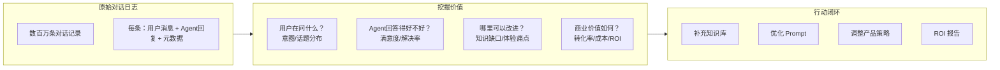
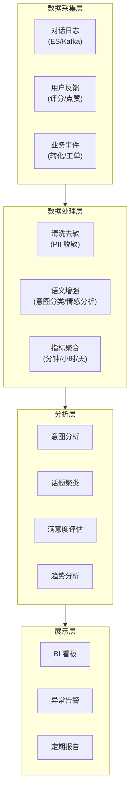
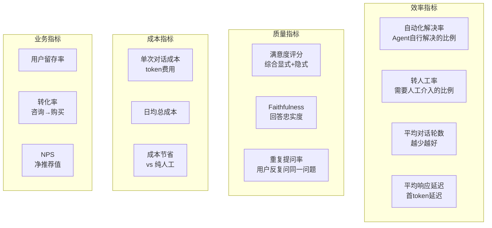

# 60 · Agent 对话分析与商业智能

> 阶段：4 生产化 · 难度：⭐⭐⭐ · 预计：2 天
> 前置：[03 可观测性建设](03-可观测性建设.md)
> 产出：从 Agent 对话日志中挖掘商业价值——用户意图分析、满意度评估、趋势洞察

---

## 你将学会

- 对话分析的数据管线（采集 → 清洗 → 分析 → 可视化）
- 用户意图分类与话题聚类
- 对话满意度自动评估（LLM-as-Judge + 用户反馈）
- 商业指标体系构建（转化率/解决率/成本/留存）

---

## 为什么对话分析很重要

Agent 对话日志是一座金矿：



---

## 知识讲解

### 1. 对话分析数据管线



### 2. 对话日志结构

```java
package demo.demo04.analytics;

import java.time.*;
import java.util.*;

/**
 * 结构化对话日志
 */
public record ConversationLog(
    String conversationId,
    String tenantId,
    String userId,
    Instant startTime,
    Instant endTime,
    int messageCount,
    List<TurnLog> turns,
    String model,
    int promptTokens,
    int completionTokens,
    double estimatedCost,
    String userFeedback,     // positive / negative / null
    Integer userRating,      // 1-5 / null
    String resolution,       // resolved / escalated / abandoned
    List<String> toolsUsed,
    Map<String, String> metadata
) {}

record TurnLog(
    int turnIndex,
    String userMessage,
    String agentReply,
    Instant timestamp,
    int latencyMs,
    List<String> toolCalls,
    String intent,           // 意图标签
    String sentiment,        // positive / neutral / negative
    double satisfactionScore // 0-1
) {}
```

### 3. 用户意图分类

```java
package demo.demo04.analytics;

import org.springframework.ai.chat.client.ChatClient;
import org.springframework.stereotype.Component;

import java.util.*;

/**
 * 用户意图分类器
 * 用 LLM 将用户对话分类到预定义的意图体系
 */
@Component
public class IntentClassifier {

    private final ChatClient chatClient;

    // 预定义意图体系（根据业务定制）
    private static final String INTENT_TAXONOMY = """
        意图分类体系（选最匹配的一个）：
        - product_inquiry: 产品咨询（价格/功能/对比）
        - technical_support: 技术支持（故障/使用问题）
        - complaint: 投诉（不满/批评）
        - billing: 账单/付费问题
        - account: 账户操作（注册/登录/修改信息）
        - recommendation: 推荐/建议请求
        - general_chat: 闲聊/其他
        - inappropriate: 不当内容
        """;

    private static final String CLASSIFY_PROMPT = """
        %s

        请分析以下用户消息，分类到最匹配的意图。
        以 JSON 格式返回：{"intent":"xxx","confidence":0.95,"subIntent":"xxx"}

        用户消息：%s
        """;

    public String classify(String userMessage) {
        String response = chatClient.prompt()
                .user(INTENT_TAXONOMY.formatted(CLASSIFY_PROMPT, userMessage))
                .call()
                .content();

        return parseIntent(response);
    }

    /**
     * 批量分类（减少 LLM 调用次数）
     */
    public Map<String, String> classifyBatch(List<String> messages) {
        // 用一次 LLM 调用分类多条消息
        String batchPrompt = "请对以下每条消息分类意图，以 JSON 数组返回：\n";
        for (int i = 0; i < messages.size(); i++) {
            batchPrompt += (i + 1) + ". " + messages.get(i) + "\n";
        }

        String response = chatClient.prompt()
                .user(batchPrompt)
                .call()
                .content();

        return parseBatchIntent(response, messages);
    }

    private String parseIntent(String response) {
        // 解析 {"intent":"product_inquiry",...}
        return response;
    }

    private Map<String, String> parseBatchIntent(String response, List<String> messages) {
        return Map.of();
    }
}
```

### 4. 话题聚类

```java
package demo.demo04.analytics;

import org.springframework.stereotype.Component;

import java.util.*;
import java.util.stream.*;

/**
 * 话题聚类器
 * 将相似对话聚类为话题，发现热门问题
 */
@Component
public class TopicClusterer {

    /**
     * 基于嵌入向量的聚类
     */
    public List<TopicCluster> cluster(List<String> conversations, int k) {
        // 1. 向量化每条对话
        List<float[]> embeddings = conversations.stream()
                .map(this::embed)
                .toList();

        // 2. K-Means 聚类
        List<TopicCluster> clusters = kmeans(embeddings, conversations, k);

        // 3. 为每个簇生成话题标签
        for (TopicCluster cluster : clusters) {
            String label = generateLabel(cluster);
            cluster.setLabel(label);
        }

        return clusters;
    }

    /**
     * K-Means 实现（简化）
     */
    private List<TopicCluster> kmeans(List<float[]> embeddings,
                                       List<String> texts, int k) {
        // 简化实现：实际用 Apache Commons Math 或 Smile
        // 1. 随机选 K 个中心点
        // 2. 分配每个点到最近中心
        // 3. 重新计算中心
        // 4. 重复直到收敛
        return List.of();
    }

    /**
     * 用 LLM 为聚类生成人类可读的标签
     */
    private String generateLabel(TopicCluster cluster) {
        // 取簇中最有代表性的 5 条对话
        String samples = String.join("\n", cluster.getSamples().stream().limit(5).toList());

        // 用 LLM 提炼话题
        return "用一句话总结这些对话的共同话题：\n" + samples;
        // → "用户咨询如何重置密码" / "用户反馈 App 闪退问题"
    }

    private float[] embed(String text) {
        // 调用 EmbeddingModel
        return new float[0];
    }
}

record TopicCluster(
    String label,
    List<String> members,
    int size,
    double percentage,
    List<String> samples
) {
    void setLabel(String l) {}
    List<String> getSamples() { return samples; }
    String getLabel() { return label; }
}
```

### 5. 满意度评估

```java
package demo.demo04.analytics;

import org.springframework.stereotype.Component;

import java.util.*;

/**
 * 对话满意度评估器
 * 综合：用户显式反馈 + LLM 隐式评估 + 行为信号
 */
@Component
public class SatisfactionEvaluator {

    /**
     * 综合满意度评分
     */
    public double evaluate(ConversationLog conversation) {
        // 1. 显式反馈（权重最高）
        double explicitScore = getExplicitScore(conversation);

        // 2. LLM 隐式评估
        double llmScore = getLlmScore(conversation);

        // 3. 行为信号（权重）
        double behaviorScore = getBehaviorScore(conversation);

        // 加权融合
        return explicitScore * 0.5 + llmScore * 0.3 + behaviorScore * 0.2;
    }

    /**
     * 显式反馈分数
     */
    private double getExplicitScore(ConversationLog conv) {
        if (conv.userRating() != null) {
            return conv.userRating() / 5.0; // 1-5 → 0.2-1.0
        }
        if ("positive".equals(conv.userFeedback())) return 1.0;
        if ("negative".equals(conv.userFeedback())) return 0.0;
        return 0.5; // 无反馈，中性
    }

    /**
     * LLM 隐式评估
     * 让 LLM 从对话内容判断满意度
     */
    private double getLlmScore(ConversationLog conv) {
        // 关键信号：
        // - 用户说了"谢谢"/"解决了" → 高满意度
        // - 用户反复追问同一问题 → 低满意度
        // - 用户骂脏话 → 极低满意度
        // - 用户转人工 → 低满意度
        // - 对话被 abandoned → 低满意度

        String lastUserMsg = conv.turns().get(conv.turns().size() - 1).userMessage();

        Set<String> positiveSignals = Set.of("谢谢", "感谢", "解决了", "明白了", "thanks");
        Set<String> negativeSignals = Set.of("没用", "还是不行", "转人工", "什么垃圾");

        if (positiveSignals.stream().anyMatch(lastUserMsg::contains)) return 0.9;
        if (negativeSignals.stream().anyMatch(lastUserMsg::contains)) return 0.2;

        // 用 LLM 做更细致的评估
        return 0.6; // 默认中性
    }

    /**
     * 行为信号分数
     */
    private double getBehaviorScore(ConversationLog conv) {
        double score = 0.5;

        // 被解决：+0.3
        if ("resolved".equals(conv.resolution())) score += 0.3;

        // 转人工：-0.3
        if ("escalated".equals(conv.resolution())) score -= 0.3;

        // 放弃：-0.2
        if ("abandoned".equals(conv.resolution())) score -= 0.2;

        // 轮数过多（>10轮可能没解决）：-0.1
        if (conv.turns().size() > 10) score -= 0.1;

        // 重复问题（同一问题问3次以上）：-0.1
        if (hasRepetition(conv)) score -= 0.1;

        return Math.max(0, Math.min(1, score));
    }

    private boolean hasRepetition(ConversationLog conv) {
        // 检查用户是否反复问类似问题
        return false;
    }
}
```

### 6. 商业指标仪表盘

```java
package demo.demo04.analytics;

import org.springframework.stereotype.Component;

import java.time.*;
import java.util.*;

/**
 * 商业指标聚合器
 */
@Component
public class BusinessMetrics {

    /**
     * 生成日报
     */
    public DashboardReport dailyReport(LocalDate date) {
        List<ConversationLog> conversations = loadByDate(date);

        return new DashboardReport(
            date,
            conversations.size(),                                    // 总对话数
            resolveRate(conversations),                              // 解决率
            avgSatisfaction(conversations),                          // 平均满意度
            avgCost(conversations),                                  // 平均成本
            totalCost(conversations),                                // 总成本
            intentDistribution(conversations),                       // 意图分布
            topTopics(conversations, 10),                            // 热门话题 Top 10
            escalationRate(conversations),                           // 转人工率
            avgTurns(conversations),                                 // 平均轮数
            knowledgeGaps(conversations),                            // 知识缺口
            uniqueUsers(conversations)                               // 独立用户数
        );
    }

    private double resolveRate(List<ConversationLog> convs) {
        long resolved = convs.stream().filter(c -> "resolved".equals(c.resolution())).count();
        return (double) resolved / convs.size();
    }

    private double avgSatisfaction(List<ConversationLog> convs) {
        return convs.stream().mapToDouble(c -> {
            // 简化：实际用 SatisfactionEvaluator
            return c.userRating() != null ? c.userRating() / 5.0 : 0.6;
        }).average().orElse(0);
    }

    private Map<String, Integer> intentDistribution(List<ConversationLog> convs) {
        return convs.stream()
                .flatMap(c -> c.turns().stream())
                .filter(t -> t.intent() != null)
                .collect(Collectors.groupingBy(
                    TurnLog::intent,
                    Collectors.summingInt(t -> 1)
                ));
    }

    private List<String> topTopics(List<ConversationLog> convs, int n) {
        // 简化：实际做聚类
        return List.of("密码重置", "账单查询", "产品退货", "技术故障", "功能咨询");
    }

    private List<String> knowledgeGaps(List<ConversationLog> convs) {
        // 找出 Agent 回答不了的问题（低满意度 + 未解决）
        return convs.stream()
                .filter(c -> "abandoned".equals(c.resolution()))
                .map(c -> c.turns().get(0).userMessage())
                .distinct()
                .limit(20)
                .toList();
    }

    // 其他辅助方法省略...
    private List<ConversationLog> loadByDate(LocalDate d) { return List.of(); }
    private double avgCost(List<ConversationLog> c) { return 0.01; }
    private double totalCost(List<ConversationLog> c) { return 10.5; }
    private double escalationRate(List<ConversationLog> c) { return 0.15; }
    private double avgTurns(List<ConversationLog> c) { return 5.2; }
    private int uniqueUsers(List<ConversationLog> c) { return 100; }
}

record DashboardReport(
    LocalDate date,
    int totalConversations,
    double resolveRate,
    double avgSatisfaction,
    double avgCost,
    double totalCost,
    Map<String, Integer> intentDistribution,
    List<String> topTopics,
    double escalationRate,
    double avgTurns,
    List<String> knowledgeGaps,
    int uniqueUsers
) {}
```

---

## 商业指标体系



---

## 常见坑

- ❌ **只看平均值不看分布** → 平均满意度 0.8 掩盖了 20% 极差体验。要看 P10/P50/P90
- ❌ **没有去敏就分析** → 对话日志中的 PII 数据进入分析管线，违反合规。分析前必须脱敏
- ❌ **意图分类靠人工标注** → 新意图不断涌现，人工标注跟不上。用 LLM 自动分类 + 定期校正
- ❌ **知识缺口没有闭环** → 分析出 "Agent 经常回答不了XX问题" 但没有补充知识库
- ❌ **满意度只看显式反馈** → 不到 5% 的用户会主动评分。需要隐式评估补充

---

## 验收检查

- [ ] 对话日志能结构化存储并支持查询
- [ ] 意图分类覆盖率 > 90%
- [ ] 满意度评估综合显式反馈 + LLM 隐式评估 + 行为信号
- [ ] BI 看板能展示效率/质量/成本/业务四大维度指标
- [ ] 知识缺口能定期识别并反馈到知识库团队
- [ ] 所有分析数据已脱敏（无 PII）

---

## 下一步

→ 阶段 5 下一篇：[20 Agent API 网关与 BFF 层设计](../阶段5-架构师/20-Agent%20API网关与BFF层设计.md)
