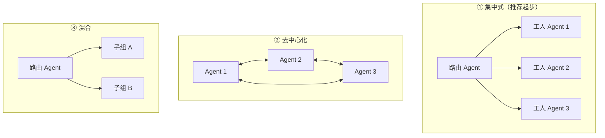
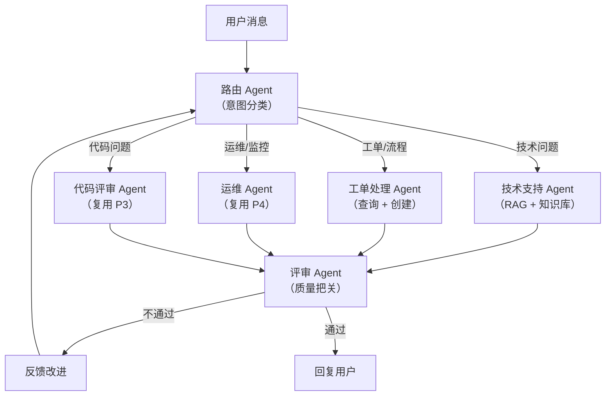

# 01 · 多 Agent 编排

> 阶段：5 架构师 · 难度：⭐⭐⭐⭐⭐ · 预计：2 周
> 前置：[阶段 4 完成](../阶段4-生产化/07-项目P4-运维Agent.md)
> 产出：能设计多 Agent 协作架构，理解编排模式与共享上下文

---

## 你将学会

- 什么时候需要多 Agent（单 Agent 的瓶颈在哪）
- 三大编排模式：集中式 / 去中心化 / 混合
- 共享上下文：多 Agent 协作的关键（行业调研重点）
- 路由 Agent + 工人 Agent + 评审 Agent 架构

---

## 什么时候需要多 Agent

> 来源：[行业调研](../调研/00-Agent架构师行业调研-2026.md)——无共享上下文的编排，规模化时必崩。

**单 Agent 的瓶颈**：
- 工具太多（20+ 个）→ LLM 选择困难
- 上下文太长 → token 爆炸
- 不同子任务需要不同的 system prompt

**多 Agent 的价值**：
- 每个 Agent 专注一个领域（工具少、上下文短）
- 并行处理不同子任务
- 通过路由 Agent 协调分工

---

## 三大编排模式



| 模式 | 优点 | 缺点 | 适用 |
|------|------|------|------|
| 集中式 | 简单可控 | 路由 Agent 成瓶颈 | 起步推荐 |
| 去中心化 | 无单点 | 协调复杂 | 研究/探索 |
| 混合 | 兼顾 | 实现复杂 | 大规模 |

---

## 客服平台多 Agent 架构



---

## 共享上下文（关键）

> 行业调研结论：**多 Agent 编排在规模化时崩塌的根因是缺少共享上下文。**

```java
// 共享上下文：所有 Agent 能读写同一个会话状态
public class SharedContext {
    private String sessionId;
    private String userIntent;          // 路由 Agent 写入
    private List<ToolResult> toolResults; // 工人 Agent 写入
    private String currentPlan;          // 编排器写入
    private int turnCount;              // 防失控
}
```

---

## 验收检查

- [ ] 能设计多 Agent 编排架构
- [ ] 理解三种编排模式的优缺点
- [ ] 实现了共享上下文
- [ ] 能解释"为什么规模化时需要共享上下文"

---

## 下一步

→ 下一篇：[02 多租户与权限](02-多租户与权限.md)

---

## 延伸阅读：多 Agent 编排深化路线图

本篇是多 Agent 编排入门。以下文档从不同维度深化编排能力：

| 方向 | 文档 | 深化内容 |
|------|------|---------|
| 编排引擎选型 | [05-编排引擎选型](05-编排引擎选型.md) | DAG vs 状态机 vs 自主的 ADR |
| 速率限制 | [09-Agent速率限制与背压设计](09-Agent速率限制与背压设计.md) | 多Agent间的限流与背压 |
| 事件驱动 | [13-EventDrivenAgent架构](13-EventDrivenAgent架构.md) | Event Sourcing + CQRS |
| 生命周期 | [07-Agent生命周期管理](07-Agent生命周期管理.md) | Agent 创建→终止全生命周期 |
| 平台化 | [08-Agent平台化设计](08-Agent平台化设计.md) | 统一管理多Agent的平台 |
| 自我反思 | [阶段4-41-Agent自我反思与元认知](../阶段4-生产化/41-Agent自我反思与元认知.md) | Agent 从执行到反思 |
| 编排理论 | [理论字典-Agent编排](../理论字典/Agent编排.md) | 五大模式决策树 |
| 编排实战 | [项目15-NexusOrchestra](../项目实践/15-企业项目-Agent智能编排平台/00-总览.md) | 上百Agent的智能编排平台 |
| 工作流实战 | [项目07-FlowEngine](../项目实践/07-企业项目-工作流引擎/00-总览.md) | DAG编排+审批+集成 |

---

## 随堂练习：写作+审校双 Agent 协作（90 分钟）

实现 Writer Agent 写文章 → Reviewer Agent 审校 → Writer 修改 → 直到通过。

**提示**：
```java
// Writer: write(topic) → 初稿, revise(draft, feedback) → 改稿
// Reviewer: review(draft) → ReviewResult(approved, feedback)
// Orchestrator: write → review → 不通过则 revise → review → 循环（max 3 轮）
```

**验收**：Writer 能写、Reviewer 能审、修改后质量提升、有 maxRevisions 保护。
**扩展**：加第三个 Editor Agent 润色；加质量评分（1-5 分）。
