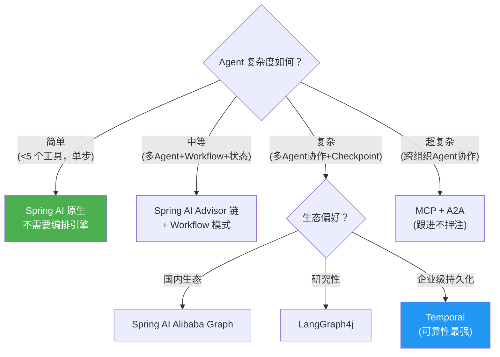

# 05 · 编排引擎选型

> 阶段：5 架构师 · 难度：⭐⭐⭐ · 预计：2 天
> 前置：[04 AI 原生架构设计](04-AI原生架构设计.md)
> 产出：能做编排引擎选型决策（ADR），知道何时引入、引入哪个

---

## 选型决策树



---

## ADR（架构决策记录）

选型决策必须写成文档，留痕可追溯：

```markdown
# ADR-001：多 Agent 编排引擎选型

## 状态
已接受

## 背景
客服平台需要多 Agent 协作（路由/技术/工单/运维），需要 Checkpoint 和断点续跑。

## 决策
选择 Spring AI Alibaba Graph。

## 理由
- 国内生态，中文文档完善
- 与 Spring AI 2.0 原生集成
- 支持 DAG + 状态机 + Checkpoint

## 后果
- 正面：团队学习成本低、社区活跃
- 负面：不如 LangGraph4j 灵活、绑定阿里生态
```

---

## 验收检查

- [ ] 能判断何时需要编排引擎
- [ ] 能写 ADR 决策文档
- [ ] 了解至少 2 种编排引擎的优缺点

---

## 下一步

→ 下一篇：[06 项目 P5 企业客服平台（毕业）](06-项目P5-企业客服平台.md)
