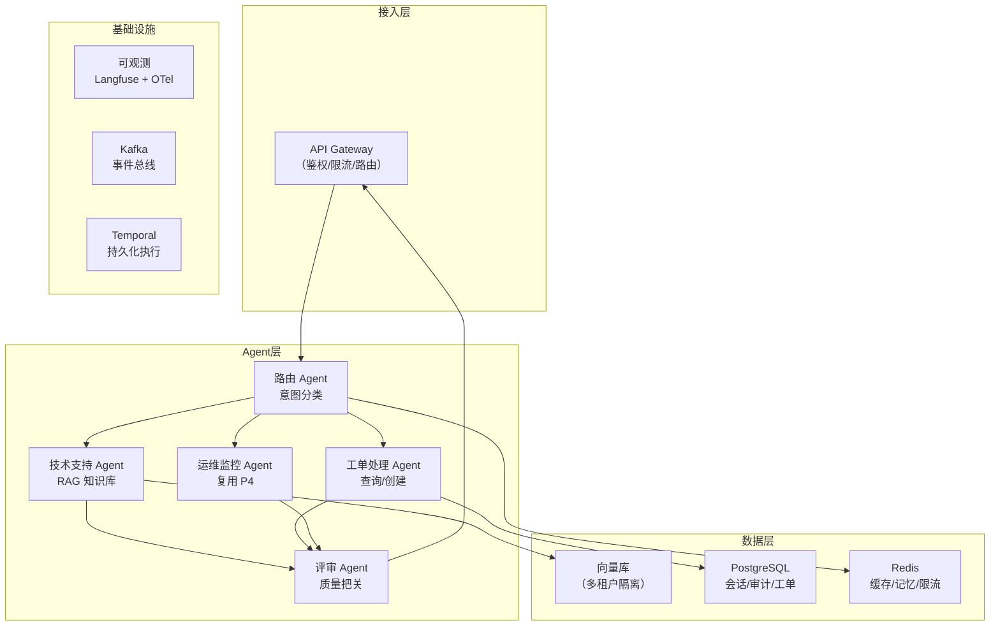

# 06 · 项目 P5：企业客服平台（毕业项目）

> 阶段：5 架构师 · 难度：⭐⭐⭐⭐⭐ · 预计：3-4 周
> 前置：[05 编排引擎选型](05-编排引擎选型.md)
> 产出：一个完整的企业级多租户客服平台——你的毕业项目

---

## 项目目标

你要从零设计并交付一个**企业级多租户 AI 客服平台**。这不是 Demo——它是你简历上的核心项目。

### 核心功能

```
用户视角：
  1. 企业客户注册 → 独立租户（独立知识库 + 权限）
  2. 上传企业文档 → 自动建知识库（RAG）
  3. 客户提问 → 多 Agent 协作回答
  4. 复杂工单 → Routing → Orchestrator → Evaluator → 人工确认
  5. 全链路审计 → 合规报告

架构视角：
  - 多 Agent（路由/技术/工单/运维/评审）
  - 多租户隔离（数据+向量库+权限）
  - RAG（企业知识库）
  - Workflow 模式（五大模式全用上）
  - 可靠性（幂等/重试/熔断/持久化）
  - 可观测（全链路 trace + 成本看板）
  - 安全（Prompt Injection 防御 + 审计日志）
  - 全栈（Docker/K8s/监控/文档）
```

### 复用的全部能力

| 能力 | 来源 | 在 P5 中的角色 |
|------|------|-------------|
| 对话 + 记忆 | P1 | 客服对话核心 |
| RAG + 评估 | P2 | 企业知识库问答 |
| 五大 Workflow + MCP | P3 | 代码评审 Agent（一个模块） |
| 可靠性 + 可观测 + 成本 | P4 | 运维监控 Agent（一个模块）+ 生产化底座 |
| 多 Agent 编排 | 阶段 5-01 | 客服路由 + 分工 |
| 多租户 + 审计 | 阶段 5-02/03 | 租户隔离 + 合规 |
| AI 原生架构 | 阶段 5-04 | Event Sourcing 会话 |

---

## 架构设计



---

## 毕业标准

- [ ] **多租户**：不同企业客户数据互不可见
- [ ] **RAG**：上传文档 → 自动问答
- [ ] **多 Agent**：至少 3 个 Agent 协作
- [ ] **Workflow**：复杂工单用五大模式处理
- [ ] **审计**：全链路 append-only 日志
- [ ] **可靠性**：幂等 + 熔断 + 持久化恢复
- [ ] **可观测**：全链路 trace + 成本看板
- [ ] **评估**：faithfulness > 0.85
- [ ] **部署**：Docker Compose 一键启动
- [ ] **文档**：README + 架构图 + ADR
- [ ] **简历**：3 个量化指标（QPS / 准确率 / 成本）

---

## 🎓 恭喜毕业

完成 P5 后，你已经从零走到了 **Agent 架构师**。你能独立设计并交付一个企业级 AI Agent 系统——从需求建模到上线运维，经得起真实流量和合规审计。

→ 继续进阶：[阶段 6 前沿](../阶段6-前沿/01-DurableAgentExecution.md)
→ 回顾路线：[能力地图](../01-能力地图.md)——看看你已经到了哪一级
