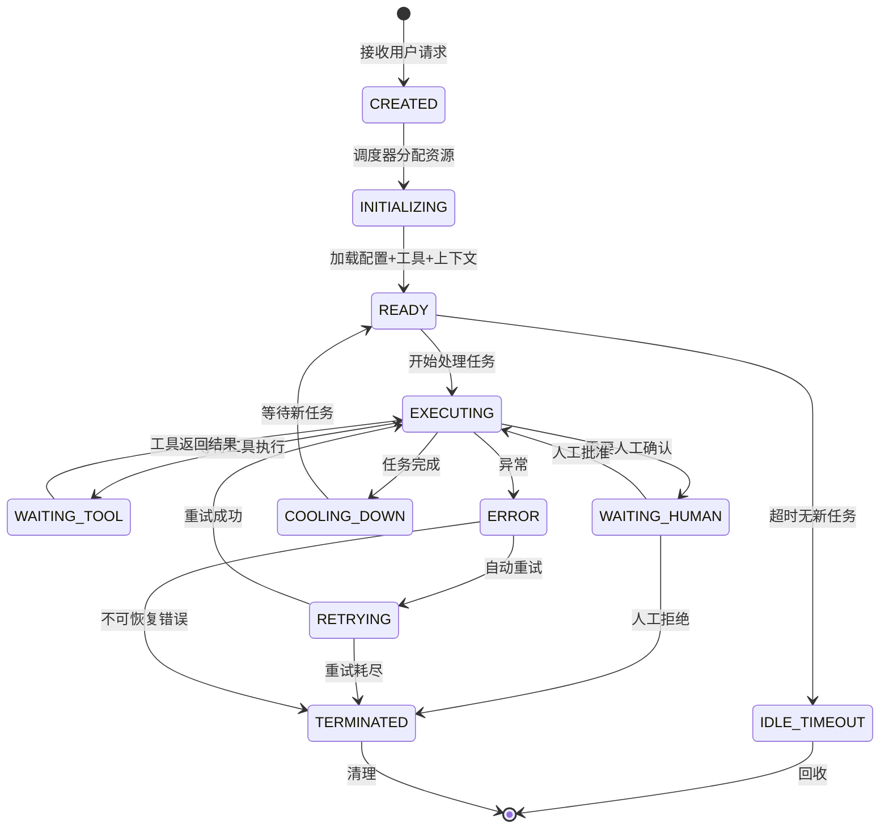

# 07 · Agent 生命周期管理（补充篇）

> 阶段：5 架构师 · 难度：⭐⭐⭐⭐ · 预计：2 天
> 前置：[06 项目 P5 企业客服平台](06-项目P5-企业客服平台.md)
> 产出：掌握 Agent 完整生命周期管理——从创建到终止

---

## Agent 生命周期状态机



### 状态定义

```java
package com.example.platform.lifecycle;

/**
 * Agent 生命周期状态
 */
public enum AgentState {
    CREATED,         // 刚创建，尚未初始化
    INITIALIZING,    // 正在加载配置/工具/上下文
    READY,           // 就绪，等待任务
    EXECUTING,       // 正在执行任务（LLM 调用 + 工具调用）
    WAITING_TOOL,    // 等待工具执行完成
    WAITING_HUMAN,   // 等待人工确认（危险操作）
    COOLING_DOWN,    // 任务刚完成，短暂冷却
    ERROR,           // 异常状态
    RETRYING,        // 自动重试中
    IDLE_TIMEOUT,    // 空闲超时，即将回收
    TERMINATED       // 已终止，资源已清理
}
```

### 完整生命周期管理器

```java
package com.example.platform.lifecycle;

import org.springframework.stereotype.Component;
import java.util.*;
import java.util.concurrent.*;

/**
 * Agent 生命周期管理器
 *
 * 职责：
 * - 管理 Agent 实例的创建、状态转换、销毁
 * - 控制空闲超时（自动回收资源）
 * - 控制最大执行时间（防止僵尸 Agent）
 * - 状态变更通知（观察者模式）
 */
@Component
public class AgentLifecycleManager {

    private final Map<String, AgentInstance> instances = new ConcurrentHashMap<>();
    private final List<AgentStateListener> listeners = new CopyOnWriteArrayList<>();
    private final ScheduledExecutorService scheduler = Executors.newScheduledThreadPool(2);

    // 配置
    private static final long IDLE_TIMEOUT_MS = 30 * 60 * 1000;     // 30 分钟空闲 → 回收
    private static final long MAX_EXECUTION_MS = 10 * 60 * 1000;    // 最大执行 10 分钟
    private static final int MAX_RETRIES = 3;

    /**
     * 创建 Agent 实例
     */
    public AgentInstance create(String tenantId, String userId, String sessionId) {
        String agentId = UUID.randomUUID().toString();

        AgentInstance agent = new AgentInstance(
            agentId, tenantId, userId, sessionId,
            AgentState.CREATED,
            System.currentTimeMillis()
        );

        instances.put(agentId, agent);
        notifyStateChange(agent, AgentState.CREATED);

        // 启动空闲超时检查
        scheduleIdleCheck(agentId);

        // 初始化
        transition(agentId, AgentState.INITIALIZING);
        // ... 加载配置、工具、上下文
        transition(agentId, AgentState.READY);

        return agent;
    }

    /**
     * 状态转换（带合法性检查）
     */
    public void transition(String agentId, AgentState newState) {
        AgentInstance agent = instances.get(agentId);
        if (agent == null) throw new IllegalStateException("Agent not found: " + agentId);

        AgentState oldState = agent.state();
        if (!isValidTransition(oldState, newState)) {
            throw new IllegalStateException(
                "Invalid transition: " + oldState + " → " + newState);
        }

        agent.setState(newState);
        agent.setLastStateChangeTime(System.currentTimeMillis());
        notifyStateChange(agent, newState);

        // 执行状态对应的逻辑
        switch (newState) {
            case TERMINATED -> cleanup(agentId);
            case ERROR -> handleError(agentId);
            case IDLE_TIMEOUT -> terminate(agentId, "Idle timeout");
        }
    }

    /**
     * 获取所有活跃 Agent（监控台用）
     */
    public List<AgentInstance> getActiveAgents() {
        return instances.values().stream()
            .filter(a -> a.state() != AgentState.TERMINATED)
            .toList();
    }

    /**
     * 按状态过滤
     */
    public Map<AgentState, Long> getStateDistribution() {
        return instances.values().stream()
            .collect(Collectors.groupingBy(
                AgentInstance::state,
                Collectors.counting()
            ));
    }

    /**
     * 终止 Agent
     */
    public void terminate(String agentId, String reason) {
        AgentInstance agent = instances.get(agentId);
        if (agent != null) {
            agent.setTerminationReason(reason);
            transition(agentId, AgentState.TERMINATED);
        }
    }

    // === 内部方法 ===

    private boolean isValidTransition(AgentState from, AgentState to) {
        return switch (from) {
            case CREATED -> to == AgentState.INITIALIZING || to == AgentState.TERMINATED;
            case INITIALIZING -> to == AgentState.READY || to == AgentState.ERROR;
            case READY -> to == AgentState.EXECUTING || to == AgentState.IDLE_TIMEOUT
                            || to == AgentState.TERMINATED;
            case EXECUTING -> to == AgentState.WAITING_TOOL || to == AgentState.WAITING_HUMAN
                               || to == AgentState.COOLING_DOWN || to == AgentState.ERROR;
            case WAITING_TOOL -> to == AgentState.EXECUTING || to == AgentState.ERROR
                                  || to == AgentState.TERMINATED;
            case WAITING_HUMAN -> to == AgentState.EXECUTING || to == AgentState.TERMINATED
                                   || to == AgentState.ERROR;
            case COOLING_DOWN -> to == AgentState.READY || to == AgentState.TERMINATED;
            case ERROR -> to == AgentState.RETRYING || to == AgentState.TERMINATED;
            case RETRYING -> to == AgentState.EXECUTING || to == AgentState.TERMINATED;
            case IDLE_TIMEOUT, TERMINATED -> false;  // 终态
        };
    }

    private void scheduleIdleCheck(String agentId) {
        scheduler.scheduleAtFixedRate(() -> {
            AgentInstance agent = instances.get(agentId);
            if (agent == null) return;

            if (agent.state() == AgentState.READY) {
                long idleTime = System.currentTimeMillis() - agent.lastStateChangeTime();
                if (idleTime > IDLE_TIMEOUT_MS) {
                    transition(agentId, AgentState.IDLE_TIMEOUT);
                }
            }

            // 执行超时检查
            if (agent.state() == AgentState.EXECUTING) {
                long execTime = System.currentTimeMillis() - agent.lastStateChangeTime();
                if (execTime > MAX_EXECUTION_MS) {
                    terminate(agentId, "Execution timeout");
                }
            }
        }, 1, 1, TimeUnit.MINUTES);
    }

    private void handleError(String agentId) {
        AgentInstance agent = instances.get(agentId);
        if (agent == null) return;

        if (agent.retryCount() < MAX_RETRIES) {
            agent.incrementRetry();
            transition(agentId, AgentState.RETRYING);
            // 指数退避后重试
            scheduler.schedule(() -> {
                transition(agentId, AgentState.EXECUTING);
            }, (long) Math.pow(2, agent.retryCount()), TimeUnit.SECONDS);
        } else {
            terminate(agentId, "Max retries exceeded");
        }
    }

    private void cleanup(String agentId) {
        AgentInstance agent = instances.remove(agentId);
        if (agent != null) {
            // 释放资源（ChatClient、Memory、Tool 上下文等）
        }
    }

    private void notifyStateChange(AgentInstance agent, AgentState newState) {
        for (var listener : listeners) {
            listener.onStateChange(agent, newState);
        }
    }

    public void addListener(AgentStateListener listener) {
        listeners.add(listener);
    }

    @FunctionalInterface
    public interface AgentStateListener {
        void onStateChange(AgentInstance agent, AgentState newState);
    }

    /**
     * Agent 实例
     */
    public static class AgentInstance {
        private final String agentId;
        private final String tenantId;
        private final String userId;
        private final String sessionId;
        private volatile AgentState state;
        private volatile long createdAt;
        private volatile long lastStateChangeTime;
        private volatile int retryCount;
        private volatile String terminationReason;

        // Constructor, getters, setters...
        public AgentInstance(String agentId, String tenantId, String userId,
                              String sessionId, AgentState state, long createdAt) {
            this.agentId = agentId;
            this.tenantId = tenantId;
            this.userId = userId;
            this.sessionId = sessionId;
            this.state = state;
            this.createdAt = createdAt;
            this.lastStateChangeTime = createdAt;
        }

        public void incrementRetry() { retryCount++; }
        public String agentId() { return agentId; }
        public String tenantId() { return tenantId; }
        public AgentState state() { return state; }
        public void setState(AgentState s) { this.state = s; }
        public long lastStateChangeTime() { return lastStateChangeTime; }
        public void setLastStateChangeTime(long t) { this.lastStateChangeTime = t; }
        public int retryCount() { return retryCount; }
        public void setTerminationReason(String r) { this.terminationReason = r; }
    }
}
```

---

## Agent 健康检查

```java
package com.example.platform.lifecycle;

import org.springframework.boot.actuate.health.*;
import org.springframework.stereotype.Component;

/**
 * Agent 健康检查——Spring Boot Actuator 集成
 *
 * K8s 用 /health/live 判断是否需要重启容器
 * K8s 用 /health/ready 判断是否可以接收流量
 */
@Component
public class AgentHealthIndicator implements HealthIndicator {

    private final AgentLifecycleManager lifecycleManager;

    @Override
    public Health health() {
        var distribution = lifecycleManager.getStateDistribution();

        long total = distribution.values().stream().mapToLong(Long::longValue).sum();
        long errorCount = distribution.getOrDefault(AgentState.ERROR, 0L);
        long terminatedCount = distribution.getOrDefault(AgentState.TERMINATED, 0L);
        long activeCount = total - terminatedCount;

        double errorRate = activeCount > 0 ? (double) errorCount / activeCount : 0;

        if (errorRate > 0.3) {
            return Health.down()
                .withDetail("errorRate", errorRate)
                .withDetail("activeAgents", activeCount)
                .withDetail("errorAgents", errorCount)
                .build();
        }

        return Health.up()
            .withDetail("activeAgents", activeCount)
            .withDetail("stateDistribution", distribution)
            .build();
    }
}
```

---

## 限流与背压

```java
package com.example.platform.lifecycle;

import io.github.resilience4j.ratelimiter.RateLimiter;
import io.github.resilience4j.ratelimiter.RateLimiterConfig;
import org.springframework.stereotype.Component;

import java.time.Duration;
import java.util.concurrent.ConcurrentHashMap;
import java.util.concurrent.ConcurrentMap;

/**
 * Agent 级别限流——防止 LLM API 被打爆
 *
 * 三级限流：
 * 1. 全局限流（保护整体 API 配额）
 * 2. 租户限流（防止单租户垄断）
 * 3. 会话限流（防止单会话死循环消耗）
 */
@Component
public class AgentRateLimiter {

    private final RateLimiter globalLimiter;
    private final ConcurrentMap<String, RateLimiter> tenantLimiters = new ConcurrentHashMap<>();

    public AgentRateLimiter() {
        this.globalLimiter = RateLimiter.of("global-llm",
            RateLimiterConfig.custom()
                .limitForPeriod(100)              // 100 次/周期
                .limitRefreshPeriod(Duration.ofSeconds(10))  // 10 秒周期
                .timeoutDuration(Duration.ofSeconds(30))     // 超时等待 30s
                .build());
    }

    /**
     * 获取租户级限流器
     */
    private RateLimiter getTenantLimiter(String tenantId) {
        return tenantLimiters.computeIfAbsent(tenantId, tid ->
            RateLimiter.of("tenant-" + tid,
                RateLimiterConfig.custom()
                    .limitForPeriod(30)           // 每租户 30 次/10 秒
                    .limitRefreshPeriod(Duration.ofSeconds(10))
                    .timeoutDuration(Duration.ofSeconds(10))
                    .build())
        );
    }

    /**
     * 检查是否允许调用 LLM
     */
    public RateLimitResult checkLlmCall(String tenantId) {
        if (!globalLimiter.acquirePermission()) {
            return RateLimitResult.rejected("全局 LLM 调用限流，请稍后重试");
        }

        RateLimiter tenantLimiter = getTenantLimiter(tenantId);
        if (!tenantLimiter.acquirePermission()) {
            return RateLimitResult.rejected("租户 " + tenantId + " LLM 调用限流");
        }

        return RateLimitResult.allowed();
    }

    public record RateLimitResult(boolean allowed, String reason) {
        static RateLimitResult allowed() { return new RateLimitResult(true, null); }
        static RateLimitResult rejected(String reason) { return new RateLimitResult(false, reason); }
    }
}
```

---

## 验收检查

- [ ] 理解 Agent 生命周期 10 个状态及转换规则
- [ ] 能实现生命周期状态机
- [ ] 能实现空闲超时自动回收
- [ ] 能实现执行超时自动终止
- [ ] 能实现错误自动重试（指数退避）
- [ ] 能实现 Agent 健康检查（K8s 集成）
- [ ] 能实现三级限流（全局/租户/会话）

---

## 下一步

→ 下一篇：[08 Agent 平台化设计](08-Agent平台化设计.md)
