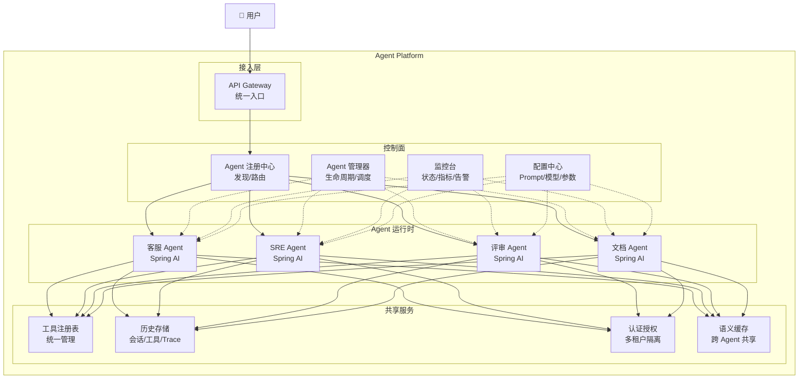

# 08 · Agent 平台化设计（补充篇）

> 阶段：5 架构师 · 难度：⭐⭐⭐⭐⭐ · 预计：3 天
> 前置：[07 Agent 生命周期管理](07-Agent生命周期管理.md)
> 产出：掌握多 Agent 统一管理、调度、监控的平台级架构

---

## 从"一个 Agent"到"Agent 平台"

之前的学习中你构建的是**单个 Agent**（客服 Agent、代码 Agent……）。企业级架构需要的是**Agent 平台**——一个统一管理多个 Agent 的系统。



---

## 平台核心组件

### 组件一：Agent 注册中心

```java
package com.example.platform.registry;

import org.springframework.stereotype.Component;
import java.util.*;
import java.util.concurrent.ConcurrentHashMap;

/**
 * Agent 注册中心
 *
 * 每个 Agent 类型注册自己的：
 * - 能力描述（能做什么）
 * - 输入/输出 Schema
 * - 所需工具列表
 * - 所需权限
 * - 健康状态
 *
 * 路由器根据注册信息决定用户的请求该交给哪个 Agent。
 */
@Component
public class AgentRegistry {

    private final Map<String, AgentDescriptor> agents = new ConcurrentHashMap<>();

    /**
     * 注册一个 Agent 类型
     */
    public void register(AgentDescriptor descriptor) {
        agents.put(descriptor.agentType(), descriptor);
    }

    /**
     * 发现：根据用户意图匹配 Agent
     */
    public List<AgentDescriptor> discover(String intent) {
        return agents.values().stream()
            .filter(a -> a.status() == AgentStatus.HEALTHY)
            .filter(a -> matchesIntent(a, intent))
            .sorted(Comparator.comparingDouble(AgentDescriptor::priority).reversed())
            .toList();
    }

    /**
     * 路由：选择最合适的 Agent
     */
    public AgentDescriptor route(String intent, String tenantId) {
        var candidates = discover(intent);

        if (candidates.isEmpty()) {
            return defaultAgent();
        }

        // 租户权限过滤
        return candidates.stream()
            .filter(a -> hasPermission(tenantId, a))
            .findFirst()
            .orElse(defaultAgent());
    }

    private boolean matchesIntent(AgentDescriptor agent, String intent) {
        return agent.capabilities().stream()
            .anyMatch(c -> intent.toLowerCase().contains(c.toLowerCase()));
    }

    private boolean hasPermission(String tenantId, AgentDescriptor agent) {
        // 检查租户是否有权使用该 Agent
        return true; // 简化
    }

    private AgentDescriptor defaultAgent() {
        return agents.get("general-chat");
    }

    /**
     * Agent 描述符
     */
    public record AgentDescriptor(
        String agentType,          // "customer-service", "code-review"
        String displayName,        // "智能客服"
        String description,        // "处理客户咨询、工单、退款"
        List<String> capabilities, // ["退款", "工单", "咨询"]
        List<String> requiredTools,// ["search_kb", "create_ticket", "process_refund"]
        double priority,           // 路由优先级（越高越优先）
        AgentStatus status,        // HEALTHY / DEGRADED / OFFLINE
        String version,            // "v2.1.0"
        long registeredAt
    ) {}

    public enum AgentStatus { HEALTHY, DEGRADED, OFFLINE }
}
```

### 组件二：Agent 管理器

```java
package com.example.platform.manager;

import org.springframework.stereotype.Component;
import java.util.*;

/**
 * Agent 管理器——平台视角的 Agent 运营工具
 *
 * 功能：
 * 1. 查看所有 Agent 实例状态
 * 2. 终止异常 Agent
 * 3. 暂停/恢复某个 Agent 类型
 * 4. 查看 Agent 的资源消耗
 */
@Component
public class AgentPlatformManager {

    private final AgentRegistry registry;
    private final AgentLifecycleManager lifecycle;

    /**
     * 平台概览（管理后台首页用）
     */
    public PlatformOverview overview() {
        var allAgents = registry.getAll();
        var activeInstances = lifecycle.getActiveAgents();

        Map<String, Long> byType = activeInstances.stream()
            .collect(Collectors.groupingBy(
                AgentInstance::agentType,
                Collectors.counting()));

        Map<String, AgentHealth> healthByType = new HashMap<>();
        for (var desc : allAgents) {
            healthByType.put(desc.agentType(), checkHealth(desc));
        }

        return new PlatformOverview(
            allAgents.size(),
            activeInstances.size(),
            byType,
            healthByType
        );
    }

    /**
     * 暂停某个 Agent 类型（紧急回滚）
     */
    public void pause(String agentType) {
        // 1. 标记为 OFFLINE
        registry.updateStatus(agentType, AgentStatus.OFFLINE);

        // 2. 终止所有正在执行的该类型 Agent
        lifecycle.getActiveAgents().stream()
            .filter(a -> a.agentType().equals(agentType))
            .forEach(a -> lifecycle.terminate(a.agentId(), "Agent type paused"));
    }

    /**
     * 恢复某个 Agent 类型
     */
    public void resume(String agentType) {
        registry.updateStatus(agentType, AgentStatus.HEALTHY);
    }

    public record PlatformOverview(
        int registeredTypes,
        int activeInstances,
        Map<String, Long> instancesByType,
        Map<String, AgentHealth> healthByType
    ) {}

    public record AgentHealth(
        String agentType,
        AgentStatus status,
        long activeCount,
        double avgLatencyMs,
        double errorRate,
        double costLastHourUsd
    ) {}
}
```

### 组件三：统一事件驱动

```java
package com.example.platform.events;

import org.springframework.context.event.EventListener;
import org.springframework.stereotype.Component;
import java.util.*;

/**
 * 事件驱动的 Agent 通信
 *
 * Agent 之间不直接调用，而是通过事件总线通信。
 * 优势：
 * - 解耦：Agent 不需要知道彼此
 * - 可观测：所有交互通过事件可追踪
 * - 可扩展：新 Agent 只需订阅事件
 */
@Component
public class AgentEventBus {

    private final Map<Class<?>, List<AgentEventHandler<?>>> handlers = new ConcurrentHashMap<>();

    /**
     * 发布事件
     */
    public <T extends AgentEvent> void publish(T event) {
        List<AgentEventHandler<?>> eventHandlers = handlers.get(event.getClass());
        if (eventHandlers != null) {
            for (var handler : eventHandlers) {
                @SuppressWarnings("unchecked")
                AgentEventHandler<T> typed = (AgentEventHandler<T>) handler;
                typed.handle(event);
            }
        }
    }

    /**
     * 订阅事件
     */
    public <T extends AgentEvent> void subscribe(Class<T> eventType, AgentEventHandler<T> handler) {
        handlers.computeIfAbsent(eventType, k -> new ArrayList<>()).add(handler);
    }

    // === 标准 Agent 事件 ===

    public record AgentStartedEvent(String agentId, String agentType, String sessionId) implements AgentEvent {}
    public record AgentCompletedEvent(String agentId, String sessionId, double costUsd, long durationMs) implements AgentEvent {}
    public record AgentFailedEvent(String agentId, String sessionId, String error, boolean retriable) implements AgentEvent {}
    public record ToolExecutedEvent(String agentId, String toolName, boolean success, long latencyMs) implements AgentEvent {}
    public record HumanInputRequiredEvent(String agentId, String sessionId, String question) implements AgentEvent {}
    public record BudgetExceededEvent(String agentId, String sessionId, double used, double limit) implements AgentEvent {}

    public sealed interface AgentEvent {}
    @FunctionalInterface
    public interface AgentEventHandler<T extends AgentEvent> {
        void handle(T event);
    }
}
```

---

## Agent 平台管理后台

```java
package com.example.platform.controller;

import org.springframework.web.bind.annotation.*;
import java.util.*;

/**
 * 平台管理 API
 */
@RestController
@RequestMapping("/api/platform")
public class PlatformController {

    private final AgentPlatformManager manager;
    private final AgentRegistry registry;
    private final HistoryPersistenceService history;
    private final ToolCallVisualizer visualizer;

    /**
     * 平台概览
     */
    @GetMapping("/overview")
    public PlatformOverview overview() {
        return manager.overview();
    }

    /**
     * Agent 列表
     */
    @GetMapping("/agents")
    public List<AgentDescriptor> agents() {
        return registry.getAll();
    }

    /**
     * 暂停 Agent 类型
     */
    @PostMapping("/agents/{type}/pause")
    public void pause(@PathVariable String type) {
        manager.pause(type);
    }

    /**
     * 恢复 Agent 类型
     */
    @PostMapping("/agents/{type}/resume")
    public void resume(@PathVariable String type) {
        manager.resume(type);
    }

    /**
     * 工具调用可视化（时间线）
     */
    @GetMapping("/sessions/{sessionId}/timeline")
    public Timeline timeline(@PathVariable String sessionId) {
        return visualizer.buildTimeline(sessionId);
    }

    /**
     * 工具调用链路图（Mermaid）
     */
    @GetMapping("/sessions/{sessionId}/callgraph")
    public String callGraph(@PathVariable String sessionId) {
        return visualizer.buildCallGraph(sessionId);
    }

    /**
     * 工具使用统计
     */
    @GetMapping("/stats/tools")
    public List<ToolUsageStat> toolStats(
            @RequestHeader("X-Tenant-Id") String tenantId,
            @RequestParam(defaultValue = "7") int days) {
        return history.getToolUsageStats(tenantId, days);
    }
}
```

---

## 验收检查

- [ ] 理解从"单个 Agent"到"Agent 平台"的架构升级
- [ ] 能实现 Agent 注册中心（注册/发现/路由）
- [ ] 能实现 Agent 平台管理器（暂停/恢复/概览）
- [ ] 能实现事件驱动 Agent 通信
- [ ] 能实现管理后台 API（可视化/统计/控制）

---

## 下一步

→ 进入 [阶段 6 前沿](../阶段6-前沿/01-DurableAgentExecution.md) 继续进阶

---

## 延伸阅读：平台化深化路线

| 方向 | 文档 | 内容 |
|------|------|------|
| 智能编排 | [项目15-NexusOrchestra](../项目实践/15-企业项目-Agent智能编排平台/00-总览.md) | 上百Agent的智能编排平台 |
| 事件驱动 | [13-EventDrivenAgent架构](13-EventDrivenAgent架构.md) | Event Sourcing + CQRS |
| Agent DevOps | [项目13-AgentForgeOps](../项目实践/13-企业项目-AgentDevOps平台/00-总览.md) | Agent 全生命周期 DevOps |
| 速率限制 | [09-速率限制与背压](09-Agent速率限制与背压设计.md) | 平台级限流 |
| 健康检查 | [10-健康检查与熔断器](10-Agent健康检查与熔断器.md) | 平台健康监控 |
| 控制中心 | [项目03-AgentOps](../项目实践/03-企业项目-Agent控制中心/00-总览.md) | 管控分离+可视化+配置管理 |
| 编排理论 | [理论字典-Agent编排](../理论字典/Agent编排.md) | 编排模式决策树 |
