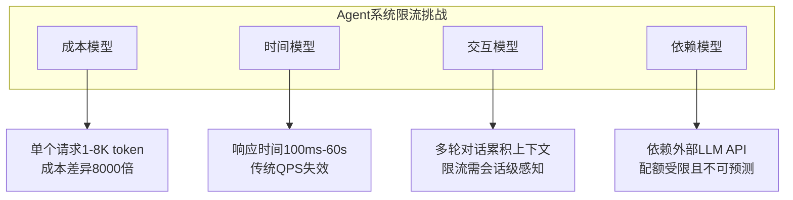
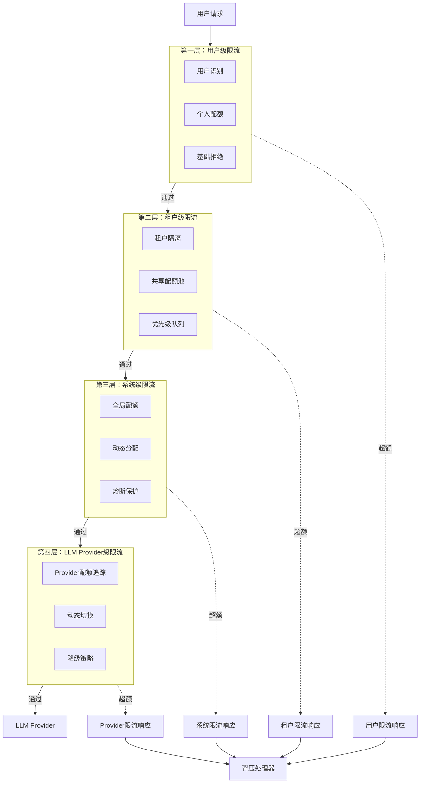
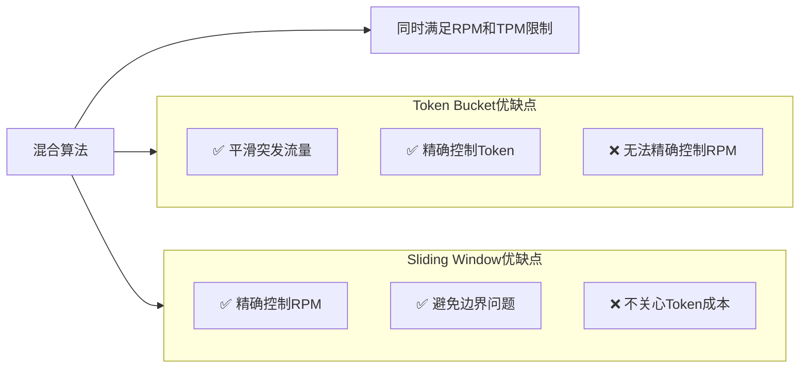
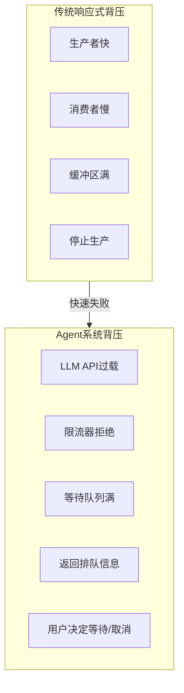
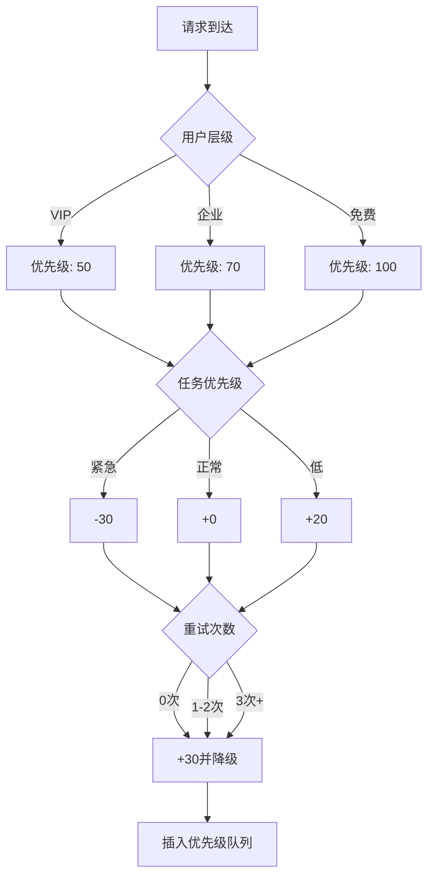
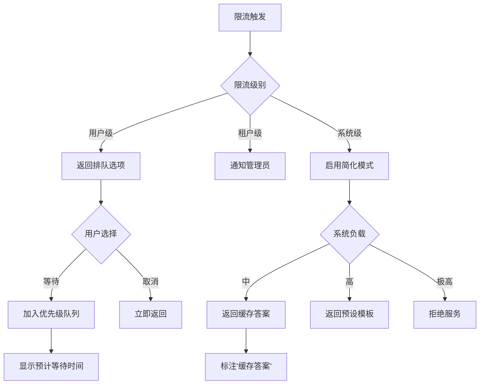

# 09 · Agent 速率限制与背压设计（Rate Limiting & Backpressure）

> **核心问题**：LLM API 有严格的 TPM（Tokens Per Minute）和 RPM（Requests Per Minute）限制，如何在高并发 Agent 系统中实现优雅的速率限制，当资源不足时如何通过背压机制保护系统？

---

## 概述

Agent 系统的速率限制与背压设计是保障系统稳定性和成本可控的关键防线。与传统 API 网关的限流不同，Agent 系统需要考虑：

1. **多层级限流需求**：从用户级到 LLM Provider 级的立体防护
2. **非均匀成本模型**：Token 消耗因请求而异，无法简单按请求计数
3. **背压传播链路**：从底层 LLM 过载向上传递到用户层
4. **优先级调度**：VIP 用户与普通用户的差异化对待
5. **分布式一致性**：多实例部署时的限流状态同步

本文将从架构设计、算法实现、Java 代码实战到最佳实践，全方位解析 Agent 系统的速率限制与背压机制。

---

## 为什么需要 Agent 专属的速率限制

### 传统限流方案的不足

| 限流维度 | 传统 API 适用性 | Agent 系统的问题 |
|---------|----------------|----------------|
| QPS/TPS | ✅ 适用 | ❌ 单个 Agent 调用可能耗时 30 秒，QPS 无法反映真实压力 |
| 固定令牌桶 | ✅ 适用 | ❌ Token 消耗差异巨大（1 token vs 8000 token），均匀令牌分配失效 |
| 单机限流 | ✅ 适用 | ❌ Agent 调用需要跨实例协同，否则总配额被突破 |
| 简单拒绝 | ✅ 适用 | ❌ Agent 调用成本高、等待时间长，简单拒绝用户体验极差 |

### Agent 系统的特殊挑战



### LLM Provider 的限流现实

主流 LLM Provider 的限流策略：

| Provider | 限流维度 | 免费层 | 付费层 |
|----------|---------|-------|-------|
| OpenAI | RPM + TPM | 3 RPM / 40K TPM | 10K-90K RPM（按 tier） |
| Anthropic | RPM + TPM | 5 RPM / 20K TPM | 60 RPM / 300K TPM |
| Azure OpenAI | TPM | - | 120K-300K TPM / deployment |
| Google Gemini | QPD + QPM | 60 QPD | 1500 QPM |

**关键洞察**：TPM（Tokens Per Minute）是 Agent 限流的核心指标，因为：
1. LLM 成本按 Token 计费
2. Provider 硬限以 Token 为主
3. 请求的 Token 数分布极不均匀

---

## 三层速率限制架构

### 架构全景图



### 各层职责详解

#### 第一层：用户级限流
- **目标**：防止单个用户占用过多资源
- **指标**：每用户 RPM、每用户 TPM、会话级限流
- **实现**：本地 Guava RateLimiter + Redis 分布式计数

#### 第二层：租户级限流
- **目标**：企业多租户隔离与资源共享
- **指标**：租户总配额、租户内优先级队列
- **实现**：Redis Sorted Queue + Token Bucket

#### 第三层：系统级限流
- **目标**：保护整体系统不过载
- **指标**：全系统 TPM、全系统并发连接数
- **实现**：自适应限流算法（根据成功率动态调整）

#### 第四层：LLM Provider 级限流
- **目标**：不触发 Provider 硬限，避免账号封禁
- **指标**：每个 Provider 的实时配额消耗
- **实现**：配额预测算法 + 多 Provider 热切换

---

## 核心算法：Token Bucket + Sliding Window 混合

### 为什么需要混合算法



### 算法实现

```java
/**
 * 混合限流器：同时控制 RPM 和 TPM
 * 基于 Token Bucket + Sliding Window
 */
public class HybridRateLimiter {
    
    // Token Bucket for TPM
    private final TokenBucket tokenBucket;
    
    // Sliding Window for RPM
    private final SlidingWindowRateLimiter requestLimiter;
    
    // 分布式锁（Redis）
    private final DistributedLock lock;
    
    // 配置
    private final int maxTokensPerMinute;
    private final int maxRequestsPerMinute;
    
    public HybridRateLimiter(int tpm, int rpm, RedisTemplate redisTemplate) {
        this.maxTokensPerMinute = tpm;
        this.maxRequestsPerMinute = rpm;
        this.tokenBucket = new TokenBucket(tpm, redisTemplate);
        this.requestLimiter = new SlidingWindowRateLimiter(rpm, redisTemplate);
        this.lock = new DistributedLock(redisTemplate);
    }
    
    /**
     * 尝试获取许可
     * @param estimatedTokens 预估消耗的 Token 数
     * @param requestId 请求ID
     * @return RateLimitResult
     */
    public RateLimitResult tryAcquire(int estimatedTokens, String requestId) {
        String lockKey = "rate_limit_lock:" + requestId;
        
        return lock.execute(lockKey, () -> {
            // 1. 先检查 RPM
            if (!requestLimiter.tryAcquire(requestId)) {
                return RateLimitResult.rejected("RPM_EXCEEDED", 
                    waitForNextRequest());
            }
            
            // 2. 再检查 TPM
            if (!tokenBucket.tryConsume(estimatedTokens, requestId)) {
                // 回滚 RPM 计数
                requestLimiter.rollback(requestId);
                return RateLimitResult.rejected("TPM_EXCEEDED", 
                    waitForTokens(estimatedTokens));
            }
            
            return RateLimitResult.granted();
        });
    }
    
    /**
     * 计算等待时间（毫秒）
     */
    private long waitForNextRequest() {
        return requestLimiter.timeToNextRequest();
    }
    
    /**
     * 计算等待足够 Token 的时间
     */
    private long waitForTokens(int tokens) {
        return tokenBucket.timeToAccumulate(tokens);
    }
}

/**
 * Token Bucket 实现（支持 Redis 分布式）
 */
class TokenBucket {
    private final int capacity;
    private final double refillRate;  // tokens per millisecond
    private final RedisTemplate redisTemplate;
    
    public TokenBucket(int tokensPerMinute, RedisTemplate redisTemplate) {
        this.capacity = tokensPerMinute;
        this.refillRate = tokensPerMinute / 60000.0;
        this.redisTemplate = redisTemplate;
    }
    
    public boolean tryConsume(int tokens, String key) {
        String bucketKey = "token_bucket:" + key;
        
        // Lua 脚本保证原子性
        String luaScript = """
            local key = KEYS[1]
            local now = tonumber(ARGV[1])
            local tokens = tonumber(ARGV[2])
            local capacity = tonumber(ARGV[3])
            local rate = tonumber(ARGV[4])
            
            local bucket = redis.call('HMGET', key, 'tokens', 'last_refill')
            local currentTokens = tonumber(bucket[1]) or capacity
            local lastRefill = tonumber(bucket[2]) or now
            
            -- 计算 refill
            local elapsed = now - lastRefill
            local refill = math.min(elapsed * rate, capacity - currentTokens)
            currentTokens = currentTokens + refill
            
            -- 检查是否有足够 tokens
            if currentTokens >= tokens then
                currentTokens = currentTokens - tokens
                redis.call('HMSET', key, 'tokens', currentTokens, 'last_refill', now)
                redis.call('EXPIRE', key, 120)
                return 1
            else
                redis.call('HMSET', key, 'tokens', currentTokens, 'last_refill', now)
                redis.call('EXPIRE', key, 120)
                return 0
            end
        """;
        
        Long result = redisTemplate.execute(
            RedisScript.of(luaScript, Long.class),
            Collections.singletonList(bucketKey),
            System.currentTimeMillis(),
            tokens,
            capacity,
            refillRate
        );
        
        return result == 1;
    }
    
    public long timeToAccumulate(int tokens) {
        // 简化计算：基于当前 refill rate 估算
        return (long) Math.ceil(tokens / refillRate);
    }
}

/**
 * 滑动窗口限流器
 */
class SlidingWindowRateLimiter {
    private final int maxRequests;
    private final RedisTemplate redisTemplate;
    
    public SlidingWindowRateLimiter(int rpm, RedisTemplate redisTemplate) {
        this.maxRequests = rpm;
        this.redisTemplate = redisTemplate;
    }
    
    public boolean tryAcquire(String key) {
        String windowKey = "sliding_window:" + key;
        long now = System.currentTimeMillis();
        long windowStart = now - 60000;  // 1分钟窗口
        
        String luaScript = """
            local key = KEYS[1]
            local now = tonumber(ARGV[1])
            local windowStart = tonumber(ARGV[2])
            local maxRequests = tonumber(ARGV[3])
            
            -- 清理过期记录
            redis.call('ZREMRANGEBYSCORE', key, 0, windowStart)
            
            -- 获取当前计数
            local count = redis.call('ZCARD', key)
            
            if count < maxRequests then
                redis.call('ZADD', key, now, now)
                redis.call('EXPIRE', key, 120)
                return 1
            else
                return 0
            end
        """;
        
        Long result = redisTemplate.execute(
            RedisScript.of(luaScript, Long.class),
            Collections.singletonList(windowKey),
            now,
            windowStart,
            maxRequests
        );
        
        return result == 1;
    }
    
    public void rollback(String key) {
        String windowKey = "sliding_window:" + key;
        redisTemplate.opsForZSet().removeRange(windowKey, System.currentTimeMillis(), 
            System.currentTimeMillis());
    }
    
    public long timeToNextRequest() {
        // 获取最早请求的时间戳
        // 实际实现中需要从 Redis 获取
        return 1000;  // 简化
    }
}

/**
 * 限流结果
 */
record RateLimitResult(
    boolean allowed,
    String reason,
    long retryAfterMs,
    Map<String, Object> metadata
) {
    public static RateLimitResult granted() {
        return new RateLimitResult(true, null, 0, Map.of());
    }
    
    public static RateLimitResult rejected(String reason, long retryAfterMs) {
        return new RateLimitResult(false, reason, retryAfterMs, Map.of(
            "timestamp", System.currentTimeMillis()
        ));
    }
}
```

---

## 背压传播机制

### 背压在 Agent 系统中的特殊性



**关键差异**：
1. **时间尺度**：Agent 调用秒级，背压策略不能是"拒绝"而应是"排队"
2. **用户交互**：需要告知等待时间，让用户有选择权
3. **成本敏感**：重试会消耗配额，需要智能重试策略

### 背压传播链路

```mermaid
sequenceDiagram
    participant U as 用户
    participant A as Agent API
    participant R as RateLimiter
    participant Q as 请求队列
    participant L as LLM Client
    participant P as LLM Provider
    
    U->>A: 发送请求
    A->>R: 检查限流
    
    alt 限流通过
        R->>Q: 加入队列
        Q-->>A: 排队位置 + 预计等待
        
        alt 用户选择等待
            A-->>U: 202 Accepted + Retry-After
            
            par 等待中...
                Q->>L: 轮到该请求
                L->>P: 调用 LLM
                
                alt LLM成功
                    P-->>L: 响应
                    L-->>A: 结果
                    A-->>U: 200 OK + 结果
                else LLM限流
                    P-->>L: 429 Too Many Requests
                    L->>Q: 重新排队（指数退避）
                end
            else 超时
                Q->>A: 请求超时
                A-->>U: 504 Gateway Timeout
            end
        else 用户取消
            U->>A: 取消请求
            A->>Q: 从队列移除
            A-->>U: 200 OK (已取消)
        end
    else 限流拒绝
        R-->>A: 429 Too Many Requests
        A-->>U: 429 + X-RateLimit-Reset
    end
```

### 响应式背压实现

```java
/**
 * Agent 背压处理器
 * 集成 Project Reactor 响应式流
 */
@Component
public class AgentBackpressureHandler {
    
    private final RequestQueue requestQueue;
    private final LLMClient llmClient;
    private final int maxQueueSize = 1000;
    
    /**
     * 处理 Agent 请求（响应式）
     */
    public Flux<AgentResponse> processRequest(Flux<AgentRequest> requests) {
        return requests
            .onBackpressureBuffer(
                maxQueueSize,
                () -> new RateLimitExceededException("队列已满"),
                BackpressureBufferStrategy.DROP_LATEST
            )
            .flatMap(request -> {
                // 1. 先尝试限流检查
                RateLimitResult rateCheck = rateLimiter.tryAcquire(
                    request.estimatedTokens(),
                    request.requestId()
                );
                
                if (!rateCheck.allowed()) {
                    return Mono.just(AgentResponse.rateLimited(
                        request,
                        rateCheck.retryAfterMs()
                    ));
                }
                
                // 2. 加入排队
                return requestQueue.enqueue(request)
                    .flatMap(queuePosition -> {
                        // 3. 等待轮到
                        return waitForTurn(queuePosition);
                    })
                    .flatMap(qr -> {
                        // 4. 实际调用 LLM
                        return callLLMWithRetry(qr.request());
                    });
            }, 16);  // 并发控制
    }
    
    /**
     * 调用 LLM 带背压感知的重试
     */
    private Mono<AgentResponse> callLLMWithRetry(AgentRequest request) {
        return llmClient.callAsync(request.toLLMRequest())
            .onErrorResume(throwable -> {
                if (isRateLimitError(throwable)) {
                    // LLM 返回 429，需要背压
                    return handleLLMRateLimit(request, throwable);
                }
                return Mono.error(throwable);
            })
            .timeout(Duration.ofSeconds(60))
            .doOnError(ex -> recordError(ex));
    }
    
    /**
     * 处理 LLM 返回的限流错误
     */
    private Mono<AgentResponse> handleLLMRateLimit(AgentRequest request, Throwable error) {
        // 解析 Retry-After
        long retryAfter = extractRetryAfter(error);
        
        // 指数退避
        long backoff = calculateExponentialBackoff(request.retryCount());
        
        return Mono.defer(() -> {
            if (request.retryCount() >= 3) {
                return Mono.just(AgentResponse.llmRateLimited(request, retryAfter));
            }
            
            // 重新排队
            return requestQueue.requeue(request, retryAfter + backoff)
                .flatMap(queuePosition -> waitForTurn(queuePosition))
                .flatMap(qr -> callLLMWithRetry(qr.request().withRetryIncrement()));
        });
    }
    
    /**
     * 等待轮到该请求
     */
    private Mono<QueuedRequest> waitForTurn(long queuePosition) {
        return Mono.create(sink -> {
            // 订阅队列事件
            Disposable subscription = requestQueue.onPositionReached(queuePosition)
                .subscribe(sink::success, sink::error, () -> sink.success());
            
            sink.onDispose(subscription);
        })
        .timeout(Duration.ofMinutes(5))
        .onErrorResume(TimeoutException.class, ex -> 
            Mono.error(new RequestTimeoutException("排队超时"))
        );
    }
}

/**
 * 响应式请求队列
 */
@Component
public class RequestQueue {
    
    private final Sinks.Many<QueueEvent> sink = Sinks.many().multicast().onBackpressureBuffer();
    private final PriorityBlockingQueue<QueuedRequest> queue;
    private final AtomicLong sequenceGenerator = new AtomicLong(0);
    
    public RequestQueue() {
        this.queue = new PriorityBlockingQueue<>(1000, 
            Comparator.comparingLong(QueuedRequest::priority)
                .thenComparingLong(QueuedRequest::sequence)
        );
    }
    
    /**
     * 入队
     */
    public Mono<Long> enqueue(AgentRequest request) {
        return Mono.fromCallable(() -> {
            QueuedRequest qr = QueuedRequest.builder()
                .request(request)
                .priority(calculatePriority(request))
                .sequence(sequenceGenerator.incrementAndGet())
                .enqueueTime(Instant.now())
                .build();
            
            queue.offer(qr);
            sink.tryEmitNext(QueueEvent.enqueued(qr));
            
            return (long) queue.indexOf(qr) + 1;  // 返回排队位置
        })
        .subscribeOn(Schedulers.boundedElastic());
    }
    
    /**
     * 计算优先级
     */
    private int calculatePriority(AgentRequest request) {
        int priority = 100;  // 默认优先级
        
        // VIP 用户
        if (request.userTier() == UserTier.VIP) {
            priority -= 50;
        }
        
        // 紧急任务
        if (request.priority() == RequestPriority.URGENT) {
            priority -= 30;
        }
        
        // 重试次数多的降级
        priority += request.retryCount() * 10;
        
        return priority;
    }
    
    /**
     * 等待位置到达
     */
    public Flux<QueuedRequest> onPositionReached(long targetPosition) {
        return sink.asFlux()
            .filter(event -> event.currentPosition() >= targetPosition)
            .map(QueueEvent::request)
            .take(1);
    }
    
    /**
     * 处理队列（后台线程）
     */
    @Scheduled(fixedDelay = 100)
    public void processQueue() {
        QueuedRequest qr = queue.poll();
        if (qr != null) {
            sink.tryEmitNext(QueueEvent.processing(qr, 1));  // 第一个位置
        }
    }
}

/**
 * 队列事件
 */
record QueueEvent(
    QueueEventType type,
    QueuedRequest request,
    long currentPosition
) {
    static QueueEvent enqueued(QueuedRequest request) {
        return new QueueEvent(QueueEventType.ENQUEUED, request, -1);
    }
    
    static QueueEvent processing(QueuedRequest request, long position) {
        return new QueueEvent(QueueEventType.PROCESSING, request, position);
    }
}

enum QueueEventType { ENQUEUED, PROCESSING, COMPLETED, FAILED }
```

---

## 优先级队列设计

### 优先级决策树



### 多级优先级队列实现

```java
/**
 * 多级优先级队列
 */
@Component
public class MultiLevelPriorityQueue {
    
    // 高优先级队列（VIP + 紧急）
    private final PriorityBlockingQueue<QueuedRequest> highQueue = 
        new PriorityBlockingQueue<>(100);
    
    // 中优先级队列（普通用户）
    private final PriorityBlockingQueue<QueuedRequest> mediumQueue = 
        new PriorityBlockingQueue<>(500);
    
    // 低优先级队列（重试、批量任务）
    private final PriorityBlockingQueue<QueuedRequest> lowQueue = 
        new PriorityBlockingQueue<>(1000);
    
    // 配额管理
    private final AtomicInteger highQuota = new AtomicInteger(10);    // 70%
    private final AtomicInteger mediumQuota = new AtomicInteger(4);    // 20%
    private final AtomicInteger lowQuota = new AtomicInteger(1);       // 10%
    
    /**
     * 入队
     */
    public Mono<Void> enqueue(AgentRequest request) {
        return Mono.fromCallable(() -> {
            QueuedRequest qr = QueuedRequest.from(request);
            
            switch (determineQueue(request)) {
                case HIGH -> highQueue.offer(qr);
                case MEDIUM -> mediumQueue.offer(qr);
                case LOW -> lowQueue.offer(qr);
            }
            
            return null;
        }).subscribeOn(Schedulers.boundedElastic()).then();
    }
    
    /**
     * 出队（按配额比例）
     */
    @Scheduled(fixedDelay = 100)
    public void poll() {
        // 先尝试高优先级
        if (highQuota.get() > 0 && !highQueue.isEmpty()) {
            if (highQuota.decrementAndGet() >= 0) {
                process(highQueue.poll());
                return;
            }
        }
        
        // 再尝试中优先级
        if (mediumQuota.get() > 0 && !mediumQueue.isEmpty()) {
            if (mediumQuota.decrementAndGet() >= 0) {
                process(mediumQueue.poll());
                return;
            }
        }
        
        // 最后低优先级
        if (lowQuota.get() > 0 && !lowQueue.isEmpty()) {
            if (lowQuota.decrementAndGet() >= 0) {
                process(lowQueue.poll());
            }
        }
        
        // 重置配额（每分钟）
        resetQuotasIfNeeded();
    }
    
    private QueueLevel determineQueue(AgentRequest request) {
        if (request.userTier() == UserTier.VIP || 
            request.priority() == RequestPriority.URGENT) {
            return QueueLevel.HIGH;
        }
        
        if (request.retryCount() >= 3) {
            return QueueLevel.LOW;
        }
        
        return QueueLevel.MEDIUM;
    }
    
    @Scheduled(cron = "0 * * * * ?")
    public void resetQuotasIfNeeded() {
        highQuota.set(10);
        mediumQuota.set(4);
        lowQuota.set(1);
    }
}

enum QueueLevel { HIGH, MEDIUM, LOW }
```

---

## 分布式限流（Redis + Lua）

### 为什么需要 Redis

- 多实例部署时共享限流状态
- 原子操作避免并发问题
- Lua 脚本保证多个操作的原子性

### Redis + Lua 实现

```lua
-- rate_limit.lua
-- 完整的分布式混合限流 Lua 脚本

local KEYS = {'rate_limit:user', 'rate_limit:tenant', 'rate_limit:global'}
local ARGV = {
    'user_id',      -- 1
    'tenant_id',    -- 2
    'estimated_tokens', -- 3
    'max_user_rpm', -- 4
    'max_user_tpm', -- 5
    'max_tenant_rpm', -- 6
    'max_tenant_tpm', -- 7
    'max_global_rpm', -- 8
    'max_global_tpm', -- 9
    'now'           -- 10
}

local now = tonumber(ARGV[10])
local windowStart = now - 60000

-- 辅助函数：检查 RPM
local function checkRPM(key, maxRpm)
    redis.call('ZREMRANGEBYSCORE', key, 0, windowStart)
    local count = redis.call('ZCARD', key)
    if count >= tonumber(maxRpm) then
        return false, count
    end
    redis.call('ZADD', key, now, now)
    redis.call('EXPIRE', key, 120)
    return true, count + 1
end

-- 辅助函数：检查 TPM
local function checkTPM(key, tokens, maxTpm, capacity)
    local bucket = redis.call('HMGET', key, 'tokens', 'last_refill')
    local currentTokens = tonumber(bucket[1]) or capacity
    local lastRefill = tonumber(bucket[2]) or now
    
    local elapsed = now - lastRefill
    local refillRate = tonumber(maxTpm) / 60000.0
    local refill = math.min(elapsed * refillRate, capacity - currentTokens)
    currentTokens = currentTokens + refill
    
    if currentTokens >= tonumber(tokens) then
        currentTokens = currentTokens - tokens
        redis.call('HMSET', key, 'tokens', currentTokens, 'last_refill', now)
        redis.call('EXPIRE', key, 120)
        return true, currentTokens
    else
        redis.call('HMSET', key, 'tokens', currentTokens, 'last_refill', now)
        redis.call('EXPIRE', key, 120)
        return false, currentTokens
    end
end

-- 1. 检查用户级 RPM
local userRpmKey = KEYS[1] .. ':rpm:' .. ARGV[1]
local ok, count = checkRPM(userRpmKey, ARGV[4])
if not ok then
    return {false, 'USER_RPM_EXCEEDED', count, ARGV[4]}
end

-- 2. 检查用户级 TPM
local userTpmKey = KEYS[1] .. ':tpm:' .. ARGV[1]
ok, remaining = checkTPM(userTpmKey, ARGV[3], ARGV[5], ARGV[5])
if not ok then
    -- 回滚 RPM
    redis.call('ZREM', userRpmKey, now)
    return {false, 'USER_TPM_EXCEEDED', remaining, ARGV[5]}
end

-- 3. 检查租户级 RPM
local tenantRpmKey = KEYS[2] .. ':rpm:' .. ARGV[2]
ok, count = checkRPM(tenantRpmKey, ARGV[6])
if not ok then
    -- 回滚用户级
    redis.call('ZREM', userRpmKey, now)
    redis.call('HINCRBY', userTpmKey, 'tokens', ARGV[3])
    return {false, 'TENANT_RPM_EXCEEDED', count, ARGV[6]}
end

-- 4. 检查租户级 TPM
local tenantTpmKey = KEYS[2] .. ':tpm:' .. ARGV[2]
ok, remaining = checkTPM(tenantTpmKey, ARGV[3], ARGV[7], ARGV[7])
if not ok then
    -- 回滚
    redis.call('ZREM', userRpmKey, now)
    redis.call('ZREM', tenantRpmKey, now)
    redis.call('HINCRBY', userTpmKey, 'tokens', ARGV[3])
    return {false, 'TENANT_TPM_EXCEEDED', remaining, ARGV[7]}
end

-- 5. 检查全局级 RPM
local globalRpmKey = KEYS[3] .. ':rpm'
ok, count = checkRPM(globalRpmKey, ARGV[8])
if not ok then
    -- 回滚所有
    redis.call('ZREM', userRpmKey, now)
    redis.call('ZREM', tenantRpmKey, now)
    redis.call('HINCRBY', userTpmKey, 'tokens', ARGV[3])
    redis.call('HINCRBY', tenantTpmKey, 'tokens', ARGV[3])
    return {false, 'GLOBAL_RPM_EXCEEDED', count, ARGV[8]}
end

-- 6. 检查全局级 TPM
local globalTpmKey = KEYS[3] .. ':tpm'
ok, remaining = checkTPM(globalTpmKey, ARGV[3], ARGV[9], ARGV[9])
if not ok then
    -- 回滚所有
    redis.call('ZREM', userRpmKey, now)
    redis.call('ZREM', tenantRpmKey, now)
    redis.call('ZREM', globalRpmKey, now)
    redis.call('HINCRBY', userTpmKey, 'tokens', ARGV[3])
    redis.call('HINCRBY', tenantTpmKey, 'tokens', ARGV[3])
    return {false, 'GLOBAL_TPM_EXCEEDED', remaining, ARGV[9]}
end

-- 全部通过
return {true, 'GRANTED', remaining, 0}
```

```java
/**
 * 分布式限流器
 */
@Service
public class DistributedRateLimiter {
    
    private final RedisTemplate<String, Object> redisTemplate;
    private final DefaultRedisScript<List> rateLimitScript;
    
    @PostConstruct
    public void init() {
        // 加载 Lua 脚本
        Resource resource = new ClassPathResource("rate_limit.lua");
        String scriptContent;
        try {
            scriptContent = new String(resource.getContentAsString(), StandardCharsets.UTF_8);
        } catch (IOException e) {
            throw new RuntimeException("Failed to load rate limit script", e);
        }
        
        rateLimitScript = new DefaultRedisScript<>();
        rateLimitScript.setScriptText(scriptContent);
        rateLimitScript.setResultType(List.class);
    }
    
    /**
     * 尝试获取许可
     */
    public RateLimitResult tryAcquire(RateLimitRequest request) {
        List<String> keys = List.of(
            "rate_limit:user",
            "rate_limit:tenant",
            "rate_limit:global"
        );
        
        List<Object> result = redisTemplate.execute(
            rateLimitScript,
            keys,
            request.userId(),
            request.tenantId(),
            request.estimatedTokens(),
            request.maxUserRpm(),
            request.maxUserTpm(),
            request.maxTenantRpm(),
            request.maxTenantTpm(),
            request.maxGlobalRpm(),
            request.maxGlobalTpm(),
            System.currentTimeMillis()
        );
        
        boolean allowed = (Boolean) result.get(0);
        String reason = (String) result.get(1);
        long remaining = ((Number) result.get(2)).longValue();
        long limit = ((Number) result.get(3)).longValue();
        
        if (allowed) {
            return RateLimitResult.granted();
        } else {
            long retryAfter = calculateRetryAfter(reason, remaining, limit);
            return RateLimitResult.rejected(reason, retryAfter);
        }
    }
    
    private long calculateRetryAfter(String reason, long remaining, long limit) {
        return switch (reason) {
            case "USER_RPM_EXCEEDED", "TENANT_RPM_EXCEEDED", "GLOBAL_RPM_EXCEEDED" -> 
                60000 / limit + 1;  // 简化计算
            case "USER_TPM_EXCEEDED", "TENANT_TPM_EXCEEDED", "GLOBAL_TPM_EXCEEDED" -> 
                (long) Math.ceil((limit - remaining) * 60000.0 / limit);
            default -> 5000;
        };
    }
}
```

---

## 优雅降级策略

### 降级决策树



### 降级实现

```java
/**
 * 优雅降级处理器
 */
@Component
public class GracefulDegradationHandler {
    
    private final AnswerCache answerCache;
    private final TemplateEngine templateEngine;
    private final SystemMetrics metrics;
    
    /**
     * 处理限流场景
     */
    public AgentResponse handleRateLimit(RateLimitResult rateLimit, AgentRequest request) {
        SystemLoadLevel loadLevel = metrics.currentLoadLevel();
        
        return switch (loadLevel) {
            case LOW -> offerQueueOption(rateLimit, request);
            case MEDIUM -> tryCacheOrQueue(request);
            case HIGH -> fallbackToTemplate(request);
            case CRITICAL -> AgentResponse.unavailable("系统繁忙，请稍后再试");
        };
    }
    
    /**
     * 提供排队选项
     */
    private AgentResponse offerQueueOption(RateLimitResult rateLimit, AgentRequest request) {
        long estimatedWait = estimateWaitTime(request);
        
        return AgentResponse.rateLimitedWithQueue(
            request,
            rateLimit.reason(),
            estimatedWait,
            QueueOption.builder()
                .canCancel(true)
                .maxWait(Duration.ofMinutes(5))
                .notificationEnabled(true)
                .build()
        );
    }
    
    /**
     * 尝试缓存或排队
     */
    private AgentResponse tryCacheOrQueue(AgentRequest request) {
        // 1. 先尝试缓存
        Optional<Answer> cached = answerCache.findSimilar(request);
        if (cached.isPresent()) {
            return AgentResponse.fromCache(cached.get());
        }
        
        // 2. 加入低优先级队列
        return AgentResponse.queuedLowPriority(
            request,
            Duration.ofMinutes(2)  // 预计等待更久
        );
    }
    
    /**
     * 降级到模板
     */
    private AgentResponse fallbackToTemplate(AgentRequest request) {
        // 检测意图
        String intent = intentDetector.detect(request.question());
        
        // 返回预设模板
        String template = templateEngine.getTemplate(intent);
        
        return AgentResponse.template(template, List.of(
            "这是基于历史常见问题生成的快速回答",
            "由于当前系统负载较高，暂时无法提供个性化回答",
            "您可以稍后重新提问以获得更准确的答案"
        ));
    }
    
    /**
     * 估算等待时间
     */
    private Duration estimateWaitTime(AgentRequest request) {
        QueueMetrics metrics = queueMetrics.getMetrics();
        
        // 基础等待时间
        long baseWait = metrics.averageProcessingTime() * metrics.queueSize();
        
        // 根据用户优先级调整
        if (request.userTier() == UserTier.VIP) {
            baseWait = baseWait / 3;
        } else if (request.userTier() == UserTier.ENTERPRISE) {
            baseWait = baseWait / 2;
        }
        
        return Duration.ofMillis(baseWait);
    }
}

/**
 * 系统负载级别
 */
enum SystemLoadLevel {
    LOW(0.5),      // < 50% 负载
    MEDIUM(0.8),   // 50-80% 负载
    HIGH(0.95),    // 80-95% 负载
    CRITICAL(1.0); // > 95% 负载
    
    private final double threshold;
    
    SystemLoadLevel(double threshold) {
        this.threshold = threshold;
    }
    
    public static SystemLoadLevel from(double utilization) {
        if (utilization < LOW.threshold) return LOW;
        if (utilization < MEDIUM.threshold) return MEDIUM;
        if (utilization < HIGH.threshold) return HIGH;
        return CRITICAL;
    }
}
```

---

## 最佳实践

### 1. 分层限流，先严后松

```java
// ✅ 正确：先检查用户级，再检查租户级
if (!userLimiter.tryAcquire()) {
    return reject("用户配额不足");
}
if (!tenantLimiter.tryAcquire()) {
    return queue("租户配额不足，可排队");
}

// ❌ 错误：先检查全局，浪费用户级检查
if (!globalLimiter.tryAcquire()) {
    return reject("系统繁忙");  // 失去了用户级个性化拒绝的机会
}
```

### 2. 限流检查必须在业务逻辑之前

```java
// ✅ 正确：限流检查最先执行
@PostMapping("/chat")
public ResponseEntity<?> chat(@RequestBody ChatRequest request) {
    // 1. 限流检查
    RateLimitResult result = rateLimiter.tryAcquire(request);
    if (!result.allowed()) {
        return ResponseEntity.status(429)
            .headers(buildRateLimitHeaders(result))
            .body(buildRateLimitBody(result));
    }
    
    // 2. 业务逻辑
    return agentService.chat(request);
}

// ❌ 错误：先做业务检查，浪费资源
@PostMapping("/chat")
public ResponseEntity<?> chat(@RequestBody ChatRequest request) {
    // 先做权限检查、参数验证...
    if (!hasPermission(request)) { /* ... */ }
    if (!isValid(request)) { /* ... */ }
    
    // 最后才限流，浪费了前面的计算
    RateLimitResult result = rateLimiter.tryAcquire(request);
    // ...
}
```

### 3. 限流决策要可观测

```java
// ✅ 正确：详细记录限流决策
@RateLimited
public AgentResponse process(AgentRequest request) {
    MeterRegistry registry = meterRegistry;
    
    return rateLimiter.tryAcquire(request)
        .doOnSuccess(result -> {
            // 记录决策
            registry.counter("rate_limit.decision",
                "result", result.allowed() ? "allowed" : "rejected",
                "reason", result.reason(),
                "user_tier", request.userTier().name()
            ).increment();
            
            if (!result.allowed()) {
                // 记录拒绝详情
                logger.warn("Rate limit rejected: userId={}, reason={}, retryAfter={}ms",
                    request.userId(), result.reason(), result.retryAfterMs());
            }
        })
        .flatMap(result -> {
            if (!result.allowed()) {
                return Mono.just(buildRateLimitResponse(result));
            }
            return processRequest(request);
        });
}
```

### 4. 背压与超时配合

```java
// ✅ 正确：背压 + 超时 + 降级
public Flux<AgentResponse> processWithBackpressure(Flux<AgentRequest> requests) {
    return requests
        .onBackpressureBuffer(100, () -> new QueueFullException())
        .timeout(Duration.ofSeconds(30))
        .onErrorResume(QueueFullException.class, ex -> 
            Flux.just(AgentResponse.unavailable("排队已满"))
        )
        .onErrorResume(TimeoutException.class, ex ->
            Flux.just(AgentResponse.timeout("请求超时"))
        );
}
```

### 5. 限流配置要可动态调整

```java
// ✅ 正确：配置中心驱动的限流参数
@ConfigurationProperties(prefix = "agent.rate-limit")
@RefreshScope  // 支持配置刷新
public class RateLimitProperties {
    private int userRpm = 10;
    private int userTpm = 10000;
    private int tenantRpm = 100;
    private int tenantTpm = 100000;
    // getters and setters
}

// 运行时更新限流参数
@EventListener
public void onConfigChanged(ConfigChangedEvent event) {
    if (event.getKey().startsWith("agent.rate-limit")) {
        rateLimiter.updateConfig(event.getNewConfig());
        logger.info("Rate limit config updated: {}", event.getNewConfig());
    }
}
```

---

## 检查清单

### 架构设计检查清单

- [ ] 是否实现了四层限流架构（用户→租户→系统→Provider）
- [ ] 限流算法是否同时考虑 RPM 和 TPM
- [ ] 是否有背压传播机制
- [ ] 优先级队列是否支持多级调度
- [ ] 分布式限流是否使用 Redis + Lua 保证原子性
- [ ] 限流配置是否支持动态调整

### 实现检查清单

- [ ] Token Bucket 是否正确计算 refill rate
- [ ] Sliding Window 是否清理过期记录
- [ ] 背压队列是否支持优先级
- [ ] 背压是否与 Reactive Stream 集成
- [ ] 限流拒绝时是否返回 Retry-After
- [ ] 重试策略是否指数退避

### 降级检查清单

- [ ] 是否有多级降级策略
- [ ] 降级时是否通知用户
- [ ] 缓存答案是否标注来源
- [ ] 模板答案是否覆盖常见场景
- [ ] 降级决策是否基于系统负载

### 可观测性检查清单

- [ ] 是否记录每次限流决策
- [ ] 是否有队列位置查询接口
- [ ] 是否有等待时间预估
- [ ] 是否有配额使用告警
- [ ] 是否有限流影响分析报表

### 测试检查清单

- [ ] 是否测试限流边界条件（刚好触发/不触发）
- [ ] 是否测试并发限流（100 并发同时请求）
- [ ] 是否测试背压传播（下游阻塞是否正确传递）
- [ ] 是否测试降级路径（各级负载下的降级）
- [ ] 是否测试 Redis 故障场景（限流器降级策略）
- [ ] 是否测试配置热更新

### 安全检查清单

- [ ] 用户级限流是否基于真实用户 ID（而非 IP）
- [ ] 租户级限流是否防止租户间互相影响
- [ ] 限流参数是否防止篡改
- [ ] 降级模板是否不包含敏感信息
- [ ] 限流日志是否脱敏

---

## 参考资料

1. **Resilience4j RateLimiter**: https://resilience4j.readme.io/docs/ratelimiter
2. **Spring Reactive Backpressure**: https://docs.spring.io/spring-framework/docs/current/reference/html/web-reactive.html
3. **Redis Lua 脚本最佳实践**: https://redis.io/docs/manual/programmability/
4. **Google SRE Book**: Rate Limiting Strategies章节

---

**文档版本**: v1.0  
**最后更新**: 2025-01-09  
**作者**: Agent 架构师团队  
**状态**: 待审核
