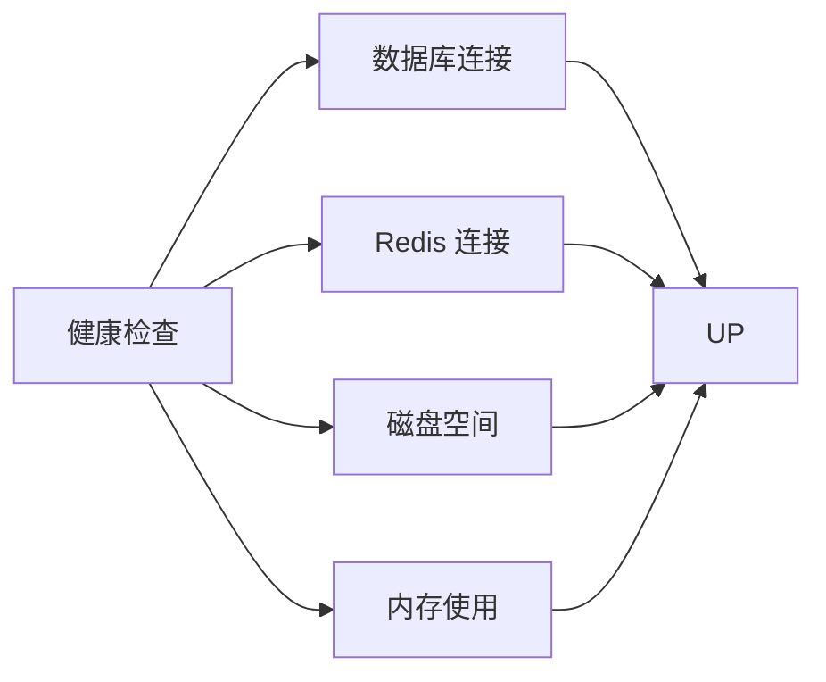
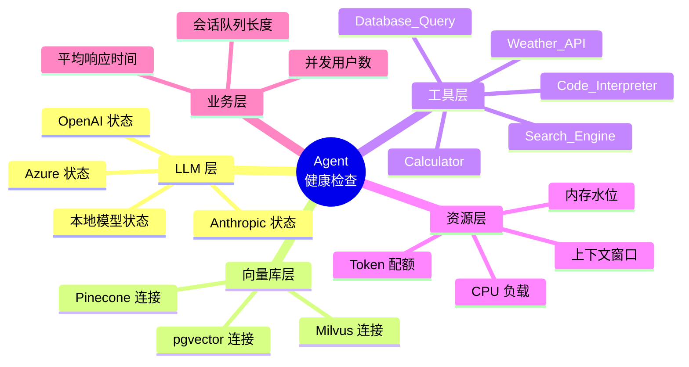
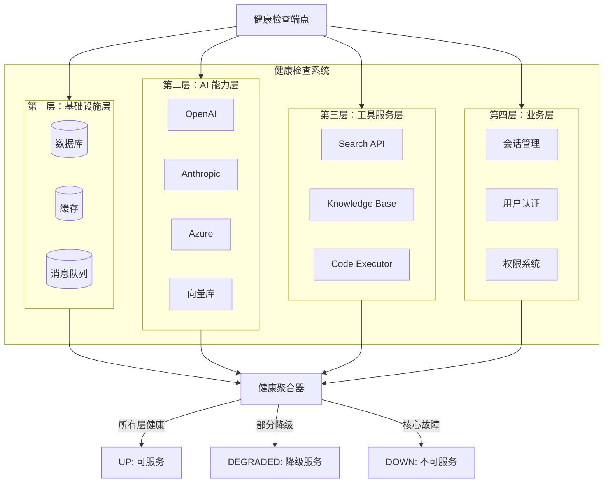
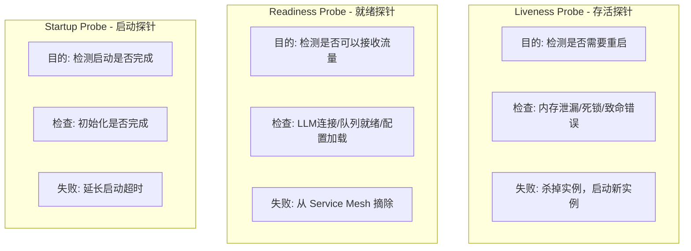
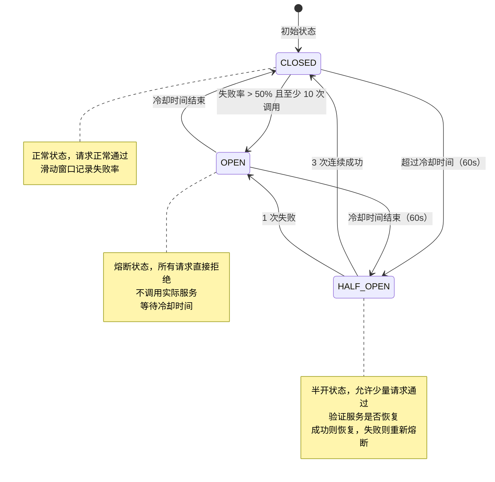
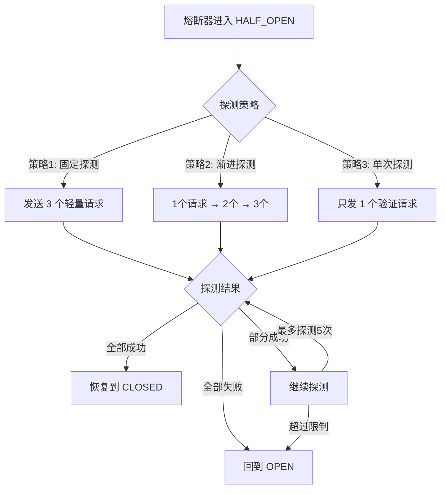
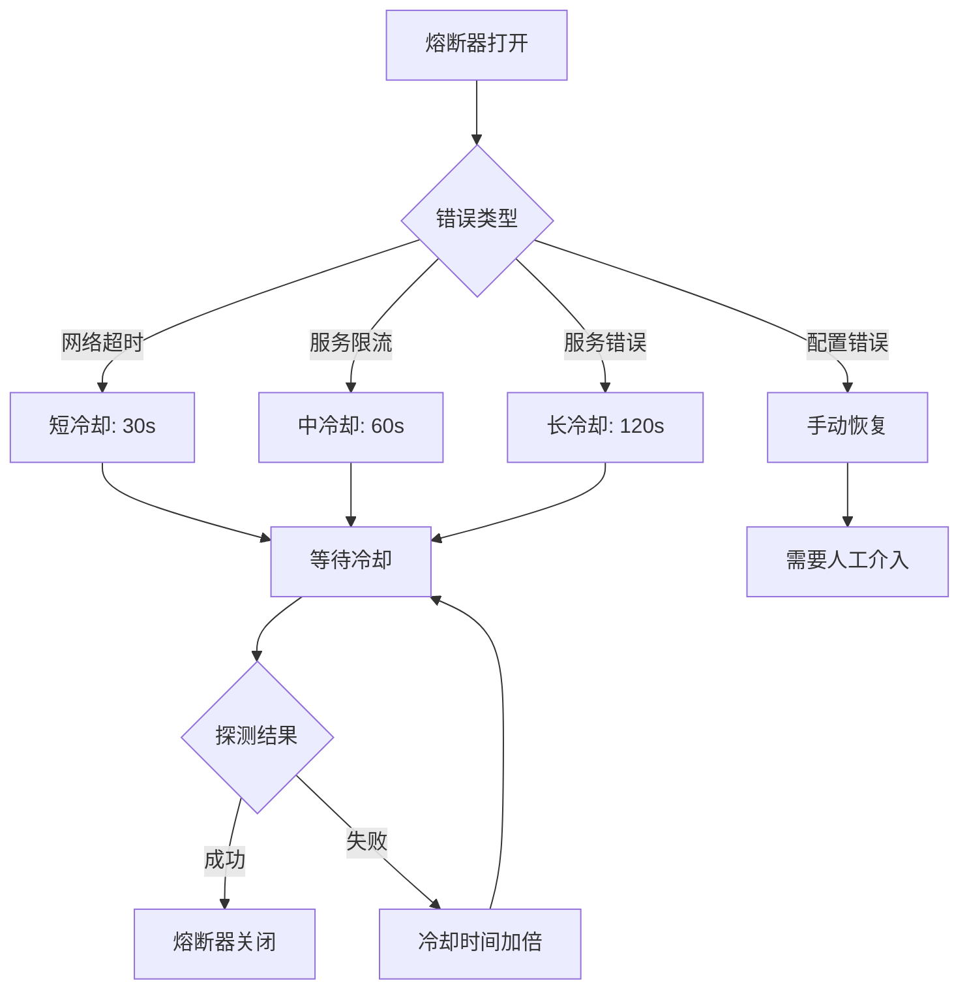

# 10 · Agent 健康检查与熔断器（Health Check & Circuit Breaker）

> **核心问题**：Agent 系统依赖多个外部服务（LLM、向量库、工具API），如何快速检测系统健康状态？当依赖服务故障时，如何通过熔断器保护系统？

---

## 概述

Agent 系统的健康检查与传统微服务有本质区别：

| 维度 | 传统微服务 | Agent 系统 |
|------|-----------|-----------|
| 健康维度 | 数据库连接、磁盘空间、内存 | LLM 可达性、向量库状态、工具可用性、Token 配额 |
| 失败模式 | 请求失败返回错误 | LLM 超时、工具调用卡死、上下文溢出 |
| 恢复策略 | 重启实例、切换节点 | 切换 LLM Provider、降级到简化模式 |
| 检查复杂度 | O(n) 服务数 | O(n × m) 服务数 × 工具数 |

本文将详细介绍 Agent 系统的多维度健康检查、Liveness/Readiness 设计、Resilience4j 熔断器配置，以及独立的工具级熔断器管理。

---

## 为什么 Agent 健康检查更复杂

### 传统健康检查模型



### Agent 系统健康检查模型



**复杂度来源**：
1. **依赖链长**：一次 Agent 调用可能涉及 3-5 个外部服务
2. **故障传播快**：LLM 超时会导致整个调用链阻塞
3. **恢复非二值**：不是简单的 UP/DOWN，而是性能降级
4. **状态易变**：Token 配额实时变化，不能简单缓存状态

---

## 多维度健康检查架构

### 健康检查维度全景图



### 健康检查实现

```java
/**
 * Agent 健康检查指示器
 */
@Component
public class AgentHealthIndicator implements HealthIndicator {
    
    private final List<HealthChecker> healthCheckers;
    
    @Override
    public Health health() {
        Health.Builder builder = Health.up();
        
        // 执行所有健康检查
        Map<String, HealthCheckResult> results = new HashMap<>();
        for (HealthChecker checker : healthCheckers) {
            try {
                HealthCheckResult result = checker.check();
                results.put(checker.name(), result);
                
                if (!result.healthy()) {
                    builder = Health.down()
                        .withDetail(checker.name(), result.details());
                }
            } catch (Exception e) {
                results.put(checker.name(), HealthCheckResult.failed(e));
                builder = Health.down().withException(e);
            }
        }
        
        // 计算总体健康状态
        HealthStatus overall = calculateOverallStatus(results);
        
        return builder
            .withDetail("checks", results)
            .withDetail("overall", overall)
            .withDetail("timestamp", Instant.now())
            .build();
    }
    
    private HealthStatus calculateOverallStatus(Map<String, HealthCheckResult> results) {
        boolean allHealthy = results.values().stream()
            .allMatch(HealthCheckResult::healthy);
        
        boolean criticalHealthy = results.values().stream()
            .filter(r -> r.isCritical())
            .allMatch(HealthCheckResult::healthy);
        
        if (allHealthy) return HealthStatus.HEALTHY;
        if (criticalHealthy) return HealthStatus.DEGRADED;
        return HealthStatus.UNHEALTHY;
    }
}

/**
 * LLM 健康检查器
 */
@Component
@Order(1)
public class LLMHealthChecker implements HealthChecker {
    
    private final List<LLMClient> llmClients;
    
    @Override
    public String name() {
        return "llm";
    }
    
    @Override
    public HealthCheckResult check() {
        Map<String, Object> details = new HashMap<>();
        boolean allHealthy = true;
        
        for (LLMClient client : llmClients) {
            try {
                // 探测性请求：发送最简单的 prompt
                long startTime = System.currentTimeMillis();
                LLMResponse response = client.probe();
                long duration = System.currentTimeMillis() - startTime;
                
                details.put(client.provider(), Map.of(
                    "status", "healthy",
                    "latency", duration + "ms",
                    "model", response.model()
                ));
                
                // 延迟超过 1s 标记为 degraded
                if (duration > 1000) {
                    details.put(client.provider() + "_warn", "high_latency");
                }
                
            } catch (LLMRateLimitException e) {
                details.put(client.provider(), Map.of(
                    "status", "rate_limited",
                    "error", e.getMessage()
                ));
                allHealthy = false;
                
            } catch (Exception e) {
                details.put(client.provider(), Map.of(
                    "status", "unhealthy",
                    "error", e.getMessage()
                ));
                allHealthy = false;
            }
        }
        
        return allHealthy 
            ? HealthCheckResult.healthy(details)
            : HealthCheckResult.unhealthy(details, true);  // LLM 是关键依赖
    }
}

/**
 * 向量库健康检查器
 */
@Component
@Order(2)
public class VectorDBHealthChecker implements HealthChecker {
    
    private final VectorStoreClient vectorStore;
    
    @Override
    public String name() {
        return "vector_db";
    }
    
    @Override
    public HealthCheckResult check() {
        try {
            // 探测性查询：查询一个小向量
            List<Float> probeVector = List.of(0.1f, 0.2f, 0.3f);
            long startTime = System.currentTimeMillis();
            SearchResponse response = vectorStore.search(probeVector, 1);
            long duration = System.currentTimeMillis() - startTime;
            
            Map<String, Object> details = Map.of(
                "status", "healthy",
                "latency", duration + "ms",
                "result_count", response.results().size()
            );
            
            return HealthCheckResult.healthy(details);
            
        } catch (Exception e) {
            // 向量库故障不一定是致命的（Agent 可以不使用 RAG）
            return HealthCheckResult.unhealthy(Map.of(
                "status", "unhealthy",
                "error", e.getMessage()
            ), false);  // 非关键依赖
        }
    }
}

/**
 * 工具健康检查器
 */
@Component
@Order(3)
public class ToolHealthChecker implements HealthChecker {
    
    private final ToolRegistry toolRegistry;
    
    @Override
    public String name() {
        return "tools";
    }
    
    @Override
    public HealthCheckResult check() {
        Map<String, Object> toolStatus = new HashMap<>();
        int healthyCount = 0;
        
        for (Tool tool : toolRegistry.getAllTools()) {
            try {
                // 工具健康检查：调用工具的 healthCheck 方法
                long startTime = System.currentTimeMillis();
                ToolHealth health = tool.healthCheck();
                long duration = System.currentTimeMillis() - startTime;
                
                toolStatus.put(tool.name(), Map.of(
                    "status", health.status(),
                    "latency", duration + "ms",
                    "last_used", health.lastUsed()
                ));
                
                if (health.isHealthy()) healthyCount++;
                
            } catch (Exception e) {
                toolStatus.put(tool.name(), Map.of(
                    "status", "unhealthy",
                    "error", e.getMessage()
                ));
            }
        }
        
        boolean overallHealthy = healthyCount == toolRegistry.getAllTools().size();
        
        return HealthCheckResult.builder()
            .healthy(overallHealthy)
            .critical(false)  // 工具故障非致命
            .details(Map.of(
                "total_tools", toolRegistry.getAllTools().size(),
                "healthy_tools", healthyCount,
                "details", toolStatus
            ))
            .build();
    }
}

/**
 * Token 配额健康检查器
 */
@Component
@Order(4)
public class QuotaHealthChecker implements HealthChecker {
    
    private final QuotaService quotaService;
    
    @Override
    public String name() {
        return "quota";
    }
    
    @Override
    public HealthCheckResult check() {
        QuotaStatus quota = quotaService.getCurrentStatus();
        
        Map<String, Object> details = new HashMap<>();
        details.put("tokens_used", quota.tokensUsed());
        details.put("tokens_limit", quota.tokensLimit());
        details.put("usage_percentage", quota.usagePercentage());
        details.put("resets_in", quota.resetsIn());
        
        // 使用率超过 80% 警告
        if (quota.usagePercentage() > 80) {
            return HealthCheckResult.builder()
                .healthy(true)  // 仍然健康，但需要警告
                .critical(false)
                .details(Map.of(
                    "status", "warning",
                    "message", "Token 配额即将耗尽",
                    "details", details
                ))
                .build();
        }
        
        return HealthCheckResult.builder()
            .healthy(true)
            .critical(false)
            .details(Map.of("status", "ok", "details", details))
            .build();
    }
}
```

---

## Liveness vs Readiness for Agent

### 概念对比



### Agent 系统的 Liveness/Readiness 实现

```java
/**
 * Liveness 探针：检查进程是否健康
 */
@Component
@Endpoint(id = "liveness")
public class AgentLivenessProbe {
    
    private final HealthRegistry healthRegistry;
    
    @ReadOperation
    public HealthState liveness() {
        // Liveness 只检查致命问题
        if (isDeadlocked()) {
            return HealthState.dead("检测到死锁");
        }
        
        if (isMemoryLeaking()) {
            return HealthState.dead("内存泄漏");
        }
        
        if (hasFatalError()) {
            return HealthState.dead("存在致命错误");
        }
        
        return HealthState.alive();
    }
    
    private boolean isDeadlocked() {
        // 使用 ThreadMXBean 检测死锁
        ThreadMXBean threadBean = ManagementFactory.getThreadMXBean();
        long[] deadlockedThreads = threadBean.findDeadlockedThreads();
        return deadlockedThreads != null && deadlockedThreads.length > 0;
    }
    
    private boolean isMemoryLeaking() {
        // 检查内存使用趋势
        MemoryMXBean memoryBean = ManagementFactory.getMemoryMXBean();
        MemoryUsage heapUsage = memoryBean.getHeapMemoryUsage();
        
        // 如果使用率超过 95%，可能有问题
        return heapUsage.getUsed() > heapUsage.getMax() * 0.95;
    }
    
    private boolean hasFatalError() {
        return healthRegistry.hasFatalError();
    }
}

/**
 * Readiness 探针：检查是否可以接收流量
 */
@Component
@Endpoint(id = "readiness")
public class AgentReadinessProbe {
    
    private final List<ReadinessChecker> readinessCheckers;
    
    @ReadOperation
    public ReadinessState readiness() {
        Map<String, Boolean> checks = new HashMap<>();
        boolean ready = true;
        
        for (ReadinessChecker checker : readinessCheckers) {
            boolean checkResult = checker.isReady();
            checks.put(checker.name(), checkResult);
            
            if (!checkResult && checker.isCritical()) {
                ready = false;
            }
        }
        
        return ready 
            ? ReadinessState.ready(checks)
            : ReadinessState.notReady(checks);
    }
}

/**
 * LLM Readiness 检查器
 */
@Component
public class LLMReadinessChecker implements ReadinessChecker {
    
    private final LLMClient llmClient;
    private final AtomicBoolean llmReady = new AtomicBoolean(false);
    
    @Override
    public String name() {
        return "llm";
    }
    
    @Override
    public boolean isCritical() {
        return true;  // LLM 是关键依赖
    }
    
    @Override
    public boolean isReady() {
        // 快速检查：不发送真实请求
        return llmReady.get() && llmClient.isConnected();
    }
    
    /**
     * 启动时初始化 LLM 连接
     */
    @PostConstruct
    public void init() {
        // 异步初始化，不阻塞启动
        CompletableFuture.runAsync(() -> {
            try {
                // 尝试连接
                llmClient.connect();
                llmReady.set(true);
                logger.info("LLM client ready");
            } catch (Exception e) {
                logger.error("LLM client initialization failed", e);
                llmReady.set(false);
            }
        });
    }
    
    /**
     * 定期检查 LLM 可用性
     */
    @Scheduled(fixedDelay = 30000)
    public void periodicCheck() {
        if (!llmClient.isConnected()) {
            llmReady.set(false);
            return;
        }
        
        // 如果连接正常，尝试一个轻量级请求
        try {
            llmClient.probe();
            llmReady.set(true);
        } catch (Exception e) {
            logger.warn("LLM probe failed", e);
            llmReady.set(false);
        }
    }
}

/**
 * 队列 Readiness 检查器
 */
@Component
public class QueueReadinessChecker implements ReadinessChecker {
    
    private final RequestQueue requestQueue;
    
    @Override
    public String name() {
        return "request_queue";
    }
    
    @Override
    public boolean isCritical() {
        return true;
    }
    
    @Override
    public boolean isReady() {
        // 队列未满，可以接收新请求
        return requestQueue.availableSlots() > 0;
    }
}

/**
 * 配置 Readiness 检查器
 */
@Component
public class ConfigReadinessChecker implements ReadinessChecker {
    
    private final ConfigService configService;
    
    @Override
    public String name() {
        return "config";
    }
    
    @Override
    public boolean isCritical() {
        return false;  // 配置加载失败可以降级使用默认配置
    }
    
    @Override
    public boolean isReady() {
        return configService.isLoaded();
    }
}
```

### Kubernetes 配置示例

```yaml
apiVersion: apps/v1
kind: Deployment
metadata:
  name: agent-service
spec:
  template:
    spec:
      containers:
      - name: agent
        image: agent-service:latest
        # Liveness 探针
        livenessProbe:
          httpGet:
            path: /actuator/health/liveness
            port: management
          initialDelaySeconds: 60
          periodSeconds: 10
          timeoutSeconds: 3
          failureThreshold: 3
        # Readiness 探针
        readinessProbe:
          httpGet:
            path: /actuator/health/readiness
            port: management
          initialDelaySeconds: 30
          periodSeconds: 5
          timeoutSeconds: 2
          failureThreshold: 2
        # Startup 探针（慢启动服务）
        startupProbe:
          httpGet:
            path: /actuator/health/liveness
            port: management
          initialDelaySeconds: 10
          periodSeconds: 10
          timeoutSeconds: 3
          failureThreshold: 18  # 最多 3 分钟
```

---

## Resilience4j 熔断器配置

### 熔断器状态机



### Resilience4j 配置

```java
/**
 * 熔断器配置
 */
@Configuration
public class CircuitBreakerConfig {
    
    /**
     * LLM 客户端熔断器
     */
    @Bean
    public CircuitBreaker llmCircuitBreaker() {
        CircuitBreakerConfig config = CircuitBreakerConfig.custom()
            // 滑动窗口：基于调用的计数
            .slidingWindowType(SlidingWindowType.COUNT_BASED)
            .slidingWindowSize(50)  // 50 次调用
            // 失败率阈值
            .failureRateThreshold(50)  // 50% 失败率
            // 最小调用次数
            .minimumNumberOfCalls(10)  // 至少 10 次调用才开始统计
            // 熔断等待时间
            .waitDurationInOpenState(Duration.ofSeconds(60))
            // 半开状态允许的调用次数
            .permittedNumberOfCallsInHalfOpenState(3)
            // 自动从 OPEN -> HALF_OPEN
            .automaticTransitionFromOpenToHalfOpenEnabled(true)
            // 异常判定
            .recordException(e -> isFailure(e))
            .build();
    
        return CircuitBreaker.of("llm", config);
    }
    
    /**
     * 向量库熔断器
     */
    @Bean
    public CircuitBreaker vectorDBCircuitBreaker() {
        CircuitBreakerConfig config = CircuitBreakerConfig.custom()
            .slidingWindowType(SlidingWindowType.TIME_BASED)
            .slidingWindowSize(30)  // 30 秒
            .failureRateThreshold(60)  // 60% 失败率
            .minimumNumberOfCalls(5)
            .waitDurationInOpenState(Duration.ofSeconds(30))
            .permittedNumberOfCallsInHalfOpenState(5)
            .recordException(e -> e instanceof VectorDBException)
            .build();
    
        return CircuitBreaker.of("vector_db", config);
    }
    
    /**
     * 工具调用熔断器（每个工具独立）
     */
    @Bean
    @Scope("prototype")
    public CircuitBreaker toolCircuitBreaker(String toolName) {
        CircuitBreakerConfig config = CircuitBreakerConfig.custom()
            .slidingWindowType(SlidingWindowType.COUNT_BASED)
            .slidingWindowSize(20)
            .failureRateThreshold(70)  // 工具容错率更高
            .minimumNumberOfCalls(5)
            .waitDurationInOpenState(Duration.ofSeconds(30))
            .permittedNumberOfCallsInHalfOpenState(2)
            .recordException(e -> e instanceof ToolExecutionException)
            .build();
    
        return CircuitBreaker.of(toolName, config);
    }
    
    private boolean isFailure(Throwable e) {
        // 超时是失败
        if (e instanceof TimeoutException) return true;
        // 限流不是失败（这是业务问题）
        if (e instanceof LLMRateLimitException) return false;
        // 服务错误是失败
        if (e instanceof LLMServiceException) return true;
        return false;
    }
}

/**
 * 使用熔断器的 LLM 客户端
 */
@Service
public class ResilientLLMClient {
    
    private final CircuitBreaker circuitBreaker;
    private final LLMClient delegate;
    private final MeterRegistry meterRegistry;
    
    public ResilientLLMClient(
        CircuitBreaker llmCircuitBreaker,
        LLMClient delegate,
        MeterRegistry meterRegistry
    ) {
        this.circuitBreaker = llmCircuitBreaker;
        this.delegate = delegate;
        this.meterRegistry = meterRegistry;
        
        // 注册指标
        CircuitBreaker.Metrics metrics = circuitBreaker.getMetrics();
        Gauge.builder("circuitbreaker.state", circuitBreaker, cb -> cb.getState().name().toLowerCase())
            .tag("name", "llm")
            .register(meterRegistry);
        
        Gauge.builder("circuitbreaker.failure_rate", circuitBreaker, cb -> cb.getMetrics().getFailureRate())
            .tag("name", "llm")
            .register(meterRegistry);
    }
    
    /**
     * 调用 LLM（受熔断器保护）
     */
    public LLMResponse call(LLMRequest request) {
        return CircuitBreaker.decorateCallable(
            circuitBreaker,
            () -> {
                long startTime = System.currentTimeMillis();
                try {
                    LLMResponse response = delegate.call(request);
                    recordSuccess(System.currentTimeMillis() - startTime);
                    return response;
                } catch (Exception e) {
                    recordFailure(e, System.currentTimeMillis() - startTime);
                    throw e;
                }
            }
        ).call();
    }
    
    /**
     * 异步调用 LLM
     */
    public CompletableFuture<LLMResponse> callAsync(LLMRequest request) {
        return CircuitBreaker.decorateCompletionStage(
            circuitBreaker,
            () -> {
                long startTime = System.currentTimeMillis();
                return delegate.callAsync(request)
                    .whenComplete((response, ex) -> {
                        long duration = System.currentTimeMillis() - startTime;
                        if (ex == null) {
                            recordSuccess(duration);
                        } else {
                            recordFailure(ex, duration);
                        }
                    });
            }
        ).apply();
    }
    
    private void recordSuccess(long duration) {
        meterRegistry.counter("llm.calls", "status", "success", 
            "circuit_state", circuitBreaker.getState().name().toLowerCase()).increment();
        meterRegistry.timer("llm.duration").record(duration, TimeUnit.MILLISECONDS);
    }
    
    private void recordFailure(Throwable ex, long duration) {
        meterRegistry.counter("llm.calls", "status", "failure", 
            "error", ex.getClass().getSimpleName(),
            "circuit_state", circuitBreaker.getState().name().toLowerCase()).increment();
        meterRegistry.timer("llm.duration", "status", "failure").record(duration, TimeUnit.MILLISECONDS);
    }
}

/**
 * 熔断器事件监听
 */
@Component
public class CircuitBreakerEventLogger {
    
    @EventListener
    public void onCircuitBreakerEvent(CircuitBreakerEvent event) {
        if (event.getEventType() == CircuitBreakerEvent.Type.CIRCUIT_OPENED) {
            logger.warn("熔断器打开: {}, 失败率: {}%, 状态: {}", 
                event.getCircuitBreakerName(),
                ((CircuitBreakerOnFailureRateExceededEvent) event).getFailureRate(),
                event.getStateTransition());
            
            // 发送告警
            sendAlert(event);
            
        } else if (event.getEventType() == CircuitBreakerEvent.Type.CIRCUIT_CLOSED) {
            logger.info("熔断器关闭: {}", event.getCircuitBreakerName());
            
        } else if (event.getEventType() == CircuitBreakerEvent.Type.CIRCUIT_HALF_OPEN) {
            logger.info("熔断器半开: {}, 尝试恢复", event.getCircuitBreakerName());
        }
    }
    
    private void sendAlert(CircuitBreakerEvent event) {
        // 发送告警到监控系统
        alertService.send(Alert.builder()
            .severity(AlertSeverity.HIGH)
            .title("熔断器触发")
            .message(String.format("熔断器 %s 已打开，失败率过高", event.getCircuitBreakerName()))
            .metadata(Map.of(
                "circuit_name", event.getCircuitBreakerName(),
                "state", event.getState().toString()
            ))
            .build());
    }
}
```

### 每个工具的独立熔断器

```java
/**
 * 工具熔断器注册表
 */
@Component
public class ToolCircuitBreakerRegistry {
    
    private final Map<String, CircuitBreaker> breakers = new ConcurrentHashMap<>();
    private final CircuitBreakerRegistry registry;
    private final MeterRegistry meterRegistry;
    
    @PostConstruct
    public void init() {
        // 为每个工具创建独立的熔断器
        for (Tool tool : toolRegistry.getAllTools()) {
            CircuitBreaker breaker = createBreaker(tool);
            breakers.put(tool.name(), breaker);
        }
    }
    
    private CircuitBreaker createBreaker(Tool tool) {
        // 根据工具类型配置不同的熔断参数
        CircuitBreakerConfig config = switch (tool.category()) {
            case CRITICAL -> CircuitBreakerConfig.custom()
                .slidingWindowSize(10)
                .failureRateThreshold(40)
                .minimumNumberOfCalls(3)
                .waitDurationInOpenState(Duration.ofSeconds(120))
                .build();
            
            case NORMAL -> CircuitBreakerConfig.custom()
                .slidingWindowSize(20)
                .failureRateThreshold(60)
                .minimumNumberOfCalls(5)
                .waitDurationInOpenState(Duration.ofSeconds(60))
                .build();
            
            case OPTIONAL -> CircuitBreakerConfig.custom()
                .slidingWindowSize(30)
                .failureRateThreshold(80)
                .minimumNumberOfCalls(10)
                .waitDurationInOpenState(Duration.ofSeconds(30))
                .build();
        };
    
        CircuitBreaker breaker = registry.circuitBreaker(tool.name(), config);
        
        // 注册指标
        registerMetrics(breaker, tool);
        
        // 注册事件监听
        breaker.getEventPublisher().onCircuitBreakerEvent(event -> {
            logger.info("Tool {}: {}", tool.name(), event.getEventType());
        });
        
        return breaker;
    }
    
    public CircuitBreaker getBreaker(String toolName) {
        return breakers.get(toolName);
    }
    
    /**
     * 动态添加工具熔断器
     */
    public void addTool(Tool tool) {
        CircuitBreaker breaker = createBreaker(tool);
        breakers.put(tool.name(), breaker);
    }
}

/**
 * 工具执行器（带熔断保护）
 */
@Service
public class ToolExecutor {
    
    private final ToolCircuitBreakerRegistry breakerRegistry;
    private final ToolRegistry toolRegistry;
    
    /**
     * 执行工具调用
     */
    public ToolExecutionResult execute(ToolCall call) {
        Tool tool = toolRegistry.get(call.toolName());
        CircuitBreaker breaker = breakerRegistry.getBreaker(call.toolName());
        
        try {
            // 检查熔断器状态
            if (breaker.getState() == CircuitBreaker.State.OPEN) {
                return ToolExecutionResult.skipped("熔断器已打开");
            }
            
            // 执行工具
            return CircuitBreaker.decorateCallable(
                breaker,
                () -> tool.execute(call.arguments())
            ).call();
            
        } catch (CallNotPermittedException e) {
            // 熔断器拒绝调用
            logger.warn("工具 {} 调用被熔断器拒绝", call.toolName());
            return ToolExecutionResult.skipped("熔断器拒绝");
            
        } catch (Exception e) {
            if (breaker.getState() == CircuitBreaker.State.HALF_OPEN) {
                // 半开状态失败，熔断器会重新打开
                logger.warn("工具 {} 在半开状态执行失败", call.toolName());
            }
            throw new ToolExecutionException("工具执行失败", e);
        }
    }
}
```

---

## 熔断器半开探测策略

### 探测策略选择



### 探测策略实现

```java
/**
 * 熔断器探测策略接口
 */
public interface CircuitBreakerProbeStrategy {
    
    /**
     * 判断探测是否成功
     */
    ProbeResult probe(CircuitBreaker breaker, Callable<?> testCall);
    
    /**
     * 探测结果
     */
    record ProbeResult(boolean success, String reason) {
        public static ProbeResult success() {
            return new ProbeResult(true, "探测成功");
        }
        
        public static ProbeResult failure(String reason) {
            return new ProbeResult(false, reason);
        }
    }
}

/**
 * 渐进式探测策略
 */
@Component
public class ProgressiveProbeStrategy implements CircuitBreakerProbeStrategy {
    
    private final MeterRegistry meterRegistry;
    
    @Override
    public ProbeResult probe(CircuitBreaker breaker, Callable<?> testCall) {
        int consecutiveSuccesses = 0;
        int consecutiveFailures = 0;
        int currentBatchSize = 1;  // 从 1 个请求开始
        final int maxBatches = 5;
        
        for (int batch = 0; batch < maxBatches; batch++) {
            logger.info("探测批次 {}, 请求数: {}", batch + 1, currentBatchSize);
            
            int batchSuccesses = 0;
            for (int i = 0; i < currentBatchSize; i++) {
                try {
                    testCall.call();
                    batchSuccesses++;
                    consecutiveSuccesses++;
                    consecutiveFailures = 0;
                } catch (Exception e) {
                    consecutiveFailures++;
                    consecutiveSuccesses = 0;
                    
                    // 快速失败：连续 2 次失败则停止
                    if (consecutiveFailures >= 2) {
                        recordProbeResult(breaker, false, batch, i);
                        return ProbeResult.failure("连续失败次数过多");
                    }
                }
            }
            
            // 批次成功率
            double batchSuccessRate = (double) batchSuccesses / currentBatchSize;
            logger.info("批次 {} 成功率: {}", batch + 1, batchSuccessRate);
            
            // 成功率 >= 80% 继续，否则失败
            if (batchSuccessRate < 0.8) {
                recordProbeResult(breaker, false, batch, -1);
                return ProbeResult.failure("批次成功率不足");
            }
            
            // 增加下一批次的大小
            currentBatchSize = Math.min(currentBatchSize * 2, 10);
        }
        
        // 所有批次都通过
        recordProbeResult(breaker, true, maxBatches, -1);
        return ProbeResult.success();
    }
    
    private void recordProbeResult(CircuitBreaker breaker, boolean success, int batch, int attempt) {
        meterRegistry.counter("circuit_breaker.probe",
            "breaker", breaker.getName(),
            "result", success ? "success" : "failure",
            "batch", String.valueOf(batch),
            "attempt", String.valueOf(attempt)
        ).increment();
    }
}

/**
 * 探测式熔断器包装器
 */
public class ProbingCircuitBreaker {
    
    private final CircuitBreaker delegate;
    private final CircuitBreakerProbeStrategy probeStrategy;
    private final AtomicInteger probeCount = new AtomicInteger(0);
    
    public ProbingCircuitBreaker(
        CircuitBreaker delegate,
        CircuitBreakerProbeStrategy probeStrategy
    ) {
        this.delegate = delegate;
        this.probeStrategy = probeStrategy;
        
        // 监听状态转换
        delegate.getEventPublisher().onStateTransition(event -> {
            if (event.getStateTransition() == CircuitBreaker.StateTransition.OPEN_TO_HALF_OPEN) {
                initiateProbe();
            }
        });
    }
    
    /**
     * 启动探测
     */
    private void initiateProbe() {
        logger.info("启动熔断器探测: {}", delegate.getName());
        
        // 异步探测
        CompletableFuture.runAsync(() -> {
            try {
                // 使用轻量级探测请求
                Callable<LLMResponse> testCall = () -> {
                    return llmClient.probe();
                };
                
                CircuitBreakerProbeStrategy.ProbeResult result = 
                    probeStrategy.probe(delegate, testCall);
                
                if (result.success()) {
                    logger.info("探测成功，熔断器将关闭: {}", delegate.getName());
                } else {
                    logger.warn("探测失败: {}", result.reason());
                }
                
            } catch (Exception e) {
                logger.error("探测过程异常", e);
            }
        });
    }
    
    public CircuitBreaker.State getState() {
        return delegate.getState();
    }
}
```

---

## 健康检查端点设计

### 端点架构

```mermaid
graph TB
    subgraph Endpoints[健康检查端点]
        E1[/health]
        E2[/ready]
        E3[/alive]
        E4[/deepcheck]
    end
    
    subgraph Responses[响应内容]
        R1{UP / DOWN}
        R2{ready / notReady}
        R3{alive / dead}
        R4{详细报告}
    end
    
    subgraph Consumers[消费者]
        C1[Kubernetes Liveness]
        C2[Kubernetes Readiness]
        C3[负载均衡]
        C4[监控系统]
        C5[运维脚本]
    end
    
    E1 --> R1
    E2 --> R2
    E3 --> R3
    E4 --> R4
    
    C1 --> E3
    C2 --> E2
    C3 --> E2
    C4 --> E1
    C4 --> E4
    C5 --> E1
    C5 --> E4
```

### 端点实现

```java
/**
 * 健康检查端点
 */
@RestController
@RequestMapping("/actuator")
public class HealthEndpoints {
    
    private final AgentHealthIndicator healthIndicator;
    private final AgentReadinessProbe readinessProbe;
    private final AgentLivenessProbe livenessProbe;
    private final DeepHealthChecker deepHealthChecker;
    
    /**
     * /health - 标准 Spring Boot 健康检查
     */
    @GetMapping("/health")
    public ResponseEntity<Map<String, Object>> health() {
        Health health = healthIndicator.health();
        
        return ResponseEntity.status(
            health.getStatus() == Status.DOWN ? HttpStatus.SERVICE_UNAVAILABLE : HttpStatus.OK
        ).body(health.getDetails());
    }
    
    /**
     * /ready - Readiness 探针
     */
    @GetMapping("/ready")
    public ResponseEntity<Map<String, Object>> ready() {
        ReadinessState readiness = readinessProbe.readiness();
        
        Map<String, Object> response = new HashMap<>();
        response.put("ready", readiness.isReady());
        response.put("checks", readiness.checks());
        response.put("timestamp", Instant.now());
        
        return ResponseEntity.status(
            readiness.isReady() ? HttpStatus.OK : HttpStatus.SERVICE_UNAVAILABLE
        ).body(response);
    }
    
    /**
     * /alive - Liveness 探针
     */
    @GetMapping("/alive")
    public ResponseEntity<Map<String, Object>> alive() {
        HealthState liveness = livenessProbe.liveness();
        
        Map<String, Object> response = new HashMap<>();
        response.put("alive", liveness.isAlive());
        response.put("timestamp", Instant.now());
        
        if (!liveness.isAlive()) {
            response.put("reason", liveness.reason());
        }
        
        return ResponseEntity.status(
            liveness.isAlive() ? HttpStatus.OK : HttpStatus.INTERNAL_SERVER_ERROR
        ).body(response);
    }
    
    /**
     * /deepcheck - 深度健康检查
     * 包含所有依赖的详细状态
     */
    @GetMapping("/deepcheck")
    public ResponseEntity<DeepHealthReport> deepcheck(
        @RequestParam(defaultValue = "false") boolean includeDetails
    ) {
        DeepHealthReport report = deepHealthChecker.check(includeDetails);
        
        return ResponseEntity.status(
            report.isHealthy() ? HttpStatus.OK : HttpStatus.SERVICE_UNAVAILABLE
        ).body(report);
    }
}

/**
 * 深度健康检查报告
 */
public record DeepHealthReport(
    boolean healthy,
    HealthStatus status,
    Instant timestamp,
    Map<String, ComponentHealth> components,
    List<String> recommendations
) {
    public static DeepHealthReport from(Map<String, ComponentHealth> components) {
        boolean allHealthy = components.values().stream()
            .allMatch(ComponentHealth::isHealthy);
        
        HealthStatus status = allHealthy ? HealthStatus.HEALTHY :
            components.values().stream().anyMatch(c -> c.isCritical() && !c.isHealthy())
                ? HealthStatus.UNHEALTHY
                : HealthStatus.DEGRADED;
        
        List<String> recommendations = generateRecommendations(components);
        
        return new DeepHealthReport(allHealthy, status, Instant.now(), components, recommendations);
    }
    
    private static List<String> generateRecommendations(Map<String, ComponentHealth> components) {
        List<String> recommendations = new ArrayList<>();
        
        for (Map.Entry<String, ComponentHealth> entry : components.entrySet()) {
            ComponentHealth health = entry.getValue();
            
            if (!health.isHealthy()) {
                if (health.isCritical()) {
                    recommendations.add(String.format("紧急: %s 故障，服务不可用", entry.getKey()));
                } else {
                    recommendations.add(String.format("警告: %s 性能下降", entry.getKey()));
                }
            } else if (health.latency() > 1000) {
                recommendations.add(String.format("建议: %s 延迟过高 (%dms)", 
                    entry.getKey(), health.latency()));
            }
        }
        
        return recommendations;
    }
}

/**
 * 组件健康状态
 */
record ComponentHealth(
    String name,
    boolean healthy,
    boolean critical,
    int latency,
    String message,
    Map<String, Object> details
) {
    public boolean isDegraded() {
        return healthy && latency > 500;
    }
}
```

---

## 自动恢复与冷却时间管理

### 冷却时间策略



### 自适应冷却时间

```java
/**
 * 自适应冷却时间策略
 */
@Component
public class AdaptiveCooldownStrategy {
    
    private final Map<String, CooldownState> cooldownStates = new ConcurrentHashMap<>();
    private final CooldownConfig config;
    
    /**
     * 计算冷却时间
     */
    public Duration calculateCooldown(String circuitName, Throwable lastError) {
        CooldownState state = cooldownStates.computeIfAbsent(
            circuitName, k -> new CooldownState()
        );
        
        // 根据错误类型和失败历史计算
        Duration baseCooldown = determineBaseCooldown(lastError);
        
        // 根据连续失败次数增加
        double multiplier = Math.pow(config.getBackoffMultiplier(), state.consecutiveFailures());
        
        Duration calculated = Duration.ofMillis(
            (long) (baseCooldown.toMillis() * multiplier)
        );
        
        // 限制最大值
        return Duration.ofMillis(
            Math.min(calculated.toMillis(), config.getMaxCooldown().toMillis())
        );
    }
    
    private Duration determineBaseCooldown(Throwable error) {
        return switch (error) {
            case TimeoutException e -> config.getShortCooldown();
            case LLMRateLimitException e -> config.getRateLimitCooldown();
            case LLMServiceException e -> {
                // 根据错误代码决定
                if (e.getErrorCode() == 503) {
                    yield config.getLongCooldown();
                } else {
                    yield config.getMediumCooldown();
                }
            }
            default -> config.getMediumCooldown();
        };
    }
    
    /**
     * 记录探测结果
     */
    public void recordProbeResult(String circuitName, boolean success) {
        CooldownState state = cooldownStates.get(circuitName);
        
        if (success) {
            state.consecutiveFailures = 0;
        } else {
            state.consecutiveFailures++;
        }
    }
    
    static class CooldownState {
        int consecutiveFailures = 0;
        Instant lastOpenTime;
        Duration lastCooldown;
    }
}

/**
 * 可配置的冷却参数
 */
@ConfigurationProperties(prefix = "circuit-breaker.cooldown")
@Data
public class CooldownConfig {
    private Duration shortCooldown = Duration.ofSeconds(30);
    private Duration mediumCooldown = Duration.ofSeconds(60);
    private Duration longCooldown = Duration.ofSeconds(120);
    private Duration rateLimitCooldown = Duration.ofSeconds(90);
    private Duration maxCooldown = Duration.ofMinutes(10);
    private double backoffMultiplier = 1.5;
}

/**
 * 自适应熔断器
 */
public class AdaptiveCircuitBreaker {
    
    private final CircuitBreaker delegate;
    private final AdaptiveCooldownStrategy cooldownStrategy;
    private final String name;
    
    public AdaptiveCircuitBreaker(
        String name,
        CircuitBreaker delegate,
        AdaptiveCooldownStrategy cooldownStrategy
    ) {
        this.name = name;
        this.delegate = delegate;
        this.cooldownStrategy = cooldownStrategy;
        
        // 监听熔断事件
        delegate.getEventPublisher().onCircuitBreakerEvent(event -> {
            if (event.getEventType() == CircuitBreakerEvent.Type.CIRCUIT_OPENED) {
                handleCircuitOpened(event);
            }
        });
    }
    
    private void handleCircuitOpened(CircuitBreakerEvent event) {
        if (event instanceof CircuitBreakerOnErrorEvent errorEvent) {
            Throwable error = errorEvent.getError();
            
            // 计算冷却时间
            Duration cooldown = cooldownStrategy.calculateCooldown(name, error);
            
            logger.info("熔断器 {} 打开，冷却时间: {}", name, cooldown);
            
            // 可以动态调整熔断器的等待时间（需要重新创建熔断器）
            // 这里简化为记录
            circuitMetrics.recordCooldown(name, cooldown);
        }
    }
}
```

---

## 最佳实践

### 1. Liveness 检查要快速且可靠

```java
// ✅ 正确：Liveness 检查不调用外部服务
@Endpoint(id = "liveness")
public class LivenessProbe {
    @ReadOperation
    public boolean isAlive() {
        // 只检查本地状态
        return !isDeadlocked() && !isMemoryCritical();
    }
}

// ❌ 错误：Liveness 调用外部服务
@Endpoint(id = "liveness")
public class LivenessProbe {
    @ReadOperation
    public boolean isAlive() {
        // LLM 故障会导致误判为 Dead
        return llmClient.probe() != null;
    }
}
```

### 2. Readiness 检查要包含关键依赖

```java
// ✅ 正确：Readiness 包含关键依赖
@Component
public class ReadinessProbe {
    @ReadOperation
    public boolean isReady() {
        // 关键依赖都就绪才算 Ready
        return llmReady && queueReady && dbReady;
    }
}

// ❌ 错误：Readiness 检查非关键依赖
@Component
public class ReadinessProbe {
    @ReadOperation
    public boolean isReady() {
        // 缓存故障导致无法 Ready，但缓存不关键
        return cacheReady && llmReady;
    }
}
```

### 3. 熔断器参数要差异化配置

```java
// ✅ 正确：不同工具不同配置
CircuitBreakerConfig config = switch (tool.category()) {
    case CRITICAL -> strictConfig();
    case OPTIONAL -> lenientConfig();
};

// ❌ 错误：所有工具同一配置
CircuitBreakerConfig config = CircuitBreakerConfig.custom()
    .failureRateThreshold(50)  // 所有工具一样
    .build();
```

### 4. 健康检查要有超时保护

```java
// ✅ 正确：每个检查独立超时
public HealthCheckResult check() {
    return CompletableFuture.supplyAsync(() -> {
        return doCheck();
    }).orTimeout(5, TimeUnit.SECONDS)  // 5秒超时
    .exceptionally(ex -> HealthCheckResult.failed(ex))
    .join();
}

// ❌ 错误：没有超时保护
public HealthCheckResult check() {
    return doCheck();  // 可能永久阻塞
}
```

### 5. 熔断器事件要可观测

```java
// ✅ 正确：记录所有熔断器事件
breaker.getEventPublisher()
    .onStateTransition(event -> {
        logger.info("熔断器状态变化: {} -> {}", 
            event.getStateTransition().getFromState(),
            event.getStateTransition().getToState());
        metrics.counter("circuit.state_change",
            "breaker", breaker.getName(),
            "from", event.getStateTransition().getFromState().name(),
            "to", event.getStateTransition().getToState().name()
        ).increment();
    })
    .onFailureRateExceeded(event -> {
        logger.warn("熔断器失败率超标: {}%", event.getFailureRate());
        alerts.send("熔断器即将打开");
    })
    .onCallNotPermitted(event -> {
        metrics.counter("circuit.calls_rejected",
            "breaker", breaker.getName()).increment();
    });

// ❌ 错误：没有事件监听
CircuitBreaker breaker = CircuitBreaker.of("name", config);
// 事件发生但没人知道
```

---

## 检查清单

### 架构设计检查清单

- [ ] 是否实现了 Liveness 和 Readiness 分离
- [ ] 健康检查是否覆盖所有关键依赖（LLM、向量库、工具）
- [ ] 是否为每个工具配置独立熔断器
- [ ] 熔断器参数是否根据工具重要性差异化配置
- [ ] 是否实现了深度健康检查端点

### 实现检查清单

- [ ] Liveness 探针是否只检查本地状态
- [ ] Readiness 探针是否包含关键外部依赖
- [ ] 健康检查是否有超时保护
- [ ] 熔断器是否使用滑动窗口统计
- [ ] 熔断器是否正确识别异常类型
- [ ] 探测策略是否支持渐进式验证

### 可观测性检查清单

- [ ] 是否记录所有熔断器状态转换
- [ ] 是否记录失败率超过阈值事件
- [ ] 是否记录被拒绝的调用次数
- [ ] 健康检查是否提供详细报告
- [ ] 是否有熔断器恢复时间统计

### Kubernetes 集成检查清单

- [ ] Liveness 探针配置正确（超时、间隔、阈值）
- [ ] Readiness 探针配置正确
- [ ] Startup 探针配置正确（对于慢启动服务）
- [ ] 探针路径与代码实现一致

### 冷却策略检查清单

- [ ] 冷却时间是否根据错误类型调整
- [ ] 连续失败是否增加冷却时间
- [ ] 冷却时间是否有上限
- [ ] 探测失败是否重新计算冷却时间

### 测试检查清单

- [ ] 是否测试熔断器打开/关闭/半开状态转换
- [ ] 是否测试探测策略在半开状态的行为
- [ ] 是否测试健康检查超时场景
- [ ] 是否测试关键依赖故障时的 Readiness
- [ ] 是否测试自适应冷却时间调整
- [ ] 是否测试熔断器事件监听

---

## 参考资料

1. **Resilience4j 官方文档**: https://resilience4j.readme.io/docs
2. **Kubernetes Probes**: https://kubernetes.io/docs/tasks/configure-pod-container/configure-liveness-readiness-startup-probes/
3. **Spring Boot Actuator**: https://docs.spring.io/spring-boot/docs/current/reference/html/actuator.html
4. **Google SRE Book**: Circuit Breaker Pattern

---

**文档版本**: v1.0  
**最后更新**: 2025-01-09  
**作者**: Agent 架构师团队  
**状态**: 待审核
