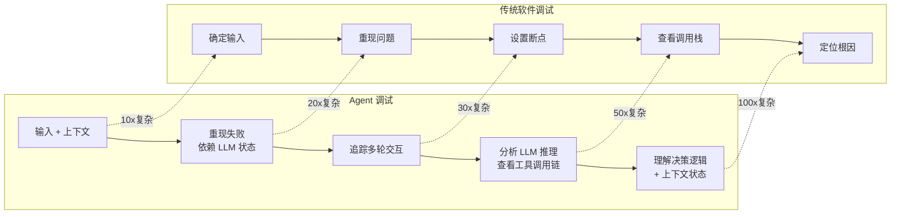
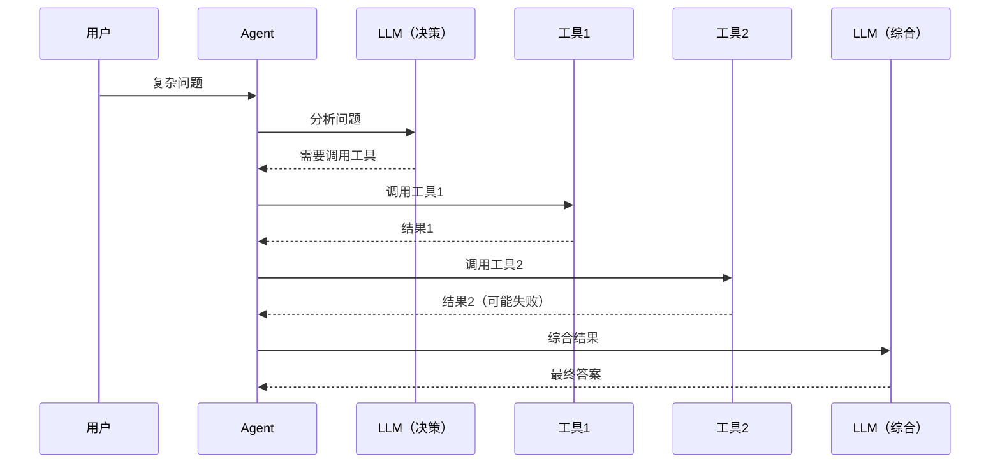
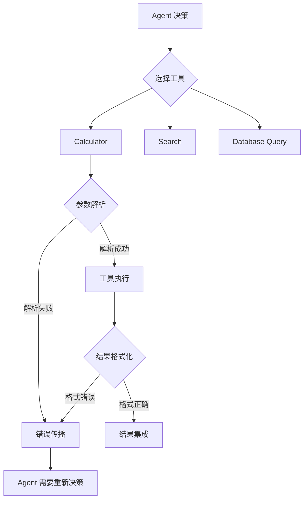
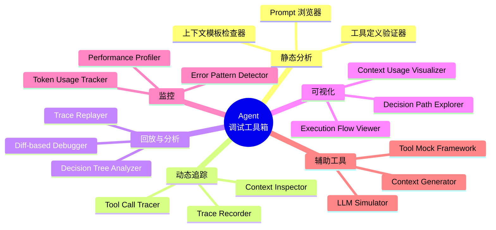
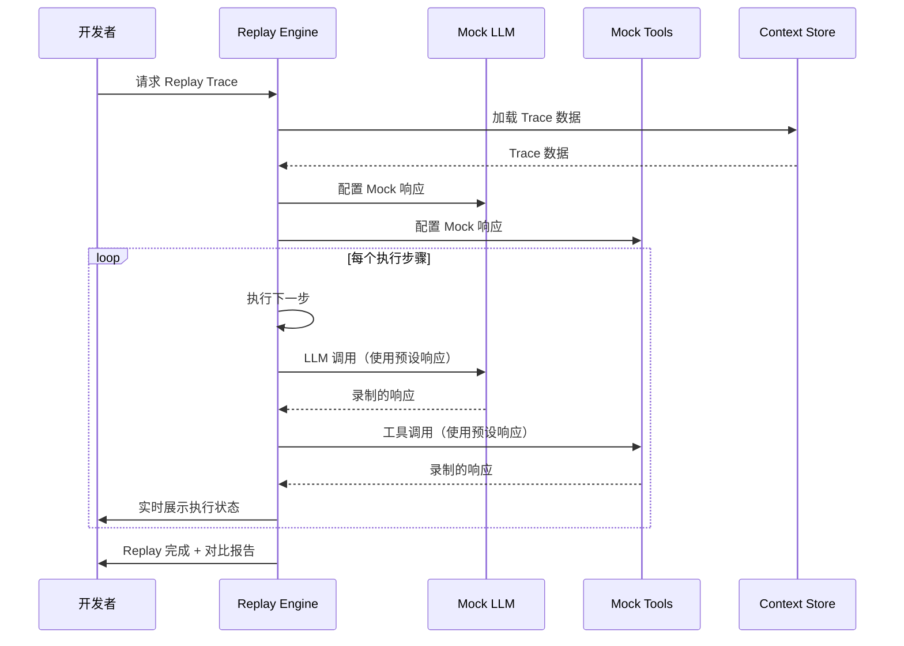
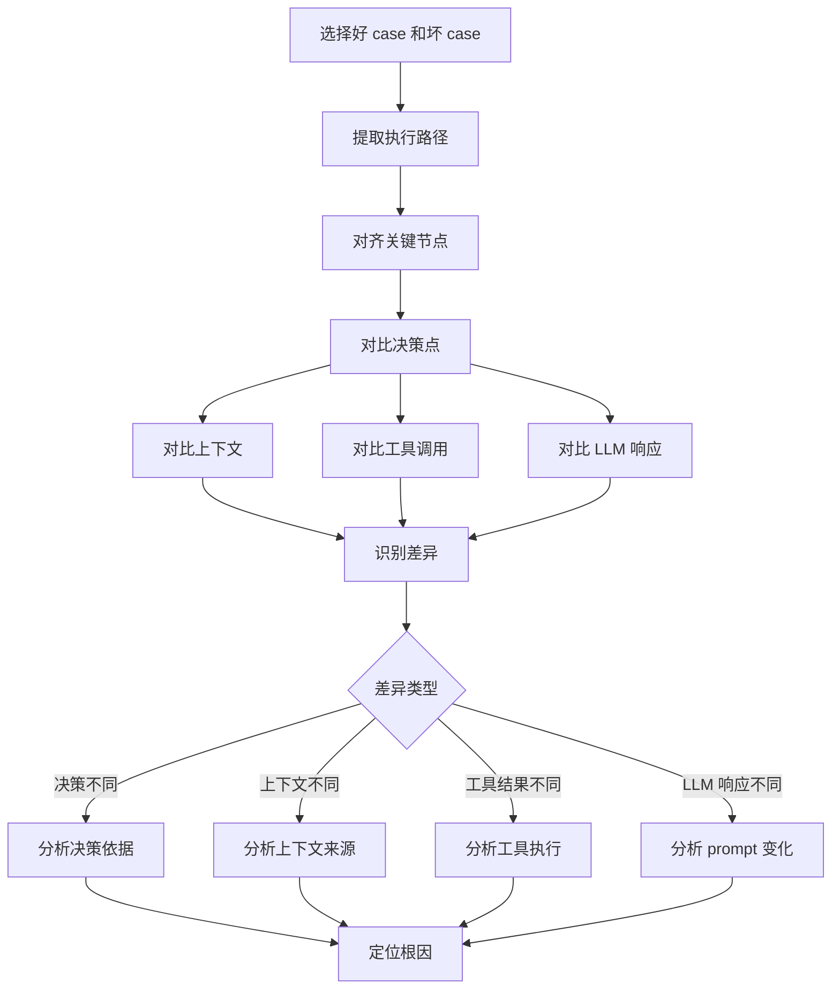
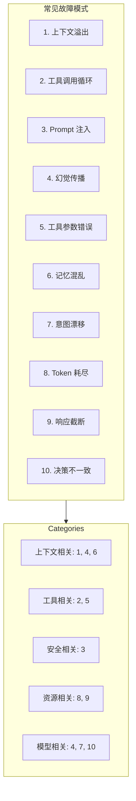
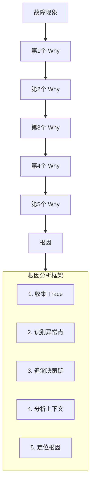

# 11 · Agent 调试与根因分析（Debugging & RCA）

> **核心问题**：Agent 调试比传统软件难 100 倍 —— 非确定性输出、多步决策链、工具交互复杂、上下文爆炸。如何系统性地调试 Agent 并快速定位根因？

---

## 概述

Agent 系统的调试面临独特挑战：

| 挑战维度 | 传统软件 | Agent 系统 |
|---------|---------|-----------|
| 确定性 | 相同输入 → 相同输出 | 相同输入 → 不同输出（LLM 非确定性） |
| 执行路径 | 分支可预测 | 动态工具调用，路径不可预测 |
| 状态追踪 | 变量、调用栈完整 | 隐藏的 LLM 推理过程 |
| 故障复现 | 重现条件明确 | 难以复现（依赖 LLM 状态） |
| 日志粒度 | 方法级别 | Token + 工具 + 上下文级别 |

本文提供一套系统化的 Agent 调试方法论，包括调试工具箱、Trace Replay、Diff-based 调试、决策树分析、上下文审查、常见故障模式、根因分析框架，以及实战排障决策树。

---

## 为什么 Agent 调试比传统软件难 100 倍

### 调试复杂度对比



### 调试难度来源详解

#### 1. 非确定性（Non-determinism）

```java
// ✅ 传统软件：相同输入，相同输出
int add(int a, int b) {
    return a + b;  // 永远返回相同结果
}

// ❌ Agent 系统：相同输入，不同输出
String answer(AgentRequest request) {
    // 即使请求相同，LLM 可能返回不同答案
    return llmClient.chat(request.prompt());
    // temperature、top_p 参数影响输出
    // 模型本身有随机性
}
```

**调试难点**：
- 无法稳定复现问题
- 难以区分随机错误 vs 真实 bug
- 需要大量重复测试才能捕获问题

#### 2. 多步决策链（Multi-step Decision Chain）



**调试难点**：
- 任意一步失败都可能导致最终错误
- 难以定位是决策错误还是工具错误
- 上下文在多步间累积，可能产生"上下文污染"

#### 3. 上下文爆炸（Context Explosion）

```java
// 简单的 Agent 调用可能携带大量上下文
AgentContext context = AgentContext.builder()
    .conversationHistory(loadHistory(userId, last50Messages))  // 50 条历史
    .relevantDocuments(search(query, top20))                  // 20 个文档
    .toolDefinitions(getAllToolSchemas())                      // 10 个工具定义
    .systemPrompt(getSystemPrompt())                          // 系统提示词
    .userMessage(request.message())                           // 用户消息
    .build();

// Token 数：50×100 + 20×500 + 10×200 + 500 + 100 = 16,100 tokens
// 上下文中的任何部分都可能导致问题
```

**调试难点**：
- 难以确定是上下文的哪个部分导致问题
- 上下文超出 Token 限制时的截断策略难以调试
- 多个上下文来源的优先级冲突

#### 4. 工具交互复杂性（Tool Interaction Complexity）



**调试难点**：
- 工具参数解析错误难以追踪
- 工具返回格式异常处理复杂
- 工具级联调用难以追踪

---

## Agent 调试工具箱全景

### 调试工具分类



### 核心工具实现

#### 1. Trace Recorder

```java
/**
 * Agent 执行追踪器
 * 记录完整的执行链路
 */
@Component
public class AgentTraceRecorder {
    
    private final TraceStore traceStore;
    private final ThreadLocal<TraceContext> currentTrace = new ThreadLocal<>();
    
    /**
     * 开始追踪
     */
    public void startTrace(String traceId, AgentRequest request) {
        TraceContext context = TraceContext.builder()
            .traceId(traceId)
            .request(request)
            .startTime(Instant.now())
            .build();
        
        currentTrace.set(context);
        
        // 记录初始状态
        recordEvent(TraceEvent.init(context));
    }
    
    /**
     * 记录 LLM 调用
     */
    public void recordLLMCall(LLMCall call) {
        TraceContext context = currentTrace.get();
        if (context == null) return;
        
        recordEvent(TraceEvent.llmCall(TraceEvent.LLMCall.builder()
            .model(call.model())
            .prompt(call.prompt())
            .promptTokens(call.promptTokens())
            .response(call.response())
            .responseTokens(call.responseTokens())
            .latency(call.latency())
            .timestamp(Instant.now())
            .build()));
    }
    
    /**
     * 记录工具调用
     */
    public void recordToolCall(ToolCall call, ToolResult result) {
        TraceContext context = currentTrace.get();
        if (context == null) return;
        
        recordEvent(TraceEvent.toolCall(TraceEvent.ToolCall.builder()
            .toolName(call.toolName())
            .arguments(call.arguments())
            .result(result)
            .success(result.success())
            .latency(result.latency())
            .timestamp(Instant.now())
            .build()));
    }
    
    /**
     * 记录决策点
     */
    public void recordDecision(Decision decision) {
        TraceContext context = currentTrace.get();
        if (context == null) return;
        
        recordEvent(TraceEvent.decision(TraceEvent.Decision.builder()
            .type(decision.type())
            .reasoning(decision.reasoning())
            .alternatives(decision.alternatives())
            .chosen(decision.chosen())
            .confidence(decision.confidence())
            .timestamp(Instant.now())
            .build()));
    }
    
    /**
     * 记录上下文变化
     */
    public void recordContextChange(ContextChange change) {
        TraceContext context = currentTrace.get();
        if (context == null) return;
        
        recordEvent(TraceEvent.contextChange(TraceEvent.ContextChange.builder()
            .changeType(change.type())
            .before(change.before())
            .after(change.after())
            .source(change.source())
            .timestamp(Instant.now())
            .build()));
    }
    
    /**
     * 完成追踪
     */
    public Trace completeTrace(AgentResponse response) {
        TraceContext context = currentTrace.get();
        if (context == null) return null;
        
        Trace trace = context.toBuilder()
            .response(response)
            .endTime(Instant.now())
            .status(response.success() ? TraceStatus.SUCCESS : TraceStatus.FAILED)
            .build();
        
        // 持久化
        traceStore.save(trace);
        
        currentTrace.remove();
        return trace;
    }
    
    private void recordEvent(TraceEvent event) {
        TraceContext context = currentTrace.get();
        if (context == null) return;
        
        context = context.toBuilder()
            .event(context.events().size(), event)
            .build();
        
        currentTrace.set(context);
    }
}

/**
 * Trace 事件
 */
sealed interface TraceEvent {
    String type();
    Instant timestamp();
    
    record Init(
        String traceId,
        AgentRequest request,
        Instant timestamp
    ) implements TraceEvent {
        static Init init(TraceContext context) {
            return new Init(context.traceId(), context.request(), Instant.now());
        }
    }
    
    record LLMCall(
        String model,
        String prompt,
        int promptTokens,
        String response,
        int responseTokens,
        long latency,
        Instant timestamp
    ) implements TraceEvent {}
    
    record ToolCall(
        String toolName,
        Map<String, Object> arguments,
        ToolResult result,
        boolean success,
        long latency,
        Instant timestamp
    ) implements TraceEvent {}
    
    record Decision(
        DecisionType type,
        String reasoning,
        List<Alternative> alternatives,
        String chosen,
        double confidence,
        Instant timestamp
    ) implements TraceEvent {}
    
    record ContextChange(
        ContextChangeType type,
        String before,
        String after,
        String source,
        Instant timestamp
    ) implements TraceEvent {}
}
```

#### 2. Decision Tree Analyzer

```java
/**
 * 决策树分析器
 * 可视化 Agent 的决策过程
 */
@Component
public class DecisionTreeAnalyzer {
    
    private final TraceStore traceStore;
    
    /**
     * 生成决策树
     */
    public DecisionTree analyzeDecisionTree(String traceId) {
        Trace trace = traceStore.get(traceId);
        if (trace == null) return null;
        
        DecisionTree.Builder treeBuilder = DecisionTree.builder();
        
        // 构建决策节点
        for (TraceEvent event : trace.events()) {
            if (event instanceof TraceEvent.Decision decision) {
                DecisionNode node = DecisionNode.builder()
                    .id(UUID.randomUUID().toString())
                    .type(decision.type())
                    .reasoning(decision.reasoning())
                    .chosen(decision.chosen())
                    .confidence(decision.confidence())
                    .alternatives(decision.alternatives())
                    .build();
                
                treeBuilder.node(node);
            }
        }
        
        // 构建节点间的依赖关系
        buildDependencies(trace, treeBuilder);
        
        return treeBuilder.build();
    }
    
    /**
     * 对比多个 Trace 的决策路径
     */
    public DecisionPathDiff compareDecisionPaths(String... traceIds) {
        List<Trace> traces = Arrays.stream(traceIds)
            .map(traceStore::get)
            .filter(Objects::nonNull)
            .toList();
        
        if (traces.size() < 2) {
            throw new IllegalArgumentException("至少需要2个 Trace 进行对比");
        }
        
        DecisionPathDiff.Builder diffBuilder = DecisionPathDiff.builder();
        
        // 提取每个 Trace 的决策路径
        List<List<DecisionNode>> paths = traces.stream()
            .map(this::extractDecisionPath)
            .toList();
        
        // 对比路径
        for (int i = 0; i < paths.size(); i++) {
            for (int j = i + 1; j < paths.size(); j++) {
                PathComparison comparison = comparePaths(paths.get(i), paths.get(j));
                diffBuilder.comparison(i + " vs " + j, comparison);
            }
        }
        
        return diffBuilder.build();
    }
    
    /**
     * 提取决策路径
     */
    private List<DecisionNode> extractDecisionPath(Trace trace) {
        return trace.events().stream()
            .filter(e -> e instanceof TraceEvent.Decision)
            .map(e -> (TraceEvent.Decision) e)
            .map(decision -> DecisionNode.builder()
                .type(decision.type())
                .chosen(decision.chosen())
                .confidence(decision.confidence())
                .build())
            .toList();
    }
    
    /**
     * 对比两条路径
     */
    private PathComparison comparePaths(List<DecisionNode> path1, List<DecisionNode> path2) {
        PathComparison.Builder comparison = PathComparison.builder();
        
        int minLength = Math.min(path1.size(), path2.size());
        int divergencePoint = -1;
        
        for (int i = 0; i < minLength; i++) {
            DecisionNode node1 = path1.get(i);
            DecisionNode node2 = path2.get(i);
            
            if (!node1.chosen().equals(node2.chosen())) {
                divergencePoint = i;
                comparison.divergence(i);
                comparison.difference(
                    "Path1: " + node1.chosen() + " (conf: " + node1.confidence() + ")",
                    "Path2: " + node2.chosen() + " (conf: " + node2.confidence() + ")"
                );
            }
        }
        
        if (divergencePoint == -1 && path1.size() != path2.size()) {
            comparison.divergence(minLength);
        }
        
        return comparison.build();
    }
}

/**
 * 决策树可视化
 */
@Component
public class DecisionTreeVisualizer {
    
    /**
     * 生成 Mermaid 流程图
     */
    public String visualize(DecisionTree tree) {
        StringBuilder sb = new StringBuilder();
        sb.append("```mermaid\nflowchart TD\n");
        
        for (DecisionNode node : tree.nodes()) {
            sb.append("    ").append(node.id()).append("[")
              .append(node.type()).append("\\n")
              .append("选择: ").append(node.chosen()).append("\\n")
              .append("置信度: ").append(String.format("%.2f", node.confidence()))
              .append("]\n");
            
            // 连接替代选项
            for (Alternative alt : node.alternatives()) {
                sb.append("    ").append(node.id()).append(" -.-> ")
                  .append(alt.id()).append("[")
                  .append(alt.description())
                  .append("]\n");
            }
        }
        
        sb.append("```\n");
        return sb.toString();
    }
}
```

---

## Trace Replay：完整复现 Agent 执行路径

### Replay 架构



### Trace Replay 实现

```java
/**
 * Trace 重放器
 */
@Component
public class TraceReplayer {
    
    private final TraceStore traceStore;
    private final LLMClient llmClient;
    private final ToolRegistry toolRegistry;
    private final ComparisonService comparisonService;
    
    /**
     * 重放 Trace
     */
    public ReplayResult replay(String traceId, ReplayOptions options) {
        // 1. 加载原始 Trace
        Trace originalTrace = traceStore.get(traceId);
        if (originalTrace == null) {
            throw new TraceNotFoundException(traceId);
        }
        
        // 2. 创建重放上下文
        ReplayContext context = createReplayContext(originalTrace, options);
        
        // 3. 执行重放
        try {
            return executeReplay(context, originalTrace, options);
        } catch (Exception e) {
            return ReplayResult.failed(originalTrace, null, e);
        }
    }
    
    /**
     * 创建重放上下文
     */
    private ReplayContext createReplayContext(Trace trace, ReplayOptions options) {
        ReplayContext.Builder contextBuilder = ReplayContext.builder()
            .traceId(trace.traceId())
            .startTime(Instant.now());
        
        // 配置 LLM Mock
        if (options.useMockLLM()) {
            MockLLMConfig llmConfig = createLLMMock(trace);
            contextBuilder.llmClient(new MockLLMClient(llmConfig));
        } else {
            contextBuilder.llmClient(llmClient);
        }
        
        // 配置工具 Mock
        if (options.useMockTools()) {
            MockToolConfig toolConfig = createToolMock(trace);
            contextBuilder.toolRegistry(new MockToolRegistry(toolConfig));
        } else {
            contextBuilder.toolRegistry(toolRegistry);
        }
        
        // 配置上下文注入点
        if (options.contextInjectionPoint() != null) {
            contextBuilder.contextInjection(options.contextInjection());
        }
        
        return contextBuilder.build();
    }
    
    /**
     * 创建 LLM Mock 配置
     */
    private MockLLMConfig createLLMMock(Trace trace) {
        MockLLMConfig.Builder configBuilder = MockLLMConfig.builder();
        
        // 从 Trace 中提取所有 LLM 调用
        for (TraceEvent event : trace.events()) {
            if (event instanceof TraceEvent.LLMCall call) {
                configBuilder.response(call.prompt(), MockLLMResponse.builder()
                    .response(call.response())
                    .responseTokens(call.responseTokens())
                    .model(call.model())
                    .build());
            }
        }
        
        return configBuilder.build();
    }
    
    /**
     * 创建工具 Mock 配置
     */
    private MockToolConfig createToolMock(Trace trace) {
        MockToolConfig.Builder configBuilder = MockToolConfig.builder();
        
        // 从 Trace 中提取所有工具调用
        for (TraceEvent event : trace.events()) {
            if (event instanceof TraceEvent.ToolCall call) {
                configBuilder.response(
                    call.toolName(),
                    call.arguments(),
                    call.result()
                );
            }
        }
        
        return configBuilder.build();
    }
    
    /**
     * 执行重放
     */
    private ReplayResult executeReplay(
        ReplayContext context,
        Trace originalTrace,
        ReplayOptions options
    ) {
        AgentRequest request = originalTrace.request();
        Agent replayAgent = createReplayAgent(context);
        
        // 执行
        AgentResponse replayResponse = replayAgent.execute(request);
        
        // 对比结果
        Trace replayTrace = extractReplayTrace(context);
        ComparisonReport comparison = comparisonService.compare(
            originalTrace,
            replayTrace,
            options.comparisonOptions()
        );
        
        return ReplayResult.success(originalTrace, replayTrace, comparison);
    }
    
    /**
     * 提取重放 Trace
     */
    private Trace extractReplayTrace(ReplayContext context) {
        return context.traceBuilder().build();
    }
    
    /**
     * 带调试断点的重放
     */
    public ReplayResult replayWithBreakpoints(
        String traceId,
        List<Breakpoint> breakpoints
    ) {
        ReplayContext context = createReplayContext(traceId, ReplayOptions.defaults());
        context.breakpoints(breakpoints);
        
        boolean shouldContinue = true;
        int step = 0;
        
        while (shouldContinue && step < context.maxSteps()) {
            // 执行一步
            StepResult result = executeStep(context);
            
            // 检查断点
            for (Breakpoint bp : breakpoints) {
                if (bp.matches(result)) {
                    // 暂停，等待开发者指示
                    shouldContinue = handleBreakpoint(bp, result, context);
                    break;
                }
            }
            
            step++;
        }
        
        return context.buildResult();
    }
    
    private boolean handleBreakpoint(
        Breakpoint bp,
        StepResult result,
        ReplayContext context
    ) {
        // 发送调试事件
        debugEventPublisher.publish(DebugEvent.breakpointHit(bp, result));
        
        // 等待继续信号
        return context.waitForContinue();
    }
}

/**
 * 重放选项
 */
record ReplayOptions(
    boolean useMockLLM,
    boolean useMockTools,
    ContextInjectionPoint contextInjectionPoint,
    Map<String, Object> contextInjection,
    ComparisonOptions comparisonOptions
) {
    static ReplayOptions defaults() {
        return new ReplayOptions(true, true, null, null, ComparisonOptions.defaults());
    }
}

/**
 * 重放结果
 */
record ReplayResult(
    boolean success,
    Trace originalTrace,
    Trace replayTrace,
    ComparisonReport comparison,
    Exception error
) {
    static ReplayResult success(Trace original, Trace replay, ComparisonReport comparison) {
        return new ReplayResult(true, original, replay, comparison, null);
    }
    
    static ReplayResult failed(Trace original, Trace replay, Exception error) {
        return new ReplayResult(false, original, replay, null, error);
    }
}
```

---

## Diff-based 调试：对比好 case 和坏 case

### Diff 分析流程



### Diff 工具实现

```java
/**
 * Trace 对比服务
 */
@Component
public class TraceComparisonService {
    
    /**
     * 对比两个 Trace
     */
    public ComparisonReport compare(Trace trace1, Trace trace2) {
        return compare(trace1, trace2, ComparisonOptions.defaults());
    }
    
    public ComparisonReport compare(
        Trace trace1,
        Trace trace2,
        ComparisonOptions options
    ) {
        ComparisonReport.Builder report = ComparisonReport.builder()
            .trace1Id(trace1.traceId())
            .trace2Id(trace2.traceId());
        
        // 1. 对比基本信息
        report.basicInfo(compareBasicInfo(trace1, trace2));
        
        // 2. 对比决策序列
        if (options.compareDecisions()) {
            report.decisionDiff(compareDecisionSequence(trace1, trace2));
        }
        
        // 3. 对比工具调用
        if (options.compareToolCalls()) {
            report.toolCallDiff(compareToolCalls(trace1, trace2));
        }
        
        // 4. 对比上下文
        if (options.compareContext()) {
            report.contextDiff(compareContext(trace1, trace2));
        }
        
        // 5. 对比 LLM 调用
        if (options.compareLLMCalls()) {
            report.llmCallDiff(compareLLMCalls(trace1, trace2));
        }
        
        // 6. 计算相似度
        report.similarity(calculateSimilarity(trace1, trace2));
        
        return report.build();
    }
    
    /**
     * 对比决策序列
     */
    private DecisionSequenceDiff compareDecisionSequence(Trace trace1, Trace trace2) {
        List<Decision> decisions1 = extractDecisions(trace1);
        List<Decision> decisions2 = extractDecisions(trace2);
        
        DecisionSequenceDiff.Builder diff = DecisionSequenceDiff.builder();
        
        // 对齐并对比
        int maxLen = Math.max(decisions1.size(), decisions2.size());
        for (int i = 0; i < maxLen; i++) {
            if (i >= decisions1.size() || i >= decisions2.size()) {
                diff.mismatch(i, null, null, "length_mismatch");
                continue;
            }
            
            Decision d1 = decisions1.get(i);
            Decision d2 = decisions2.get(i);
            
            if (!d1.equals(d2)) {
                diff.mismatch(i, d1, d2, analyzeDecisionDifference(d1, d2));
            }
        }
        
        return diff.build();
    }
    
    /**
     * 分析决策差异
     */
    private String analyzeDecisionDifference(Decision d1, Decision d2) {
        if (!d1.type().equals(d2.type())) {
            return "different_decision_type";
        }
        
        if (!d1.chosen().equals(d2.chosen())) {
            // 分析为什么选择不同
            return analyzeChoiceDifference(d1, d2);
        }
        
        if (Math.abs(d1.confidence() - d2.confidence()) > 0.2) {
            return "significant_confidence_diff";
        }
        
        return "other_difference";
    }
    
    /**
     * 分析选择差异
     */
    private String analyzeChoiceDifference(Decision d1, Decision d2) {
        // 检查是否因为上下文不同
        if (!d1.context().equals(d2.context())) {
            ContextDiff contextDiff = compareContexts(
                d1.context(), 
                d2.context()
            );
            
            if (contextDiff.hasSignificantDifference()) {
                return "context_difference_caused_choice_diff";
            }
        }
        
        // 检查是否因为置信度不同
        if (d1.confidence() != d2.confidence()) {
            return "confidence_diff_caused_choice_diff";
        }
        
        return "choice_diff_unknown_reason";
    }
    
    /**
     * 对比上下文
     */
    private ContextDiff compareContext(Context ctx1, Context ctx2) {
        ContextDiff.Builder diff = ContextDiff.builder();
        
        // 对比历史对话
        diff.historyDiff(compareLists(
            ctx1.conversationHistory(),
            ctx2.conversationHistory()
        ));
        
        // 对比检索文档
        diff.documentsDiff(compareLists(
            ctx1.relevantDocuments(),
            ctx2.relevantDocuments()
        ));
        
        // 对比工具定义
        diff.toolsDiff(compareLists(
            ctx1.availableTools(),
            ctx2.availableTools()
        ));
        
        return diff.build();
    }
    
    /**
     * 计算相似度
     */
    private double calculateSimilarity(Trace trace1, Trace trace2) {
        double decisionSim = calculateDecisionSimilarity(trace1, trace2);
        double toolCallSim = calculateToolCallSimilarity(trace1, trace2);
        double llmSim = calculateLLMSimilarity(trace1, trace2);
        
        // 加权平均
        return decisionSim * 0.4 + toolCallSim * 0.3 + llmSim * 0.3;
    }
}

/**
 * 相似度计算器
 */
@Component
public class TraceSimilarityCalculator {
    
    private final EmbeddingModel embeddingModel;
    
    /**
     * 计算决策相似度（基于决策序列的编辑距离）
     */
    public double calculateDecisionSimilarity(Trace trace1, Trace trace2) {
        List<String> decisions1 = extractDecisionSequence(trace1);
        List<String> decisions2 = extractDecisionSequence(trace2);
        
        int distance = levenshteinDistance(decisions1, decisions2);
        int maxLength = Math.max(decisions1.size(), decisions2.size());
        
        return maxLength == 0 ? 1.0 : 1.0 - (double) distance / maxLength;
    }
    
    /**
     * 计算文本相似度（基于 embedding）
     */
    public double calculateTextSimilarity(String text1, String text2) {
        if (text1 == null || text2 == null) return 0.0;
        
        float[] emb1 = embeddingModel.embed(text1);
        float[] emb2 = embeddingModel.embed(text2);
        
        return cosineSimilarity(emb1, emb2);
    }
    
    /**
     * 计算 LLM 响应相似度
     */
    public double calculateLLMSimilarity(Trace trace1, Trace trace2) {
        List<String> responses1 = extractLLMResponses(trace1);
        List<String> responses2 = extractLLMResponses(trace2);
        
        if (responses1.isEmpty() || responses2.isEmpty()) {
            return responses1.equals(responses2) ? 1.0 : 0.0;
        }
        
        // 逐个对比，然后平均
        double totalSim = 0.0;
        int count = 0;
        
        int minSize = Math.min(responses1.size(), responses2.size());
        for (int i = 0; i < minSize; i++) {
            totalSim += calculateTextSimilarity(responses1.get(i), responses2.get(i));
            count++;
        }
        
        return count == 0 ? 0.0 : totalSim / count;
    }
    
    private double cosineSimilarity(float[] v1, float[] v2) {
        double dot = 0.0;
        double norm1 = 0.0;
        double norm2 = 0.0;
        
        for (int i = 0; i < v1.length; i++) {
            dot += v1[i] * v2[i];
            norm1 += v1[i] * v1[i];
            norm2 += v2[i] * v2[i];
        }
        
        return dot / (Math.sqrt(norm1) * Math.sqrt(norm2));
    }
}
```

---

## 上下文窗口审查工具

### 上下文分析器

```java
/**
 * 上下文窗口分析器
 */
@Component
public class ContextWindowAnalyzer {
    
    private final TokenCounter tokenCounter;
    
    /**
     * 分析上下文使用情况
     */
    public ContextAnalysis analyze(AgentContext context) {
        ContextAnalysis.Builder analysis = ContextAnalysis.builder();
        
        // 1. 计算 Token 分布
        Map<String, Integer> tokenUsage = calculateTokenUsage(context);
        analysis.tokenDistribution(tokenUsage);
        
        // 2. 检查是否超出限制
        int totalTokens = tokenUsage.values().stream().mapToInt(i -> i).sum();
        if (totalTokens > context.maxTokens()) {
            analysis.exceededBy(totalTokens - context.maxTokens());
            analysis.truncationNeeded(true);
        }
        
        // 3. 分析上下文组成
        analysis.composition(analyzeComposition(context));
        
        // 4. 检查冗余
        analysis.redundancy(checkRedundancy(context));
        
        // 5. 生成优化建议
        analysis.optimizationSuggestions(generateSuggestions(context, tokenUsage));
        
        return analysis.build();
    }
    
    /**
     * 计算 Token 分布
     */
    private Map<String, Integer> calculateTokenUsage(AgentContext context) {
        Map<String, Integer> usage = new HashMap<>();
        
        // 系统提示词
        usage.put("system_prompt", tokenCounter.count(context.systemPrompt()));
        
        // 历史对话
        int historyTokens = context.conversationHistory().stream()
            .mapToInt(msg -> tokenCounter.count(msg.content()))
            .sum();
        usage.put("conversation_history", historyTokens);
        
        // 检索文档
        int documentTokens = context.relevantDocuments().stream()
            .mapToInt(doc -> tokenCounter.count(doc.content()))
            .sum();
        usage.put("retrieved_documents", documentTokens);
        
        // 工具定义
        int toolTokens = context.toolDefinitions().stream()
            .mapToInt(tool -> tokenCounter.count(tool.definition()))
            .sum();
        usage.put("tool_definitions", toolTokens);
        
        // 用户消息
        usage.put("user_message", tokenCounter.count(context.userMessage()));
        
        return usage;
    }
    
    /**
     * 分析上下文组成
     */
    private ContextComposition analyzeComposition(AgentContext context) {
        return ContextComposition.builder()
            .systemPromptRatio(calculateRatio(context.systemPrompt(), context))
            .historyRatio(calculateHistoryRatio(context))
            .documentRatio(calculateDocumentRatio(context))
            .toolRatio(calculateToolRatio(context))
            .userMessageRatio(calculateUserMessageRatio(context))
            .build();
    }
    
    /**
     * 检查冗余
     */
    public RedundancyCheck checkRedundancy(AgentContext context) {
        RedundancyCheck.Builder check = RedundancyCheck.builder();
        
        // 检查历史对话中的重复
        List<RedundancyIssue> historyIssues = checkHistoryRedundancy(
            context.conversationHistory()
        );
        check.historyRedundancy(historyIssues);
        
        // 检查检索文档中的重复
        List<RedundancyIssue> docIssues = checkDocumentRedundancy(
            context.relevantDocuments()
        );
        check.documentRedundancy(docIssues);
        
        // 检查工具定义的重复
        List<RedundancyIssue> toolIssues = checkToolRedundancy(
            context.toolDefinitions()
        );
        check.toolRedundancy(toolIssues);
        
        return check.build();
    }
    
    /**
     * 生成优化建议
     */
    private List<OptimizationSuggestion> generateSuggestions(
        AgentContext context,
        Map<String, Integer> tokenUsage
    ) {
        List<OptimizationSuggestion> suggestions = new ArrayList<>();
        
        // 历史对话过长
        if (tokenUsage.get("conversation_history") > 4000) {
            suggestions.add(OptimizationSuggestion.builder()
                .type(OptimizationType.TRUNCATE_HISTORY)
                .priority(Priority.HIGH)
                .description("历史对话占用过多 Token，考虑截断或压缩")
                .estimatedSavings(tokenUsage.get("conversation_history") - 2000)
                .build());
        }
        
        // 文档数量过多
        if (context.relevantDocuments().size() > 10) {
            suggestions.add(OptimizationSuggestion.builder()
                .type(OptimizationType.REDUCE_DOCUMENTS)
                .priority(Priority.MEDIUM)
                .description("检索文档数量过多，考虑提高相关性阈值")
                .estimatedSavings(calculateDocumentSavings(context))
                .build());
        }
        
        // 工具定义冗余
        List<String> unusedTools = findUnusedTools(context);
        if (!unusedTools.isEmpty()) {
            suggestions.add(OptimizationSuggestion.builder()
                .type(OptimizationType.REMOVE_UNUSED_TOOLS)
                .priority(Priority.LOW)
                .description("移除未使用的工具定义: " + unusedTools)
                .estimatedSavings(unusedTools.size() * 150)
                .build());
        }
        
        return suggestions;
    }
}

/**
 * Token 级别的上下文检查器
 */
@Component
public class TokenLevelInspector {
    
    /**
     * 检查特定 Token 位置的内容
     */
    public TokenContent inspectAtPosition(AgentContext context, int tokenPosition) {
        String fullContext = context.buildFullContext();
        List<String> tokens = tokenize(fullContext);
        
        if (tokenPosition >= tokens.size()) {
            return TokenContent.outOfBounds();
        }
        
        // 获取该位置的内容和上下文
        int windowSize = 50;  // 前后各 50 个 token
        int start = Math.max(0, tokenPosition - windowSize);
        int end = Math.min(tokens.size(), tokenPosition + windowSize + 1);
        
        List<String> window = tokens.subList(start, end);
        
        return TokenContent.builder()
            .position(tokenPosition)
            .token(tokens.get(tokenPosition))
            .window(window)
            .windowStart(start)
            .windowEnd(end)
            .totalTokens(tokens.size())
            .percentage((double) tokenPosition / tokens.size() * 100)
            .build();
    }
    
    /**
     * 可视化 Token 分布
     */
    public String visualizeTokenDistribution(AgentContext context) {
        Map<String, Integer> distribution = calculateTokenDistribution(context);
        int total = distribution.values().stream().mapToInt(i -> i).sum();
        
        StringBuilder sb = new StringBuilder();
        sb.append("```\nToken 分布:\n");
        
        for (Map.Entry<String, Integer> entry : distribution.entrySet()) {
            double percentage = (double) entry.getValue() / total * 100;
            int barLength = (int) (percentage / 2);  // 每 2% 一个字符
            
            sb.append(String.format("%-20s ", entry.getKey()));
            sb.append("█".repeat(barLength));
            sb.append(String.format(" %.1f%% (%d tokens)\n", percentage, entry.getValue()));
        }
        
        sb.append(String.format("%-20s %s\n", "总计", "─".repeat(50)));
        sb.append(String.format("%-20s %d tokens\n", "", total));
        sb.append("```\n");
        
        return sb.toString();
    }
}
```

---

## 常见 Agent 故障模式 Top 10

### 故障模式分类



### 故障模式详解

| # | 故障模式 | 症状 | 根因 | 诊断方法 | 解决方案 |
|---|---------|------|------|---------|---------|
| 1 | 上下文溢出 | 响应突然变短或无关联 | Token 限制导致上下文截断 | Token 使用分析 | 实现上下文压缩 |
| 2 | 工具调用循环 | Agent 重复调用同一工具 | 工具返回结果导致重新调用 | 调用链分析 | 添加调用深度限制 |
| 3 | Prompt 注入 | Agent 执行非预期指令 | 恶意输入覆盖系统提示 | 输入扫描 | Prompt 防护层 |
| 4 | 幻觉传播 | Agent 坚持错误信息 | LLM 生成内容被当作事实 | 事实核查层 | 验证机制 |
| 5 | 工具参数错误 | 工具调用失败率高 | 参数解析或生成错误 | 参数验证器 | 参数模板 |
| 6 | 记忆混乱 | 引用错误的对话历史 | 会话 ID 混淆或历史过长 | 记忆追踪器 | 会话隔离 |
| 7 | 意图漂移 | Agent 偏离原始目标 | 多轮对话中目标变化 | 意图追踪器 | 目标锚定 |
| 8 | Token 耗尽 | 后续请求被限流 | 配额管理不当 | 配额监控 | 动态配额调整 |
| 9 | 响应截断 | 回答中途结束 | 输出 Token 限制 | 响应长度分析 | 流式输出检测 |
| 10 | 决策不一致 | 相同输入不同决策 | 温度/采样参数不稳定 | 决策一致性检查 | 固定随机种子 |

---

## 根因分析框架

### 5-Why 法 + Agent 决策链回溯



### RCA 框架实现

```java
/**
 * Agent 根因分析器
 */
@Component
public class AgentRootCauseAnalyzer {
    
    /**
     * 分析根因
     */
    public RootCauseAnalysis analyze(String failedTraceId) {
        Trace failedTrace = traceStore.get(failedTraceId);
        if (failedTrace == null) {
            throw new TraceNotFoundException(failedTraceId);
        }
        
        // 1. 识别故障类型
        FaultType faultType = identifyFaultType(failedTrace);
        
        // 2. 5-Why 分析
        List<WhyStep> whySteps = performFiveWhys(failedTrace, faultType);
        
        // 3. 回溯决策链
        DecisionChainTrace decisionChain = traceDecisionChain(failedTrace);
        
        // 4. 分析上下文影响
        ContextInfluence contextInfluence = analyzeContextInfluence(failedTrace);
        
        // 5. 生成根因报告
        return RootCauseAnalysis.builder()
            .traceId(failedTraceId)
            .faultType(faultType)
            .whySteps(whySteps)
            .decisionChain(decisionChain)
            .contextInfluence(contextInfluence)
            .rootCause(deriveRootCause(whySteps, decisionChain))
            .remediationActions(generateRemediations(faultType))
            .build();
    }
    
    /**
     * 识别故障类型
     */
    private FaultType identifyFaultType(Trace trace) {
        AgentResponse response = trace.response();
        
        if (!response.success()) {
            // 检查错误类型
            if (response.error() instanceof ToolExecutionException) {
                return FaultType.TOOL_ERROR;
            } else if (response.error() instanceof LLMException) {
                return FaultType.LLM_ERROR;
            } else if (response.error() instanceof ContextOverflowException) {
                return FaultType.CONTEXT_OVERFLOW;
            }
        }
        
        // 检查响应质量
        ResponseQuality quality = analyzeResponseQuality(trace);
        if (quality.hallucinationDetected()) {
            return FaultType.HALLUCINATION;
        }
        if (quality.inconsistencyDetected()) {
            return FaultType.INCONSISTENT_DECISION;
        }
        
        return FaultType.OTHER;
    }
    
    /**
     * 执行 5-Why 分析
     */
    private List<WhyStep> performFiveWhys(Trace trace, FaultType faultType) {
        List<WhyStep> steps = new ArrayList<>();
        String currentContext = "故障: " + describeFault(trace);
        
        for (int i = 1; i <= 5; i++) {
            String nextWhy = askWhy(currentContext, trace, i);
            WhyStep step = WhyStep.builder()
                .level(i)
                .question("为什么 " + currentContext + "?")
                .answer(nextWhy)
                .evidence(gatherEvidence(trace, i, nextWhy))
                .build();
            
            steps.add(step);
            currentContext = nextWhy;
            
            // 如果已经找到根本原因，提前终止
            if (isRootCause(step)) {
                break;
            }
        }
        
        return steps;
    }
    
    /**
     * 追溯决策链
     */
    private DecisionChainTrace traceDecisionChain(Trace trace) {
        DecisionChainTrace.Builder chainBuilder = DecisionChainTrace.builder();
        
        for (TraceEvent event : trace.events()) {
            if (event instanceof TraceEvent.Decision decision) {
                chainBuilder.addDecision(decision);
            }
        }
        
        // 分析决策链中的问题
        chainBuilder.analyzeChain();
        
        return chainBuilder.build();
    }
    
    /**
     * 分析上下文影响
     */
    private ContextInfluence analyzeContextInfluence(Trace trace) {
        // 提取关键决策点的上下文
        List<ContextSnapshot> snapshots = extractContextSnapshots(trace);
        
        // 分析上下文变化对决策的影响
        ContextInfluence.Builder influence = ContextInfluence.builder();
        
        for (ContextSnapshot snapshot : snapshots) {
            double influenceScore = calculateInfluenceScore(snapshot);
            influence.addSnapshot(snapshot, influenceScore);
        }
        
        return influence.build();
    }
    
    /**
     * 生成修复建议
     */
    private List<RemediationAction> generateRemediations(FaultType faultType) {
        return switch (faultType) {
            case CONTEXT_OVERFLOW -> List.of(
                RemediationAction.implementContextCompression(),
                RemediationAction.addTokenMonitoring()
            );
            case TOOL_ERROR -> List.of(
                RemediationAction.improveToolValidation(),
                RemediationAction.addToolCircuitBreaker()
            );
            case HALLUCINATION -> List.of(
                RemediationAction.addFactVerification(),
                RemediationAction.lowerTemperature()
            );
            default -> List.of(
                RemediationAction.collectMoreData()
            );
        };
    }
}

/**
 * 根因分析报告
 */
record RootCauseAnalysis(
    String traceId,
    FaultType faultType,
    List<WhyStep> whySteps,
    DecisionChainTrace decisionChain,
    ContextInfluence contextInfluence,
    String rootCause,
    List<RemediationAction> remediationActions
) {
    public String toMarkdown() {
        StringBuilder sb = new StringBuilder();
        sb.append("# 根因分析报告\n\n");
        sb.append("## 故障类型\n").append(faultType.description()).append("\n\n");
        sb.append("## 5-Why 分析\n\n");
        
        for (WhyStep step : whySteps) {
            sb.append("### Why ").append(step.level()).append("\n");
            sb.append("**问题**: ").append(step.question()).append("\n\n");
            sb.append("**答案**: ").append(step.answer()).append("\n\n");
        }
        
        sb.append("## 根本原因\n\n").append(rootCause).append("\n\n");
        sb.append("## 修复建议\n\n");
        
        for (RemediationAction action : remediationActions) {
            sb.append("- ").append(action.description()).append("\n");
        }
        
        return sb.toString();
    }
}
```

---

## 调试 Checklist 与排障决策树

### 排障决策树

```mermaid
flowchart TD
    START([Agent 故障]) → Q1{能否复现?}
    
    Q1 →|能| Q2{是响应错误<br/>还是无响应?}
    Q1 →|不能| TRACE1[启用详细 Trace<br/>等待问题重现]
    
    Q2 →|响应错误| Q3{错误类型?}
    Q2 →|无响应| Q4[检查 LLM 连接<br/>检查超时配置]
    
    Q3 →|工具错误| Q5[检查工具参数<br/>检查工具可用性]
    Q3 →|内容错误| Q6[使用 Diff 对比<br/>好/坏 case]
    Q3 →|格式错误| Q7[检查输出解析<br/>检查响应模板]
    
    Q6 → DIFF[Diff 分析] → Q8{上下文不同?}
    Q8 →|是| Q9[分析上下文来源<br/>检查 RAG 检索]
    Q8 →|否| Q10[检查决策树<br/>检查 LLM 参数]
    
    TRACE1 → TRACE2[问题重现后<br/>使用 Trace Replay]
    TRACE2 → RCA[执行根因分析]
    
    Q5 → FIX1[修复工具问题]
    Q9 → FIX2[优化上下文<br/>调整检索策略]
    Q10 → FIX3[调整温度参数<br/>固定随机种子]
    Q4 → FIX4[增加超时<br/>添加重试]
    
    RCA → FIX5[根据分析结果<br/>实施修复]
    
    FIX1 & FIX2 & FIX3 & FIX4 & FIX5 → VERIFY[验证修复]
    VERIFY → TEST[添加测试用例]
    TEST → DONE([完成])
```

### 调试检查清单

#### 初步诊断
- [ ] 是否能稳定复现问题？
- [ ] 是否收集了完整的 Trace？
- [ ] 是否有类似的历史案例可参考？
- [ ] 是否了解问题的发生频率？

#### Trace 分析
- [ ] Trace 是否包含完整的执行链路？
- [ ] 是否记录了所有 LLM 调用？
- [ ] 是否记录了所有工具调用？
- [ ] 是否记录了上下文变化？
- [ ] Token 使用是否正常？

#### 对比分析
- [ ] 是否找到了正常工作的 case？
- [ ] 是否执行了 Diff 分析？
- [ ] 是否识别了关键差异点？
- [ ] 是否分析了决策树差异？

#### 根因分析
- [ ] 是否执行了 5-Why 分析？
- [ ] 是否回溯了决策链？
- [ ] 是否分析了上下文影响？
- [ ] 是否考虑了非确定性因素？

#### 修复验证
- [ ] 修复方案是否针对根因？
- [ ] 是否添加了回归测试？
- [ ] 是否更新了文档？
- [ ] 是否分享了经验？

---

## 最佳实践

### 1. 始终记录完整 Trace

```java
// ✅ 正确：记录所有关键事件
@Component
public class TracingAgent {
    public AgentResponse execute(AgentRequest request) {
        traceRecorder.startTrace(request);
        
        try {
            // ... 业务逻辑
            traceRecorder.recordLLMCall(llmCall);
            traceRecorder.recordToolCall(toolCall, result);
            traceRecorder.recordDecision(decision);
            
            return response;
        } finally {
            traceRecorder.completeTrace(response);
        }
    }
}

// ❌ 错误：只记录成功路径
@Component
public class NonTracingAgent {
    public AgentResponse execute(AgentRequest request) {
        // 只在成功时记录
        if (response.success()) {
            recordSuccess(response);
        }
        // 失败时没有任何记录
    }
}
```

### 2. 使用 Diff 对比定位问题

```java
// ✅ 正确：对比好 case 和坏 case
public void debug(String badTraceId) {
    String goodTraceId = findSimilarGoodTrace(badTraceId);
    ComparisonReport report = comparisonService.compare(goodTraceId, badTraceId);
    logger.info("差异分析: {}", report);
    
    // 重点分析决策不同的节点
    for (DecisionDiff diff : report.decisionDiffs()) {
        analyzeDecisionDifference(diff);
    }
}

// ❌ 错误：单独分析坏 case
public void debug(String badTraceId) {
    Trace badTrace = traceStore.get(badTraceId);
    // 缺少对比参考，难以定位问题
}
```

### 3. 对关键决策点添加断点

```java
// ✅ 正确：在关键决策点添加断点
@ToolCall(name = "database_query")
public ToolResult executeQuery(String query) {
    debugBreakpoint.check("database_query", Map.of("query", query));
    
    // 验证查询安全性
    if (!isSafe(query)) {
        debugBreakpoint.alert("unsafe_query_detected", Map.of("query", query));
        return ToolResult.error("查询不安全");
    }
    
    return database.execute(query);
}

// ❌ 错误：没有断点，难以追踪决策
@ToolCall(name = "database_query")
public ToolResult executeQuery(String query) {
    return database.execute(query);
}
```

---

## 检查清单

### 工具链检查清单

- [ ] 是否部署了 Trace Recorder？
- [ ] Trace 数据是否持久化？
- [ ] 是否有 Trace 查询界面？
- [ ] 是否实现了 Diff 分析工具？
- [ ] 是否有决策树可视化？
- [ ] 是否有上下文审查工具？

### 调试流程检查清单

- [ ] 是否建立了标准调试流程？
- [ ] 是否有故障案例库？
- [ ] 是否有排障决策树？
- [ ] 是否有调试检查清单？
- [ ] 是否有根因分析模板？

### 团队协作检查清单

- [ ] 是否共享 Trace 数据？
- [ ] 是否有调试知识库？
- [ ] 是否定期回顾故障案例？
- [ ] 是否有调试最佳实践文档？
- [ ] 是否有调试技能培训？

---

## 参考资料

1. **Debugging LLM Applications**: https://arxiv.org/abs/2308.06974
2. **Interpretable Machine Learning**: https://christophm.github.io/interpretable-ml-book/
3. **Google SRE Book**: Debugging Distributed Systems
4. **Observability in AI Systems**: https://www.oreilly.com/radar/observability-for-ai-systems/

---

**文档版本**: v1.0  
**最后更新**: 2025-01-09  
**作者**: Agent 架构师团队  
**状态**: 待审核
