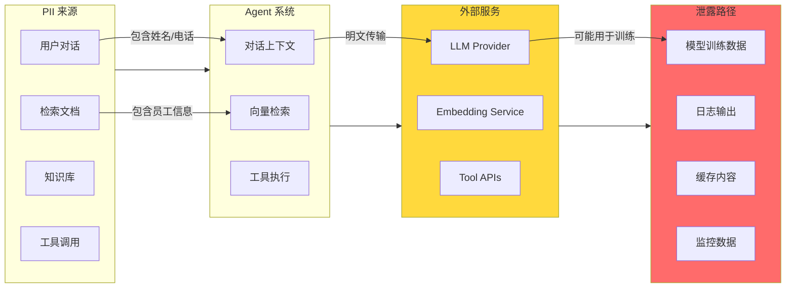
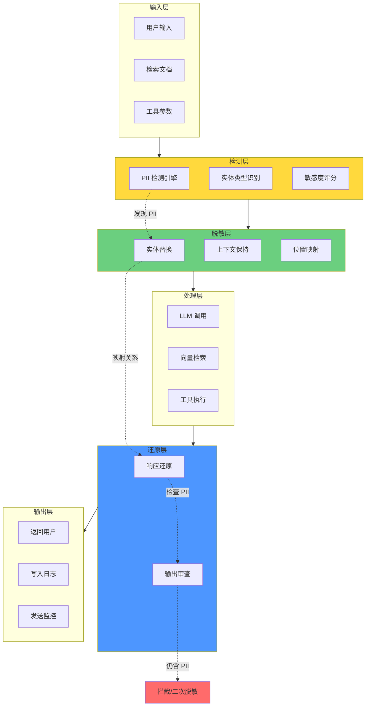
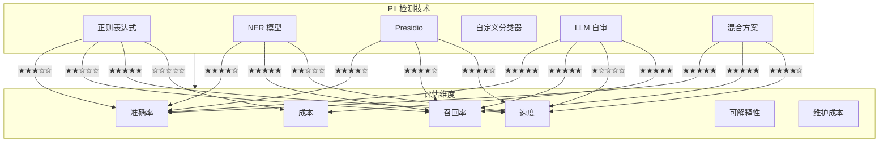
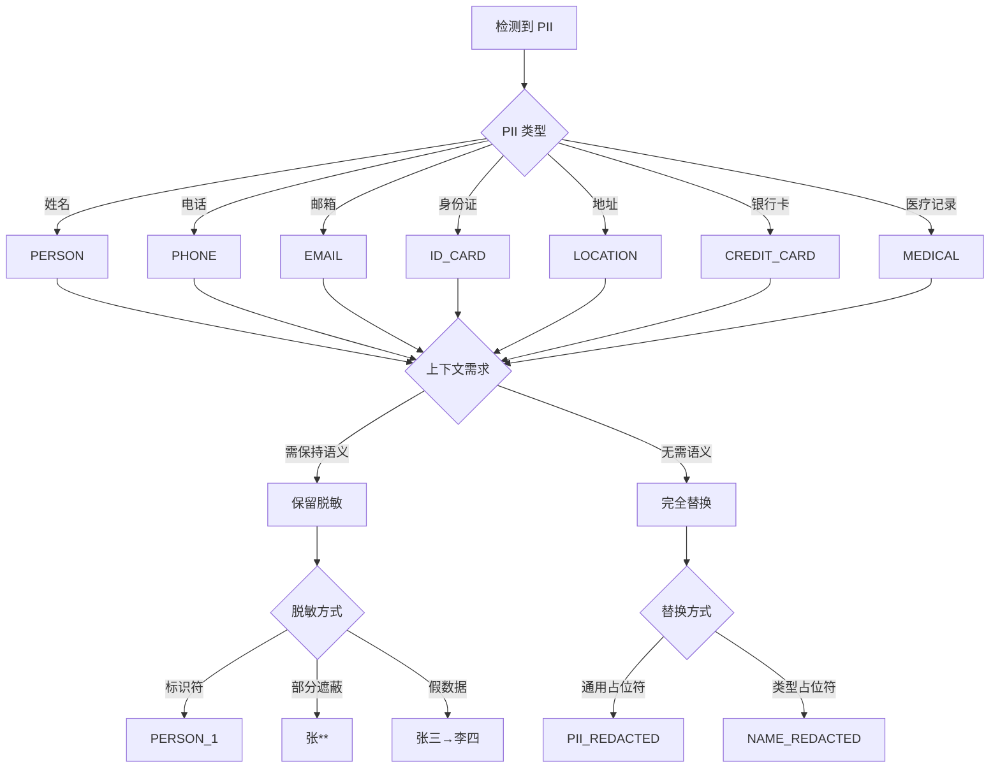
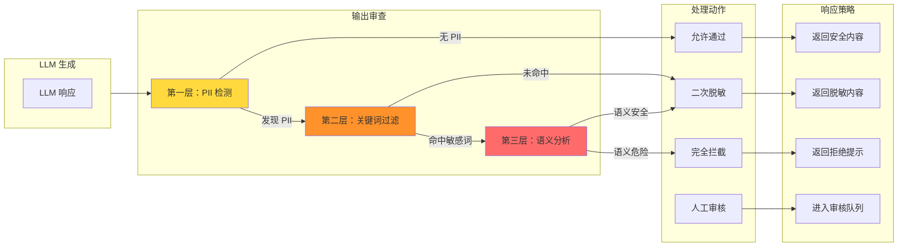

# 12 · Agent PII 脱敏与数据隐私管线（PII Redaction & DLP）

> **核心问题**：Agent 系统是企业最大的数据泄露风险面 —— 用户对话、检索文档、工具调用都可能包含 PII。如何构建端到端的 PII 脱敏管线，在保护隐私的同时保持 Agent 功能？

---

## 概述

PII（Personally Identifiable Information，个人身份信息）脱敏是 Agent 系统合规运营的基石：

| 合规要求 | 适用场景 | 后果 |
|---------|---------|------|
| GDPR | 欧盟用户数据 | 最高 2000 万欧元或 4% 全球营业额 |
| CCPA | 加州居民数据 | 每违规 7500 美元 |
| PIPL | 中国个人信息 | 最高 5000 万元或 5% 营业额 |
| HIPAA | 医疗健康信息 | 最高 150 万美元/年 |

Agent 系统的 PII 风险点：
1. **用户对话**：姓名、身份证、电话、邮箱、地址等
2. **检索文档**：员工档案、客户记录、合同内容
3. **工具调用**：数据库查询、API 调用参数
4. **LLM 上下文**：所有输入 LLM 的内容

本文将介绍完整的 PII 脱敏管线架构、检测技术对比、差异化脱敏策略、输出 DLP、合规映射，以及 Java 实战代码。

---

## 为什么 Agent 是企业最大的数据泄露风险面

### 风险传播链



### 风险严重程度对比

| 系统 | PII 暴露面 | 数据留存 | 第三方共享 | 风险等级 |
|------|-----------|---------|-----------|---------|
| 传统 Web 应用 | 有限 | 数据库 | 否 | 中 |
| 微服务架构 | 分散 | 各服务 | 否 | 中 |
| Agent 系统 | **全面** | **上下文+日志** | **是（LLM）** | **高** |
| RAG 系统 | **全面+检索** | **向量库+文档** | **是（Embedding）** | **极高** |

---

## PII 脱敏管线架构

### 端到端脱敏流程



### 管线组件详解

#### 1. 输入侧脱敏

- **用户对话**：实时检测并脱敏 PII
- **检索文档**：批量扫描并建立脱敏索引
- **工具参数**：参数化脱敏（URL 参数、JSON 字段）

#### 2. 中间处理

- **LLM 调用**：传递脱敏后的 prompt
- **向量检索**：使用脱敏后的查询向量
- **工具执行**：脱敏后的参数执行

#### 3. 输出侧还原

- **响应还原**：根据映射关系还原 PII
- **输出审查**：双重检查输出是否仍含 PII
- **日志脱敏**：确保日志不含敏感信息

---

## 6 种 PII 检测技术对比

### 技术对比矩阵



### 详细对比表

| 技术 | 准确率 | 召回率 | 速度 | 成本 | 优点 | 缺点 | 适用场景 |
|------|-------|-------|------|------|------|------|---------|
| 正则表达式 | 70% | 60% | ⚡⚡⚡⚡⚡ | 免费 | 简单快速 | 误报多、覆盖不全 | 结构化数据（邮箱、电话） |
| NER 模型 | 85% | 90% | ⚡⚡⚡ | 中等 | 泛化能力强 | 需要训练 | 非结构化文本 |
| Presidio | 90% | 85% | ⚡⚡⚡⚡ | 低 | 开源集成好 | 定制难 | 通用脱敏 |
| 自定义分类器 | 95% | 95% | ⚡⚡⚡ | 中等 | 高精度 | 需要标注 | 特定领域（医疗、金融） |
| LLM 自审 | 98% | 98% | ⚡ | 高 | 最准确 | 成本高、慢 | 高价值场景 |
| 混合方案 | 95% | 95% | ⚡⚡⚡⚡ | 中低 | 平衡最优 | 复杂度高 | 生产环境推荐 |

---

## 差异化脱敏策略

### 脱敏决策树



### 脱敏策略配置

```java
/**
 * 脱敏策略配置
 */
@Configuration
@ConfigurationProperties(prefix = "pii.redaction")
@Data
public class RedactionStrategyConfig {
    
    /**
     * 各类型 PII 的脱敏方式
     */
    private Map<PIIType, RedactionMethod> strategies = new HashMap<>();
    
    @PostConstruct
    public void initDefaults() {
        // 默认策略
        strategies.put(PIIType.PERSON, RedactionMethod.CONTEXTUAL_PLACEHOLDER);
        strategies.put(PIIType.PHONE, RedactionMethod.PARTIAL_MASK);
        strategies.put(PIIType.EMAIL, RedactionMethod.PARTIAL_MASK);
        strategies.put(PIIType.ID_CARD, RedactionMethod.COMPLETE_REPLACEMENT);
        strategies.put(PIIType.LOCATION, RedactionMethod.CONTEXTUAL_PLACEHOLDER);
        strategies.put(PIIType.CREDIT_CARD, RedactionMethod.COMPLETE_REPLACEMENT);
        strategies.put(PIIType.MEDICAL_RECORD, RedactionMethod.COMPLETE_REPLACEMENT);
    }
    
    /**
     * 获取脱敏方式
     */
    public RedactionMethod getStrategy(PIIType type) {
        return strategies.getOrDefault(type, RedactionMethod.COMPLETE_REPLACEMENT);
    }
}

/**
 * 脱敏方式
 */
public enum RedactionMethod {
    /**
     * 上下文保留占位符："[PERSON_1]"，保持可理解性
     */
    CONTEXTUAL_PLACEHOLDER,
    
    /**
     * 部分遮蔽："张**" 或 "138****1234"
     */
    PARTIAL_MASK,
    
    /**
     * 假数据替换："张三" → "李四"
     */
    FAKE_DATA_REPLACEMENT,
    
    /**
     * 完全替换："[REDACTED]"
     */
    COMPLETE_REPLACEMENT,
    
    /**
     * Hash 替换："张三" → "USER_HASH_8f2a3b"
     */
    HASH_REPLACEMENT
}
```

### 上下文保留脱敏

```java
/**
 * 上下文保留脱敏器
 * 脱敏后仍能理解语义，如 "张三" → "[PERSON_1]"
 */
@Component
public class ContextualRedactionEngine {
    
    private final PIITypeDetector detector;
    private final EntityPlaceholderGenerator placeholderGenerator;
    private final RedactionStrategyConfig config;
    
    /**
     * 执行上下文保留脱敏
     */
    public RedactionResult redact(String text) {
        // 1. 检测 PII 实体
        List<PIIEntity> entities = detector.detect(text);
        
        // 2. 按位置排序（从后向前处理，避免索引偏移）
        entities.sort((a, b) -> Integer.compare(b.end(), a.end()));
        
        // 3. 构建实体到占位符的映射
        Map<String, String> entityToPlaceholder = new HashMap<>();
        Map<String, PIIType> placeholderToType = new HashMap<>();
        
        StringBuilder redactedText = new StringBuilder(text);
        
        for (PIIEntity entity : entities) {
            String placeholder = placeholderGenerator.generate(
                entity.type(),
                entityToPlaceholder.size() + 1
            );
            
            // 替换
            redactedText.replace(entity.start(), entity.end(), placeholder);
            
            // 记录映射
            entityToPlaceholder.put(entity.text(), placeholder);
            placeholderToType.put(placeholder, entity.type());
        }
        
        return RedactionResult.builder()
            .originalText(text)
            .redactedText(redactedText.toString())
            .entityMappings(entityToPlaceholder)
            .placeholderTypes(placeholderToType)
            .entities(entities)
            .build();
    }
    
    /**
     * 还原脱敏文本
     */
    public String restore(String redactedText, Map<String, String> mappings) {
        String restored = redactedText;
        
        for (Map.Entry<String, String> entry : mappings.entrySet()) {
            restored = restored.replace(entry.getValue(), entry.getKey());
        }
        
        return restored;
    }
}

/**
 * 实体占位符生成器
 */
@Component
public class EntityPlaceholderGenerator {
    
    /**
     * 生成占位符
     * 例如："[PERSON_1]", "[PHONE_1]", "[EMAIL_2]"
     */
    public String generate(PIIType type, int index) {
        return String.format("[%s_%d]", type.name().toLowerCase(), index);
    }
    
    /**
     * 生成语义化占位符
     * 例如："[员工张三]" → "[员工_某先生]"
     */
    public String generateSemantic(PIIEntity entity, int index) {
        return switch (entity.type()) {
            case PERSON -> String.format("[某%s]", inferTitle(entity.text()));
            case PHONE -> "[电话号码]";
            case EMAIL -> "[电子邮箱]";
            default -> generate(entity.type(), index);
        };
    }
    
    private String inferTitle(String name) {
        // 简单推断称谓
        if (name.endsWith("先生")) return "先生";
        if (name.endsWith("女士")) return "女士";
        return "人";
    }
}

/**
 * 部分遮蔽脱敏器
 */
@Component
public class PartialMaskRedactionEngine {
    
    /**
     * 部分遮蔽脱敏
     * 规则：
     * - 姓名：保留首字，其余用 * 代替
     * - 电话：保留前3后4，中间用 * 代替
     * - 邮箱：保留前2和域名，其余用 * 代替
     */
    public String redact(String text, PIIEntity entity) {
        return switch (entity.type()) {
            case PERSON -> maskName(text);
            case PHONE -> maskPhone(text);
            case EMAIL -> maskEmail(text);
            case ID_CARD -> maskIdCard(text);
            default -> "[REDACTED]";
        };
    }
    
    private String maskName(String name) {
        if (name.length() <= 1) return name;
        return name.charAt(0) + "*".repeat(name.length() - 1);
    }
    
    private String maskPhone(String phone) {
        // 移除所有非数字
        String digits = phone.replaceAll("\\D", "");
        
        if (digits.length() < 7) return "***";
        
        // 保留前3后4
        return digits.substring(0, 3) + "****" + digits.substring(digits.length() - 4);
    }
    
    private String maskEmail(String email) {
        int atIndex = email.indexOf('@');
        if (atIndex < 2) return "***@***";
        
        String prefix = email.substring(0, 2);
        String domain = email.substring(atIndex);
        
        return prefix + "***" + domain;
    }
    
    private String maskIdCard(String idCard) {
        if (idCard.length() < 8) return "***";
        
        // 保留前4后4
        return idCard.substring(0, 4) + "********" + idCard.substring(idCard.length() - 4);
    }
}
```

---

## 输出 DLP：Agent 返回内容中的敏感信息拦截

### 输出审查架构



### 输出 DLP 实现

```java
/**
 * 输出 DLP 过滤器
 */
@Component
public class OutputDLPFilter {
    
    private final PIITypeDetector piiDetector;
    private final SensitiveWordMatcher wordMatcher;
    private final SemanticAnalyzer semanticAnalyzer;
    private final DLPPolicy policy;
    
    /**
     * 过滤输出内容
     */
    public DLPResult filter(AgentResponse response) {
        String content = response.content();
        
        // 1. PII 检测
        PII检测结果 piiResult = piiDetector.detect(content);
        if (!piiResult.entities().isEmpty()) {
            return handlePII(content, piiResult);
        }
        
        // 2. 敏感词过滤
        SensitiveWordResult wordResult = wordMatcher.match(content);
        if (wordResult.hasMatch()) {
            return handleSensitiveWords(content, wordResult);
        }
        
        // 3. 语义分析（可选，用于高安全场景）
        if (policy.enableSemanticAnalysis()) {
            SemanticResult semanticResult = semanticAnalyzer.analyze(content);
            if (semanticResult.isDangerous()) {
                return handleDangerousContent(content, semanticResult);
            }
        }
        
        // 通过所有检查
        return DLPResult.allowed(content);
    }
    
    /**
     * 处理 PII
     */
    private DLPResult handlePII(String content, PII检测结果 piiResult) {
        switch (policy.piiHandling()) {
            case REDACT:
                // 二次脱敏
                String redacted = redactPII(content, piiResult);
                return DLPResult.redacted(redacted, List.of("PII 已脱敏"));
                
            case BLOCK:
                // 完全拦截
                return DLPResult.blocked("响应包含 PII，已拦截");
                
            case QUARANTINE:
                // 隔离审核
                return DLPResult.quarantine(content, "响应包含 PII，待审核");
                
            default:
                return DLPResult.blocked("未知 PII 处理策略");
        }
    }
    
    /**
     * 处理敏感词
     */
    private DLPResult handleSensitiveWords(String content, SensitiveWordResult result) {
        if (result.severity() == Severity.HIGH) {
            return DLPResult.blocked("响应包含违禁词: " + result.matchedWords());
        }
        
        if (result.severity() == Severity.MEDIUM) {
            return DLPResult.redacted(content, List.of(
                "响应包含敏感词: " + result.matchedWords()
            ));
        }
        
        return DLPResult.allowed(content);
    }
    
    /**
     * 处理危险内容
     */
    private DLPResult handleDangerousContent(String content, SemanticResult result) {
        return DLPResult.blocked("响应包含危险内容: " + result.reason());
    }
}

/**
 * 敏感词匹配器
 */
@Component
public class SensitiveWordMatcher {
    
    private final Trie sensitiveWordTrie;
    private final Set<String> regexPatterns;
    
    /**
     * 匹配敏感词
     */
    public SensitiveWordResult match(String text) {
        List<MatchedWord> matchedWords = new ArrayList<>();
        Severity maxSeverity = Severity.LOW;
        
        // 1. 精确匹配（AC 自动机）
        List<String> exactMatches = exactMatch(text);
        for (String word : exactMatches) {
            matchedWords.add(new MatchedWord(word, getSeverity(word)));
            maxSeverity = maxSeverity.max(getSeverity(word));
        }
        
        // 2. 正则匹配（变体检测）
        List<String> regexMatches = regexMatch(text);
        for (String word : regexMatches) {
            if (!matchedWords.contains(word)) {
                matchedWords.add(new MatchedWord(word, getSeverity(word)));
                maxSeverity = maxSeverity.max(getSeverity(word));
            }
        }
        
        return new SensitiveWordResult(matchedWords, maxSeverity);
    }
    
    /**
     * 精确匹配（使用 AC 自动机）
     */
    private List<String> exactMatch(String text) {
        List<String> matches = new ArrayList<>();
        // AC 自动机实现...
        return matches;
    }
    
    /**
     * 正则匹配（检测变体）
     */
    private List<String> regexMatch(String text) {
        List<String> matches = new ArrayList<>();
        
        for (String pattern : regexPatterns) {
            Matcher matcher = Pattern.compile(pattern).matcher(text);
            while (matcher.find()) {
                matches.add(matcher.group());
            }
        }
        
        return matches;
    }
    
    /**
     * 获取敏感词严重程度
     */
    private Severity getSeverity(String word) {
        // 从配置或数据库获取
        return sensitiveWordDB.getSeverity(word);
    }
}

/**
 * 语义分析器
 */
@Component
public class SemanticAnalyzer {
    
    private final LLMClient llmClient;
    
    /**
     * 分析内容语义安全性
     */
    public SemanticResult analyze(String content) {
        // 使用 LLM 进行语义分析
        String prompt = """
            请分析以下内容是否包含危险信息：
            
            内容：%s
            
            判断标准：
            1. 是否包含仇恨言论
            2. 是否包含暴力威胁
            3. 是否包含非法指导
            4. 是否包含歧视性内容
            
            返回格式：{"is_dangerous": true/false, "reason": "..."}
            """.formatted(content);
        
        try {
            String response = llmClient.complete(prompt);
            return parseSemanticResult(response);
        } catch (Exception e) {
            // 分析失败时保守处理
            return SemanticResult.safe("分析失败");
        }
    }
    
    private SemanticResult parseSemanticResult(String response) {
        // 解析 LLM 响应
        // ...
        return SemanticResult.safe("内容安全");
    }
}
```

---

## 合规映射：GDPR/CCPA/PIPL

### 法规要求映射表

| 法规 | 关键条款 | 脱敏义务 | 数据最小化 | 被遗忘权 | 可携带权 | 违规后果 |
|------|---------|---------|-----------|---------|---------|---------|
| GDPR | Art. 32 | 数据脱敏/加密 | 必需 | 必需 | 必需 | 2000万€或4%营业额 |
| CCPA | 1798.100 | 合理安全程序 | 建议 | 必需 | 必需 | 7500美元/违规 |
| PIPL | 第6条 | 去标识化 | 必需 | 必需 | 必需 | 5000万¥或5%营业额 |
| HIPAA | 164.312 | 加密/脱敏 | 必需 | 必需 | 否 | 150万美元/年 |

### 合规检查清单

```java
/**
 * 合规检查器
 */
@Component
public class ComplianceChecker {
    
    private final Map<String, ComplianceRule> rules;
    
    /**
     * 检查合规性
     */
    public ComplianceReport check(AgentOperation operation) {
        ComplianceReport.Builder report = ComplianceReport.builder()
            .operation(operation)
            .timestamp(Instant.now());
        
        for (Map.Entry<String, ComplianceRule> entry : rules.entrySet()) {
            String regulation = entry.getKey();
            ComplianceRule rule = entry.getValue();
            
            ComplianceCheckResult result = rule.check(operation);
            report.addRegulation(regulation, result);
        }
        
        return report.build();
    }
}

/**
 * GDPR 合规规则
 */
@Component
public class GDPRComplianceRule implements ComplianceRule {
    
    @Override
    public ComplianceCheckResult check(AgentOperation operation) {
        ComplianceCheckResult.Builder result = ComplianceCheckResult.builder()
            .regulation("GDPR");
        
        // 1. 检查数据脱敏
        boolean redactionCompliant = checkRedaction(operation);
        result.addCheck("数据脱敏", redactionCompliant, 
            redactionCompliant ? "符合" : "不符合：PII 未充分脱敏");
        
        // 2. 检查数据最小化
        boolean minimizationCompliant = checkDataMinimization(operation);
        result.addCheck("数据最小化", minimizationCompliant,
            minimizationCompliant ? "符合" : "不符合：收集了非必要数据");
        
        // 3. 检查被遗忘权
        boolean rightToErasure = checkRightToErasure(operation);
        result.addCheck("被遗忘权", rightToErasure,
            rightToErasure ? "符合" : "不符合：数据未提供删除机制");
        
        // 4. 检查数据可携带权
        boolean dataPortability = checkDataPortability(operation);
        result.addCheck("数据可携带权", dataPortability,
            dataPortability ? "符合" : "不符合：数据不可导出");
        
        return result.build();
    }
    
    private boolean checkRedaction(AgentOperation operation) {
        // 检查是否所有 PII 都已脱敏
        List<PIIEntity> pii = piiDetector.detect(operation.input());
        return pii.isEmpty() || operation.redactionApplied();
    }
    
    private boolean checkDataMinimization(AgentOperation operation) {
        // 检查是否只收集了必要的数据
        return operation.dataCollected().size() <= operation.requiredData().size();
    }
    
    private boolean checkRightToErasure(AgentOperation operation) {
        // 检查是否支持数据删除
        return dataDeletionService.supports(operation.userId());
    }
    
    private boolean checkDataPortability(AgentOperation operation) {
        // 检查是否支持数据导出
        return dataExportService.supports(operation.userId());
    }
}

/**
 * PIPL 合规规则（中国个人信息保护法）
 */
@Component
public class PIPLComplianceRule implements ComplianceRule {
    
    @Override
    public ComplianceCheckResult check(AgentOperation operation) {
        ComplianceCheckResult.Builder result = ComplianceCheckResult.builder()
            .regulation("PIPL");
        
        // 1. 检查去标识化
        boolean deidentification = checkDeidentification(operation);
        result.addCheck("去标识化", deidentification,
            deidentification ? "符合" : "不符合：个人信息未去标识化");
        
        // 2. 检查单独同意
        boolean explicitConsent = checkExplicitConsent(operation);
        result.addCheck("单独同意", explicitConsent,
            explicitConsent ? "符合" : "不符合：未取得单独同意");
        
        // 3. 检查必要原则
        boolean necessity = checkNecessity(operation);
        result.addCheck("必要性原则", necessity,
            necessity ? "符合" : "不符合：超出必要范围");
        
        // 4. 检查本地化要求
        boolean localization = checkLocalization(operation);
        result.addCheck("本地存储", localization,
            localization ? "符合" : "不符合：数据需本地存储");
        
        return result.build();
    }
    
    private boolean checkDeidentification(AgentOperation operation) {
        // PIPL 的去标识化要求比 GDPR 更严格
        List<PIIEntity> pii = piiDetector.detect(operation.input());
        
        // 检查是否实现了去标识化
        if (!pii.isEmpty()) {
            // 检查是否可复原
            return !operation.isReversible();
        }
        
        return true;
    }
    
    private boolean checkExplicitConsent(AgentOperation operation) {
        // 检查是否取得了单独同意
        return consentService.hasExplicitConsent(
            operation.userId(),
            operation.dataType()
        );
    }
    
    private boolean checkNecessity(AgentOperation operation) {
        // 检查是否符合必要性原则
        return operation.dataCollected().stream()
            .allMatch(data -> operation.requiredData().contains(data.type()));
    }
    
    private boolean checkLocalization(AgentOperation operation) {
        // 检查是否满足本地化存储要求
        return dataLocalizationService.isStoredInChina(operation.dataId());
    }
}
```

---

## Java 实现：完整脱敏管线

### 管线入口

```java
/**
 * PII 脱敏管线入口
 */
@Component
public class PIIRedactionPipeline {
    
    private final PIITypeDetector detector;
    private final RedactionEngine redactionEngine;
    private final OutputDLPFilter dlpFilter;
    private final RedactionStore redactionStore;
    
    /**
     * 处理输入（脱敏）
     */
    public RedactionResult processInput(AgentRequest request) {
        // 1. 检测 PII
        List<PIIEntity> entities = detector.detectAll(request.input());
        
        if (entities.isEmpty()) {
            return RedactionResult.noAction(request.input());
        }
        
        // 2. 脱敏
        String redactedInput = redactionEngine.redact(request.input(), entities);
        
        // 3. 存储映射关系（用于还原）
        String mappingId = redactionStore.saveMapping(entities);
        
        // 4. 返回脱敏结果
        return RedactionResult.builder()
            .originalText(request.input())
            .redactedText(redactedInput)
            .mappingId(mappingId)
            .entities(entities)
            .build();
    }
    
    /**
     * 处理输出（审查和还原）
     */
    public String processOutput(AgentResponse response, String mappingId) {
        String content = response.content();
        
        // 1. 输出 DLP 检查
        DLPResult dlpResult = dlpFilter.filter(response);
        
        if (dlpResult.isBlocked()) {
            throw new OutputBlockedException(dlpResult.reason());
        }
        
        if (dlpResult.isRedacted()) {
            // 如果被二次脱敏，返回脱敏后的内容
            return dlpResult.content();
        }
        
        // 2. 还原 PII
        if (mappingId != null) {
            Map<String, String> mappings = redactionStore.getMapping(mappingId);
            content = restorePII(content, mappings);
        }
        
        return content;
    }
    
    /**
     * 还原 PII
     */
    private String restorePII(String redactedText, Map<String, String> mappings) {
        String restored = redactedText;
        
        for (Map.Entry<String, String> entry : mappings.entrySet()) {
            restored = restored.replace(entry.getValue(), entry.getKey());
        }
        
        return restored;
    }
}

/**
 * PII 类型检测器（混合方案）
 */
@Component
public class HybridPIITypeDetector implements PIITypeDetector {
    
    private final RegexPIIDetector regexDetector;
    private final NERPIIDetector nerDetector;
    private final PresidioDetector presidioDetector;
    private final LLMPIIDetector llmDetector;
    
    /**
     * 检测所有 PII 实体
     */
    public List<PIIEntity> detectAll(String text) {
        List<PIIEntity> allEntities = new ArrayList<>();
        
        // 1. 正则检测（快速，但准确率低）
        List<PIIEntity> regexEntities = regexDetector.detect(text);
        allEntities.addAll(regexEntities);
        
        // 2. NER 检测（中等速度，中等准确率）
        List<PIIEntity> nerEntities = nerDetector.detect(text);
        mergeEntities(allEntities, nerEntities);
        
        // 3. Presidio 检测（开源集成）
        List<PIIEntity> presidioEntities = presidioDetector.detect(text);
        mergeEntities(allEntities, presidioEntities);
        
        // 4. 对于高价值场景，使用 LLM 验证
        if (shouldUseLLMValidation(text)) {
            List<PIIEntity> llmEntities = llmDetector.detect(text);
            allEntities = llmEntities;  // LLM 结果更可信
        }
        
        // 5. 去重和合并
        return deduplicateEntities(allEntities);
    }
    
    /**
     * 合并实体
     */
    private void mergeEntities(List<PIIEntity> base, List<PIIEntity> newEntities) {
        for (PIIEntity newEntity : newEntities) {
            if (!containsEntity(base, newEntity)) {
                base.add(newEntity);
            }
        }
    }
    
    /**
     * 去重实体
     */
    private List<PIIEntity> deduplicateEntities(List<PIIEntity> entities) {
        Map<String, PIIEntity> uniqueEntities = new LinkedHashMap<>();
        
        for (PIIEntity entity : entities) {
            String key = entity.start() + "-" + entity.end() + "-" + entity.type();
            if (!uniqueEntities.containsKey(key)) {
                uniqueEntities.put(key, entity);
            }
        }
        
        return new ArrayList<>(uniqueEntities.values());
    }
    
    /**
     * 判断是否需要 LLM 验证
     */
    private boolean shouldUseLLMValidation(String text) {
        // 高价值场景或正则检测到 PII 时使用
        return regexDetector.detect(text).size() > 0;
    }
}

/**
 * 脱敏映射存储
 */
@Component
public class RedactionStore {
    
    private final RedisTemplate<String, Object> redisTemplate;
    private static final String MAPPING_KEY_PREFIX = "pii:mapping:";
    private static final Duration MAPPING_TTL = Duration.ofHours(24);
    
    /**
     * 保存映射关系
     */
    public String saveMapping(List<PIIEntity> entities) {
        String mappingId = UUID.randomUUID().toString();
        String key = MAPPING_KEY_PREFIX + mappingId;
        
        Map<String, String> mappings = new HashMap<>();
        for (PIIEntity entity : entities) {
            String placeholder = generatePlaceholder(entity);
            mappings.put(placeholder, entity.text());
        }
        
        redisTemplate.opsForHash().putAll(key, mappings);
        redisTemplate.expire(key, MAPPING_TTL);
        
        return mappingId;
    }
    
    /**
     * 获取映射关系
     */
    public Map<String, String> getMapping(String mappingId) {
        String key = MAPPING_KEY_PREFIX + mappingId;
        
        Map<Object, Object> rawMappings = redisTemplate.opsForHash().entries(key);
        
        Map<String, String> mappings = new HashMap<>();
        for (Map.Entry<Object, Object> entry : rawMappings.entrySet()) {
            mappings.put((String) entry.getKey(), (String) entry.getValue());
        }
        
        return mappings;
    }
    
    /**
     * 生成占位符
     */
    private String generatePlaceholder(PIIEntity entity) {
        return String.format("[%s_%d]", 
            entity.type().name().toLowerCase(), 
            entity.index()
        );
    }
}
```

---

## 最佳实践

### 1. 默认拒绝 + 明确同意

```java
// ✅ 正确：默认不收集，明确同意后收集
public void collectPII(String userId, String pii, ConsentType type) {
    if (!consentService.hasConsent(userId, type)) {
        throw new ConsentRequiredException("需要用户明确同意");
    }
    
    piiStorage.store(userId, pii, type);
}

// ❌ 错误：默认收集，隐含同意
public void collectPII(String userId, String pii) {
    piiStorage.store(userId, pii);  // 未检查同意
}
```

### 2. 脱敏粒度可控

```java
// ✅ 正确：支持不同脱敏粒度
public enum RedactionLevel {
    FULL,       // 完全脱敏，不可还原
    PARTIAL,    // 部分脱敏，可还原
    NONE        // 不脱敏（开发/测试）
}

public String redact(String text, RedactionLevel level) {
    return switch (level) {
        case FULL -> fullRedact(text);
        case PARTIAL -> partialRedact(text);
        case NONE -> text;
    };
}

// ❌ 错误：只有完全脱敏
public String redact(String text) {
    return fullRedact(text);  // 无法调试
}
```

### 3. 敏感数据加密存储

```java
// ✅ 正确：敏感数据加密存储
public void storeSensitiveData(String userId, String data) {
    String encrypted = encryptionService.encrypt(data);
    secureStorage.store(userId, encrypted);
}

// ❌ 错误：明文存储
public void storeSensitiveData(String userId, String data) {
    storage.store(userId, data);  // 明文存储
}
```

### 4. 脱敏日志

```java
// ✅ 正确：日志也脱敏
public void logAgentExecution(AgentExecution execution) {
    String logMessage = execution.toLogString();
    String redacted = piiDetector.redact(logMessage);
    logger.info(redacted);
}

// ❌ 错误：日志未脱敏
public void logAgentExecution(AgentExecution execution) {
    logger.info(execution.toString());  // 可能包含 PII
}
```

### 5. 定期合规审计

```java
// ✅ 正确：定期合规审计
@Scheduled(cron = "0 0 2 * * ?")  // 每天凌晨2点
public void auditCompliance() {
    ComplianceReport report = complianceChecker.audit();
    
    if (!report.isCompliant()) {
        alertService.send("合规检查未通过", report);
    }
}

// ❌ 错误：没有定期审计
public void auditCompliance() {
    // 只在人工触发时执行
}
```

---

## 检查清单

### 架构设计检查清单

- [ ] 是否实现了完整的脱敏管线？
- [ ] 是否支持输入脱敏和输出审查？
- [ ] 是否支持上下文保留脱敏？
- [ ] 是否有映射关系管理？
- [ ] 是否支持差异化脱敏策略？

### 检测能力检查清单

- [ ] 是否覆盖常见 PII 类型（姓名、电话、邮箱、身份证、地址）？
- [ ] 是否支持自定义 PII 类型？
- [ ] 是否使用混合检测方案？
- [ ] 检测准确率是否达到 95% 以上？
- [ ] 是否有误报处理机制？

### 合规性检查清单

- [ ] 是否满足 GDPR 要求数据脱敏？
- [ ] 是否满足 CCPA 要求合理安全？
- [ ] 是否满足 PIPL 要求去标识化？
- [ ] 是否支持被遗忘权？
- [ ] 是否支持数据可携带权？

### 安全性检查清单

- [ ] 映射关系是否加密存储？
- [ ] 脱敏数据是否有 TTL？
- [ ] 是否有审计日志？
- [ ] 是否有访问控制？
- [ ] 是否定期安全审计？

### 性能检查清单

- [ ] 脱敏延迟是否 < 100ms？
- [ ] 是否支持批量脱敏？
- [ ] 是否有缓存机制？
- [ ] 是否异步处理？
- [ ] 是否支持降级策略？

---

## 参考资料

1. **Microsoft Presidio**: https://github.com/microsoft/presidio
2. **Google Data Loss Prevention API**: https://cloud.google.com/security/products/dlp
3. **GDPR Compliance Guide**: https://gdpr-info.eu/
4. **PII Anonymization Techniques**: https://arxiv.org/abs/2004.03445

---

**文档版本**: v1.0  
**最后更新**: 2025-01-09  
**作者**: Agent 架构师团队  
**状态**: 待审核
