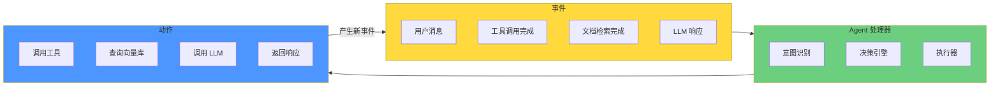
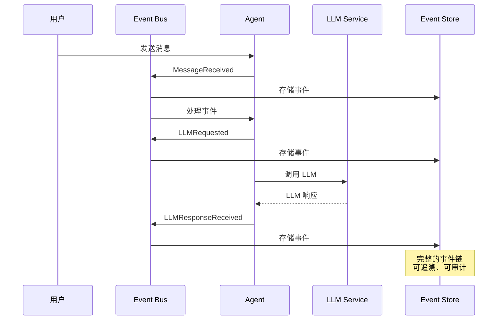
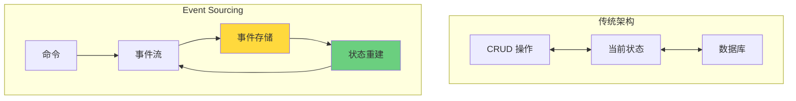
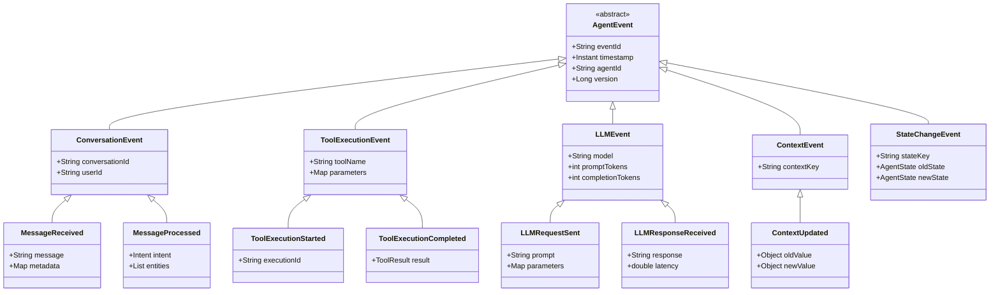
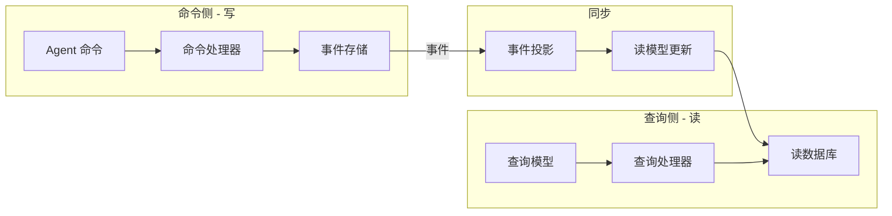
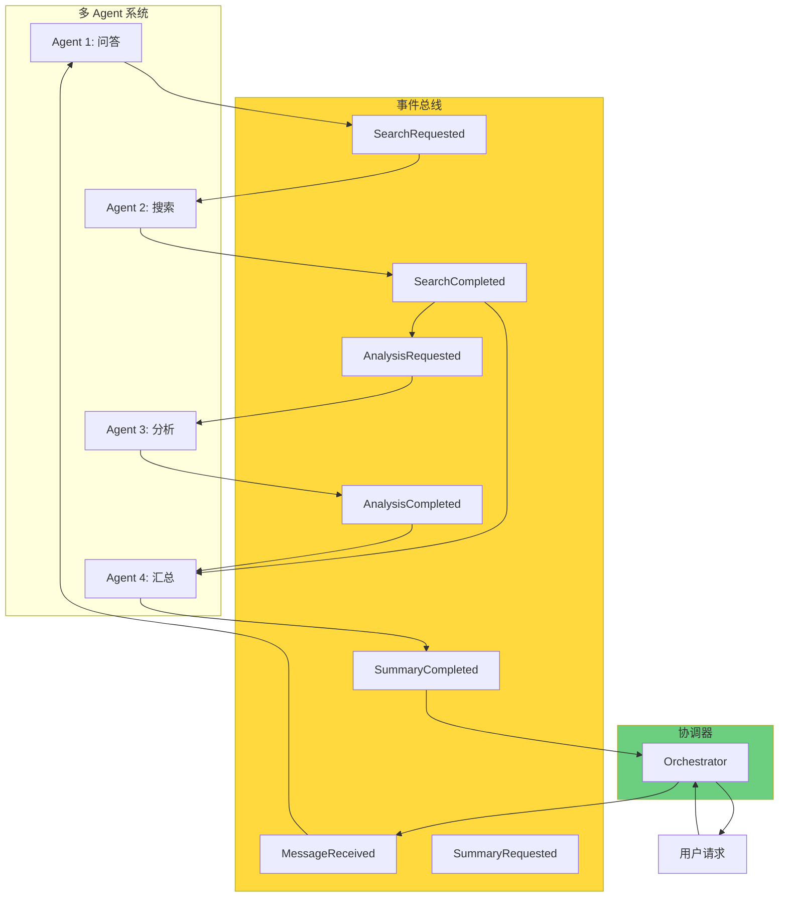
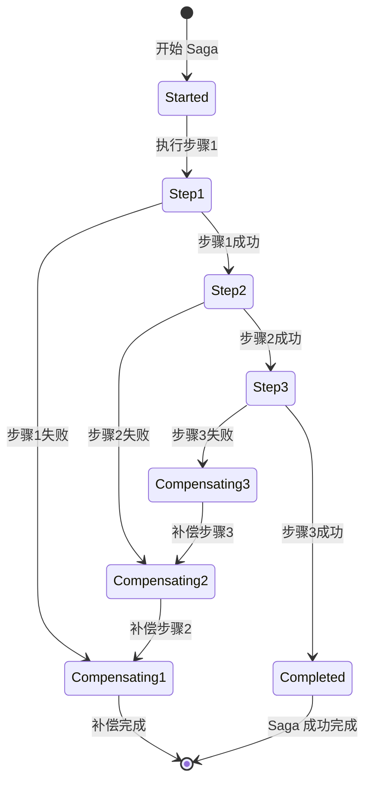
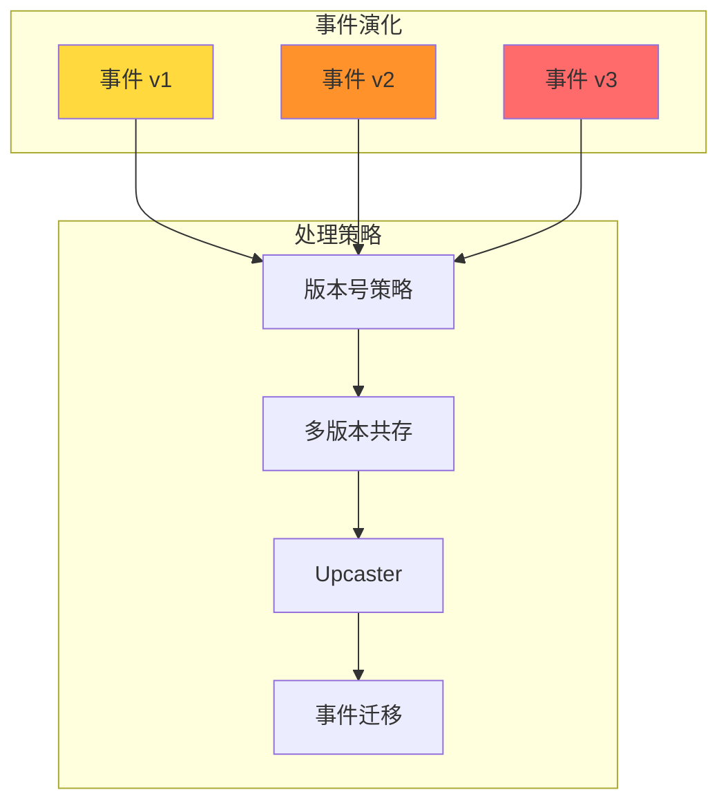

# 13 · Event-Driven Agent 架构（事件驱动 Agent）

> **核心问题**：传统 Agent 架构是同步请求-响应模型，如何通过事件驱动实现解耦、可扩展、易维护的 Agent 系统？

---

## 概述

事件驱动架构（Event-Driven Architecture, EDA）与 Agent 系统是天作之合：

| 特性 | 传统 Agent 架构 | 事件驱动 Agent 架构 |
|------|---------------|-------------------|
| 耦合度 | 高（服务间直接调用） | 低（通过事件解耦） |
| 可扩展性 | 受限（同步调用瓶颈） | 高（异步处理） |
| 可追溯性 | 弱（调用链难以追踪） | 强（Event Log 即历史） |
| 状态管理 | 隐式（数据库状态） | 显式（事件流即状态） |
| 故障恢复 | 复杂（状态不一致） | 简单（重放事件即可） |
| 多 Agent 协作 | 复杂（需要编排器） | 自然（事件总线即编排） |

本文将深入探讨 Event Sourcing 在 Agent 系统中的应用、CQRS 模式、事件驱动的多 Agent 协作、Saga 事务模式、事件版本演化，以及完整的 Java 实现。

---

## 为什么 Agent 天然适合事件驱动架构

### Agent 的本质是事件处理器



**核心洞察**：
1. **Agent 本身就是事件处理器**：接收用户消息事件，输出动作事件
2. **工具调用是异步事件**：工具调用 → 等待 → 工具返回（完成事件）
3. **多轮对话是事件流**：每一轮对话都是一个事件序列
4. **状态变化是事件**：会话状态改变、上下文更新都是事件

### 事件驱动架构的优势

#### 1. 解耦与可扩展性

```java
// ✅ 传统架构：紧耦合
public class Agent {
    private LLMClient llmClient;  // 直接依赖
    private VectorStore vectorStore;  // 直接依赖
    
    public Response process(Request request) {
        // 同步调用
        List<Document> docs = vectorStore.search(query);
        Response response = llmClient.chat(prompt);
        return response;
    }
}

// ✅ 事件驱动架构：松耦合
public class EventDrivenAgent {
    private EventBus eventBus;
    
    public void handle(RequestEvent event) {
        // 发布事件，不关心谁处理
        eventBus.publish(DocumentQueryEvent.of(event));
    }
    
    @Subscribe
    public void onDocumentsFound(DocumentsFoundEvent event) {
        eventBus.publish(LLMRequestEvent.of(event));
    }
}
```

#### 2. 完整的可追溯性



#### 3. 状态即事件流

```java
// Agent 状态 = 事件流的聚合
public class AgentState {
    // 当前状态由事件流重建
    public static AgentState rebuildFrom(List<AgentEvent> events) {
        AgentState state = new AgentState();
        
        for (AgentEvent event : events) {
            state.apply(event);
        }
        
        return state;
    }
    
    // 应用事件更新状态
    private void apply(AgentEvent event) {
        switch (event) {
            case MessageReceived e -> this.hasMessage = true;
            case LLMResponseReceived e -> this.hasLLMResponse = true;
            // ...
        }
    }
}
```

---

## Event Sourcing in Agent

### Event Sourcing 基本原理



### Agent 事件类型体系



### Event Store 实现

```java
/**
 * Agent 事件存储
 */
@Component
public class AgentEventStore {
    
    private final EventRepository eventRepository;
    private final SnapshotRepository snapshotRepository;
    private final ObjectMapper objectMapper;
    
    /**
     * 追加事件
     */
    public void append(String agentId, List<AgentEvent> events) {
        // 1. 验证版本号（乐观锁）
        long currentVersion = getCurrentVersion(agentId);
        long expectedVersion = currentVersion;
        
        for (AgentEvent event : events) {
            if (event.version() != expectedVersion + 1) {
                throw new ConcurrencyException(
                    "版本冲突：期望 " + (expectedVersion + 1) + "，实际 " + event.version()
                );
            }
            expectedVersion = event.version();
        }
        
        // 2. 批量写入
        List<EventRecord> records = events.stream()
            .map(this::toRecord)
            .toList();
        
        eventRepository.saveAll(records);
        
        // 3. 检查是否需要快照
        if (shouldCreateSnapshot(agentId, currentVersion + events.size())) {
            createSnapshot(agentId);
        }
    }
    
    /**
     * 读取事件流
     */
    public List<AgentEvent> readEvents(String agentId, long fromVersion) {
        return eventRepository.findByAggregateIdAndVersionGreaterThanOrderByVersionAsc(
            agentId, 
            fromVersion
        ).stream()
        .map(this::fromRecord)
        .toList();
    }
    
    /**
     * 读取完整事件流
     */
    public List<AgentEvent> readAllEvents(String agentId) {
        return readEvents(agentId, 0);
    }
    
    /**
     * 获取当前版本
     */
    public long getCurrentVersion(String agentId) {
        return eventRepository
            .findFirstByAggregateIdOrderByVersionDesc(agentId)
            .map(EventRecord::getVersion)
            .orElse(0L);
    }
    
    /**
     * 从快照重建状态
     */
    public AgentState rebuildFromSnapshot(String agentId) {
        // 1. 尝试加载最新快照
        Optional<Snapshot> snapshot = snapshotRepository
            .findFirstByAggregateIdOrderByCreatedAtDesc(agentId);
        
        AgentState state;
        long fromVersion;
        
        if (snapshot.isPresent()) {
            state = snapshot.get().getState();
            fromVersion = snapshot.get().getVersion() + 1;
        } else {
            state = AgentState.initial();
            fromVersion = 0;
        }
        
        // 2. 从快照版本之后的事件恢复
        List<AgentEvent> events = readEvents(agentId, fromVersion);
        
        for (AgentEvent event : events) {
            state = state.apply(event);
        }
        
        return state;
    }
    
    /**
     * 创建快照
     */
    private void createSnapshot(String agentId) {
        AgentState state = rebuildFromSnapshot(agentId);
        long version = getCurrentVersion(agentId);
        
        Snapshot snapshot = new Snapshot();
        snapshot.setAggregateId(agentId);
        snapshot.setVersion(version);
        snapshot.setState(state);
        snapshot.setCreatedAt(Instant.now());
        
        snapshotRepository.save(snapshot);
    }
    
    /**
     * 判断是否需要快照
     */
    private boolean shouldCreateSnapshot(String agentId, long version) {
        // 每 100 个事件创建一次快照
        return version % 100 == 0;
    }
}

/**
 * 事件记录
 */
@Entity
@Table(name = "agent_events")
@Data
class EventRecord {
    @Id
    private String id;
    
    private String aggregateId;  // Agent ID
    private Long version;
    private String eventType;
    private String eventData;  // JSON
    private Instant timestamp;
    
    @Index
    private String conversationId;  // 用于查询会话事件
}

/**
 * 快照记录
 */
@Entity
@Table(name = "agent_snapshots")
@Data
class Snapshot {
    @Id
    private String id;
    
    private String aggregateId;
    private Long version;
    private AgentState state;  // JSON
    private Instant createdAt;
}
```

---

## CQRS 在 Agent 系统中的应用

### CQRS 架构



### CQRS 实现

```java
/**
 * Agent 命令侧
 */
@Component
public class AgentCommandHandler {
    
    private final AgentEventStore eventStore;
    private final CommandValidator validator;
    
    /**
     * 处理消息接收命令
     */
    @CommandHandler
    public void handle(ReceiveMessageCommand command) {
        // 1. 验证命令
        validator.validate(command);
        
        // 2. 重建当前状态
        AgentState state = eventStore.rebuildFromSnapshot(command.agentId());
        
        // 3. 执行业务逻辑
        List<AgentEvent> events = state.receiveMessage(command);
        
        // 4. 持久化事件
        eventStore.append(command.agentId(), events);
        
        // 5. 发布事件
        eventPublisher.publish(events);
    }
    
    /**
     * 处理工具执行命令
     */
    @CommandHandler
    public void handle(ExecuteToolCommand command) {
        validator.validate(command);
        
        AgentState state = eventStore.rebuildFromSnapshot(command.agentId());
        List<AgentEvent> events = state.executeTool(command);
        
        eventStore.append(command.agentId(), events);
        eventPublisher.publish(events);
    }
}

/**
 * Agent 查询侧
 */
@Component
public class AgentQueryHandler {
    
    private final ConversationViewRepository viewRepository;
    private final ConversationIndexRepository indexRepository;
    
    /**
     * 查询会话历史
     */
    @QueryHandler
    public ConversationHistory query(GetConversationHistory query) {
        return viewRepository.findByConversationId(query.conversationId());
    }
    
    /**
     * 搜索会话
     */
    @QueryHandler
    public List<ConversationSummary> search(SearchConversations query) {
        return indexRepository.search(query.keyword(), query.filters());
    }
    
    /**
     * 查询 Agent 状态
     */
    @QueryHandler
    public AgentStateView query(GetAgentState query) {
        return viewRepository.findStateByAgentId(query.agentId());
    }
}

/**
 * 事件投影器
 */
@Component
public class ConversationProjection {
    
    private final ConversationViewRepository viewRepository;
    
    @Subscribe
    public void on(MessageReceived event) {
        ConversationView view = viewRepository
            .findByConversationId(event.conversationId())
            .orElse(new ConversationView(event.conversationId()));
        
        view.addMessage(event.message(), event.timestamp());
        viewRepository.save(view);
    }
    
    @Subscribe
    public void on(MessageProcessed event) {
        ConversationView view = viewRepository
            .findByConversationId(event.conversationId())
            .orElseThrow();
        
        view.updateIntent(event.intent());
        view.updateEntities(event.entities());
        viewRepository.save(view);
    }
}
```

---

## 事件驱动的多 Agent 协作

### 协作架构



### 协作实现

```java
/**
 * 事件驱动的 Agent 编排器
 */
@Component
public class EventDrivenAgentOrchestrator {
    
    private final EventBus eventBus;
    private final AgentRegistry agentRegistry;
    private final ConversationStateManager stateManager;
    
    /**
     * 处理用户请求
     */
    public void processUserRequest(UserRequest request) {
        // 1. 发布消息接收事件
        eventBus.publish(MessageReceivedEvent.builder()
            .requestId(request.requestId())
            .userId(request.userId())
            .message(request.message())
            .timestamp(Instant.now())
            .build());
        
        // 2. 等待编排完成
        CompletableFuture<OrchestrationResult> future = new CompletableFuture<>();
        stateManager.registerWaiting(request.requestId(), future);
        
        // 3. 启动超时
        CompletableFuture.delayedExecutor(5, TimeUnit.MINUTES).execute(() -> {
            if (!future.isDone()) {
                future.complete(OrchestrationResult.timeout());
            }
        });
        
        return future;
    }
    
    /**
     * 消息接收事件处理
     */
    @Subscribe
    public void onMessageReceived(MessageReceivedEvent event) {
        ConversationState state = stateManager.getOrCreate(event.requestId());
        
        // 分析意图
        Intent intent = analyzeIntent(event.message());
        
        // 根据意图分发给对应的 Agent
        switch (intent.type()) {
            case QUESTION -> eventBus.publish(QuestionProcessingEvent.of(event));
            case SEARCH -> eventBus.publish(SearchProcessingEvent.of(event));
            case ANALYSIS -> eventBus.publish(AnalysisProcessingEvent.of(event));
            default -> eventBus.publish(UnknownIntentEvent.of(event));
        }
    }
    
    /**
     * 问题处理事件
     */
    @Subscribe
    public void onQuestionProcessing(QuestionProcessingEvent event) {
        QAAgent agent = agentRegistry.getAgent("qa");
        AgentResponse response = agent.process(event.message());
        
        eventBus.publish(QuestionAnsweredEvent.builder()
            .requestId(event.requestId())
            .response(response)
            .build());
    }
    
    /**
     * 搜索处理事件
     */
    @Subscribe
    public void onSearchProcessing(SearchProcessingEvent event) {
        SearchAgent agent = agentRegistry.getAgent("search");
        
        // 先启动搜索
        CompletableFuture<SearchResult> searchFuture = agent.searchAsync(event.message());
        
        searchFuture.thenAccept(result -> {
            eventBus.publish(SearchCompletedEvent.builder()
                .requestId(event.requestId())
                .result(result)
                .build());
        });
    }
    
    /**
     * 搜索完成事件
     */
    @Subscribe
    public void onSearchCompleted(SearchCompletedEvent event) {
        // 可能需要进一步分析
        eventBus.publish(AnalysisProcessingEvent.builder()
            .requestId(event.requestId())
            .searchResults(event.result())
            .build());
    }
    
    /**
     * 分析处理事件
     */
    @Subscribe
    public void onAnalysisProcessing(AnalysisProcessingEvent event) {
        AnalysisAgent agent = agentRegistry.getAgent("analysis");
        CompletableFuture<AnalysisResult> analysisFuture = agent.analyzeAsync(event);
        
        analysisFuture.thenAccept(result -> {
            eventBus.publish(AnalysisCompletedEvent.builder()
                .requestId(event.requestId())
                .result(result)
                .build());
        });
    }
    
    /**
     * 编排完成事件
     */
    @Subscribe
    public void onOrchestrationCompleted(OrchestrationCompletedEvent event) {
        CompletableFuture<OrchestrationResult> future = 
            stateManager.unregisterWaiting(event.requestId());
        
        if (future != null) {
            future.complete(OrchestrationResult.success(event.finalResponse()));
        }
    }
}

/**
 * 多 Agent 协作示例：RAG + 分析
 */
@Component
public class RAGAnalysisOrchestrator {
    
    /**
     * 处理需要 RAG 和分析的请求
     */
    @Subscribe
    public void onRAGAnalysisRequest(RAGAnalysisRequestEvent event) {
        // 1. 启动并行任务
        CompletableFuture<Void> retrievalFuture = retrieveDocuments(event);
        CompletableFuture<Void> contextFuture = buildContext(event);
        
        // 2. 等待并行任务完成
        CompletableFuture.allOf(retrievalFuture, contextFuture)
            .thenRun(() -> {
                // 3. 执行 RAG 生成
                eventBus.publish(RAGReadyEvent.of(event.requestId()));
            })
            .exceptionally(ex -> {
                eventBus.publish(RAGFailedEvent.of(event.requestId(), ex));
                return null;
            });
    }
    
    @Subscribe
    public void onRAGReady(RAGReadyEvent event) {
        // RAG 完成后，执行深度分析
        eventBus.publish(DeepAnalysisRequestEvent.of(event.requestId()));
    }
    
    @Subscribe
    public void onDeepAnalysisCompleted(DeepAnalysisCompletedEvent event) {
        // 深度分析完成，汇总结果
        eventBus.publish(OrchestrationCompletedEvent.of(event.requestId()));
    }
}
```

---

## Saga 模式与事件驱动的 Agent 事务

### Saga 模式



### Saga 实现

```java
/**
 * Agent Saga 编排器
 */
@Component
public class AgentSagaOrchestrator {
    
    private final SagaStore sagaStore;
    private final EventBus eventBus;
    private final Map<String, SagaStep> stepRegistry;
    
    /**
     * 启动 Saga
     */
    public String startSaga(SagaDefinition definition) {
        SagaInstance saga = SagaInstance.builder()
            .sagaId(UUID.randomUUID().toString())
            .definition(definition)
            .currentState(SagaState.STARTED)
            .currentStep(0)
            .build();
        
        sagaStore.save(saga);
        
        // 执行第一步
        executeStep(saga, 0);
        
        return saga.sagaId();
    }
    
    /**
     * 执行 Saga 步骤
     */
    private void executeStep(SagaInstance saga, int stepIndex) {
        if (stepIndex >= saga.definition().steps().size()) {
            // Saga 完成
            completeSaga(saga);
            return;
        }
        
        SagaStep step = saga.definition().steps().get(stepIndex);
        
        try {
            // 执行步骤
            StepResult result = step.execute();
            
            // 记录成功
            sagaStore.recordStepSuccess(saga.sagaId(), stepIndex, result);
            
            // 执行下一步
            executeStep(saga, stepIndex + 1);
            
        } catch (Exception e) {
            // 步骤失败，启动补偿
            compensateSaga(saga, stepIndex - 1, e);
        }
    }
    
    /**
     * 补偿 Saga
     */
    private void compensateSaga(SagaInstance saga, int fromStep, Exception error) {
        sagaStore.recordSagaFailed(saga.sagaId(), error);
        
        // 从失败步骤的前一步开始补偿
        for (int i = fromStep; i >= 0; i--) {
            SagaStep step = saga.definition().steps().get(i);
            
            try {
                step.compensate();
                sagaStore.recordStepCompensated(saga.sagaId(), i);
            } catch (Exception e) {
                sagaStore.recordCompensationFailed(saga.sagaId(), i, e);
            }
        }
        
        sagaStore.updateState(saga.sagaId(), SagaState.COMPENSATED);
    }
    
    /**
     * 完成 Saga
     */
    private void completeSaga(SagaInstance saga) {
        sagaStore.updateState(saga.sagaId(), SagaState.COMPLETED);
        
        eventBus.publish(SagaCompletedEvent.builder()
            .sagaId(saga.sagaId())
            .result(saga.buildResult())
            .build());
    }
}

/**
 * 多 Agent 工作流 Saga 示例
 */
@Configuration
public class AgentWorkflowSagaConfig {
    
    @Bean
    public SagaDefinition documentAnalysisWorkflow() {
        return SagaDefinition.builder()
            .sagaType("DOCUMENT_ANALYSIS")
            .steps(List.of(
                // 步骤1：上传文档
                SagaStep.builder()
                    .name("upload_document")
                    .action(ctx -> uploadDocument(ctx))
                    .compensation(ctx -> deleteDocument(ctx))
                    .build(),
                
                // 步骤2：提取文本
                SagaStep.builder()
                    .name("extract_text")
                    .action(ctx -> extractText(ctx))
                    .compensation(ctx -> deleteExtractedText(ctx))
                    .build(),
                
                // 步骤3：向量嵌入
                SagaStep.builder()
                    .name("create_embeddings")
                    .action(ctx -> createEmbeddings(ctx))
                    .compensation(ctx -> deleteEmbeddings(ctx))
                    .build(),
                
                // 步骤4：存储到向量库
                SagaStep.builder()
                    .name("store_in_vector_db")
                    .action(ctx -> storeInVectorDB(ctx))
                    .compensation(ctx -> deleteFromVectorDB(ctx))
                    .build(),
                
                // 步骤5：创建索引
                SagaStep.builder()
                    .name("create_index")
                    .action(ctx -> createIndex(ctx))
                    .compensation(ctx -> deleteIndex(ctx))
                    .build()
            ))
            .build();
    }
}
```

---

## 事件版本演化与向后兼容

### 事件版本管理策略



### 事件版本兼容实现

```java
/**
 * 事件 Upcaster（版本升级器）
 */
@Component
public class EventUpcasterChain {
    
    private final List<EventUpcaster> upcasters;
    
    /**
     * 升级事件到最新版本
     */
    public AgentEvent upcast(AgentEvent event) {
        AgentEvent current = event;
        
        for (EventUpcaster upcaster : upcasters) {
            if (upcaster.supports(current)) {
                current = upcaster.upcast(current);
            }
        }
        
        return current;
    }
    
    /**
     * 批量升级事件流
     */
    public List<AgentEvent> upcastEventStream(List<AgentEvent> events) {
        return events.stream()
            .map(this::upcast)
            .toList();
    }
}

/**
 * 具体的 Upcaster 示例
 */
@Component
public class MessageReceivedUpcaster_V1_V2 implements EventUpcaster {
    
    @Override
    public boolean supports(AgentEvent event) {
        return event instanceof MessageReceived && 
               event.version() == 1;
    }
    
    @Override
    public AgentEvent upcast(AgentEvent event) {
        MessageReceived v1 = (MessageReceived) event;
        
        // V2 版本增加了 messageId 字段
        return MessageReceived.builder()
            .eventId(v1.eventId())
            .timestamp(v1.timestamp())
            .agentId(v1.agentId())
            .version(2)
            .conversationId(v1.conversationId())
            .userId(v1.userId())
            .message(v1.message())
            .messageId(UUID.randomUUID().toString())  // 新字段
            .metadata(v1.metadata())
            .build();
    }
}

/**
 * 事件迁移器（批量迁移旧事件）
 */
@Component
public class EventMigrator {
    
    private final AgentEventStore eventStore;
    private final EventUpcasterChain upcasterChain;
    
    /**
     * 迁移指定 Agent 的所有事件
     */
    @Async
    public void migrateEvents(String agentId) {
        // 1. 读取所有事件
        List<AgentEvent> events = eventStore.readAllEvents(agentId);
        
        // 2. 升级事件版本
        List<AgentEvent> upcastedEvents = upcasterChain.upcastEventStream(events);
        
        // 3. 验证升级后的事件
        if (!validateEvents(upcastedEvents)) {
            throw new EventMigrationException("事件验证失败");
        }
        
        // 4. 备份旧事件
        backupEvents(agentId, events);
        
        // 5. 写入升级后的事件
        rewriteEvents(agentId, upcastedEvents);
    }
    
    private boolean validateEvents(List<AgentEvent> events) {
        // 验证事件序列的完整性
        for (int i = 0; i < events.size() - 1; i++) {
            if (events.get(i + 1).version() != events.get(i).version() + 1) {
                return false;
            }
        }
        return true;
    }
}
```

---

## 事件存储选型

### 存储方案对比

| 方案 | 优点 | 缺点 | 适用场景 |
|------|------|------|---------|
| PostgreSQL | 成熟可靠、支持事务 | 写入性能有限 | 中小规模、事务重要 |
| EventStoreDB | 专业事件存储、高性能 | 学习曲线陡 | 大规模、专业团队 |
| Kafka | 高吞吐、持久化 | 不支持查询 | 大规模、实时处理 |
| MongoDB | 灵活schema、高性能 | 事务支持有限 | 中大规模、灵活需求 |
| Cassandra | 极高写入性能、分布式 | 复杂查询弱 | 超大规模、写密集 |

### PostgreSQL 实现

```java
/**
 * 基于 PostgreSQL 的事件存储实现
 */
@Component
public class PostgreSQLEventStore implements AgentEventStore {
    
    private final JdbcTemplate jdbcTemplate;
    private final ObjectMapper objectMapper;
    
    @Override
    public void append(String agentId, List<AgentEvent> events) {
        // 使用 INSERT ... ON CONFLICT 实现乐观锁
        String sql = """
            INSERT INTO agent_events 
            (id, aggregate_id, version, event_type, event_data, timestamp, conversation_id)
            VALUES (?, ?, ?, ?, ?, ?, ?)
            ON CONFLICT (aggregate_id, version) 
            DO NOTHING
            """;
        
        List<Object[]> params = events.stream()
            .map(event -> new Object[]{
                UUID.randomUUID().toString(),
                agentId,
                event.version(),
                event.getClass().getSimpleName(),
                toJson(event),
                event.timestamp(),
                extractConversationId(event)
            })
            .toList();
        
        jdbcTemplate.batchUpdate(sql, params);
    }
    
    @Override
    public List<AgentEvent> readEvents(String agentId, long fromVersion) {
        String sql = """
            SELECT event_data, event_type, version, timestamp
            FROM agent_events
            WHERE aggregate_id = ? AND version > ?
            ORDER BY version ASC
            """;
        
        return jdbcTemplate.query(sql, 
            rs -> {
                List<AgentEvent> events = new ArrayList<>();
                while (rs.next()) {
                    String eventType = rs.getString("event_type");
                    String eventData = rs.getString("event_data");
                    long version = rs.getLong("version");
                    Instant timestamp = rs.getTimestamp("timestamp").toInstant();
                    
                    AgentEvent event = fromJson(eventData, eventType, version, timestamp);
                    events.add(event);
                }
                return events;
            },
            agentId, 
            fromVersion
        );
    }
    
    private String toJson(AgentEvent event) {
        try {
            return objectMapper.writeValueAsString(event);
        } catch (JsonProcessingException e) {
            throw new RuntimeException(e);
        }
    }
    
    private AgentEvent fromJson(String json, String eventType, long version, Instant timestamp) {
        try {
            Class<?> clazz = Class.forName("com.example.events." + eventType);
            return (AgentEvent) objectMapper.readValue(json, 
                objectMapper.getTypeFactory().constructType(clazz));
        } catch (Exception e) {
            throw new RuntimeException(e);
        }
    }
}
```

---

## 最佳实践

### 1. 事件设计要遵循单一职责

```java
// ✅ 正确：事件只描述发生的事情
public record MessageReceived(
    String eventId,
    Instant timestamp,
    String conversationId,
    String message
) implements AgentEvent {}

// ❌ 错误：事件包含业务逻辑
public record MessageReceivedAndProcessed(
    String eventId,
    Instant timestamp,
    String conversationId,
    String message,
    Intent detectedIntent,  // 不应该在这里
    List<String> entities,  // 不应该在这里
    boolean shouldSearch  // 不应该在这里
) implements AgentEvent {}
```

### 2. 事件命名要清晰

```java
// ✅ 正确：使用过去式，清晰描述事件
MessageReceived
ToolExecutionCompleted
LLMResponseReceived

// ❌ 错误：使用名词或现在式
Message
ToolExecution
LLMResponse
```

### 3. 要设计补偿操作

```java
// ✅ 正确：每个 Saga 步骤都有补偿
SagaStep step = SagaStep.builder()
    .action(ctx -> uploadDocument(ctx))
    .compensation(ctx -> deleteDocument(ctx))
    .build();

// ❌ 错误：没有补偿操作
SagaStep step = SagaStep.builder()
    .action(ctx -> uploadDocument(ctx))
    // 没有补偿，失败时无法回滚
    .build();
```

### 4. 事件要包含足够的信息

```java
// ✅ 正确：事件包含完整信息
public record ToolExecutionCompleted(
    String executionId,
    String toolName,
    Map<String, Object> parameters,
    ToolResult result,
    long latency
) {}

// ❌ 错误：事件信息不完整
public record ToolExecutionCompleted(
    String executionId
    // 缺少工具名、参数、结果等信息
) {}
```

### 5. 要处理事件版本

```java
// ✅ 正确：事件包含版本号
public record MessageReceived(
    String eventId,
    Instant timestamp,
    String conversationId,
    String message,
    long version  // 版本号
) implements AgentEvent {}

// ❌ 错误：没有版本号，难以演化
public record MessageReceived(
    String eventId,
    Instant timestamp,
    String conversationId,
    String message
    // 没有版本号
) implements AgentEvent {}
```

---

## 检查清单

### 架构设计检查清单

- [ ] 是否采用事件驱动架构？
- [ ] 是否实现 Event Sourcing？
- [ ] 是否实现 CQRS？
- [ ] 是否有事件存储？
- [ ] 是否支持事件回放？

### 事件设计检查清单

- [ ] 事件是否遵循单一职责？
- [ ] 事件命名是否清晰？
- [ ] 事件是否包含完整信息？
- [ ] 事件是否有版本号？
- [ ] 事件是否可序列化？

### Saga 检查清单

- [ ] 每个 Saga 步骤是否有补偿操作？
- [ ] 补偿操作是否幂等？
- [ ] 是否有超时处理？
- [ ] 是否有重试机制？
- [ ] 是否有状态持久化？

### CQRS 检查清单

- [ ] 命令侧和查询侧是否分离？
- [ ] 是否有事件投影？
- [ ] 读模型是否可查询？
- [ ] 是否有最终一致性处理？
- [ ] 是否有读写模型同步监控？

### 可观测性检查清单

- [ ] 是否记录所有事件？
- [ ] 是否有事件追踪？
- [ ] 是否有 Saga 状态监控？
- [ ] 是否有事件处理性能监控？
- [ ] 是否有失败告警？

---

## 参考资料

1. **Event Sourcing**: https://martinfowler.com/eaaDev/EventSourcing.html
2. **CQRS Pattern**: https://martinfowler.com/bliki/CQRS.html
3. **Saga Pattern**: https://microservices.io/patterns/data/saga.html
4. **EventStoreDB**: https://www.eventstore.com/

---

**文档版本**: v1.0  
**最后更新**: 2025-01-09  
**作者**: Agent 架构师团队  
**状态**: 待审核
