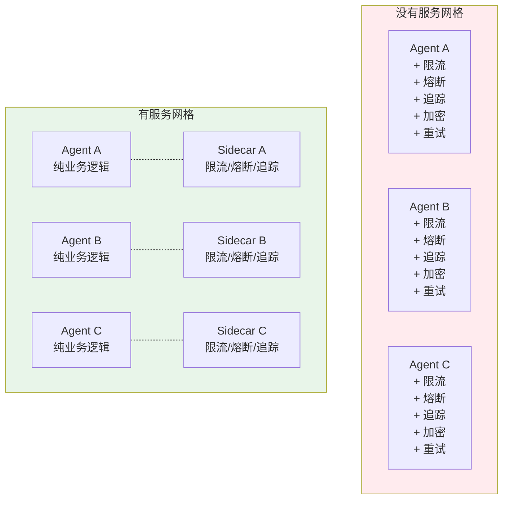
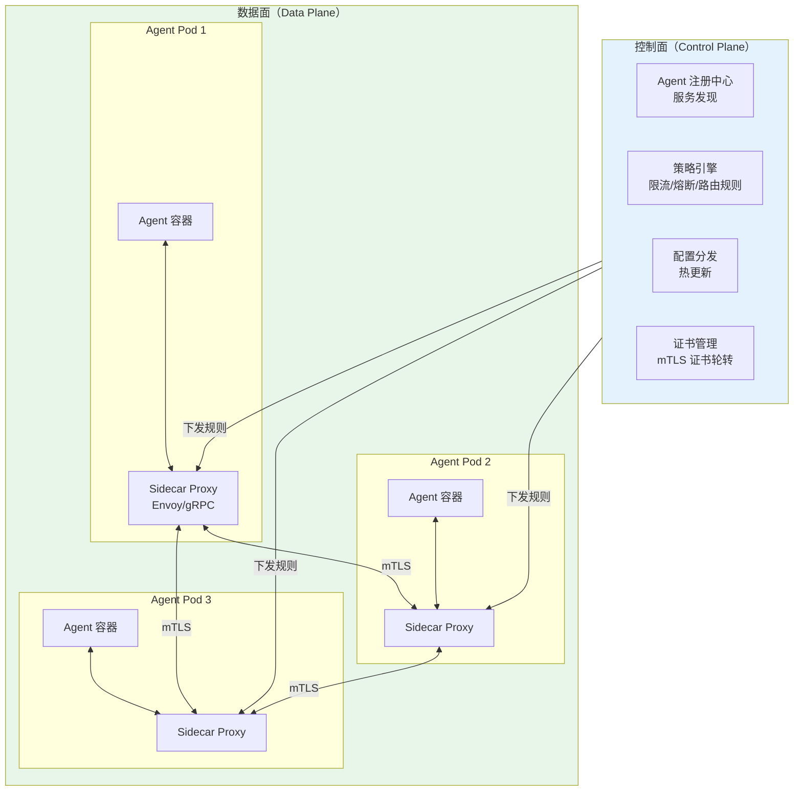
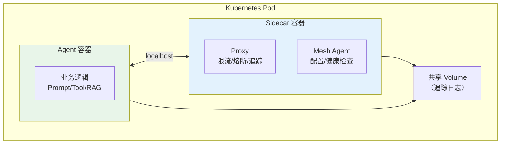
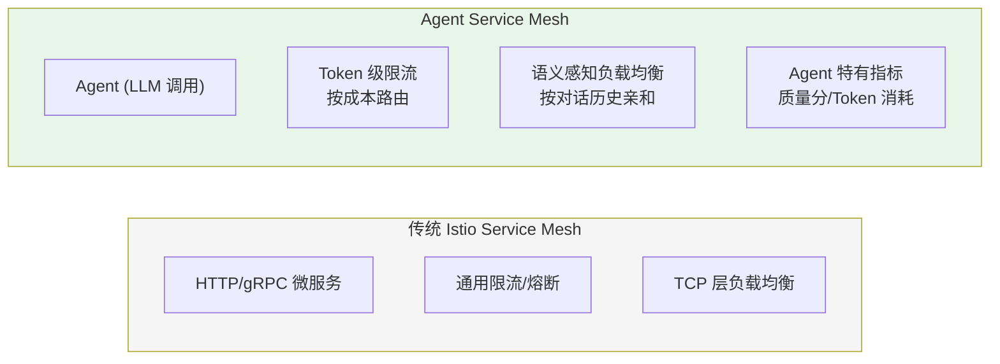

# Agent 服务网格与 Sidecar 模式

> **一句话**：100 个 Agent 互相调用，限流/熔断/追踪/加密全写在每个 Agent 里——用 Sidecar 把这些横切关注点剥离出来。

---

## 为什么 Agent 需要服务网格？



**核心价值**：Agent 只关心业务逻辑（Prompt/工具/RAG），所有基础设施（限流/熔断/追踪/加密/重试/负载均衡）由 Sidecar 统一处理。

---

## Agent 服务网格架构



---

## 核心实现

### 1. Agent Sidecar Proxy

```java
package com.enterprise.mesh;

import org.springframework.stereotype.Component;
import java.util.*;
import java.util.concurrent.*;

/**
 * Agent Sidecar Proxy
 *
 * 作为 Agent 和外部世界之间的中间层：
 * - 入站：限流、认证、追踪
 * - 出站：负载均衡、熔断、重试、加密
 */
@Component
public class AgentSidecar {

    // 入站限流器
    private final RateLimiter inboundLimiter;
    // 出站熔断器
    private final Map<String, CircuitBreaker> circuitBreakers = new ConcurrentHashMap<>();
    // 负载均衡器
    private final Map<String, LoadBalancer> balancers = new ConcurrentHashMap<>();
    // 追踪器
    private final TraceCollector tracer;

    /**
     * 入站请求处理
     */
    public InboundResult handleInbound(InboundRequest request) {
        // 1. 认证
        if (!authenticate(request)) {
            return InboundResult.reject(401, "认证失败");
        }

        // 2. 限流
        if (!inboundLimiter.tryAcquire(request.tenantId())) {
            return InboundResult.reject(429, "限流：请求过于频繁");
        }

        // 3. 追踪
        TraceSpan span = tracer.startSpan("agent.inbound", request);

        // 4. 转发到 Agent 容器
        try {
            AgentResponse response = forwardToAgent(request);
            span.finish(response);
            return InboundResult.success(response);
        } catch (Exception e) {
            span.finishWithError(e);
            return InboundResult.error(e);
        }
    }

    /**
     * 出站请求处理（Agent → 外部服务/其他 Agent）
     */
    public OutboundResult handleOutbound(OutboundRequest request) {
        String target = request.targetService();

        // 1. 熔断检查
        CircuitBreaker cb = circuitBreakers.computeIfAbsent(
            target, k -> new CircuitBreaker(cbConfig));
        if (!cb.allowRequest()) {
            return OutboundResult.circuitOpen(target);
        }

        // 2. 负载均衡选择目标实例
        LoadBalancer lb = balancers.computeIfAbsent(
            target, k -> new RoundRobinBalancer());
        String targetInstance = lb.select();

        // 3. 追踪
        TraceSpan span = tracer.startSpan("agent.outbound." + target, request);

        // 4. 发送请求（带重试）
        try {
            OutboundResponse response = sendWithRetry(
                targetInstance, request, request.maxRetries());
            cb.recordSuccess();
            span.finish(response);
            return OutboundResult.success(response);
        } catch (Exception e) {
            cb.recordFailure();
            span.finishWithError(e);
            return OutboundResult.error(e);
        }
    }

    /**
     * 带重试的请求发送
     */
    private OutboundResponse sendWithRetry(
            String target, OutboundRequest request, int maxRetries) {
        Exception lastError = null;
        for (int i = 0; i <= maxRetries; i++) {
            try {
                return httpClient.send(target, request);
            } catch (RetryableException e) {
                lastError = e;
                // 指数退避
                sleep(calculateBackoff(i, request.backoffBaseMs()));
            }
        }
        throw new RuntimeException("重试耗尽", lastError);
    }

    private long calculateBackoff(int attempt, long baseMs) {
        return baseMs * (long) Math.pow(2, attempt);
    }

    private void sleep(long ms) {
        try { Thread.sleep(ms); } catch (InterruptedException ignored) {}
    }

    // --- Types ---

    public record InboundRequest(
        String tenantId, String userId,
        String agentName, String payload,
        Map<String, String> headers
    ) {}

    public record InboundResult(
        boolean success, boolean rejected,
        int statusCode, String reason,
        AgentResponse response
    ) {
        static InboundResult success(AgentResponse resp) {
            return new InboundResult(true, false, 200, null, resp);
        }
        static InboundResult reject(int code, String reason) {
            return new InboundResult(false, true, code, reason, null);
        }
        static InboundResult error(Exception e) {
            return new InboundResult(false, false, 500, e.getMessage(), null);
        }
    }

    public record OutboundRequest(
        String targetService, String payload,
        int maxRetries, long backoffBaseMs,
        Map<String, String> headers
    ) {}
}
```

### 2. Agent 服务注册中心

```java
package com.enterprise.mesh;

import org.springframework.stereotype.Component;
import java.util.*;
import java.util.concurrent.*;

/**
 * Agent 服务注册中心
 *
 * Agent 启动时注册自己，关闭时注销
 * Sidecar 通过注册中心发现目标 Agent 实例
 */
@Component
public class AgentServiceRegistry {

    // serviceName -> 实例列表
    private final Map<String, Set<AgentInstance>> registry = new ConcurrentHashMap<>();
    // 健康检查结果
    private final Map<String, HealthStatus> healthStatus = new ConcurrentHashMap<>();

    /**
     * 注册 Agent 实例
     */
    public void register(AgentInstance instance) {
        registry.computeIfAbsent(instance.serviceName(), k -> ConcurrentHashMap.newKeySet())
                .add(instance);
        healthStatus.put(instance.id(), HealthStatus.HEALTHY);
    }

    /**
     * 注销
     */
    public void deregister(String instanceId) {
        registry.values().forEach(instances ->
            instances.removeIf(i -> i.id().equals(instanceId)));
        healthStatus.remove(instanceId);
    }

    /**
     * 发现健康实例
     */
    public List<AgentInstance> discover(String serviceName) {
        return registry.getOrDefault(serviceName, Set.of()).stream()
            .filter(i -> healthStatus.get(i.id()) == HealthStatus.HEALTHY)
            .toList();
    }

    /**
     * 健康检查（定时执行）
     */
    public void healthCheck() {
        for (Set<AgentInstance> instances : registry.values()) {
            for (AgentInstance instance : instances) {
                boolean healthy = ping(instance);
                healthStatus.put(instance.id(),
                    healthy ? HealthStatus.HEALTHY : HealthStatus.UNHEALTHY);

                // 连续 3 次不健康 → 自动注销
                if (!healthy) {
                    int failures = failureCount.merge(instance.id(), 1, Integer::sum);
                    if (failures >= 3) {
                        deregister(instance.id());
                    }
                } else {
                    failureCount.remove(instance.id());
                }
            }
        }
    }

    private final Map<String, Integer> failureCount = new ConcurrentHashMap<>();

    private boolean ping(AgentInstance instance) {
        try {
            return httpClient.healthCheck(instance.healthCheckUrl(), 2000);
        } catch (Exception e) {
            return false;
        }
    }

    public record AgentInstance(
        String id, String serviceName,
        String host, int port,
        String healthCheckUrl,
        Map<String, String> metadata
    ) {}

    public enum HealthStatus { HEALTHY, UNHEALTHY, DRAINING }
}
```

---

## Sidecar 部署模式



---

## Agent Mesh vs 传统 Istio Mesh



| 维度 | 传统 Service Mesh | Agent Service Mesh |
|------|------------------|-------------------|
| 限流维度 | QPS | QPS + TPM (Token/分钟) |
| 负载均衡 | 轮询/加权 | 会话亲和 + 模型亲和 |
| 熔断指标 | 5xx 率 + 延迟 | + 质量退化 + 成本飙升 |
| 路由策略 | URL/Header | + 任务类型 + 模型能力 |
| 追踪内容 | HTTP 请求/响应 | + Prompt + Token + 决策链 |

→ 返回 [阶段5 目录](../00-README.md)
