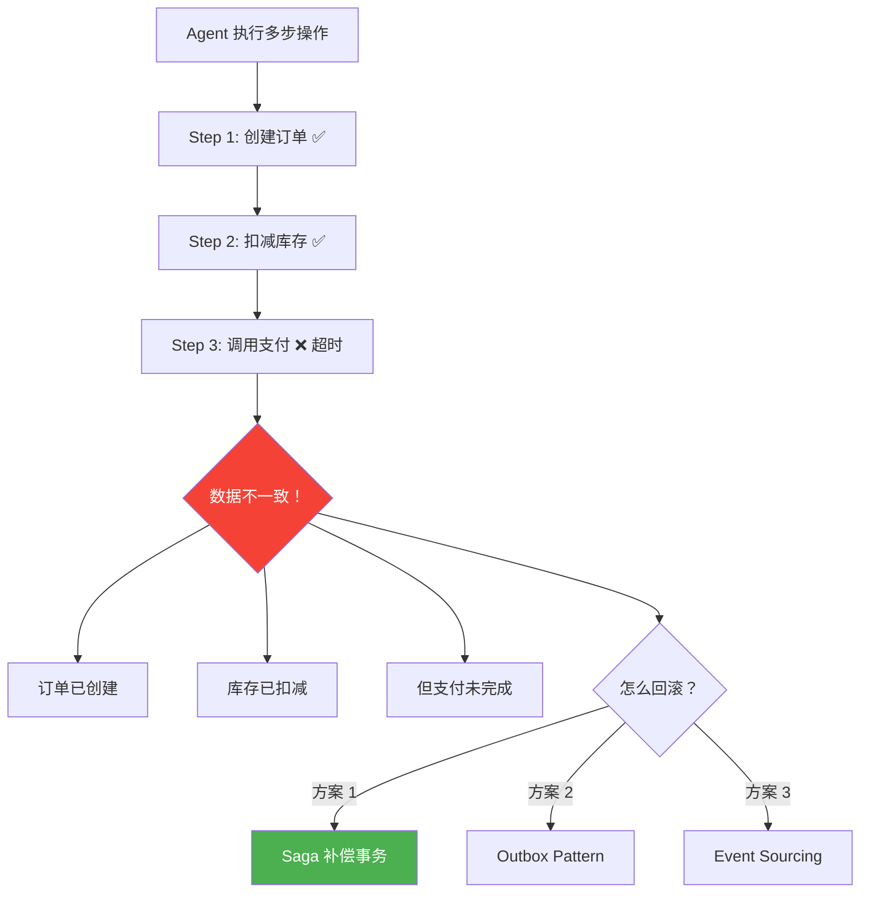
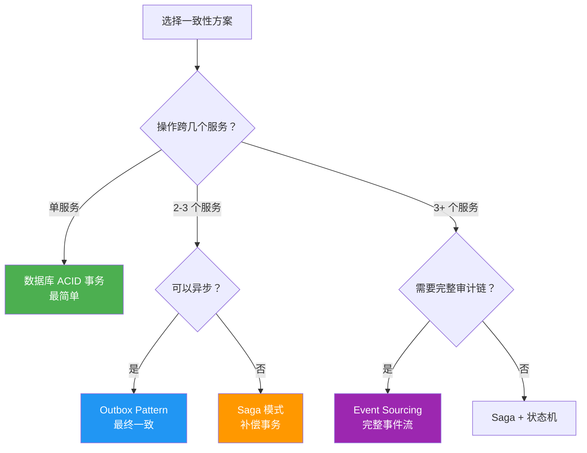
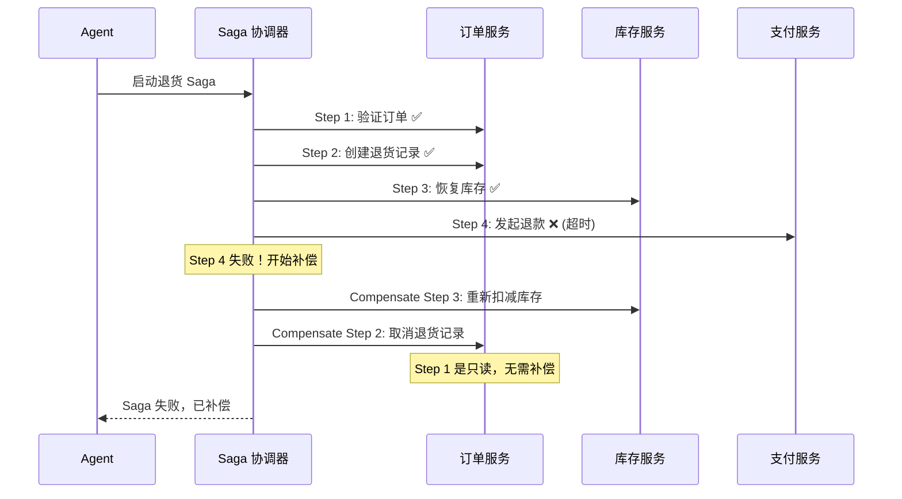

# Agent 数据一致性架构

> **一句话**：Agent 的"非确定性" + 多步骤操作 = 数据一致性噩梦——一步成功一步失败，数据就脏了。

---

## 问题场景



---

## 三种数据一致性方案对比



| 方案 | 一致性 | 复杂度 | 性能 | 适用场景 |
|------|--------|--------|------|---------|
| ACID 事务 | 强一致 | ⭐ | 快 | 单服务操作 |
| Outbox | 最终一致 | ⭐⭐ | 快 | 异步通知 |
| Saga | 最终一致 | ⭐⭐⭐ | 中 | 多服务编排 |
| Event Sourcing | 最终一致 | ⭐⭐⭐⭐ | 慢 | 审计/回溯 |

---

## 核心实现

### 1. Saga 协调器（Agent 专用）

```java
package com.enterprise.consistency;

import org.springframework.stereotype.Component;
import java.util.*;

/**
 * Agent Saga 协调器
 *
 * Agent 多步操作的补偿事务管理
 *
 * 原理：
 * - 每步操作都注册对应的补偿操作
 * - 任何一步失败 → 按逆序执行所有已成功步骤的补偿
 * - 补偿操作本身也要幂等（可能被执行多次）
 */
@Component
public class AgentSagaCoordinator {

    /**
     * 执行 Saga
     */
    public SagaResult execute(SagaDefinition saga, SagaContext context) {
        List<CompletedStep> completedSteps = new ArrayList<>();

        for (SagaStep step : saga.steps()) {
            try {
                // 执行正向操作
                StepResult result = step.action().execute(context);
                completedSteps.add(new CompletedStep(step, result));
                context.setStepResult(step.name(), result);

            } catch (Exception e) {
                // 执行补偿（逆序）
                compensate(completedSteps, context, e);
                return SagaResult.failed(step.name(), e);
            }
        }

        return SagaResult.success(context);
    }

    /**
     * 补偿：逆序执行
     */
    private void compensate(List<CompletedStep> completedSteps,
                            SagaContext context, Exception failure) {
        // 逆序遍历
        for (int i = completedSteps.size() - 1; i >= 0; i--) {
            CompletedStep completed = completedSteps.get(i);
            SagaStep step = completed.step();

            try {
                step.compensation().execute(context);
            } catch (Exception compensationError) {
                // 补偿也失败了！
                // 记录日志，通知人工处理
                alertService.notifyCompensationFailure(
                    step.name(), compensationError, failure);
            }
        }
    }

    // --- Types ---

    public record SagaDefinition(String name, List<SagaStep> steps) {}

    public interface SagaStep {
        String name();
        SagaAction action();         // 正向操作
        SagaAction compensation();   // 补偿操作
    }

    public interface SagaAction {
        StepResult execute(SagaContext context) throws Exception;
    }

    public record StepResult(boolean success, Map<String, Object> data) {}

    public record CompletedStep(SagaStep step, StepResult result) {}

    public record SagaResult(
        boolean success, boolean compensated,
        String failedStep, Exception error,
        SagaContext context
    ) {
        static SagaResult success(SagaContext ctx) {
            return new SagaResult(true, false, null, null, ctx);
        }
        static SagaResult failed(String step, Exception e) {
            return new SagaResult(false, true, step, e, null);
        }
    }

    public static class SagaContext {
        private final Map<String, Object> data = new HashMap<>();
        private final Map<String, StepResult> stepResults = new HashMap<>();

        public void put(String key, Object value) { data.put(key, value); }
        public Object get(String key) { return data.get(key); }
        public void setStepResult(String step, StepResult result) { stepResults.put(step, result); }
        public StepResult getStepResult(String step) { return stepResults.get(step); }
    }
}
```

### 2. Agent Saga 示例：退货流程

```java
package com.enterprise.consistency;

import org.springframework.stereotype.Component;

/**
 * 退货流程 Saga
 *
 * 5 步操作，每步都有补偿
 */
@Component
public class RefundSaga {

    public AgentSagaCoordinator.SagaDefinition build() {
        return new AgentSagaCoordinator.SagaDefinition(
            "refund-saga",
            List.of(
                // Step 1: 验证订单
                createStep("verify-order",
                    ctx -> {     // action
                        String orderId = (String) ctx.get("orderId");
                        boolean valid = orderService.verify(orderId);
                        if (!valid) throw new RuntimeException("订单无效");
                        return new StepResult(true, Map.of("verified", true));
                    },
                    ctx -> {     // compensation：无需操作（只读）
                        return new StepResult(true, Map.of());
                    }
                ),

                // Step 2: 创建退货记录
                createStep("create-refund",
                    ctx -> {
                        String orderId = (String) ctx.get("orderId");
                        String refundId = refundService.create(orderId);
                        ctx.put("refundId", refundId);
                        return new StepResult(true, Map.of("refundId", refundId));
                    },
                    ctx -> {     // compensation：删除退货记录
                        String refundId = (String) ctx.get("refundId");
                        refundService.cancel(refundId);
                        return new StepResult(true, Map.of());
                    }
                ),

                // Step 3: 恢复库存
                createStep("restore-inventory",
                    ctx -> {
                        String orderId = (String) ctx.get("orderId");
                        inventoryService.restore(orderId);
                        return new StepResult(true, Map.of());
                    },
                    ctx -> {     // compensation：重新扣减
                        String orderId = (String) ctx.get("orderId");
                        inventoryService.deduct(orderId);
                        return new StepResult(true, Map.of());
                    }
                ),

                // Step 4: 发起退款
                createStep("process-refund",
                    ctx -> {
                        String refundId = (String) ctx.get("refundId");
                        String txnId = paymentService.refund(refundId);
                        ctx.put("txnId", txnId);
                        return new StepResult(true, Map.of("txnId", txnId));
                    },
                    ctx -> {     // compensation：取消退款
                        String txnId = (String) ctx.get("txnId");
                        paymentService.cancelRefund(txnId);
                        return new StepResult(true, Map.of());
                    }
                ),

                // Step 5: 发送通知
                createStep("notify",
                    ctx -> {
                        String orderId = (String) ctx.get("orderId");
                        notificationService.sendRefundNotification(orderId);
                        return new StepResult(true, Map.of());
                    },
                    ctx -> {     // compensation：通知取消（无需真正撤回）
                        // 通知已经发出，无法撤回
                        // 但可以发一条"退货已取消"的通知
                        notificationService.sendCancellationNotice(
                            (String) ctx.get("orderId"));
                        return new StepResult(true, Map.of());
                    }
                )
            )
        );
    }

    private AgentSagaCoordinator.SagaStep createStep(
            String name,
            AgentSagaCoordinator.SagaAction action,
            AgentSagaCoordinator.SagaAction compensation) {
        return new AgentSagaCoordinator.SagaStep() {
            @Override public String name() { return name; }
            @Override public AgentSagaCoordinator.SagaAction action() { return action; }
            @Override public AgentSagaCoordinator.SagaAction compensation() { return compensation; }
        };
    }
}
```

### 3. Outbox Pattern 实现

```java
package com.enterprise.consistency;

import org.springframework.stereotype.Component;
import java.util.*;

/**
 * Outbox Pattern
 *
 * 问题：Agent 写数据库 + 发消息 = 两步操作，可能不一致
 * 解决：只写数据库（一个事务），后台轮询发送消息
 */
@Component
public class OutboxPublisher {

    /**
     * Agent 操作时：写业务数据 + 写 Outbox（同一事务）
     */
    public void executeWithOutbox(AgentAction action, OutboxMessage message) {
        transactionTemplate.execute(status -> {
            // 1. 执行业务操作
            action.execute();
            // 2. 写 Outbox 表（同一事务）
            outboxRepository.save(message);
            return null;
        });
        // 事务提交后，后台 Worker 会读取 Outbox 并发送
    }

    /**
     * 后台 Worker：轮询 Outbox 发送消息
     */
    public void pollAndPublish() {
        List<OutboxMessage> pending = outboxRepository.findPending(100);
        for (OutboxMessage msg : pending) {
            try {
                messageBroker.send(msg.topic(), msg.payload());
                outboxRepository.markAsSent(msg.id());
            } catch (Exception e) {
                outboxRepository.incrementRetryCount(msg.id());
                if (msg.retryCount() >= 5) {
                    outboxRepository.markAsDead(msg.id());
                    alertService.notify("Outbox 死信: " + msg.id());
                }
            }
        }
    }

    public record OutboxMessage(
        String id, String topic, String payload,
        OutboxStatus status, int retryCount,
        Instant createdAt, Instant sentAt
    ) {}

    public enum OutboxStatus { PENDING, SENT, DEAD }
}
```

---

## Saga 补偿执行流程



---

## 补偿操作设计原则

```mermaid
flowchart TD
    P1["原则 1: 幂等性<br/>补偿操作可以被执行多次<br/>结果必须一致"]
    P2["原则 2: 语义补偿<br/>不是"撤销"<br/>而是"反向操作"<br/>（发邮件 → 发取消邮件）"]
    P3["原则 3: 可观测<br/>每步补偿有完整日志<br/>补偿失败能告警"]
    P4["原则 4: 人工兜底<br/>补偿也失败时<br/>通知人工处理"]

    style P1 fill:#4caf50,color:#fff
    style P2 fill:#2196f3,color:#fff
    style P3 fill:#ff9800,color:#fff
    style P4 fill:#f44336,color:#fff
```

→ 返回 [阶段5 目录](../00-README.md)
