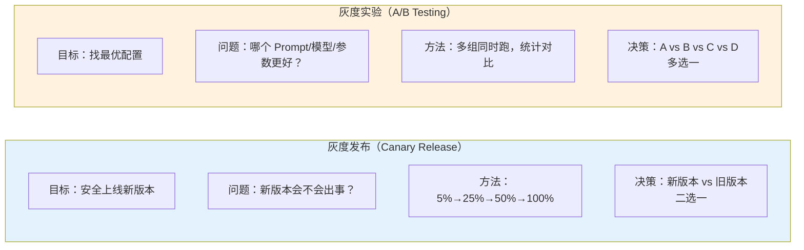
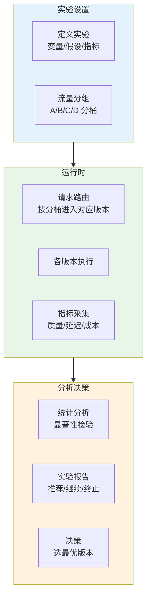
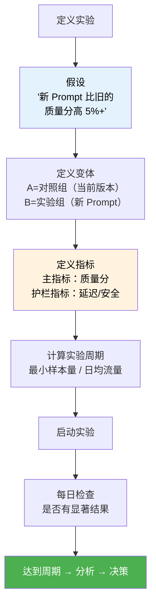

# Agent 灰度实验平台设计

> **一句话**：灰度发布是"安全地推出新版本"，灰度实验是"科学地验证哪个版本更好"——两者不同。

---

## 灰度发布 vs 灰度实验



| 维度 | 灰度发布 | 灰度实验 |
|------|---------|---------|
| 目标 | 安全上线 | 找最优解 |
| 版本数 | 2（新 vs 旧） | 多个并行 |
| 决策方式 | 无回退即成功 | 统计显著性 |
| 运行周期 | 天级 | 周-月级 |
| 样本量 | 全量 | 分组采样 |

---

## 实验平台架构



---

## 核心实现

### 1. 实验管理器

```java
package com.enterprise.experiment;

import org.springframework.stereotype.Component;
import java.util.*;

/**
 * 实验管理器
 *
 * 管理 A/B/N 测试的完整生命周期：
 * 创建 → 运行 → 分析 → 决策
 */
@Component
public class ExperimentManager {

    private final Map<String, Experiment> experiments = new ConcurrentHashMap<>();

    /**
     * 创建实验
     */
    public Experiment create(ExperimentConfig config) {
        String expId = UUID.randomUUID().toString();

        // 验证配置
        validateConfig(config);

        // 创建实验
        Experiment exp = new Experiment(
            expId,
            config.name(),
            config.description(),
            config.variants(),
            config.metrics(),
            config.trafficAllocation(),
            ExperimentStatus.RUNNING,
            Instant.now(),
            null
        );

        experiments.put(expId, exp);
        return exp;
    }

    /**
     * 路由请求到对应变体
     */
    public Variant assignVariant(String experimentId, String userId) {
        Experiment exp = experiments.get(experimentId);
        if (exp == null || exp.status() != ExperimentStatus.RUNNING) {
            return exp.variants().get(0);  // 默认变体
        }

        // 一致性分桶：同一用户始终进入同一变体
        int hash = Math.abs(userId.hashCode()) % 100;

        int cumulative = 0;
        for (Variant variant : exp.variants()) {
            cumulative += variant.trafficPercentage();
            if (hash < cumulative) {
                return variant;
            }
        }

        return exp.variants().get(0);  // 兜底
    }

    /**
     * 记录实验指标
     */
    public void record(String experimentId, String variantId,
                       String userId, Map<String, Double> metrics) {
        metricsCollector.record(experimentId, variantId, userId, metrics);
    }

    /**
     * 分析实验结果
     */
    public ExperimentReport analyze(String experimentId) {
        Experiment exp = experiments.get(experimentId);
        if (exp == null) throw new IllegalArgumentException("实验不存在");

        // 收集各变体指标
        Map<String, VariantStats> stats = new HashMap<>();
        for (Variant variant : exp.variants()) {
            stats.put(variant.id(),
                metricsCollector.aggregate(experimentId, variant.id()));
        }

        // 统计显著性检验
        Map<String, SignificanceResult> significance = new HashMap<>();
        Variant control = exp.variants().get(0);  // 对照组
        VariantStats controlStats = stats.get(control.id());

        for (int i = 1; i < exp.variants().size(); i++) {
            Variant treatment = exp.variants().get(i);
            VariantStats treatmentStats = stats.get(treatment.id());

            for (String metric : exp.metrics()) {
                significance.put(
                    treatment.id() + ":" + metric,
                    tTest(controlStats.get(metric), treatmentStats.get(metric))
                );
            }
        }

        // 生成推荐
        Recommendation recommendation = recommend(exp, stats, significance);

        return new ExperimentReport(exp, stats, significance, recommendation);
    }

    /**
     * T-Test 简化版
     */
    private SignificanceResult tTest(
            MetricStats control, MetricStats treatment) {
        if (control.sampleSize() < 30 || treatment.sampleSize() < 30) {
            return new SignificanceResult(false, 0, "样本不足（< 30）");
        }

        double pooledStd = Math.sqrt(
            (control.variance() / control.sampleSize()
           + treatment.variance() / treatment.sampleSize())
        );

        if (pooledStd == 0) {
            return new SignificanceResult(false, 0, "方差为零");
        }

        double tScore = (treatment.mean() - control.mean()) / pooledStd;
        boolean significant = Math.abs(tScore) > 1.96;  // p < 0.05
        double lift = (treatment.mean() - control.mean()) / control.mean();

        return new SignificanceResult(significant, lift,
            String.format("t=%.2f, lift=%.1f%%", tScore, lift * 100));
    }

    private Recommendation recommend(Experiment exp,
            Map<String, VariantStats> stats,
            Map<String, SignificanceResult> sig) {
        // 找质量分显著提升的变体
        String bestVariant = null;
        double bestLift = 0;

        for (Variant v : exp.variants()) {
            if (v.isControl()) continue;
            SignificanceResult s = sig.get(v.id() + ":quality_score");
            if (s != null && s.significant() && s.lift() > bestLift) {
                bestLift = s.lift();
                bestVariant = v.id();
            }
        }

        if (bestVariant != null) {
            return new Recommendation(
                RecommendationType.PROMOTE, bestVariant,
                String.format("质量分提升 %.1f%%，建议全量", bestLift * 100));
        } else {
            return new Recommendation(
                RecommendationType.CONTINUE, null,
                "尚无显著差异，继续实验");
        }
    }

    private void validateConfig(ExperimentConfig config) {
        int totalTraffic = config.variants().stream()
            .mapToInt(Variant::trafficPercentage).sum();
        if (totalTraffic != 100) {
            throw new IllegalArgumentException(
                "流量分配总和必须等于 100，当前: " + totalTraffic);
        }
    }

    // --- Types ---

    public record ExperimentConfig(
        String name, String description,
        List<Variant> variants,
        List<String> metrics,       // quality_score, latency, cost
        TrafficAllocation trafficAllocation
    ) {}

    public record Variant(
        String id, String name,
        int trafficPercentage,
        Map<String, Object> config,  // prompt, model, temperature 等
        boolean isControl
    ) {}

    public record Experiment(
        String id, String name, String description,
        List<Variant> variants,
        List<String> metrics,
        TrafficAllocation trafficAllocation,
        ExperimentStatus status,
        Instant startedAt, Instant endedAt
    ) {}

    public record TrafficAllocation(
        int totalPercentage,  // 占总流量的百分比
        String targetingRule  // 目标用户条件
    ) {}

    public record VariantStats(Map<String, MetricStats> metrics, int sampleSize) {
        public MetricStats get(String metric) { return metrics.get(metric); }
    }

    public record MetricStats(double mean, double variance, int sampleSize) {}

    public record SignificanceResult(
        boolean significant, double lift, String detail
    ) {}

    public record Recommendation(
        RecommendationType type, String variantId, String reason
    ) {}

    public enum RecommendationType { PROMOTE, CONTINUE, TERMINATE }
    public enum ExperimentStatus { RUNNING, COMPLETED, TERMINATED }
}
```

---

## 实验设计模板



---

## 常见实验设计

| 实验类型 | 变体 | 主指标 | 周期 | 决策 |
|---------|------|--------|------|------|
| Prompt 对比 | A=旧 Prompt, B=新 Prompt | 质量分 | 1-2 周 | 质量分显著提升 → 全量 |
| 模型切换 | A=deepseek-chat, B=qwen-max | 质量分 + 成本 | 2 周 | 质量↑成本↓ → 全量 |
| 温度参数 | A=0.3, B=0.5, C=0.7 | 多样性 + 安全性 | 1 周 | 找最优平衡点 |
| 工具集对比 | A=3 个工具, B=5 个工具 | 任务完成率 | 2 周 | 完成率↑ → 全量 |
| RAG 策略 | A=向量, B=混合检索 | 检索精度 | 2 周 | 精度↑ → 全量 |

→ 返回 [阶段5 目录](../00-README.md)
