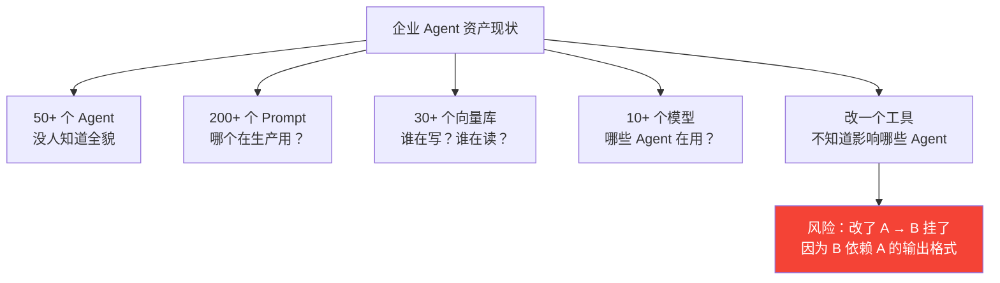
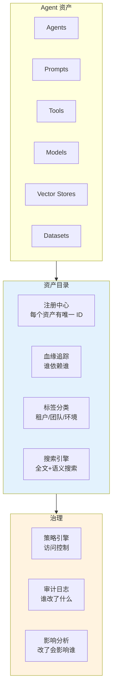
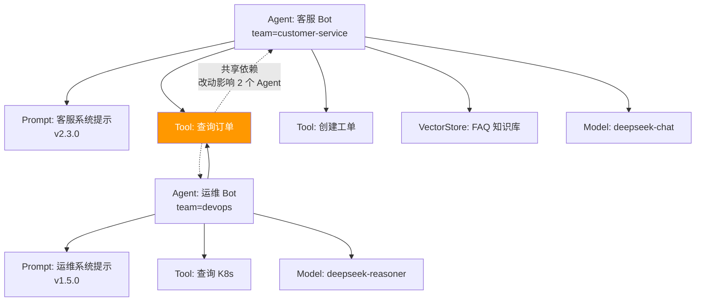
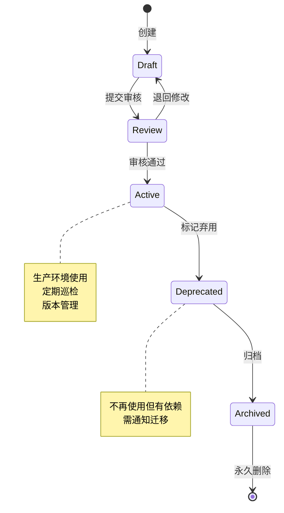

# Agent 元数据治理与资产目录

> **一句话**：企业有 50 个 Agent、200 个 Prompt、30 个向量库——没人知道哪个调哪个，改一个影响谁——元数据治理解决这个问题。

---

## Agent 资产混乱场景



---

## 元数据目录架构



---

## 核心实现

### 1. 资产注册中心

```java
package com.enterprise.catalog;

import org.springframework.stereotype.Component;
import java.util.*;

/**
 * Agent 资产注册中心
 *
 * 所有 Agent 相关资产（Agent/Prompt/Tool/Model/VectorStore/Dataset）
 * 统一注册，建立唯一 ID 和元数据
 */
@Component
public class AssetRegistry {

    // assetType -> assetId -> Asset
    private final Map<AssetType, Map<String, Asset>> registry = new ConcurrentHashMap<>();

    /**
     * 注册资产
     */
    public Asset register(Asset asset) {
        registry.computeIfAbsent(asset.type(), k -> new ConcurrentHashMap<>())
                .put(asset.id(), asset);
        return asset;
    }

    /**
     * 获取资产
     */
    public Asset get(AssetType type, String id) {
        return registry.getOrDefault(type, Map.of()).get(id);
    }

    /**
     * 搜索资产
     */
    public List<Asset> search(AssetQuery query) {
        return registry.values().stream()
            .flatMap(m -> m.values().stream())
            .filter(a -> matches(a, query))
            .toList();
    }

    private boolean matches(Asset asset, AssetQuery query) {
        if (query.type() != null && asset.type() != query.type()) return false;
        if (query.team() != null && !asset.team().equals(query.team())) return false;
        if (query.environment() != null && !asset.environment().equals(query.environment())) return false;
        if (query.tags() != null) {
            for (String tag : query.tags()) {
                if (!asset.tags().contains(tag)) return false;
            }
        }
        return true;
    }

    // --- Types ---

    public record Asset(
        String id,
        AssetType type,
        String name,
        String description,
        String team,
        String environment,
        Set<String> tags,
        String ownerId,
        Instant createdAt,
        Instant updatedAt,
        Map<String, Object> metadata
    ) {}

    public enum AssetType {
        AGENT, PROMPT, TOOL, MODEL, VECTOR_STORE, DATASET, EVAL_SET
    }

    public record AssetQuery(
        AssetType type,
        String team,
        String environment,
        Set<String> tags
    ) {}
}
```

### 2. 血缘追踪器

```java
package com.enterprise.catalog;

import org.springframework.stereotype.Component;
import java.util.*;

/**
 * 资产血缘追踪器
 *
 * 记录资产之间的依赖关系：
 * Agent A → uses → Prompt P1
 * Agent A → calls → Tool T1
 * Agent A → searches → VectorStore V1
 *
 * 核心功能：影响分析
 * "如果改了 T1，哪些 Agent 会受影响？"
 */
@Component
public class LineageTracker {

    // 依赖关系图
    // source asset -> set of (target asset, dependency type)
    private final Map<String, Set<Dependency>> dependencies = new ConcurrentHashMap<>();
    // 反向索引：target -> sources（用于影响分析）
    private final Map<String, Set<String>> reverseIndex = new ConcurrentHashMap<>();

    /**
     * 记录依赖关系
     */
    public void addDependency(String sourceId, String targetId, DependencyType type) {
        dependencies.computeIfAbsent(sourceId, k -> ConcurrentHashMap.newKeySet())
                    .add(new Dependency(targetId, type));
        reverseIndex.computeIfAbsent(targetId, k -> ConcurrentHashMap.newKeySet())
                     .add(sourceId);
    }

    /**
     * 影响分析：改了某个资产，哪些资产会受影响？
     */
    public ImpactAnalysis analyzeImpact(String assetId) {
        Set<String> directlyImpacted = reverseIndex.getOrDefault(assetId, Set.of());
        Set<String> allImpacted = new HashSet<>();
        Set<String> visited = new HashSet<>();

        // BFS 遍历反向依赖链
        Queue<String> queue = new LinkedList<>(directlyImpacted);
        while (!queue.isEmpty()) {
            String current = queue.poll();
            if (visited.contains(current)) continue;
            visited.add(current);
            allImpacted.add(current);

            Set<String> upstream = reverseIndex.getOrDefault(current, Set.of());
            queue.addAll(upstream);
        }

        return new ImpactAnalysis(
            assetId,
            directlyImpacted.size(),
            allImpacted,
            allImpacted.size()
        );
    }

    /**
     * 获取资产的完整依赖树
     */
    public DependencyTree getDependencyTree(String assetId) {
        return buildTree(assetId, new HashSet<>(), 0, 5);  // 最大深度 5
    }

    private DependencyTree buildTree(String assetId, Set<String> visited,
                                      int depth, int maxDepth) {
        if (depth >= maxDepth || visited.contains(assetId)) {
            return new DependencyTree(assetId, List.of(), depth, true);
        }
        visited.add(assetId);

        Set<Dependency> deps = dependencies.getOrDefault(assetId, Set.of());
        List<DependencyTree> children = new ArrayList<>();

        for (Dependency dep : deps) {
            children.add(buildTree(dep.targetId(), new HashSet<>(visited),
                                   depth + 1, maxDepth));
        }

        return new DependencyTree(assetId, children, depth, false);
    }

    // --- Types ---

    public record Dependency(String targetId, DependencyType type) {}

    public enum DependencyType {
        USES_PROMPT,    // Agent 使用某个 Prompt
        CALLS_TOOL,     // Agent 调用某个工具
        SEARCHES_KB,    // Agent 搜索某个向量库
        USES_MODEL,     // Agent/Prompt 使用某个模型
        EVALUATED_BY,   // Agent 被某个评估集评估
        DEPENDS_ON      // 通用依赖
    }

    public record ImpactAnalysis(
        String changedAsset,
        int directlyImpactedCount,
        Set<String> allImpactedAssets,
        int totalImpactedCount
    ) {}

    public record DependencyTree(
        String assetId,
        List<DependencyTree> children,
        int depth,
        boolean isCircular
    ) {}
}
```

### 3. 资产变更通知

```java
package com.enterprise.catalog;

import org.springframework.stereotype.Component;
import java.util.*;

/**
 * 资产变更通知
 *
 * 当资产变更时，自动通知所有依赖方
 */
@Component
public class AssetChangeNotifier {

    private final LineageTracker lineageTracker;
    private final NotificationService notificationService;

    /**
     * 资产变更时触发
     */
    public void onAssetChanged(String assetId, ChangeType changeType,
                                String changedBy, String description) {
        // 1. 影响分析
        LineageTracker.ImpactAnalysis impact =
            lineageTracker.analyzeImpact(assetId);

        // 2. 通知直接依赖方
        for (String impactedId : impact.allImpactedAssets()) {
            Asset owner = assetRegistry.get(impactedId);
            if (owner != null) {
                notificationService.send(
                    owner.ownerId(),
                    "资产变更通知",
                    String.format(
                        "您负责的资产 [%s] 依赖的 [%s] 被 %s 修改。\n" +
                        "变更类型: %s\n" +
                        "变更说明: %s\n" +
                        "影响范围: %d 个资产\n" +
                        "请验证是否受影响。",
                        owner.name(), assetId, changedBy,
                        changeType, description,
                        impact.totalImpactedCount()
                    )
                );
            }
        }

        // 3. 记录审计日志
        auditLog.recordAssetChange(assetId, changeType, changedBy,
                                    description, impact);
    }

    public enum ChangeType {
        CREATED, MODIFIED, DEPRECATED, DELETED, VERSION_CHANGED
    }
}
```

---

## 资产目录可视化



---

## 资产生命周期管理



| 状态 | 含义 | 操作 |
|------|------|------|
| Draft | 创建中 | 只有作者可见 |
| Review | 审核中 | 等待审批 |
| Active | 生产使用 | 正常运行 |
| Deprecated | 已弃用 | 不建议使用，有迁移计划 |
| Archived | 已归档 | 只读，可删除 |

→ 返回 [阶段5 目录](../00-README.md)
