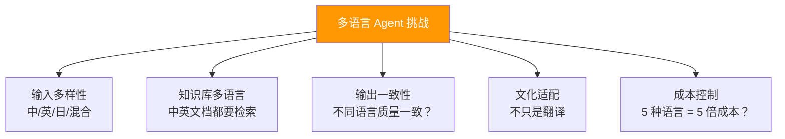
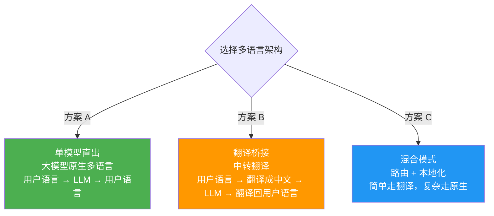
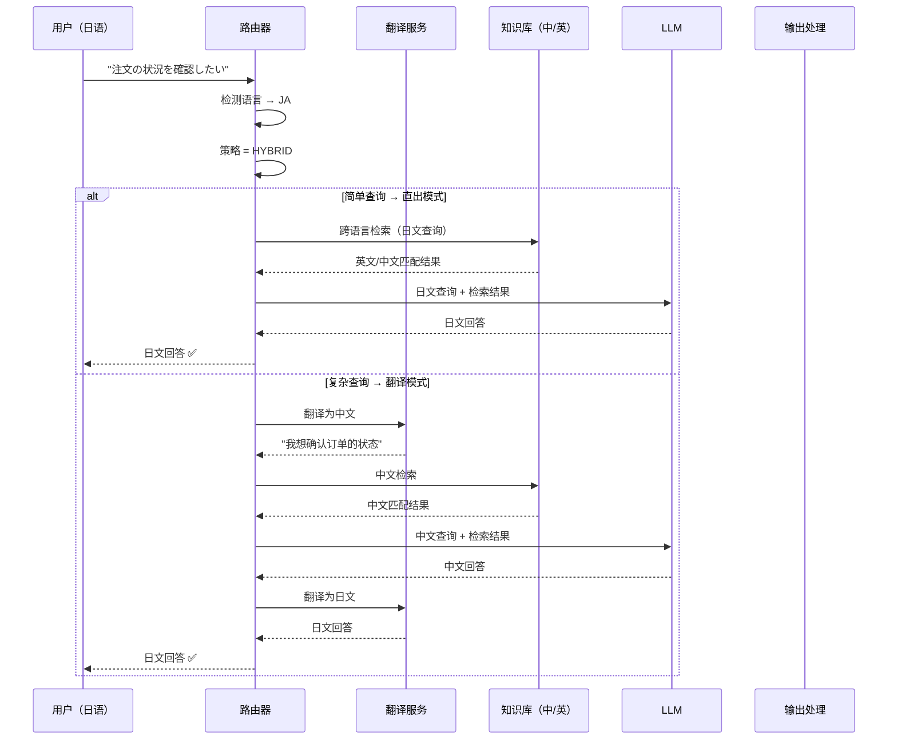

# Agent 国际化与多语言架构

> **一句话**：你的 Agent 只会说中文？当企业出海时——同一个 Agent 要服务中/英/日/西/法 5 种语言用户，架构怎么设计？

---

## 多语言挑战全景



---

## 三种多语言架构



| 方案 | 优点 | 缺点 | 适用场景 |
|------|------|------|---------|
| 单模型直出 | 简单/无延迟 | 少数语言效果差 | 大模型能力强 |
| 翻译桥接 | 支持所有语言 | 翻译可能丢义/2 倍延迟 | 小模型场景 |
| 混合模式 | 最佳效果 | 架构复杂 | 企业级生产 |

---

## 核心实现

### 1. 语言检测与路由

```java
package com.enterprise.i18n;

import org.springframework.stereotype.Component;
import java.util.*;

/**
 * 语言检测与路由器
 *
 * 检测用户输入语言 → 路由到对应处理链
 */
@Component
public class LanguageRouter {

    private final LanguageDetector detector;

    /**
     * 路由处理
     */
    public RoutingDecision route(String userInput, String sessionId) {
        // 1. 检测语言
        Language lang = detector.detect(userInput);

        // 2. 获取用户偏好语言（如有）
        Language preferred = getUserPreferredLanguage(sessionId);
        if (preferred != null) {
            lang = preferred;
        }

        // 3. 路由决策
        return switch (config.getStrategy()) {
            case DIRECT -> new RoutingDecision(
                ProcessingMode.DIRECT, lang, lang, null);

            case TRANSLATE -> {
                // 翻译为中文处理，输出时翻译回去
                String translated = translateService.translate(
                    userInput, lang, Language.ZH_CN);
                yield new RoutingDecision(
                    ProcessingMode.TRANSLATE, lang, Language.ZH_CN, translated);
            }

            case HYBRID -> {
                // 简单查询走直出，复杂推理走翻译
                if (isSimpleQuery(userInput)) {
                    yield new RoutingDecision(
                        ProcessingMode.DIRECT, lang, lang, null);
                } else {
                    String translated = translateService.translate(
                        userInput, lang, Language.ZH_CN);
                    yield new RoutingDecision(
                        ProcessingMode.TRANSLATE, lang, Language.ZH_CN, translated);
                }
            }
        };
    }

    private boolean isSimpleQuery(String input) {
        return input.length() < 100
            && !input.contains("?") || input.chars().filter(c -> c == '?').count() <= 1;
    }

    public record RoutingDecision(
        ProcessingMode mode,
        Language userLanguage,
        Language processingLanguage,
        String translatedInput
    ) {}

    public enum ProcessingMode { DIRECT, TRANSLATE }
}
```

### 2. 多语言知识库

```java
package com.enterprise.i18n;

import org.springframework.stereotype.Component;
import java.util.*;

/**
 * 多语言知识库管理
 *
 * 策略：
 * 1. 每种语言独立索引（最精确）
 * 2. 统一索引 + 语言标签（最简单）
 * 3. 跨语言检索（最灵活）
 */
@Component
public class MultilingualKnowledgeBase {

    /**
     * 策略 2：统一索引 + 语言标签
     *
     * 所有文档无论语言都 embedding 到同一个向量空间
     * 检索时带语言过滤器
     */
    public List<SearchResult> search(String query, Language userLang,
                                      int topK) {
        float[] queryVec = embeddingService.embed(query, "multilingual");

        return vectorStore.search(
            queryVec,
            topK,
            // 过滤条件：优先返回用户语言，但也包含英文
            filter -> filter
                .in("language", List.of(userLang.code(), "en"))
                .sortBy("language==" + userLang.code() ? 1 : 0, DESC)
        );
    }

    /**
     * 策略 3：跨语言检索
     *
     * 用多语言 Embedding 模型（如 LaBSE）
     * 中文查询可以匹配到英文文档
     */
    public List<SearchResult> crossLanguageSearch(
            String query, int topK) {
        // 用支持 100+ 语言的模型
        float[] queryVec = embeddingService.embed(query, "labse");

        return vectorStore.search(queryVec, topK, null);
    }

    public record SearchResult(String content, Language language, double score) {}
}
```

### 3. 多语言 Prompt 管理

```java
package com.enterprise.i18n;

import org.springframework.stereotype.Component;
import java.util.*;

/**
 * 多语言 Prompt 管理
 *
 * 同一个 Prompt 有多个语言版本
 * SystemPrompt 最好原生编写（而非翻译）
 */
@Component
public class MultilingualPromptManager {

    private final Map<String, Map<Language, String>> prompts = new HashMap<>();

    /**
     * 注册多语言 Prompt
     */
    public void register(String promptName, Language lang, String content) {
        prompts.computeIfAbsent(promptName, k -> new HashMap<>())
               .put(lang, content);
    }

    /**
     * 获取 Prompt
     *
     * 优先级：用户语言 > 英文 > 第一个可用
     */
    public String get(String promptName, Language preferred) {
        Map<Language, String> versions = prompts.get(promptName);
        if (versions == null) {
            throw new IllegalArgumentException("Prompt 不存在: " + promptName);
        }

        // 1. 用户语言版本
        if (versions.containsKey(preferred)) {
            return versions.get(preferred);
        }

        // 2. 英文兜底
        if (versions.containsKey(Language.EN)) {
            return versions.get(Language.EN);
        }

        // 3. 第一个可用
        return versions.values().iterator().next();
    }

    /**
     * 获取所有语言版本
     */
    public Map<Language, String> getAllVersions(String promptName) {
        return Collections.unmodifiableMap(
            prompts.getOrDefault(promptName, Map.of()));
    }
}
```

---

## 多语言处理流程



---

## 多语言 Embedding 模型选型

| 模型 | 支持语言 | 维度 | 效果 | 适用场景 |
|------|---------|------|------|---------|
| BGE-m3 | 100+ | 1024 | 优秀 | 企业级多语言 |
| LaBSE | 109 | 768 | 优秀 | 跨语言检索 |
| multilingual-e5 | 100+ | 1024 | 优秀 | 通用多语言 |
| OpenAI 3-large | 100+ | 3072 | 优秀 | 预算充足 |
| BGE-large-zh | 中文为主 | 1024 | 中文最佳 | 中文优先 |

→ 返回 [阶段5 目录](../00-README.md)
