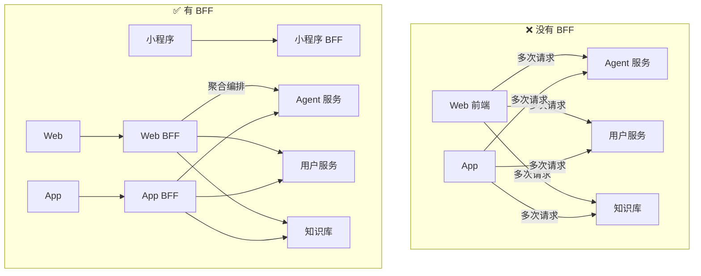
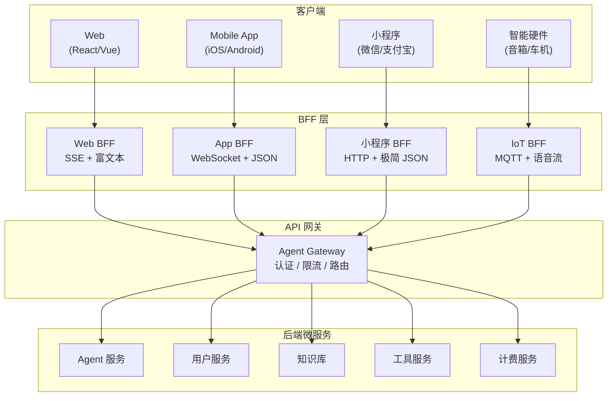
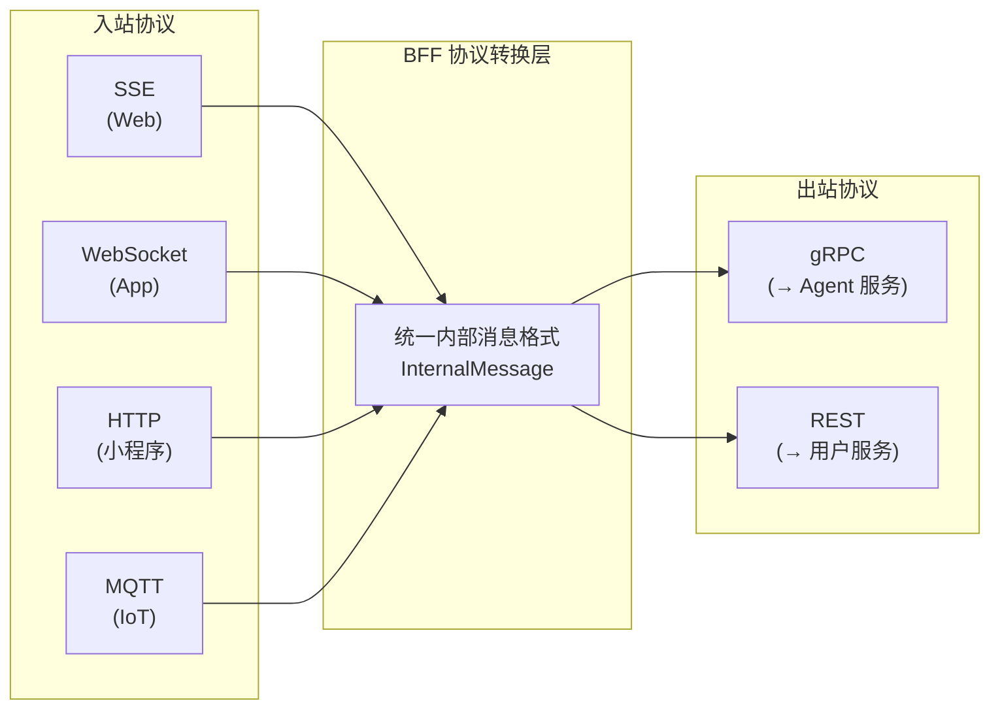
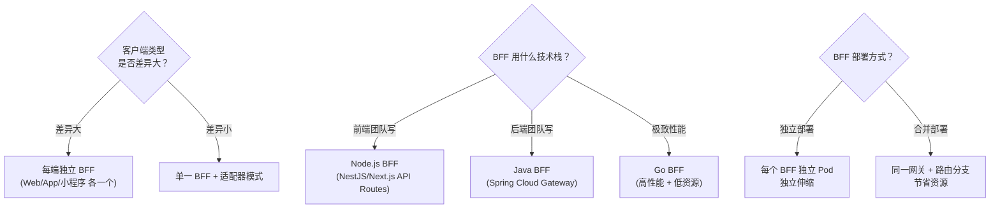

# 20 · Agent API 网关与 BFF 层设计

> 阶段：5 架构师 · 难度：⭐⭐⭐⭐⭐ · 预计：3 天
> 前置：[53 Agent API 网关设计](../阶段4-生产化/53-Agent%20API网关设计.md)
> 产出：掌握 Agent BFF（Backend for Frontend）层的架构设计——多端适配、协议转换、聚合编排

---

## 你将学会

- BFF 模式在 Agent 架构中的应用
- 多端适配（Web / App / 小程序 / 智能硬件）
- 协议转换（HTTP ↔ WebSocket ↔ gRPC ↔ SSE）
- 请求聚合与编排（一个 BFF 请求扇出多个后端服务）

---

## 为什么 Agent 需要 BFF



BFF 的核心价值：

| 价值 | 说明 |
|------|------|
| 减少前端请求次数 | 1 个 BFF 请求 = N 个后端请求的聚合 |
| 多端适配 | Web 要 HTML 渲染指令，App 要纯 JSON，硬件要极简协议 |
| 协议转换 | 前端用 HTTP，Agent 内部用 gRPC，BFF 做适配 |
| 数据裁剪 | 只返回前端需要的字段，减少传输量 |
| 流式适配 | Web 用 SSE，App 用 WebSocket，BFF 统一转 |

---

## 知识讲解

### 1. BFF 架构全景



### 2. 请求聚合编排

```java
package demo.demo05.bff;

import org.springframework.stereotype.Component;
import reactor.core.publisher.*;
import java.util.*;

/**
 * BFF 请求聚合器
 * 一个前端请求 → 扇出多个后端请求 → 合并结果
 */
@Component
public class ChatPageAggregator {

    private final AgentClient agentClient;
    private final UserClient userClient;
    private final KnowledgeClient knowledgeClient;

    /**
     * 打开对话页面时的初始化请求
     * 前端只发一次请求，BFF 并行拉取所有需要的数据
     */
    public Mono<ChatPageData> loadChatPage(String userId, String sessionId) {
        // 并行发起多个请求
        Mono<UserProfile> userMono = userClient.getProfile(userId);
        Mono<List<SessionSummary>> sessionsMono = userClient.getSessions(userId);
        Mono<List<Message>> historyMono = sessionId != null
                ? agentClient.getHistory(sessionId)
                : Mono.just(List.of());
        Mono<List<KnowledgeBase>> kbMono = knowledgeClient.listBases(userId);
        Mono<UsageSummary> usageMono = userClient.getUsage(userId);

        // 等待所有请求完成，合并结果
        return Mono.zip(userMono, sessionsMono, historyMono, kbMono, usageMono)
                .map(tuple -> new ChatPageData(
                        tuple.getT1(), // 用户信息
                        tuple.getT2(), // 会话列表
                        tuple.getT3(), // 消息历史
                        tuple.getT4(), // 知识库列表
                        tuple.getT5()  // 用量信息
                ))
                .timeout(Duration.ofSeconds(5))
                .onErrorReturn(ChatPageData.partial()); // 降级：返回部分数据
    }

    /**
     * 发送消息：同时触发 Agent 对话 + 更新用量 + 记录反馈入口
     */
    public Flux<ChatEvent> sendMessage(SendMessageRequest req) {
        // Agent 对话流（SSE）
        Flux<ChatEvent> agentStream = agentClient.streamChat(req)
                .map(this::toChatEvent);

        // 并行：异步更新用户活跃时间
        userClient.updateActivity(req.userId()).subscribe();

        return agentStream;
    }
}

record ChatPageData(
    UserProfile user,
    List<SessionSummary> sessions,
    List<Message> history,
    List<KnowledgeBase> knowledgeBases,
    UsageSummary usage
) {
    static ChatPageData partial() {
        return new ChatPageData(null, List.of(), List.of(), List.of(), null);
    }
}
```

### 3. 多端适配

```java
package demo.demo05.bff;

import org.springframework.stereotype.Component;
import org.springframework.http.*;

/**
 * 多端响应适配器
 * 同一 Agent 响应，不同客户端需要不同格式
 */
@Component
public class ResponseAdapter {

    /**
     * Web 端：完整富文本 + Markdown
     */
    public WebResponse toWeb(AgentResponse response) {
        return new WebResponse(
            response.text(),
            renderMarkdown(response.text()),
            response.toolCalls(),
            response.sources(),
            response.usage(),
            Map.of("suggestFollowups", generateFollowups(response))
        );
    }

    /**
     * App 端：精简 JSON，大段文本分段
     */
    public AppResponse toApp(AgentResponse response) {
        return new AppResponse(
            splitParagraphs(response.text()), // 分段（App 屏幕小）
            response.toolCalls().stream()
                    .map(this::simplifyToolCall) // 简化工具调用展示
                    .toList(),
            response.sources().stream()
                    .limit(3) // App 只展示 3 个来源
                    .toList(),
            response.usage().completionTokens() // 只返回 token 数
        );
    }

    /**
     * 小程序端：极简 JSON，严格控制字段大小
     */
    public MiniAppResponse toMiniApp(AgentResponse response) {
        String truncated = response.text();
        if (truncated.length() > 2000) {
            truncated = truncated.substring(0, 2000) + "...";
        }
        return new MiniAppResponse(
            truncated,
            response.toolCalls().isEmpty() ? null : response.toolCalls().get(0).name(),
            response.sources().isEmpty() ? null : response.sources().get(0)
        );
    }

    /**
     * IoT / 车机端：纯文本或语音指令
     */
    public IoTResponse toIoT(AgentResponse response) {
        // 硬件端只需要纯文本（TTS 朗读用）
        String plainText = stripMarkdown(response.text());
        return new IoTResponse(plainText, detectIntent(response));
    }

    private String renderMarkdown(String text) { return text; }
    private List<String> generateFollowups(AgentResponse r) { return List.of(); }
    private List<String> splitParagraphs(String text) { return List.of(text); }
    private Object simplifyToolCall(Object tc) { return tc; }
    private String stripMarkdown(String text) { return text; }
    private String detectIntent(AgentResponse r) { return "chat"; }
}

record WebResponse(String text, String html, List<Object> tools,
                   List<Object> sources, Object usage, Map<String, Object> extra) {}
record AppResponse(List<String> paragraphs, List<Object> tools,
                   List<Object> sources, int tokens) {}
record MiniAppResponse(String text, String toolName, Object source) {}
record IoTResponse(String speech, String intent) {}
```

### 4. 协议转换



```java
package demo.demo05.bff.protocol;

import org.springframework.web.socket.*;
import org.springframework.web.socket.handler.*;

/**
 * WebSocket → 内部 gRPC 的协议转换
 * App 通过 WebSocket 发消息，BFF 转换为 gRPC 调用 Agent 服务
 */
public class WebSocketToGrpcAdapter extends AbstractWebSocketHandler {

    private final GrpcAgentClient grpcClient;

    @Override
    protected void handleTextMessage(WebSocketSession session, TextMessage message) {
        String payload = message.getPayload();

        // 解析 WebSocket 消息 → 构造 gRPC 请求
        ChatRequest grpcReq = parseWebSocketMessage(payload);

        // 调用 gRPC 流式接口
        grpcClient.streamChat(grpcReq)
                .doOnNext(grpcResp -> {
                    // gRPC 响应 → WebSocket 文本帧
                    String wsMessage = formatWebSocketMessage(grpcResp);
                    session.sendMessage(new TextMessage(wsMessage));
                })
                .doOnComplete(() -> {
                    session.sendMessage(new TextMessage("{\"type\":\"done\"}"));
                })
                .subscribe();
    }

    private ChatRequest parseWebSocketMessage(String payload) {
        // JSON → gRPC 请求对象
        return null;
    }

    private String formatWebSocketMessage(Object grpcResp) {
        return "{}";
    }
}
```

---

## BFF 层关键设计决策



---

## 常见坑

- ❌ **BFF 变成逻辑黑洞** → 所有业务逻辑都堆在 BFF 里。BFF 应该只做聚合和适配，不写业务逻辑
- ❌ **N+1 请求问题** → 循环里发请求。用批量接口或 Reactive 的 zip/merge
- ❌ **BFF 没有降级策略** → 一个后端服务挂了，整个 BFF 请求失败。用 timeout + fallback
- ❌ **协议转换丢失信息** → WebSocket 全双工转为 HTTP 请求-响应时丢失了推送能力
- ❌ **BFF 过度设计** → 只有一个客户端却搞 BFF 层。单体够用时不要提前拆

---

## 验收检查

- [ ] BFF 能聚合并行请求，减少前端请求次数
- [ ] 同一 Agent 响应能适配 Web/App/小程序不同格式
- [ ] SSE ↔ WebSocket 协议转换正常工作
- [ ] 后端服务挂掉时有降级策略
- [ ] BFF 请求延迟 < 网关直连 + 50ms

---

## 下一步

→ 下一篇：[21 Agent 平台工程化](21-Agent平台工程化.md)
