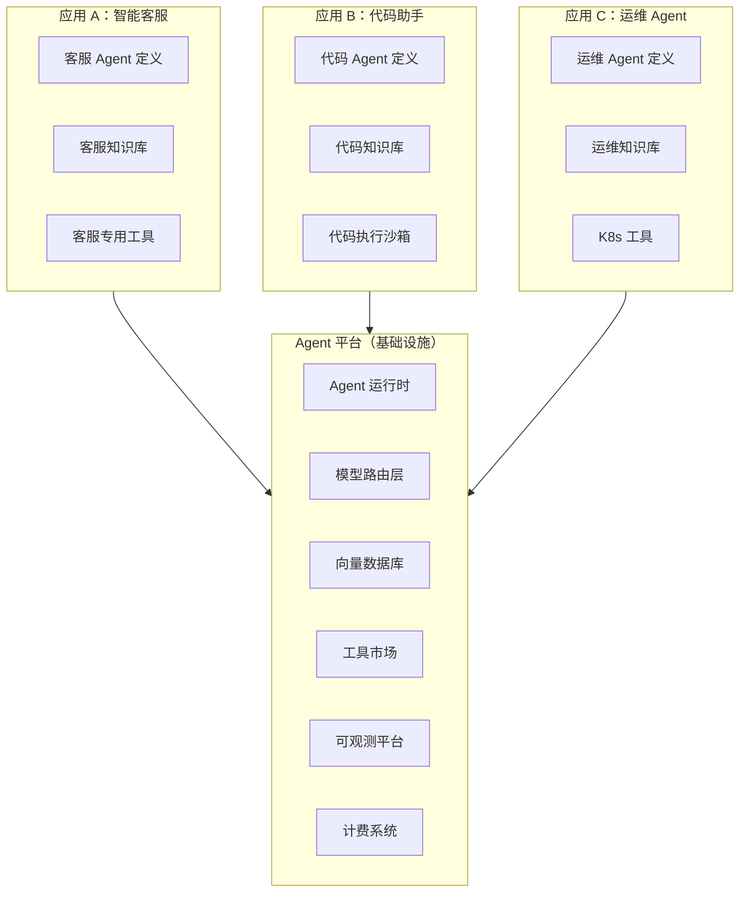
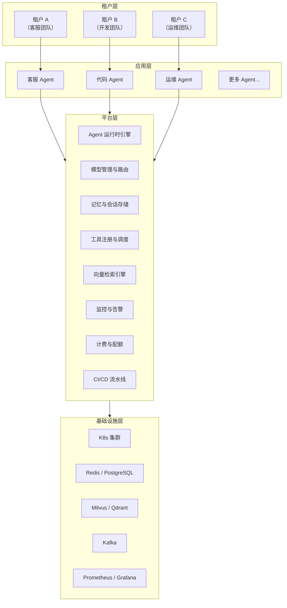
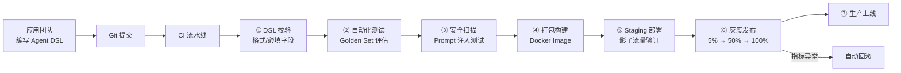
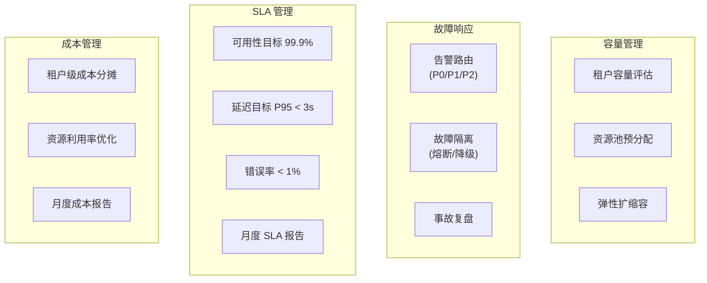

# 21 · Agent 平台工程化

> 阶段：5 架构师 · 难度：⭐⭐⭐⭐⭐ · 预计：3 天
> 前置：[08 Agent 平台化设计](08-Agent平台化设计.md)
> 产出：掌握 Agent 平台的工程化设计——多团队协作、租户隔离、资源调度、运维体系

---

## 你将学会

- Agent 平台 vs Agent 应用的本质区别
- 平台 vs 应用 vs 租户的三层架构
- 多团队协作的研发流程（Agent DSL → CI/CD → 上线）
- 平台 SRE 体系（容量规划 / 故障响应 / SLA 管理）

---

## 平台 vs 应用



**平台团队**关心：稳定性、性能、成本、通用能力  
**应用团队**关心：业务逻辑、用户体验、领域知识

---

## 知识讲解

### 1. 平台三层架构



### 2. Agent 定义模型（DSL）

平台让应用团队通过 DSL 定义 Agent，不需要写代码：

```java
package demo.demo05.platform;

import java.util.*;

/**
 * Agent 定义（YAML/JSON DSL → Java 对象）
 */
public record AgentDefinition(
    String agentId,
    String name,
    String version,
    String description,
    String systemPrompt,          // 系统提示词
    String model,                 // 使用哪个模型
    double temperature,
    int maxTurns,
    int maxTokens,
    List<String> tools,           // 绑定的工具 ID 列表
    List<String> knowledgeBases,  // 绑定的知识库 ID
    GuardrailConfig guardrails,   // 安全护栏配置
    ResourceConfig resources      // 资源限制
) {}

record GuardrailConfig(
    boolean contentModeration,
    boolean promptInjectionDefense,
    double maxCostPerConversation,
    List<String> blockedTopics
) {}

record ResourceConfig(
    int maxConcurrentSessions,
    int maxTokensPerMinute,
    int maxRequestsPerMinute,
    int sessionTimeoutSeconds
) {}
```

```yaml
# Agent 定义示例：客服 Agent
agentId: "customer-service-v2"
name: "智能客服"
version: "2.1.0"
description: "处理产品咨询、售后问题、技术支持"
systemPrompt: |
  你是某公司的智能客服助手。
  - 礼貌专业，用"您"称呼用户
  - 不确定的问题说"我帮您转人工"
  - 不做价格承诺，引导到官网
model: "qwen-max"
temperature: 0.3
maxTurns: 15
maxTokens: 2000
tools:
  - "product-search"
  - "order-query"
  - "ticket-create"
  - "faq-search"
knowledgeBases:
  - "kb-product-manual"
  - "kb-faq"
  - "kb-return-policy"
guardrails:
  contentModeration: true
  promptInjectionDefense: true
  maxCostPerConversation: 0.50
  blockedTopics:
    - "政治"
    - "宗教"
resources:
  maxConcurrentSessions: 100
  maxTokensPerMinute: 50000
  maxRequestsPerMinute: 30
  sessionTimeoutSeconds: 1800
```

### 3. 平台运行时引擎

```java
package demo.demo05.platform;

import org.springframework.stereotype.Component;
import java.util.*;
import java.util.concurrent.*;

/**
 * Agent 运行时引擎
 * 加载 Agent 定义 → 实例化 → 调度执行
 */
@Component
public class AgentRuntimeEngine {

    private final Map<String, AgentInstance> instances = new ConcurrentHashMap<>();
    private final AgentDefinitionLoader definitionLoader;
    private final QuotaManager quotaManager;

    /**
     * 加载并实例化 Agent
     */
    public AgentInstance deploy(String agentId, String version) {
        // 1. 加载定义
        AgentDefinition def = definitionLoader.load(agentId, version);

        // 2. 校验配额
        if (!quotaManager.canDeploy(def.resources())) {
            throw new PlatformException("资源配额不足");
        }

        // 3. 实例化
        AgentInstance instance = new AgentInstance(def);

        // 4. 预热（加载知识库、注册工具）
        instance.warmUp();

        // 5. 注册
        instances.put(agentId, instance);
        return instance;
    }

    /**
     * 执行 Agent 对话
     */
    public AgentResponse execute(String agentId, String sessionId, String userInput) {
        AgentInstance instance = instances.get(agentId);
        if (instance == null) {
            throw new PlatformException("Agent 未部署: " + agentId);
        }

        // 检查会话级配额
        quotaManager.checkSessionQuota(agentId, sessionId);

        // 执行
        return instance.process(sessionId, userInput);
    }

    /**
     * 卸载 Agent
     */
    public void undeploy(String agentId) {
        AgentInstance instance = instances.remove(agentId);
        if (instance != null) {
            instance.shutdown();
        }
    }
}
```

### 4. 多租户资源隔离

```java
package demo.demo05.platform;

import java.util.*;
import java.util.concurrent.*;
import java.util.concurrent.atomic.*;

/**
 * 多租户配额管理器
 */
@Component
public class QuotaManager {

    // 租户 → 资源使用
    private final Map<String, TenantUsage> tenantUsage = new ConcurrentHashMap<>();

    // 时间窗口内的 token 计数（滑动窗口）
    private final Map<String, SlidingWindowCounter> tpmCounters = new ConcurrentHashMap<>();

    /**
     * 检查是否可以部署
     */
    public boolean canDeploy(ResourceConfig config) {
        // 检查全局资源是否够
        return true;
    }

    /**
     * 检查会话级配额
     */
    public void checkSessionQuota(String agentId, String sessionId) {
        String tenantId = resolveTenant(agentId);

        // 检查 TPM
        SlidingWindowCounter tpm = tpmCounters.computeIfAbsent(
            tenantId, k -> new SlidingWindowCounter(60) // 60秒窗口
        );

        if (tpm.get() > getTpmLimit(tenantId)) {
            throw new QuotaExceededException("超出 TPM 限制");
        }

        // 检查并发会话数
        TenantUsage usage = tenantUsage.get(tenantId);
        if (usage.activeSessions.get() > usage.maxSessions) {
            throw new QuotaExceededException("超出并发会话限制");
        }
    }

    /**
     * 记录 token 用量
     */
    public void recordUsage(String tenantId, int tokens) {
        SlidingWindowCounter tpm = tpmCounters.get(tenantId);
        if (tpm != null) {
            tpm.add(tokens);
        }
    }

    private String resolveTenant(String agentId) { return "tenant-A"; }
    private long getTpmLimit(String tenantId) { return 100000; }

    static class TenantUsage {
        AtomicInteger activeSessions = new AtomicInteger();
        int maxSessions;
        AtomicLong monthlyTokens = new AtomicLong();
        AtomicLong monthlyCost = new AtomicLong();
    }

    static class SlidingWindowCounter {
        private final int windowSeconds;
        private final Queue<long[]> events = new LinkedList<>();

        SlidingWindowCounter(int windowSeconds) {
            this.windowSeconds = windowSeconds;
        }

        void add(long value) {
            long now = System.currentTimeMillis();
            events.add(new long[]{now, value});
            evictOld(now);
        }

        long get() {
            evictOld(System.currentTimeMillis());
            return events.stream().mapToLong(e -> e[1]).sum();
        }

        private void evictOld(long now) {
            long cutoff = now - windowSeconds * 1000L;
            while (!events.isEmpty() && events.peek()[0] < cutoff) {
                events.poll();
            }
        }
    }
}
```

### 5. 平台 CI/CD 流水线



---

## 平台运维体系



---

## 常见坑

- ❌ **平台与应用耦合** → 平台代码里写死了客服业务逻辑。平台必须保持通用
- ❌ **租户之间互相影响** → 租户 A 流量暴涨导致租户 B 延迟增加。需要资源隔离（cgroup/namespace/限流）
- ❌ **Agent 定义不可版本化** → 改了 prompt 没法回滚。必须版本化 + Git 管理
- ❌ **没有金丝雀发布** → 新版 Agent 直接全量上线。必须灰度
- ❌ **平台只管上线不管运行** → Agent 上线后没有运行时监控。需要全生命周期管理

---

## 验收检查

- [ ] Agent 定义可通过 DSL（YAML）配置，无需写代码
- [ ] 多租户之间资源隔离（TPM/并发/成本独立）
- [ ] Agent 部署有 CI/CD 流水线
- [ ] 平台有灰度发布能力
- [ ] SLA 可监控、可报告
- [ ] 租户级成本可分摊

---

## 下一步

→ 下一篇：[22 Agent 微服务拆分策略](22-Agent微服务拆分策略.md)
