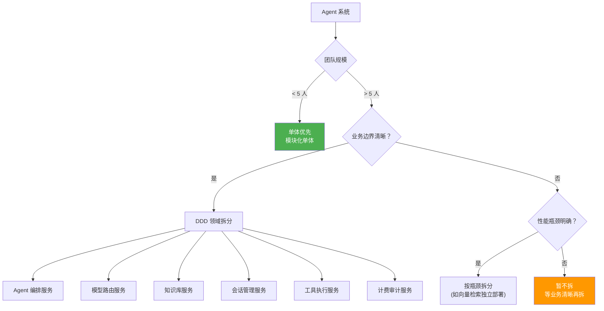
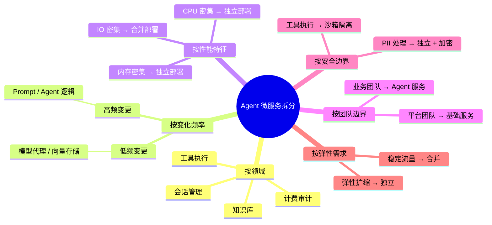
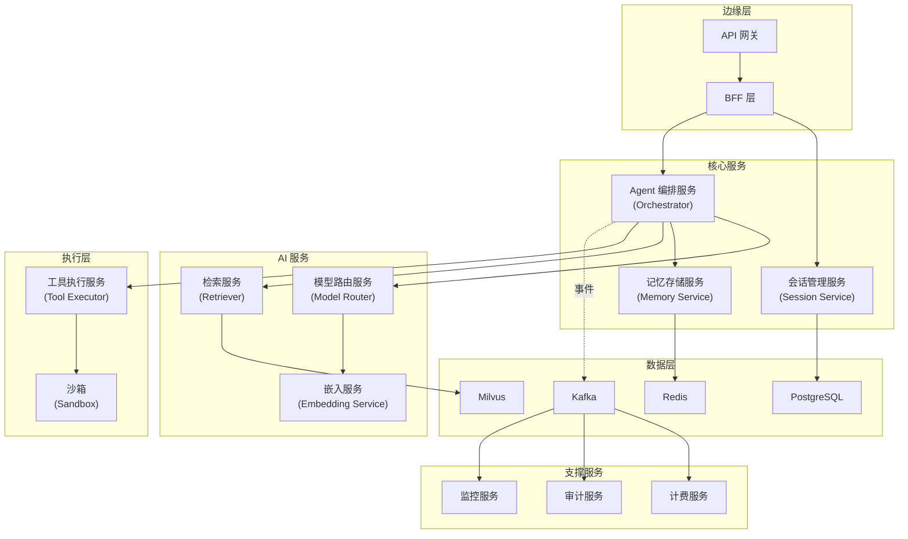
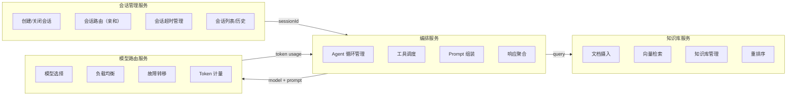
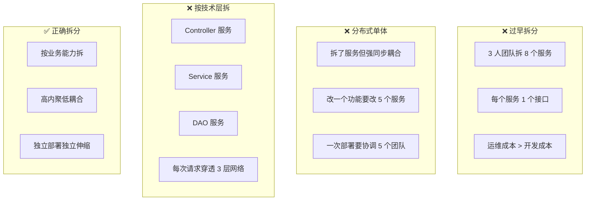

# 22 · Agent 微服务拆分策略

> 阶段：5 架构师 · 难度：⭐⭐⭐⭐ · 预计：2 天
> 前置：[04 AI 原生架构设计](04-AI原生架构设计.md)
> 产出：掌握 Agent 系统的微服务拆分原则与边界划分

---

## 你将学会

- Agent 系统微服务拆分的六大维度
- DDD 领域驱动设计在 Agent 架构中的应用
- 服务间通信模式（同步 vs 异步 vs 流式）
- 拆分时机判断——什么时候不该拆

---

## 拆分决策树



---

## 知识讲解

### 1. 六大拆分维度



### 2. 典型 Agent 微服务架构



### 3. 服务间通信模式

```java
package demo.demo05.architecture;

/**
 * Agent 微服务通信模式对比
 */
public class CommunicationPatterns {

    /**
     * 模式1：同步调用（gRPC）
     * 适用：低延迟、需要立即结果
     * 场景：编排服务 → 模型路由服务
     */
    // gRPC stub 调用
    // ChatResponse resp = modelRouterStub.chat(request);
    // 超时: 30s，重试: 2次，熔断: 10s

    /**
     * 模式2：异步事件（Kafka）
     * 适用：解耦、削峰、不需要立即结果
     * 场景：对话完成 → 计费/审计/分析
     */
    // kafka.send("conversation-completed", event);
    // 计费服务/审计服务各自消费

    /**
     * 模式3：流式（SSE / gRPC Stream）
     * 适用：LLM 流式输出、实时通知
     * 场景：编排服务 → 网关 → 前端
     */
    // Flux<ChatChunk> stream = modelRouterStub.streamChat(request);

    /**
     * 模式4：共享状态（Redis）
     * 适用：会话状态、临时上下文
     * 场景：编排服务 ↔ 记忆服务
     */
    // redis.setex("session:" + id, 1800, messagesJson);
}
```

### 4. 服务边界定义



### 5. 服务定义示例

```java
package demo.demo05.architecture;

import org.springframework.stereotype.Service;
import java.util.*;

/**
 * 会话管理服务 — 独立微服务
 * 职责：会话生命周期管理（与 Agent 逻辑解耦）
 */
@Service
public class SessionService {

    /**
     * 创建会话
     */
    public Session create(String userId, String tenantId, CreateSessionRequest req) {
        String sessionId = UUID.randomUUID().toString();
        Session session = new Session(sessionId, userId, tenantId, req.agentId(),
                                       System.currentTimeMillis(), Session.Status.ACTIVE);
        // 持久化 + Redis 缓存
        return session;
    }

    /**
     * 获取或创建会话
     */
    public Session getOrCreate(String sessionId, String userId) {
        // 先查缓存，miss 则查 DB，再 miss 则创建
        return null;
    }

    /**
     * 关闭会话
     */
    public void close(String sessionId) {
        // 标记关闭，保留历史
    }

    /**
     * 清理过期会话
     */
    public void cleanupExpired() {
        // 定时任务：关闭超时会话
    }
}

/**
 * 模型路由服务 — 独立微服务
 * 职责：模型选择 + 请求转发 + Token 计量
 */
@Service
public class ModelRouterService {

    /**
     * 同步对话
     */
    public ModelResponse chat(ModelRequest request) {
        // 1. 选择模型
        String model = selectModel(request);

        // 2. 转发请求
        ModelResponse response = callModel(model, request);

        // 3. 计量
        recordUsage(request.tenantId(), model, response.usage());

        return response;
    }

    /**
     * 流式对话
     */
    public Flux<ModelChunk> streamChat(ModelRequest request) {
        String model = selectModel(request);
        // 流式调用 + 流式计量
        return Flux.empty();
    }

    private String selectModel(ModelRequest req) { return "gpt-4o"; }
    private ModelResponse callModel(String model, ModelRequest req) { return null; }
    private void recordUsage(String tenant, String model, Object usage) { }
}

/**
 * 工具执行服务 — 独立微服务（沙箱隔离）
 * 职责：安全执行工具调用
 */
@Service
public class ToolExecutorService {

    /**
     * 执行工具（带超时、沙箱）
     */
    public ToolResult execute(ToolRequest request) {
        // 1. 查找工具定义
        // 2. 权限检查
        // 3. 参数校验
        // 4. 沙箱执行（超时 30s）
        // 5. 结果序列化
        return ToolResult.success("result");
    }
}
```

---

## 拆分反模式



---

## 常见坑

- ❌ **按 CRUD 拆服务** → UserService 只有增删改查，没有业务逻辑。应该按业务能力拆
- ❌ **服务间共享数据库** → 两个服务读写同一张表，数据库 schema 变更需要协调两个服务。每服务独立库
- ❌ **编排服务变成上帝服务** → 所有逻辑都堆在编排服务里。需要把领域逻辑下沉到对应服务
- ❌ **同步调用链太长** → A→B→C→D→E 五层同步调用，延迟叠加 + 级联故障。用异步事件解耦
- ❌ **没有服务降级** → 知识库服务挂了，编排服务也跟着挂。编排服务需要 fallback 策略（不检索也能回答）

---

## 验收检查

- [ ] 服务边界按业务能力划分，非技术层划分
- [ ] 每个服务可独立部署、独立伸缩
- [ ] 服务间通信用合适的模式（同步/异步/流式）
- [ ] 有服务降级策略（非核心服务挂掉不影响主流程）
- [ ] 每个服务有独立的数据库 schema
- [ ] 编排服务的调用链深度 ≤ 3

---

## 下一步

→ 下一篇：[23 Agent 数据中台架构](23-Agent数据中台架构.md)
