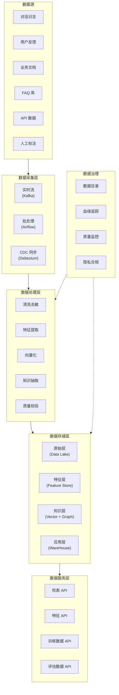
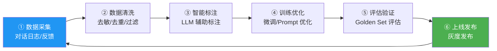
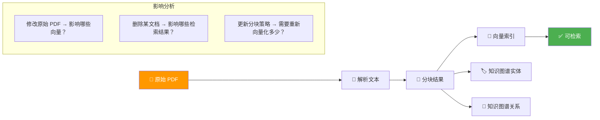
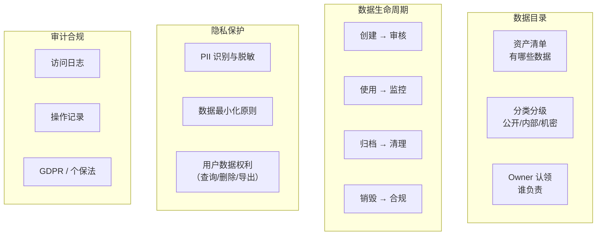

# 23 · Agent 数据中台架构

> 阶段：5 架构师 · 难度：⭐⭐⭐⭐⭐ · 预计：3 天
> 前置：[22 Agent 微服务拆分策略](22-Agent微服务拆分策略.md)
> 产出：掌握 Agent 数据中台的架构设计——数据采集、特征工程、知识管理、数据治理

---

## 你将学会

- Agent 数据中台的定位与核心能力
- 数据飞轮闭环（采集 → 清洗 → 标注 → 训练 → 评估 → 上线）
- 统一知识管理架构（文档/FAQ/知识图谱/向量库）
- 数据治理体系（质量/血缘/合规/隐私）

---

## 数据中台全景



---

## 知识讲解

### 1. 数据飞轮架构



### 2. 统一知识管理

```java
package demo.demo05.data;

import org.springframework.stereotype.Component;
import java.util.*;

/**
 * 统一知识管理服务
 * 管理：原始文档 / FAQ / 知识图谱 / 向量索引
 */
@Component
public class KnowledgeManagementService {

    /**
     * 知识资产类型
     */
    public enum AssetType {
        DOCUMENT,    // 原始文档（PDF/Word/MD）
        FAQ,         // 问答对
        CHUNK,       // 分块后的文本段
        EMBEDDING,   // 向量索引
        ENTITY,      // 知识图谱实体
        RELATION,    // 知识图谱关系
        RULE         // 规则知识
    }

    /**
     * 知识摄入管线
     */
    public void ingest(KnowledgeAsset asset) {
        switch (asset.type()) {
            case DOCUMENT -> ingestDocument(asset);
            case FAQ -> ingestFaq(asset);
            case RULE -> ingestRule(asset);
            default -> throw new IllegalArgumentException("不支持的知识类型");
        }
    }

    /**
     * 文档摄入：解析 → 分块 → 向量化 → 入库
     */
    private void ingestDocument(KnowledgeAsset doc) {
        // 1. 解析文档
        String text = parseDocument(doc);

        // 2. 智能分块
        List<Chunk> chunks = smartChunk(text, doc.metadata());

        // 3. 向量化
        List<float[]> embeddings = batchEmbed(chunks);

        // 4. 存入向量库
        vectorStore.batchUpsert(chunks, embeddings);

        // 5. 知识图谱抽取（可选）
        if (doc.metadata().containsKey("extract_graph")) {
            extractEntitiesRelations(text);
        }

        // 6. 记录血缘
        lineageTracker.record(doc.id(), chunks);
    }

    /**
     * FAQ 摄入：直接向量化问答对
     */
    private void ingestFaq(KnowledgeAsset faq) {
        List<QAPair> pairs = parseFaq(faq);
        for (QAPair pair : pairs) {
            float[] embedding = embed(pair.question());
            vectorStore.upsert(pair.id(), embedding, Map.of(
                "type", "faq",
                "question", pair.question(),
                "answer", pair.answer()
            ));
        }
    }

    /**
     * 规则知识摄入：存入规则引擎
     */
    private void ingestRule(KnowledgeAsset rule) {
        ruleEngine.add(rule.content());
    }

    // 简化方法...
    private String parseDocument(KnowledgeAsset a) { return ""; }
    private List<Chunk> smartChunk(String t, Map<String, Object> m) { return List.of(); }
    private List<float[]> batchEmbed(List<Chunk> c) { return List.of(); }
    private void extractEntitiesRelations(String t) { }
    private float[] embed(String q) { return new float[0]; }
    private List<QAPair> parseFaq(KnowledgeAsset f) { return List.of(); }
}

record KnowledgeAsset(
    String id,
    AssetType type,
    String content,
    Map<String, Object> metadata,
    String tenantId,
    String source
) {}

record Chunk(String id, String text, Map<String, Object> metadata) {}
record QAPair(String id, String question, String answer) {}
```

### 3. 特征存储（Feature Store）

```java
package demo.demo05.data;

import org.springframework.stereotype.Component;
import java.util.*;

/**
 * Agent 特征存储
 * 管理：用户画像特征、对话特征、行为特征
 */
@Component
public class FeatureStore {

    /**
     * 用户特征
     */
    public UserFeatures getUserFeatures(String userId) {
        return new UserFeatures(
            getUserTier(userId),           // 用户等级
            getPreferredLanguage(userId),   // 偏好语言
            getUsagePattern(userId),        // 使用模式（高峰时段/频率）
            getTopicPreferences(userId),    // 话题偏好
            getSatisfactionHistory(userId)  // 历史满意度
        );
    }

    /**
     * 对话特征（实时计算）
     */
    public ConversationFeatures getConversationFeatures(String sessionId) {
        return new ConversationFeatures(
            getTurnCount(sessionId),           // 当前轮数
            getAccumulatedTokens(sessionId),   // 累计 token
            getDuration(sessionId),            // 对话时长
            getToolUsagePattern(sessionId),    // 工具使用模式
            getCurrentTopic(sessionId)         // 当前话题
        );
    }

    /**
     * 特征写入（用于模型训练）
     */
    public void writeFeatures(String entityId, Map<String, Object> features) {
        // 写入特征存储（如 Feast / Redis / PostgreSQL）
    }

    // 简化方法...
    private String getUserTier(String id) { return "premium"; }
    private String getPreferredLanguage(String id) { return "zh-CN"; }
    private String getUsagePattern(String id) { return "weekday_morning"; }
    private List<String> getTopicPreferences(String id) { return List.of("技术"); }
    private double getSatisfactionHistory(String id) { return 0.85; }
    private int getTurnCount(String s) { return 3; }
    private int getAccumulatedTokens(String s) { return 500; }
    private long getDuration(String s) { return 120; }
    private List<String> getToolUsagePattern(String s) { return List.of("search"); }
    private String getCurrentTopic(String s) { return "RAG"; }
}

record UserFeatures(
    String tier,
    String preferredLanguage,
    String usagePattern,
    List<String> topicPreferences,
    double satisfactionHistory
) {}

record ConversationFeatures(
    int turnCount,
    int accumulatedTokens,
    long durationSeconds,
    List<String> toolUsagePattern,
    String currentTopic
) {}
```

### 4. 数据质量监控

```java
package demo.demo05.data;

import org.springframework.stereotype.Component;
import java.util.*;

/**
 * 数据质量监控器
 */
@Component
public class DataQualityMonitor {

    /**
     * 质量维度
     */
    public QualityReport assess(List<KnowledgeAsset> assets) {
        return new QualityReport(
            checkCompleteness(assets),    // 完整性：必填字段是否缺失
            checkAccuracy(assets),        // 准确性：内容是否正确（LLM 校验）
            checkFreshness(assets),       // 时效性：最后更新时间
            checkConsistency(assets),     // 一致性：跨来源是否矛盾
            checkUniqueness(assets),      // 唯一性：是否有重复
            checkValidity(assets)         // 有效性：格式/类型是否正确
        );
    }

    /**
     * 知识库健康度评分
     */
    public double healthScore(String knowledgeBaseId) {
        // 1. 检索质量：Golden Set Recall@5
        double retrievalQuality = evalRetrieval(knowledgeBaseId);

        // 2. 文档覆盖率：有多少问题能找到相关文档
        double coverage = evalCoverage(knowledgeBaseId);

        // 3. 文档新鲜度：过期文档比例
        double freshness = evalFreshness(knowledgeBaseId);

        // 4. 重复率
        double uniqueness = 1.0 - deduplicationRate(knowledgeBaseId);

        // 加权
        return retrievalQuality * 0.4 + coverage * 0.3
             + freshness * 0.15 + uniqueness * 0.15;
    }

    private double checkCompleteness(List<KnowledgeAsset> a) { return 0.95; }
    private double checkAccuracy(List<KnowledgeAsset> a) { return 0.90; }
    private double checkFreshness(List<KnowledgeAsset> a) { return 0.85; }
    private double checkConsistency(List<KnowledgeAsset> a) { return 0.92; }
    private double checkUniqueness(List<KnowledgeAsset> a) { return 0.98; }
    private double checkValidity(List<KnowledgeAsset> a) { return 0.96; }
    private double evalRetrieval(String kb) { return 0.82; }
    private double evalCoverage(String kb) { return 0.75; }
    private double evalFreshness(String kb) { return 0.90; }
    private double deduplicationRate(String kb) { return 0.05; }
}

record QualityReport(
    double completeness,
    double accuracy,
    double freshness,
    double consistency,
    double uniqueness,
    double validity
) {
    public double overall() {
        return (completeness + accuracy + freshness + consistency
              + uniqueness + validity) / 6.0;
    }
}
```

### 5. 数据血缘追踪



---

## 数据治理体系



---

## 常见坑

- ❌ **数据沼泽** → 数据存了一堆但没有目录和治理，谁也找不到、谁也不敢用
- ❌ **知识库只增不删** → 过期文档堆积，检索质量持续下降。需要定期清理和更新
- ❌ **没有数据血缘** → 文档改了不知道影响哪些向量索引。出问题无法追溯
- ❌ **特征与训练不一致** → 训练用的特征和线上推理用的特征不一致（Training-Serving Skew）
- ❌ **PII 数据未脱敏** → 对话日志中的用户手机号直接进入分析管线

---

## 验收检查

- [ ] 有统一的知识管理入口（文档/FAQ/图谱统一摄入）
- [ ] 数据飞轮闭环可运转（采集→清洗→训练→上线→反馈）
- [ ] 有数据质量监控和健康度评分
- [ ] 有数据血缘追踪（可做影响分析）
- [ ] 有数据目录和分类分级
- [ ] PII 数据在分析前已脱敏

---

## 下一步

→ 下一篇：[24 Agent 技术中台与能力开放](24-Agent技术中台与能力开放.md)
