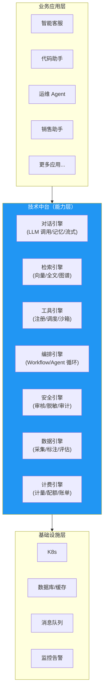
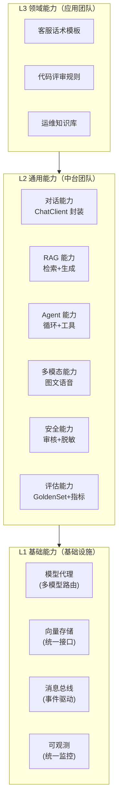
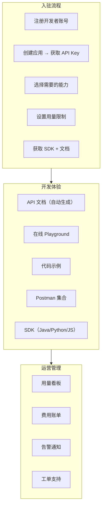
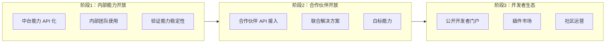

# 24 · Agent 技术中台与能力开放

> 阶段：5 架构师 · 难度：⭐⭐⭐⭐⭐ · 预计：2 天
> 前置：[23 Agent 数据中台架构](23-Agent数据中台架构.md)
> 产出：掌握 Agent 技术中台的设计——能力抽象、开放 API、开发者门户、生态建设

---

## 你将学会

- 技术中台的定位：能力沉淀 + 能力开放
- Agent 能力分层模型（基础设施 → 通用能力 → 领域能力）
- 开放 API 设计与开发者门户
- 生态建设：插件市场 + 合作伙伴集成

---

## 技术中台定位



中台的核心原则：**一次建设，多处复用。** 不为每个应用重复造轮子。

---

## 知识讲解

### 1. 能力分层模型



### 2. 能力开放架构

```mermaid
flowchart LR
    subgraph Portal["开发者门户"]
        P1["API 文档"]
        P2["在线调试"]
        P3["SDK 下载"]
        P4["用量看板"]
        P5["应用管理"]
    end

    subgraph Gateway["开放 API 网关"]
        G1["认证鉴权"]
        G2["限流配额"]
        G3["计量计费"]
        G4["版本管理"]
    end

    subgraph Capabilities["开放能力"]
        C1["对话 API<br/>/v1/chat"]
        C2["检索 API<br/>/v1/search"]
        C3["嵌入 API<br/>/v1/embeddings"]
        C4["工具 API<br/>/v1/tools/execute"]
        C5["Agent API<br/>/v1/agent/run"]
        C6["知识库 API<br/>/v1/kb/ingest"]
        C7["评估 API<br/>/v1/eval"]
    end

    Portal --> Gateway --> Capabilities
```



### 3. 核心 API 设计

```java
package demo.demo05.platform.openapi;

import org.springframework.web.bind.annotation.*;
import java.util.*;

/**
 * 开放 API — 对话能力
 */
@RestController
@RequestMapping("/v1/chat")
public class ChatOpenApiController {

    /**
     * 同步对话
     */
    @PostMapping("/completions")
    public ChatResponse completions(
            @RequestHeader("Authorization") String apiKey,
            @RequestBody ChatRequest request) {

        // 网关层已做认证和限流
        return chatEngine.execute(request);
    }

    /**
     * 流式对话（SSE）
     */
    @PostMapping(value = "/stream", produces = "text/event-stream")
    public Flux<ChatChunk> stream(
            @RequestHeader("Authorization") String apiKey,
            @RequestBody ChatRequest request) {

        return chatEngine.stream(request);
    }

    /**
     * 带工具的 Agent 对话
     */
    @PostMapping("/agent")
    public AgentResponse agent(
            @RequestHeader("Authorization") String apiKey,
            @RequestBody AgentRequest request) {

        return agentEngine.execute(request);
    }
}

/**
 * 开放 API — 知识库能力
 */
@RestController
@RequestMapping("/v1/kb")
public class KnowledgeOpenApiController {

    /**
     * 文档摄入
     */
    @PostMapping("/ingest")
    public IngestResponse ingest(
            @RequestHeader("Authorization") String apiKey,
            @RequestBody IngestRequest request) {

        int chunkCount = kbService.ingest(request);
        return new IngestResponse("ok", chunkCount);
    }

    /**
     * 语义检索
     */
    @PostMapping("/search")
    public SearchResponse search(
            @RequestHeader("Authorization") String apiKey,
            @RequestBody SearchRequest request) {

        List<SearchResult> results = kbService.search(request);
        return new SearchResponse(results);
    }
}
```

### 4. 开发者门户



### 5. 能力注册与发现

```java
package demo.demo05.platform;

import org.springframework.stereotype.Component;
import java.util.*;

/**
 * 能力注册中心
 * 每个中台能力注册自己的元数据，供应用方发现和调用
 */
@Component
public class CapabilityRegistry {

    private final Map<String, Capability> capabilities = new ConcurrentHashMap<>();

    /**
     * 注册能力
     */
    public void register(Capability cap) {
        capabilities.put(cap.id(), cap);
    }

    /**
     * 发现能力
     */
    public List<Capability> discover(String category) {
        return capabilities.values().stream()
                .filter(c -> category == null || c.category().equals(category))
                .sorted(Comparator.comparing(Capability::popularity).reversed())
                .toList();
    }

    /**
     * 获取能力的调用方式
     */
    public CapabilitySpec getSpec(String capabilityId) {
        Capability cap = capabilities.get(capabilityId);
        return new CapabilitySpec(
            cap.id(),
            cap.endpoint(),
            cap.apiSchema(),
            cap.sdkExample(),
            cap.pricing()
        );
    }
}

record Capability(
    String id,              // "chat-stream"
    String name,            // "流式对话"
    String category,        // "conversation"
    String description,
    String endpoint,        // "/v1/chat/stream"
    String apiSchema,       // OpenAPI Schema
    String sdkExample,      // SDK 示例代码
    String pricing,         // 计价规则
    int popularity          // 调用次数（排序用）
) {}

record CapabilitySpec(
    String capabilityId,
    String endpoint,
    String apiSchema,
    String sdkExample,
    String pricing
) {}
```

---

## 生态建设路线



---

## 常见坑

- ❌ **中台变成大泥球** → 中台什么都做，变成一个巨大的依赖。中台应该是薄薄的能力层
- ❌ **能力不收敛** → 每个应用都往中台塞自己的特殊需求。需要严格的抽象和通用化
- ❌ **API 设计不一致** → 每个能力的风格/版本/错误码都不一样。需要 API 设计规范
- ❌ **没有版本管理** → 改了 API 导致所有调用方全挂。需要语义化版本 + 弃用流程
- ❌ **计费不准** → 开放 API 收费但计量不准，客户投诉。需要精确的 Token 计量
- ❌ **文档与代码不同步** → API 文档更新滞后。用 OpenAPI 自动生成文档

---

## 验收检查

- [ ] 中台核心能力（对话/检索/工具/编排）可被独立调用
- [ ] 有统一的开放 API 网关（认证/限流/计量/版本）
- [ ] 有开发者门户（API 文档/在线调试/SDK）
- [ ] 能力有注册和发现机制
- [ ] API 有语义化版本管理
- [ ] 计量计费准确

---

## 下一步

→ 下一篇：[25 Agent 全栈交付与毕业评估](25-Agent全栈交付与毕业评估.md)
