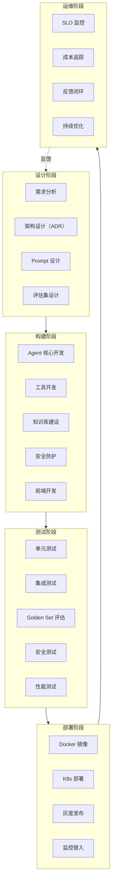
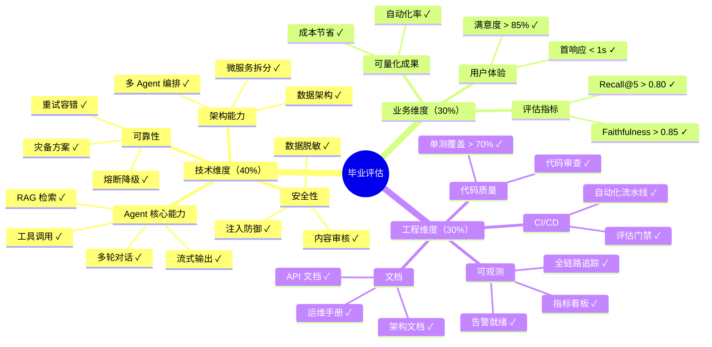
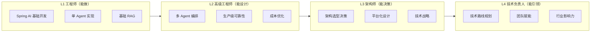
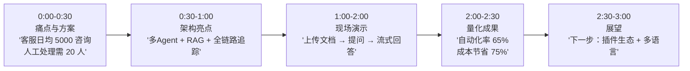
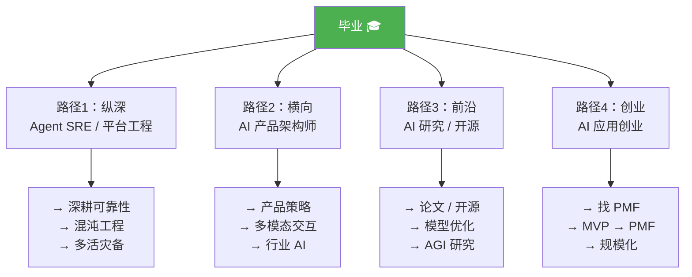

# 25 · Agent 全栈交付与毕业评估

> 阶段：5 架构师 · 难度：⭐⭐⭐⭐⭐ · 预计：2 天
> 前置：[24 Agent 技术中台与能力开放](24-Agent技术中台与能力开放.md)
> 产出：掌握 Agent 项目的全栈交付方法论——从设计到上线到运维的完整能力闭环

---

## 你将学会

- Agent 全栈交付的完整清单
- 毕业项目评估标准（技术 + 业务 + 工程三大维度）
- Agent 架构师能力模型
- 持续进阶路线

---

## 全栈交付清单



---

## 知识讲解

### 1. 毕业项目评估标准



### 2. 架构师能力模型



### 3. 量化指标体系

```java
package demo.demo05.graduation;

/**
 * 毕业项目指标体系
 */
public class ProjectMetrics {

    // ===== 技术指标 =====

    /** 检索准确率 */
    public double recallAt5;        // 目标 > 0.80
    /** 回答忠实度 */
    public double faithfulness;     // 目标 > 0.85
    /** 回答相关性 */
    public double relevance;        // 目标 > 0.85
    /** P95 首token延迟 */
    public double p95FirstTokenMs;  // 目标 < 1000
    /** P95 完整响应延迟 */
    public double p95CompleteMs;    // 目标 < 10000

    // ===== 业务指标 =====

    /** 自动解决率（不需要人工） */
    public double autoResolveRate;  // 目标 > 60%
    /** 用户满意度 */
    public double satisfactionRate; // 目标 > 85%
    /** 平均对话轮数 */
    public double avgTurns;         // 目标 < 8
    /** 周活跃用户 */
    public int weeklyActiveUsers;
    /** 日均对话量 */
    public int dailyConversations;

    // ===== 成本指标 =====

    /** 单次对话平均成本 */
    public double avgCostPerChat;   // 目标 < $0.05
    /** 月度总成本 */
    public double monthlyTotalCost;
    /** 对比纯人工的成本节省 */
    public double costSavingsRate;  // 目标 > 70%

    // ===== 工程指标 =====

    /** 单测覆盖率 */
    public double testCoverage;     // 目标 > 70%
    /** CI/CD 流水线通过率 */
    public double pipelinePassRate; // 目标 > 95%
    /** 平均故障恢复时间 */
    public double mttrMinutes;      // 目标 < 30
    /** SLA 可用率 */
    public double slaAvailability;  // 目标 > 99.9%

    /**
     * 综合评分
     */
    public double overallScore() {
        double techScore = (recallAt5 + faithfulness + relevance) / 3 * 40;
        double bizScore = (autoResolveRate + satisfactionRate) / 2 * 30;
        double engScore = (testCoverage + slaAvailability) / 2 * 30;
        return techScore + bizScore + engScore;
    }
}
```

### 4. 3 分钟项目演示模板



---

## 简历级量化指标模板

| 指标 | 写法 |
|------|------|
| 性能 | "P95 延迟 < 800ms，支持 500 QPS 并发" |
| 准确率 | "Faithfulness 0.87，Recall@5 0.83" |
| 成本 | "单次对话成本 $0.03，月节省 $15K" |
| 规模 | "日均 10K 对话，服务 50K 用户" |
| 可靠性 | "SLA 99.95%，MTTR 12 分钟" |
| 自动化 | "自动化解决率 68%，转人工率 15%" |

---

## 常见坑

- ❌ **只做功能不管指标** → 功能做完了但没有量化评估，无法证明价值
- ❌ **毕业项目太简单** → 只是调用 ChatClient，没有架构深度。需要多 Agent + RAG + 生产化
- ❌ **没有安全防护** → Agent 可以被 Prompt Injection 攻破，敏感数据泄露
- ❌ **不能一键部署** → 评审时要手动搭半天环境。必须 Docker Compose 一键启动
- ❌ **演示只展示 Happy Path** → 只演示正常流程，不展示异常处理和降级

---

## 验收检查

- [ ] 毕业项目通过三大维度评估（技术 40% + 业务 30% + 工程 30%）
- [ ] 有 3 个以上简历级量化指标
- [ ] 3 分钟演示能完整展示价值
- [ ] Docker Compose 一键部署成功
- [ ] 评估集 faithfulness > 0.85
- [ ] 全链路可观测（Trace + Metrics + Logs）
- [ ] 安全检查清单全部通过

---

## 持续进阶路线



---

## 下一步

→ 阶段 6 前沿：[17 Agent 神经符号系统](../阶段6-前沿/17-Agent神经符号系统.md)
