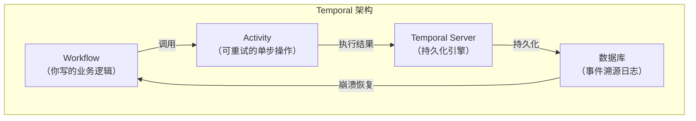

# 01 · Durable Agent Execution（持久化执行）

> 阶段：6 前沿 · 难度：⭐⭐⭐⭐⭐ · 预计：持续
> 前置：[阶段 5 毕业](../阶段5-架构师/06-项目P5-企业客服平台.md)
> 产出：深入掌握持久化 Agent 执行——2026 最热的可靠性方案

---

## 为什么这是最高优先级前沿

> 来源：[行业调研](../调研/00-Agent架构师行业调研-2026.md) + [Temporal 官方博客](https://temporal.io/blog/from-ai-hype-to-durable-reality-why-agentic-flows-need-distributed-systems)

Temporal 官方标题直白：**《From AI Hype to Durable Reality》**。Agent 需要分布式系统的纪律——durability、retries、idempotency。

**核心价值**：
- Agent 执行到第 5 步崩溃 → 从第 5 步自动恢复（不重做前 4 步）
- 每一步都持久化 → 不会因为进程重启而丢失
- 内置重试 + 补偿 → 不用手写

**为什么 Java 工程师应该特别关注**：

| 普通应用失败 | Agent 失败 | 区别 |
|-------------|-----------|------|
| 请求重发即可 | Agent 可能已执行了不可逆操作 | 必须幂等 |
| 失败快，用户重试 | Agent 执行长（分钟级），用户不愿等 | 需要 checkpoint |
| 状态简单 | Agent 状态 = 对话历史 + 工具结果 + 决策树 | 需要持久化执行 |

---

## 深入 Temporal

### 核心概念



| 概念 | 类比 | Agent 中的角色 |
|------|------|--------------|
| **Workflow** | 一个 Java 方法 | Agent 的完整任务流程 |
| **Activity** | 一个 RPC 调用 | Agent 调用的工具（LLM / 文件 / API） |
| **Signal** | 异步事件 | 用户中途介入（确认 / 取消） |
| **Query** | 只读查询 | 查看 Agent 当前进度 |
| **Event Sourcing** | 会计账本 | 每一步都有不可篡改的记录 |

### 完整 Agent 工作流示例

```java
package com.example.workflow;

import io.temporal.activity.ActivityInterface;
import io.temporal.activity.ActivityMethod;
import io.temporal.workflow.*;
import io.temporal.common.RetryOptions;
import java.time.Duration;

// ============ Activity 定义（每个方法是可重试的原子操作） ============

@ActivityInterface
public interface AgentActivities {

    @ActivityMethod
    String classifyIntent(String query, String tenantId);

    @ActivityMethod
    String searchKnowledge(String intent, String tenantId);

    @ActivityMethod
    String queryOrders(String intent, String tenantId);

    @ActivityMethod
    String generateReply(String knowledge, String orders, String query);

    @ActivityMethod
    boolean evaluateReply(String reply, String query);

    @ActivityMethod
    String improveReply(String reply, String feedback);

    @ActivityMethod
    void auditLog(String tenantId, String query, String reply);

    @ActivityMethod
    void notifyUser(String userId, String message);
}

// ============ Workflow 定义（Agent 的完整任务流程） ============

@WorkflowInterface
public interface AgentWorkflow {

    @WorkflowMethod
    String handleCustomerQuery(String userQuery, String tenantId, String userId);

    @SignalMethod
    void approveAction(String actionId);

    @SignalMethod
    void cancel();

    @QueryMethod
    String getCurrentStatus();
}

// ============ Workflow 实现 ============

public class AgentWorkflowImpl implements AgentWorkflow {

    private final AgentActivities activities =
        Workflow.newActivityStub(AgentActivities.class,
            ActivityOptions.newBuilder()
                .setStartToCloseTimeout(Duration.ofSeconds(30))
                .setRetryOptions(RetryOptions.newBuilder()
                    .setInitialInterval(Duration.ofSeconds(1))
                    .setMaximumInterval(Duration.ofSeconds(10))
                    .setMaximumAttempts(3)     // Activity 级别：自动重试 3 次
                    .build())
                .build());

    private String currentStatus = "STARTED";
    private boolean cancelled = false;
    private final java.util.Map<String, Boolean> approvals = new java.util.concurrent.ConcurrentHashMap<>();

    @Override
    public String handleCustomerQuery(String query, String tenantId, String userId) {
        try {
            // === Step 1：意图分类 ===
            currentStatus = "CLASSIFYING_INTENT";
            String intent = activities.classifyIntent(query, tenantId);
            // ↑ 如果这里崩溃，Temporal 重启后跳过这一步，直接用缓存结果

            // === Step 2：并行收集信息 ===
            currentStatus = "GATHERING_INFO";
            // Temporal 的并行：两个 Activity 同时执行，都持久化
            io.temporal.promise.Promise<String> knowledgeResult =
                io.temporal.workflow.Async.function(activities::searchKnowledge, intent, tenantId);
            io.temporal.promise.Promise<String> orderResult =
                io.temporal.workflow.Async.function(activities::queryOrders, intent, tenantId);

            // 等待两个分支完成
            String knowledge = knowledgeResult.get();
            String orders = orderResult.get();

            // === Step 3：生成回复 ===
            currentStatus = "GENERATING_REPLY";
            String reply = activities.generateReply(knowledge, orders, query);

            // === Step 4：Evaluator-Optimizer 循环 ===
            currentStatus = "EVALUATING";
            int maxIterations = 3;
            for (int i = 0; i < maxIterations; i++) {
                boolean pass = activities.evaluateReply(reply, query);
                if (pass) break;

                // 评估不通过 → 改进 → 重新评估
                currentStatus = "IMPROVING (iteration " + (i + 1) + ")";
                reply = activities.improveReply(reply, "质量不够，请改进");
            }

            // === Step 5：人在回路确认（如果是高风险操作） ===
            if (intent.contains("REFUND") || intent.contains("CANCEL_ORDER")) {
                currentStatus = "WAITING_FOR_APPROVAL";
                activities.notifyUser(userId, "需要确认：" + reply);

                // 等待用户通过 Signal 确认
                if (!waitForApproval(Duration.ofMinutes(5))) {
                    currentStatus = "TIMEOUT";
                    return "确认超时，已取消";
                }

                if (cancelled) {
                    currentStatus = "CANCELLED";
                    return "用户取消了操作";
                }
            }

            // === Step 6：审计 ===
            currentStatus = "AUDITING";
            activities.auditLog(tenantId, query, reply);

            currentStatus = "COMPLETED";
            return reply;

        } catch (Exception e) {
            currentStatus = "FAILED: " + e.getMessage();
            // 补偿事务
            activities.auditLog(tenantId, query, "FAILED: " + e.getMessage());
            throw e;
        }
    }

    @Override
    public void approveAction(String actionId) {
        approvals.put(actionId, true);
    }

    @Override
    public void cancel() {
        cancelled = true;
    }

    @Override
    public String getCurrentStatus() {
        return currentStatus;  // 前端可以 Query 当前状态
    }

    private boolean waitForApproval(Duration timeout) {
        long deadline = System.currentTimeMillis() + timeout.toMillis();
        while (System.currentTimeMillis() < deadline) {
            if (cancelled) return false;
            if (approvals.values().stream().anyMatch(v -> v)) return true;
            Workflow.sleep(Duration.ofSeconds(2));
        }
        return false;
    }
}
```

### 崩溃恢复验证

```java
// 测试崩溃恢复
@TemporalTest
class AgentWorkflowRecoveryTest {

    @Test
    @DisplayName("Step 3 崩溃后从 Step 3 恢复")
    void recoveryFromStep3() {
        // 1. 启动工作流
        String workflowId = "test-recovery-1";
        client.start(AgentWorkflow::handleCustomerQuery, "我要退款", "tenant-1", "user-1");

        // 2. 等 Step 2 完成后 kill worker
        Thread.sleep(5000); // 等 Step 1, 2 完成
        worker.stop();      // 模拟崩溃！

        // 3. Step 3 的 Activity 结果未持久化
        // 4. 重启 worker
        worker.start();

        // 5. Temporal 自动恢复：跳过 Step 1, 2（已有结果），从 Step 3 重新执行
        String result = client.getWorkflowResult(workflowId, String.class, Duration.ofMinutes(1));
        assertNotNull(result);
        assertFalse(result.contains("FAILED"));
    }
}
```

**崩溃恢复场景**：

| 崩溃位置 | 恢复行为 | 用户感知 |
|---------|---------|---------|
| classifyIntent 之后 | 跳过已完成的步骤，从搜索知识库开始 | 几秒延迟，无感知 |
| generateReply 之后 | 跳过生成，从评估开始 | 可能看到"正在恢复" |
| auditLog 之后 | 工作流已完成，无需恢复 | 无影响 |
| 等待确认时 | 继续等待确认（不丢失 Signal） | 无影响 |
| Activity 执行中 | Activity 级别重试（不是 Workflow 级别） | 可能几秒延迟 |

---

## Restate 替代方案

> Restate 是 Temporal 的轻量替代，更适合 Agent 场景：
> - 内置 Java SDK
> - 更简单的编程模型（不需要 Activity/Workflow 分离）
> - 原生支持 LLM 调用的持久化
> - 更低运营成本（单二进制部署 vs Temporal 的多组件）

```java
// Restate 版的 Agent 工作流（更简洁）
import dev.restate.sdk.workflow.WorkflowContext;
import dev.restate.sdk.workflow.Workflow;

public class AgentWorkflow extends Workflow<String> {

    @Override
    public String run(WorkflowContext ctx, String input) {
        // Restate 自动持久化每一步——不需要显式定义 Activity

        // LLM 调用（Restate 会持久化调用参数和结果）
        String intent = ctx.run("classify", () -> classifyIntent(input));

        // 并行
        String knowledge = ctx.run("search", () -> searchKnowledge(intent));
        String orders = ctx.run("orders", () -> queryOrders(intent));

        // 生成 + 评估循环
        String reply = ctx.run("generate", () -> generateReply(knowledge, orders));
        for (int i = 0; i < 3; i++) {
            boolean pass = ctx.run("evaluate", () -> evaluateReply(reply));
            if (pass) break;
            reply = ctx.run("improve", () -> improveReply(reply));
        }

        return reply;
    }
}
```

### Temporal vs Restate 选型

| 维度 | Temporal | Restate |
|------|----------|---------|
| 成熟度 | ⭐⭐⭐⭐⭐ 生产级 | ⭐⭐⭐ 快速成长中 |
| 编程模型 | Activity/Workflow 分离 | 统一函数式 |
| 运营复杂度 | 高（多组件 + DB） | 低（单二进制） |
| Java SDK | ⭐⭐⭐⭐⭐ 完善 | ⭐⭐⭐ 成长中 |
| 社区/生态 | 大 | 小但活跃 |
| **推荐场景** | 大规模企业级 Agent 平台 | 中小型 Agent 应用 |

---

## 持久化执行 vs 普通执行对比

| 场景 | 普通执行 | 持久化执行 |
|------|---------|-----------|
| Agent 崩溃 | 全部重来 | 从崩溃点恢复 |
| 超时重试 | 手写 try-catch | Activity 级别自动重试 |
| 并行任务 | 手写 CompletableFuture | 框架管理 Promise |
| 人在回路 | 手写 SSE + 超时 | Signal + 自动等待 |
| 审计追溯 | 手写日志 | Event Sourcing 自动记录 |
| 补偿事务 | 手写 | Workflow 异常处理 |

---

## 验收检查

- [ ] 理解持久化执行 vs 普通执行的区别
- [ ] 能用 Temporal 写一个 Agent 工作流
- [ ] 测试过崩溃恢复（kill 进程后自动恢复）
- [ ] 理解每一步 checkpoint 的意义
- [ ] 能使用 Signal 实现人在回路
- [ ] 能用 Query 查看实时状态
- [ ] 了解 Restate 作为轻量替代方案

---

## 下一步

→ 下一篇：[02 Context Engineering 深水区](02-ContextEngineering深水区.md)
