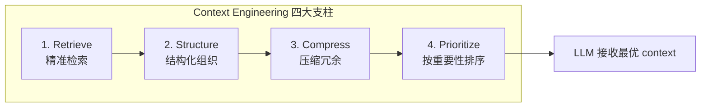

# 02 · Context Engineering 深水区

> 阶段：6 前沿 · 难度：⭐⭐⭐⭐⭐ · 预计：持续
> 前置：[01 Durable Agent Execution](01-DurableAgentExecution.md)

---

## 2026 前沿方向

> 来源：[行业调研](../调研/00-Agent架构师行业调研-2026.md)——**Agent 自主管理自己的 context budget** 是 2026 新趋势。
> [FP8.co](https://fp8.co/articles/Context-Engineering-for-AI-Agents) 报告：完整上下文工程可降低成本 **10x**。

### 1. 自主 Context Budget

Agent 自己决定保留哪些历史、丢弃哪些——而不是工程师写死窗口策略：

```java
package com.example.context;

import org.springframework.ai.chat.client.ChatClient;
import org.springframework.ai.chat.messages.*;
import org.springframework.stereotype.Component;
import java.util.List;

/**
 * 自主上下文管理——Agent 自己决定保留什么
 *
 * 借鉴 Claude Code 的 self-reflection 机制：
 * Agent 定期回顾自己的上下文，主动压缩不重要部分。
 */
@Component
public class AutonomousContextManager {

    private final ChatClient planner;

    /**
     * LLM 自主回顾上下文，决定如何压缩
     *
     * 返回压缩策略：哪些消息保留，哪些合并，哪些丢弃
     */
    public CompactionPlan plan(List<Message> messages, int currentTokens, int budget) {
        if (currentTokens <= budget) {
            return CompactionPlan.noCompaction();
        }

        // 把消息列表交给 LLM，让它自己决定重要性
        String planJson = planner.prompt()
            .system("""
                你是上下文管理器。当前对话占 %d token，预算 %d token，需要释放 %d token。

                回顾以下对话历史，制定压缩计划。
                输出 JSON：
                {
                  "keepOriginal": [消息编号列表],  // 保留原文
                  "summarize": [消息编号列表],     // 合并为摘要
                  "drop": [消息编号列表]           // 丢弃
                }

                判断原则：
                - 最近 5 轮保留原文
                - 包含关键决策/约束的保留原文
                - 工具大段输出可折叠
                - 寒暄/确认/重复丢弃
                """.formatted(currentTokens, budget, currentTokens - budget))
            .user(formatMessages(messages))
            .call()
            .content();

        return parsePlan(planJson);
    }

    /**
     * 压缩执行工具——让 Agent 主动压缩
     */
    @org.springframework.ai.tool.annotation.Tool(description =
        "主动压缩对话上下文。当你感觉到上下文中有冗余信息时，调用此工具。"
        + "keepMessages 是你想保留的消息编号列表，其余会被压缩为摘要。")
    public String compactContext(String keepMessages) {
        // Agent 自主调用——这是上下文工程的前沿：
        // 不是工程师写死窗口策略，而是 Agent 自己感知到冗余时主动清理
        List<Integer> keepIds = java.util.Arrays.stream(keepMessages.split(","))
            .map(String::trim)
            .map(Integer::parseInt)
            .toList();

        // 执行压缩逻辑
        performCompaction(keepIds);

        return "上下文已压缩。保留了 " + keepIds.size() + " 条消息，其余合并为摘要。";
    }

    public record CompactionPlan(
        List<Integer> keepOriginal,
        List<Integer> summarize,
        List<Integer> drop
    ) {
        static CompactionPlan noCompaction() {
            return new CompactionPlan(List.of(), List.of(), List.of());
        }
    }
}
```

### 2. KV Cache 优化——深入 Provider 层

```
理解 Provider（DeepSeek/OpenAI/Anthropic）的 KV Cache 机制：

什么是 KV Cache？
  - LLM 推理时，对 prompt 的每个 token 计算 Key/Value 向量
  - 如果下次请求的前缀相同，可以直接复用缓存
  - 节省的不是"钱"而是"计算时间"（TTFT 降低 30-60%）

DeepSeek Context Caching（自动）：
  - DeepSeek API 自动启用 prefix caching
  - 相同前缀的 prompt 自动命中缓存
  - 缓存命中部分的价格更低（约 0.1x）

Anthropic Prompt Caching（手动标记）：
  - 需要在 API 请求中添加 cache_control 标记
  - system prompt + tool 定义标记为缓存
  - 缓存存活 5 分钟（或最后使用后 1 小时）

最佳实践：
  1. System prompt 放在最前面（不变 → 始终命中缓存）
  2. Tool 定义紧跟 system prompt（不变 → 始终命中缓存）
  3. 对话历史放后面（变化 → 不命中缓存）
  4. 新消息放最后
```

```java
// DeepSeek 的 prefix caching 优化
@Component
public class CacheOptimizedPromptBuilder {

    /**
     * 构建 prompt 时，把不变部分放在前面，变化部分放在后面
     * 这样不变部分能命中 KV Cache
     */
    public String buildPrompt(String systemPrompt, List<String> toolDefs,
                               String conversationHistory, String newMessage) {
        var sb = new StringBuilder();

        // 1. 不变：System prompt（始终命中缓存）
        sb.append(systemPrompt).append("\n\n");

        // 2. 不变：Tool 定义（始终命中缓存）
        sb.append("== Tools ==\n");
        toolDefs.forEach(sb::append);

        // 3. 半变：对话历史（最近几轮变化 → 前缀可能命中）
        sb.append("\n== Conversation ==\n");
        sb.append(conversationHistory);

        // 4. 变化：新消息（不命中缓存）
        sb.append("\n== New Message ==\n");
        sb.append(newMessage);

        return sb.toString();
    }

    /**
     * 监控 KV Cache 命中率（通过 usage 返回的 cached_tokens）
     */
    public void trackCacheMetrics(int promptTokens, int cachedTokens) {
        double hitRate = (double) cachedTokens / promptTokens;
        if (hitRate < 0.3) {
            log.warn("⚠️ KV Cache 命中率低：%.1f%%（prompt 结构可能有问题）".formatted(hitRate * 100));
        }
        log.info("Cache hit rate: %.1f%% (cached=%d/%d)".formatted(
            hitRate * 100, cachedTokens, promptTokens));
    }
}
```

### 3. Tool Masking 动态化

```java
package com.example.context;

import org.springframework.ai.tool.annotation.Tool;
import org.springframework.stereotype.Component;
import java.util.*;

/**
 * 动态工具选择——根据当前任务阶段只注册必要的工具
 *
 * 借鉴 Claude Code 的 ConditionalToolRegistration：
 * 不同阶段暴露不同工具子集 → 减少 tool definition token 开销
 */
@Component
public class DynamicToolSelector {

    // 每个工具定义在 prompt 中占用约 200-500 token
    // 注册 20 个工具 = 4-10K token 开销！
    // 如果当前阶段只需要 3 个工具，省掉的就是 3.5-8.5K token

    /**
     * 按任务阶段规划需要的工具
     */
    public Set<String> planToolsForPhase(TaskPhase phase) {
        return switch (phase) {
            case EXPLORING -> Set.of(    // 探索阶段：只需要只读工具
                "read_file", "grep", "glob", "git_diff"
            );
            case IMPLEMENTING -> Set.of(  // 实现阶段：需要编辑工具
                "read_file", "edit_file", "write_file", "bash"
            );
            case TESTING -> Set.of(       // 测试阶段：只需要运行命令
                "bash", "read_file"
            );
            case REVIEWING -> Set.of(     // 评审阶段：只需要读取和搜索
                "read_file", "grep", "git_diff", "delegate_subtask"
            );
        };
    }

    public enum TaskPhase {
        EXPLORING,    // 理解需求、读代码
        IMPLEMENTING, // 写代码
        TESTING,      // 运行测试
        REVIEWING     // 代码评审
    }
}
```

### 4. Semantic Compression 语义压缩

```java
package com.example.context;

import org.springframework.ai.chat.client.ChatClient;
import org.springframework.stereotype.Component;

/**
 * 语义压缩——不只是截断，而是保留信息量的压缩
 *
 * 普通截断："文件有 1000 行，只显示前 50 行"（丢失 95% 信息）
 * 语义压缩："这 1000 行是一个 CRUD Service，
 *            主要方法是 create/read/update/delete，
 *            使用了 JdbcTemplate，没有事务管理"（保留 90% 信息量，10% token）
 */
@Component
public class SemanticCompressor {

    private final ChatClient compressor;

    /**
     * 语义压缩工具输出
     */
    @Tool(description = "压缩一大段文本，保留关键信息。"
         + "适用于工具返回的大段输出（如文件内容、日志、搜索结果）。"
         + "keepInfo 是你想保留的信息要点。")
    public String compress(String text, String keepInfo) {
        return compressor.prompt()
            .system("""
                你是语义压缩器。把输入文本压缩为简洁摘要。

                压缩规则：
                - 保留 %s 中指定的信息
                - 保留具体的数值、名称、路径
                - 丢弃重复内容、示例代码、注释
                - 输出不超过 10 行
                """.formatted(keepInfo))
            .user(text)
            .call()
            .content();
    }

    /**
     * 代码文件的结构化压缩
     */
    @Tool(description = "提取 Java 文件的结构摘要（不保留实现细节）。")
    public String summarizeStructure(String fileContent) {
        return compressor.prompt()
            .system("""
                提取 Java 文件的结构摘要。格式：
                - 类名 + 类型（class/interface/enum/record）
                - 继承关系
                - 字段列表（名称 + 类型）
                - 方法签名列表（不含实现体）
                - 注解列表

                不保留方法实现体。
                """)
            .user(fileContent)
            .call()
            .content();
    }
}
```

---

## Sourcegraph 四大支柱

> 来源：[Sourcegraph Context Engineering 指南](https://sourcegraph.com/blog/context-engineering)



| 支柱 | 做什么 | 工具 | 示例 |
|------|-------|------|------|
| **Retrieve** | 找到与任务相关的信息 | 向量检索 + grep + 符号搜索 | " UserService 的所有方法" |
| **Structure** | 把检索到的信息结构化组织 | 分层注入（system→project→code→conversation） | 项目指令在前，对话在后 |
| **Compress** | 压缩冗余但保留信息量 | LLM 摘要 + 结构提取 | 1000 行代码 → 10 行摘要 |
| **Prioritize** | 按重要性分配 token 预算 | Budget Manager | 最近对话 > 历史摘要 > 工具输出 |

---

## 成本影响量化

| 技术 | Token 节省 | 成本节省 | TTFT 改善 |
|------|----------|---------|----------|
| Prefix Caching | N/A（缓存命中） | 30-80% | 30-60% |
| Tool Masking | 4-8K/请求 | 10-20% | 5-15% |
| 语义压缩 | 50-90%（历史部分） | 20-40% | 20-40% |
| 自主 Context Budget | 动态 | 15-30% | 10-20% |
| **综合效果** | — | **最高 10x** | **最高 3x** |

---

## 验收检查

- [ ] 理解 KV Cache 机制，能监控 cache hit rate
- [ ] 理解 prompt 结构对 cache 命中率的影响
- [ ] 能实现动态工具选择
- [ ] 能实现语义压缩（不只是截断）
- [ ] 了解自主 Context Budget 的前沿方向
- [ ] 掌握 Sourcegraph 四大支柱

---

## 下一步

→ 下一篇：[03 AI SRE 自治](03-AISRE自治.md)
