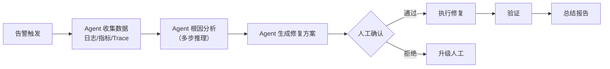

# 03 · AI SRE 自治

> 阶段：6 前沿 · 难度：⭐⭐⭐⭐ · 预计：持续

> 来源：[行业调研](../调研/00-Agent架构师行业调研-2026.md)——Fortune 500 已在用 AI Agent 自主调查生产事故，SRE 从操作者变成自治系统架构师。这是 Java 工程师的高价值交叉领域。

## 核心概念

SRE + AI = Agent 自主调查生产事故：
1. 告警触发 → Agent 收集日志/指标/Trace
2. Agent 分析根因（多步推理）
3. Agent 生成修复方案（人在回路确认）
4. 执行修复 → 验证 → 总结

## 为什么是 Java 工程师的高价值领域

- SRE 是运维，需要分布式系统知识 → Java 工程师强项
- AI Agent 需要可靠性设计 → 阶段 4 已学
- 这个交叉领域的人才极其稀缺

## 下一步

→ 下一篇：[04 MCP Hub 与工具市场](04-MCPHub与工具市场.md)
