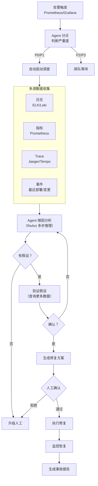

# 03 · AI SRE 自治

> 阶段：6 前沿 · 难度：⭐⭐⭐⭐ · 预计：持续

> 来源：[行业调研](../调研/00-Agent架构师行业调研-2026.md)——Fortune 500 已在用 AI Agent 自主调查生产事故，SRE 从操作者变成自治系统架构师。这是 Java 工程师的高价值交叉领域。
> [Traversal](https://www.traversal.com/blog/ai-for-sre-site-reliability-engineering-aisre)、[Rootly](https://rootly.com/sre/sre-5-years-ai-first-reliability-autonomous-ops)

---

## 核心概念

SRE + AI = Agent 自主调查生产事故：

1. 告警触发 → Agent 收集日志/指标/Trace
2. Agent 分析根因（多步推理）
3. Agent 生成修复方案（人在回路确认）
4. 执行修复 → 验证 → 总结



---

## 完整实现

### Step 1：SRE Agent 的工具集

```java
package com.example.aisre;

import org.springframework.ai.tool.annotation.Tool;
import org.springframework.stereotype.Component;
import java.util.List;
import java.util.Map;

/**
 * SRE Agent 工具集——每个工具对接一个可观测性数据源
 *
 * 工具设计原则（来自 Claude Code）：
 * - 工具返回结构化数据（不是原始 JSON dump）
 * - 返回的数据有摘要 + 详情两层
 * - 错误返回给 Agent（不崩溃）
 */
@Component
public class SRETools {

    // ============ 日志查询工具 ============

    @Tool(description = "查询最近 N 分钟的 ERROR 级别日志。"
         + "service 是服务名称，minutes 是时间窗口（默认 30 分钟）。"
         + "返回错误摘要和前 10 条错误日志。")
    public String queryErrorLogs(String service, int minutes) {
        try {
            // 实际对接 Loki/ELK/CloudWatch
            List<Map<String, Object>> logs = logClient.query(
                "{service=\"" + service + "\"} |= \"ERROR\" | json", minutes);

            if (logs.isEmpty()) {
                return "✅ 最近 " + minutes + " 分钟内没有 ERROR 日志";
            }

            // 生成摘要（不让 Agent 处理原始日志）
            var summary = new StringBuilder();
            summary.append("找到 ").append(logs.size()).append(" 条 ERROR 日志：\n\n");

            // 按错误类型分组统计
            Map<String, Long> errorTypes = logs.stream()
                .collect(java.util.stream.Collectors.groupingBy(
                    l -> (String) l.getOrDefault("error_type", "unknown"),
                    java.util.stream.Collectors.counting()));

            summary.append("错误类型分布：\n");
            errorTypes.entrySet().stream()
                .sorted(Map.Entry.<String, Long>comparingByValue().reversed())
                .forEach(e -> summary.append("  - ").append(e.getKey())
                    .append(": ").append(e.getValue()).append(" 次\n"));

            // 前 10 条详情
            summary.append("\n前 10 条错误：\n");
            logs.stream().limit(10).forEach(l ->
                summary.append("  [").append(l.get("timestamp")).append("] ")
                       .append(l.get("message")).append("\n"));

            return summary.toString();
        } catch (Exception e) {
            return "⚠️ 日志查询失败：" + e.getMessage();
        }
    }

    // ============ 指标查询工具 ============

    @Tool(description = "查询服务的关键指标。"
         + "metrics 可选：cpu, memory, latency_p99, error_rate, throughput。"
         + "返回最近 30 分钟的趋势数据。")
    public String queryMetrics(String service, String metric) {
        try {
            // 实际对接 Prometheus
            String promQL = switch (metric) {
                case "cpu" -> "rate(container_cpu_usage_seconds_total{service=\"" + service + "\"}[5m])";
                case "memory" -> "container_memory_usage_bytes{service=\"" + service + "\"}";
                case "latency_p99" -> "histogram_quantile(0.99, rate(http_request_duration_bucket{service=\"" + service + "\"}[5m]))";
                case "error_rate" -> "rate(http_requests_total{service=\"" + service + "\",status=~\"5..\"}[5m])";
                case "throughput" -> "rate(http_requests_total{service=\"" + service + "\"}[5m])";
                default -> return "⚠️ 未知指标：" + metric;
            };

            var data = prometheusClient.queryRange(promQL, "30m");

            // 生成趋势摘要
            return formatMetricTrend(metric, data);
        } catch (Exception e) {
            return "⚠️ 指标查询失败：" + e.getMessage();
        }
    }

    // ============ Trace 查询工具 ============

    @Tool(description = "查询服务的慢请求 Trace。"
         + "threshold 是慢请求阈值（毫秒），返回前 5 条最慢的请求链路。")
    public String querySlowTraces(String service, int thresholdMs) {
        try {
            // 实际对接 Jaeger/Tempo
            var traces = traceClient.findSlowTraces(service, thresholdMs, 5);

            if (traces.isEmpty()) {
                return "✅ 没有超过 " + thresholdMs + "ms 的慢请求";
            }

            var summary = new StringBuilder();
            summary.append("找到 ").append(traces.size()).append(" 条慢请求：\n\n");

            for (var trace : traces) {
                summary.append("Trace ID: ").append(trace.id()).append("\n");
                summary.append("  总耗时: ").append(trace.duration()).append("ms\n");
                summary.append("  Span 数: ").append(trace.spanCount()).append("\n");

                // 找出最慢的 Span
                var slowest = trace.spans().stream()
                    .max(java.util.Comparator.comparingLong(s -> s.duration()))
                    .orElse(null);
                if (slowest != null) {
                    summary.append("  最慢 Span: ").append(slowest.name())
                           .append(" (").append(slowest.duration()).append("ms)\n");
                }

                summary.append("  根因 Span: ").append(trace.rootSpan().name()).append("\n\n");
            }

            return summary.toString();
        } catch (Exception e) {
            return "⚠️ Trace 查询失败：" + e.getMessage();
        }
    }

    // ============ 变更查询工具 ============

    @Tool(description = "查询服务最近的变更记录（部署、配置修改、扩缩容）。"
         + "hours 是查询时间窗口（默认 6 小时）。")
    public String queryRecentChanges(String service, int hours) {
        try {
            var changes = changeClient.query(service, hours);

            if (changes.isEmpty()) {
                return "✅ 最近 " + hours + " 小时内没有变更记录";
            }

            var summary = new StringBuilder();
            summary.append("最近 ").append(hours).append(" 小时内的变更：\n\n");

            for (var change : changes) {
                summary.append("[").append(change.timestamp()).append("] ")
                       .append(change.type()).append(": ").append(change.description()).append("\n");
                summary.append("  操作人: ").append(change.actor()).append("\n");
                summary.append("  版本: ").append(change.version()).append("\n\n");
            }

            return summary.toString();
        } catch (Exception e) {
            return "⚠️ 变更查询失败：" + e.getMessage();
        }
    }

    // ============ 执行修复工具（危险！需要确认） ============

    @Tool(description = "执行修复操作。action 可以是：restart, rollback, scale_up, scale_down。"
         + "⚠️ 这是危险操作，需要人工确认。")
    public String executeRemediation(String service, String action, String params) {
        // 实际执行需要 PermissionAdvisor 确认
        try {
            return switch (action) {
                case "restart" -> k8sClient.restartService(service);
                case "rollback" -> k8sClient.rollback(service, params);
                case "scale_up" -> k8sClient.scale(service,
                    Integer.parseInt(params));
                default -> "⚠️ 未知修复操作：" + action;
            };
        } catch (Exception e) {
            return "⚠️ 修复执行失败：" + e.getMessage();
        }
    }

    private String formatMetricTrend(String metric, List<Object[]> data) {
        if (data.isEmpty()) return "无数据";
        var first = (Number) data.get(0)[1];
        var last = (Number) data.get(data.size() - 1)[1];
        var max = data.stream().mapToDouble(d -> ((Number) d[1]).doubleValue()).max().orElse(0);
        var min = data.stream().mapToDouble(d -> ((Number) d[1]).doubleValue()).min().orElse(0);
        var trend = last.doubleValue() > first.doubleValue() ? "↑ 上升" : "↓ 下降";

        return """
            指标：%s
            当前值：%s
            范围：%s ~ %s
            趋势：%s（从 %s 到 %s）
            """.formatted(metric, last, min, max, trend, first, last);
    }
}
```

### Step 2：SRE Agent 系统提示词

```java
/**
 * SRE Agent 系统提示词——ReAct 推理模式
 */
public static final String SRE_SYSTEM_PROMPT = """
    你是一个 AI SRE Agent。你的职责是自主调查生产事故。

    == 工作流程 ==
    1. 分诊：判断告警严重度，决定是否自动调查
    2. 收集：查询日志、指标、Trace、变更记录
    3. 分析：多步推理，形成根因假设
    4. 验证：查询更多数据验证假设
    5. 方案：生成修复方案，说明操作和风险
    6. 确认：等待人工确认后才执行修复
    7. 总结：生成事故报告

    == 推理原则 ==
    - 每步只做一件事，观察结果后再决定下一步
    - 形成假设后必须验证，不要跳到结论
    - 如果数据不足以判断，明确说"需要更多数据"
    - 修复操作必须说明风险和回滚方案

    == 安全原则 ==
    - restart/rollback 等操作必须人工确认
    - 永远不要自动执行未经确认的修复
    - 如果不确定，升级人工处理

    == 输出格式 ==
    调查过程用 markdown，最终报告包含：
    ## 事故摘要
    ## 根因分析
    ## 影响范围
    ## 修复方案（含风险和回滚）
    ## 验证结果
    """;
```

---

## 为什么是 Java 工程师的高价值领域

| 维度 | SRE 要求 | Java 工程师优势 |
|------|---------|---------------|
| 分布式系统 | 理解微服务、消息队列、数据库 | **核心能力** |
| 可观测性 | 日志/指标/Trace | 有日志框架使用经验 |
| 故障排查 | 根因分析 | 有 debugging 经验 |
| 可靠性工程 | 重试/熔断/限流 | 阶段4已学 |
| Agent 构建 | 工具体系 + ReAct | 阶段3已学 |

**这个交叉领域的人才极其稀缺**——既懂 SRE 又懂 AI Agent 的工程师非常少。

---

## 行业实践参考

| 公司 | 实践 | 效果 |
|------|------|------|
| Fortune 500 | AI Agent 自主调查事故 | MTTR 降低 40-60% |
| Rootly | AI 辅助事故响应 | 事故报告生成时间从 2h → 15min |
| Traversal | AI SRE 自治系统 | SRE 从操作者变成架构师 |

---

## 验收检查

- [ ] 理解 AI SRE 的工作流程（分诊→收集→分析→验证→修复→总结）
- [ ] 能为 SRE Agent 设计合适的工具集
- [ ] 理解 ReAct 模式在故障排查中的应用
- [ ] 能实现人在回路的修复确认
- [ ] 了解行业实践和 MTTR 改善效果

---

## 下一步

→ 下一篇：[04 MCP Hub 与工具市场](04-MCPHub与工具市场.md)
