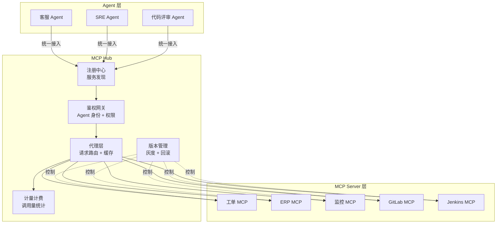

# 04 · MCP Hub 与工具市场

> 阶段：6 前沿 · 难度：⭐⭐⭐⭐ · 预计：持续

> 来源：[行业调研](../调研/00-Agent架构师行业调研-2026.md)——MCP 工具市场形成是企业级 Agent 平台的标配。

---

## 核心问题

企业内部会快速涌现大量 MCP Server（工单系统、ERP、CRM、监控、Jenkins、GitLab……）。如果没有统一管理，会出现：

| 问题 | 后果 |
|------|------|
| 每个 Agent 各自连接 MCP Server | 连接数爆炸，无法审计 |
| 工具升级破坏旧 Agent | 生产事故 |
| 无法控制谁有权用哪个工具 | 安全漏洞 |
| 无法计量工具使用量 | 成本黑洞 |
| Agent 不知道有哪些工具可用 | 能力浪费 |

**MCP Hub** 就是解决这些问题的统一管理层。

---

## Hub 架构



---

## Hub 核心能力实现

### Step 1：MCP Server 注册模型

```java
package com.example.mcphub;

import java.time.Instant;
import java.util.List;

/**
 * MCP Server 注册信息
 */
public record McpServerRegistration(
    String serverId,           // 唯一 ID
    String name,               // 人类可读名称
    String description,        // 描述
    String endpoint,           // MCP Server 地址
    String version,            // 版本号
    List<String> tools,        // 提供的工具列表
    List<String> capabilities, // 能力列表（tools/resources/prompts）
    AuthConfig authConfig,     // 认证配置
    HealthStatus health,       // 健康状态
    Instant registeredAt       // 注册时间
) {
    public record AuthConfig(String type, String token) {}
    public record HealthStatus(boolean healthy, String lastChecked, int errorRate) {}
}
```

### Step 2：MCP Hub 服务

```java
package com.example.mcphub;

import org.springframework.stereotype.Service;
import java.util.*;
import java.util.concurrent.ConcurrentHashMap;

/**
 * MCP Hub 核心服务
 *
 * 职责：
 * 1. Server 注册与发现
 * 2. Agent 鉴权（不同 Agent 有不同的工具权限）
 * 3. 请求代理与计量
 * 4. 版本管理与灰度
 */
@Service
public class McpHubService {

    private final Map<String, McpServerRegistration> servers = new ConcurrentHashMap<>();
    private final Map<String, AgentPermission> agentPermissions = new ConcurrentHashMap<>();
    private final UsageMeter usageMeter = new UsageMeter();

    /**
     * 注册一个 MCP Server
     */
    public void registerServer(McpServerRegistration registration) {
        servers.put(registration.serverId(), registration);
    }

    /**
     * Agent 发现可用的工具（按权限过滤）
     */
    public List<ToolDescriptor> discoverTools(String agentId) {
        AgentPermission permission = agentPermissions.get(agentId);
        if (permission == null) return List.of();

        return servers.values().stream()
            .filter(s -> s.health().healthy())
            .filter(s -> permission.canAccess(s.serverId()))
            .flatMap(s -> s.tools().stream()
                .map(tool -> new ToolDescriptor(
                    s.serverId(), tool, s.name() + "/" + tool, s.version()
                )))
            .toList();
    }

    /**
     * 代理工具调用（统一鉴权 + 计量 + 缓存）
     */
    public ToolCallResult proxyToolCall(String agentId, String serverId,
                                         String toolName, Map<String, Object> params) {
        // 1. 鉴权
        AgentPermission perm = agentPermissions.get(agentId);
        if (perm == null || !perm.canAccess(serverId)) {
            return ToolCallResult.denied("Agent " + agentId + " 无权访问 " + serverId);
        }

        // 2. 检查 Server 健康
        McpServerRegistration server = servers.get(serverId);
        if (server == null || !server.health().healthy()) {
            return ToolCallResult.error("Server " + serverId + " 不可用");
        }

        // 3. 调用
        long start = System.currentTimeMillis();
        try {
            var result = callMcpServer(server, toolName, params);
            long latency = System.currentTimeMillis() - start;

            // 4. 计量
            usageMeter.record(agentId, serverId, toolName, latency, true);

            return ToolCallResult.success(result);
        } catch (Exception e) {
            long latency = System.currentTimeMillis() - start;
            usageMeter.record(agentId, serverId, toolName, latency, false);
            return ToolCallResult.error(e.getMessage());
        }
    }

    /**
     * 获取用量报告
     */
    public UsageReport getUsageReport(String agentId, String timeRange) {
        return usageMeter.getReport(agentId, timeRange);
    }

    // ... callMcpServer 实现

    public record ToolDescriptor(String serverId, String name, String fullName, String version) {}
    public record ToolCallResult(boolean success, Object data, String error) {
        static ToolCallResult success(Object data) { return new ToolCallResult(true, data, null); }
        static ToolCallResult error(String error) { return new ToolCallResult(false, null, error); }
        static ToolCallResult denied(String reason) { return new ToolCallResult(false, null, "DENIED: " + reason); }
    }
    public record AgentPermission(String agentId, Set<String> allowedServers) {
        boolean canAccess(String serverId) { return allowedServers.contains(serverId); }
    }
}
```

---

## Hub 的核心能力

| 能力 | 说明 | 实现要点 |
|------|------|---------|
| **注册发现** | MCP Server 自动注册，Agent 动态发现 | 心跳检测 + 健康检查 |
| **权限管理** | 不同 Agent 可访问不同 Server | AgentPermission 白名单 |
| **用量计量** | 每个 Agent 调了哪些工具、多少次 | UsageMeter 逐调用记录 |
| **版本管理** | 工具升级不破坏旧 Agent | 语义版本号 + 灰度发布 |
| **多租户** | 不同租户的 Server 隔离 | tenantId 传播 + filterExpression |
| **缓存** | 重复的只读工具调用命中缓存 | Redis + TTL + 参数哈希 |

---

## 行业趋势

> 来源：[行业调研](../调研/00-Agent架构师行业调研-2026.md)——MCP 工具市场形成是企业级 Agent 平台的标配。

- 企业内部 MCP Hub 类似"企业 App Store"
- 第三方 MCP Server 市场正在形成（类似 npm/PyPI 生态）
- 标准化意味着跨框架互操作（LangChain4j / Spring AI / Python Agent 都能接入）

---

## 验收检查

- [ ] 理解为什么需要 MCP Hub（不能每个 Agent 各自连接）
- [ ] 能实现 Server 注册与发现
- [ ] 能实现 Agent 权限控制
- [ ] 能实现工具调用计量
- [ ] 了解版本管理和灰度发布的概念

---

## 下一步

→ 下一篇：[05 领域大模型融合](05-领域大模型融合.md)
