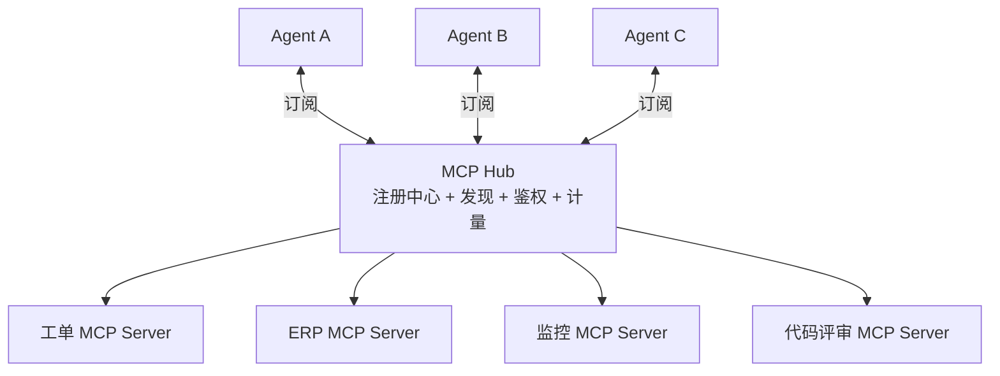

# 04 · MCP Hub 与工具市场

> 阶段：6 前沿 · 难度：⭐⭐⭐⭐ · 预计：持续

## 核心概念

企业内部的 MCP Server 会越来越多（工单系统、ERP、CRM、监控……）。需要一个 **MCP Hub** 做统一管理：

## Hub 的核心能力

| 能力 | 说明 |
|------|------|
| 注册发现 | MCP Server 自动注册，Agent 动态发现 |
| 权限管理 | 不同 Agent 可访问不同 Server |
| 用量计量 | 每个 Agent 调了哪些工具、多少次 |
| 版本管理 | 工具升级不破坏旧 Agent |
| 多租户 | 不同租户的 Server 隔离 |

## 行业趋势

> 来源：[行业调研](../调研/00-Agent架构师行业调研-2026.md)——MCP 工具市场形成是企业级 Agent 平台的标配。

## 下一步

→ 下一篇：[05 领域大模型融合](05-领域大模型融合.md)
