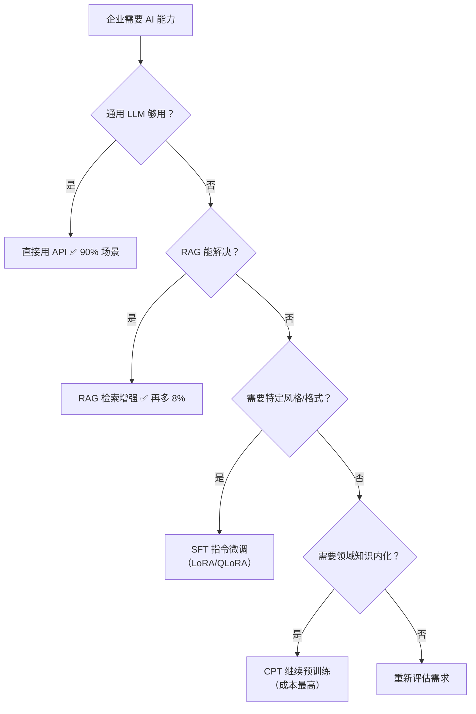

# 05 · 领域大模型融合

> 阶段：6 前沿 · 难度：⭐⭐⭐ · 预计：持续

---

## 核心概念

通用 LLM 不够用时，企业可以训练自己的领域大模型。Java 工程师的角色不是训练模型，而是**数据工程 + Agent 集成**。

### 训练路径决策树



| 路径 | 数据规模 | 工具 | 成本 | Java 工程师角色 |
|------|---------|------|------|---------------|
| **RAG** | 按需 | 向量库 + LLM | ⭐ 低 | **主力方案**（不需要训练） |
| **SFT** | 10K-100K 条 | LoRA/QLoRA | ⭐⭐ 中 | 数据标注 + 评估闭环 |
| **CPT** | 1B-100B token | Megatron/DeepSpeed | ⭐⭐⭐⭐⭐ 极高 | 数据清洗（Spark/Flink） |

> **黄金法则**：先 RAG，不够再 SFT，最后才 CPT。90% 的场景 RAG 就够了。

---

## Agent + 领域模型的混合路由

### 完整实现

```java
package com.example.domain;

import org.springframework.ai.chat.client.ChatClient;
import org.springframework.stereotype.Component;

/**
 * 混合模型路由器
 *
 * 通用问题用通用模型（成本低），
 * 专业问题用领域模型（质量高）。
 */
@Component
public class HybridModelRouter {

    private final ChatClient generalModel;    // DeepSeek/GPT
    private final ChatClient domainModel;      // 企业微调的模型
    private final ChatModelClassifier classifier;

    /**
     * 路由决策
     */
    public ChatClient route(String query, String tenantId) {
        ModelType type = classifier.classify(query);

        return switch (type) {
            case GENERAL -> generalModel;
            case DOMAIN_SPECIFIC -> domainModel;
            case HYBRID -> {
                // 先用领域模型提取专业信息
                String domainInfo = domainModel.prompt()
                    .user("提取这段查询中的专业知识点：" + query)
                    .call().content();
                // 再用通用模型组织回答
                // （这个场景在下面 combineModels 中实现）
                yield generalModel;
            }
        };
    }

    public enum ModelType {
        GENERAL,          // 通用问题
        DOMAIN_SPECIFIC,  // 专业问题
        HYBRID            // 混合
    }
}

/**
 * 查询分类器——判断用哪个模型
 */
@Component
class ChatModelClassifier {

    /**
     * 快速分类（用一个轻量模型判断查询类型）
     */
    public HybridModelRouter.ModelType classify(String query) {
        // 方案1：规则匹配（最快）
        if (containsDomainTerms(query)) {
            return HybridModelRouter.ModelType.DOMAIN_SPECIFIC;
        }

        // 方案2：LLM 分类（更准确）
        // String result = lightClassifier.prompt()
        //     .system("判断查询是通用问题还是专业问题。输出 GENERAL 或 DOMAIN。")
        //     .user(query)
        //     .call().content();

        return HybridModelRouter.ModelType.GENERAL;
    }

    private boolean containsDomainTerms(String query) {
        // 企业维护的领域术语表
        var domainTerms = java.util.Set.of(
            "保险理赔", "精算", "保单", "保费",
            "临床", "处方", "药品相互作用", "诊断"
        );
        return domainTerms.stream().anyMatch(query::contains);
    }
}
```

---

## 数据工程流水线（Java 工程师主力角色）

```java
package com.example.data;

import org.apache.spark.sql.SparkSession;
import org.apache.spark.sql.Dataset;
import org.apache.spark.sql.Row;

/**
 * 领域模型训练数据清洗——Spark 流水线
 *
 * 这是 Java/Scala 工程师在领域模型项目中的核心贡献：
 * 不是训练模型，而是准备高质量的训练数据。
 */
public class TrainingDataPipeline {

    private final SparkSession spark;

    /**
     * 清洗原始数据 → 生成 SFT 训练集
     *
     * 数据质量直接决定模型质量：
     * "Garbage In, Garbage Out"
     */
    public void buildSftDataset(String inputPath, String outputPath) {
        // 1. 加载原始数据（文档、工单、聊天记录等）
        Dataset<Row> raw = spark.read().json(inputPath);

        // 2. 去重
        Dataset<Row> deduped = raw.dropDuplicates("question");

        // 3. 质量过滤
        Dataset<Row> filtered = deduped
            .filter("length(question) > 5")           // 问题太短
            .filter("length(question) < 500")         // 问题太长
            .filter("length(answer) > 20")            // 答案太短
            .filter("length(answer) < 2000")          // 答案太长
            .filter("question NOT LIKE '%测试%'")      // 测试数据
            .filter("question NOT LIKE '%??????%'");  // 乱码

        // 4. 敏感信息脱敏
        filtered = filtered.withColumn("question",
            sanitizeUdf.apply(filtered.col("question")));
        filtered = filtered.withColumn("answer",
            sanitizeUdf.apply(filtered.col("answer")));

        // 5. 格式转换为 SFT JSONL 格式
        // {"instruction": "...", "input": "...", "output": "..."}
        Dataset<Row> sftFormat = filtered.selectExpr(
            "question as instruction",
            "'' as input",
            "answer as output"
        );

        // 6. 保存
        sftFormat.write().mode("overwrite").json(outputPath);

        System.out.println("SFT 数据集生成完成: " + outputPath);
        System.out.println("总样本数: " + sftFormat.count());
    }

    // 脱敏 UDF：移除手机号、身份证号、邮箱等
    private static final UserDefinedFunction sanitizeUdf = functions.udf(
        (String text) -> {
            if (text == null) return "";
            return text
                .replaceAll("1[3-9]\\d{9}", "[PHONE]")           // 手机号
                .replaceAll("\\d{18}", "[ID_CARD]")              // 身份证
                .replaceAll("[\\w.-]+@[\\w.-]+", "[EMAIL]")      // 邮箱
                .replaceAll("\\d{16,19}", "[BANK_CARD]");        // 银行卡号
        }, Encoders.STRING());
}
```

---

## 评估闭环

```java
package com.example.domain;

import org.springframework.stereotype.Component;
import java.util.List;

/**
 * 领域模型评估器
 *
 * 模型好不好，不看 loss 曲线，看 eval 结果。
 */
@Component
public class DomainModelEvaluator {

    /**
     * 评估领域模型 vs 通用模型在领域任务上的表现
     */
    public EvalReport evaluate(ChatClient domainModel, ChatClient generalModel,
                                List<EvalCase> evalSet) {

        int domainCorrect = 0;
        int generalCorrect = 0;

        for (var evalCase : evalSet) {
            // 领域模型回答
            String domainAnswer = domainModel.prompt()
                .user(evalCase.question()).call().content();
            boolean domainPass = judge(domainAnswer, evalCase.expectedAnswer());

            // 通用模型回答
            String generalAnswer = generalModel.prompt()
                .user(evalCase.question()).call().content();
            boolean generalPass = judge(generalAnswer, evalCase.expectedAnswer());

            if (domainPass) domainCorrect++;
            if (generalPass) generalCorrect++;
        }

        return new EvalReport(
            (double) domainCorrect / evalSet.size(),
            (double) generalCorrect / evalSet.size(),
            evalSet.size()
        );
    }

    public record EvalCase(String question, String expectedAnswer, String category) {}
    public record EvalReport(double domainScore, double generalScore, int totalCases) {
        public boolean domainBetter() { return domainScore > generalScore; }
        public double improvement() { return domainScore - generalScore; }
    }
}
```

---

## 验收检查

- [ ] 理解 RAG / SFT / CPT 三条路径的决策树
- [ ] 能实现混合模型路由器
- [ ] 了解数据清洗流水线（Spark）
- [ ] 能设计领域模型评估方案
- [ ] 理解 "Garbage In Garbage Out" 对训练数据的要求

---

## 下一步

→ 下一篇：[06 A2A 协议与 AgentOS](06-A2A协议与AgentOS.md)
