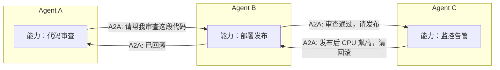
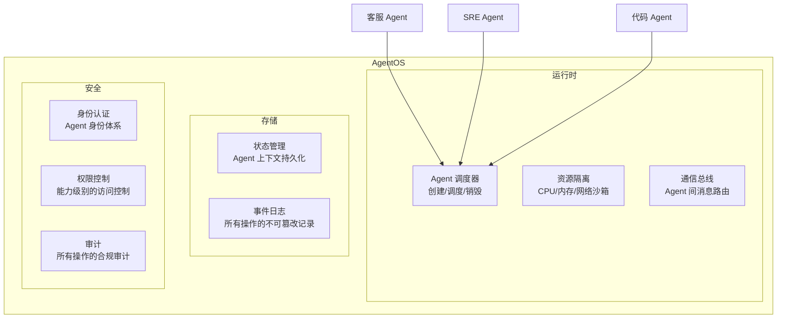

# 06 · A2A 协议与 AgentOS

> 阶段：6 前沿 · 难度：⭐⭐ · 预计：跟进不押注

> 来源：[行业调研](../调研/00-Agent架构师行业调研-2026.md)——A2A 2-3 年内跟进不押注；AgentOS 是 12-24 月方向。

---

## A2A（Agent-to-Agent）协议

| 协议 | 作用 | 成熟度 | 你的策略 |
|------|------|--------|---------|
| **MCP** | Agent 连接工具/数据 | ✅ 可用（已学） | 已掌握 |
| **A2A** | Agent 之间通信 | 🔬 2-3 年内跟进 | 了解规范 |
| **ACP** | Agent 通信协议 | 🔬 实验中 | 观望 |

**MCP vs A2A 的关系**：
```
MCP = Agent 的"手"（连接工具和数据源）
A2A = Agent 的"嘴"（Agent 之间对话协调）
```

### A2A 核心概念



A2A 协议设计的核心要素：

| 要素 | 说明 | 类比 |
|------|------|------|
| **Agent Card** | Agent 的自我介绍（能力/接口/版本） | 微服务的 OpenAPI Spec |
| **Task** | Agent 间委托的任务（有状态机） | HTTP 请求 |
| **Message** | Agent 间的消息（支持多模态） | SSE 消息（单向流式）/ HTTP 消息 |
| **Artifact** | 任务的产出物 | HTTP 响应体 |

### Java 中的 A2A 雏形

```java
package com.example.a2a;

import java.util.*;

/**
 * A2A 协议的 Java 雏形——Agent Card
 *
 * 每个 Agent 发布自己的"名片"，其他 Agent 可以发现并调用。
 */
public record AgentCard(
    String agentId,
    String name,
    String description,
    String version,
    List<AgentCapability> capabilities,  // 能力列表
    String endpoint,                      // A2A 通信端点
    Map<String, String> metadata
) {
    /**
     * Agent 能力声明
     */
    public record AgentCapability(
        String name,           // 能力名称
        String description,    // 描述
        String inputSchema,    // 输入 JSON Schema
        String outputSchema    // 输出 JSON Schema
    ) {}
}

/**
 * A2A Task——Agent 间委托的任务
 */
public record A2ATask(
    String taskId,
    String fromAgent,       // 委托方
    String toAgent,         // 被委托方
    String capability,      // 请求的能力
    Map<String, Object> input,  // 任务输入
    TaskStatus status,      // 状态
    String artifact         // 产出物
) {
    public enum TaskStatus {
        SUBMITTED, WORKING, COMPLETED, FAILED, CANCELLED
    }
}
```

---

## AgentOS（Agent 操作系统）

12-24 个月方向——统一的 Agent 运行时：



| AgentOS 能力 | 类比传统 OS | Agent 时代的意义 |
|-------------|-----------|----------------|
| Agent 调度 | 进程调度 | 多个 Agent 共享资源，按优先级调度 |
| 资源隔离 | 容器/虚拟机 | Agent 之间互不干扰，故障隔离 |
| 通信总线 | IPC（管道/信号/共享内存） | Agent 间标准化通信 |
| 状态管理 | 文件系统 | Agent 的上下文持久化 |
| 权限控制 | Unix 权限模型 | Agent 的能力边界 |
| 审计日志 | syslog | 所有 Agent 行为可追溯 |

> **当前阶段**：了解概念即可，不要投入实现。等生态成熟后再跟进。

---

## 12-24 月趋势总结

| 方向 | 时间 | 投入建议 | Java 工程师机会 |
|------|------|---------|---------------|
| AgentOS | 12-24 月 | ⭐⭐ 关注 | 基础设施级机会 |
| 多模态实时 Agent | 12-24 月 | ⭐⭐⭐ 行业相关 | 边缘部署/低延迟 |
| 跨组织 Agent 协作 | 24 月+ | ⭐ 关注 | A2A 标准化 |
| 通用 Agent 市场平台 | 24 月+ | ⭐⭐ 跟进 | 类似 App Store 的 Agent 分发 |

---

## 🎯 持续进阶

阶段 6 不是终点——它是**持续学习的起点**。技术每季度都在变，你需要：

1. **每季度 review 一次行业调研**：[调研报告](../调研/00-Agent架构师行业调研-2026.md)
2. **跟进 MCP 规范迭代**：MCP 官网 + GitHub
3. **关注 Temporal/Restate 在 AI 场景的演进**
4. **实践 Context Engineering 新模式**
5. **关注 A2A 协议标准化进展**

→ 回到 [能力地图](../01-能力地图.md)，重新自测——你应该已经到了 L5 甚至更高。
