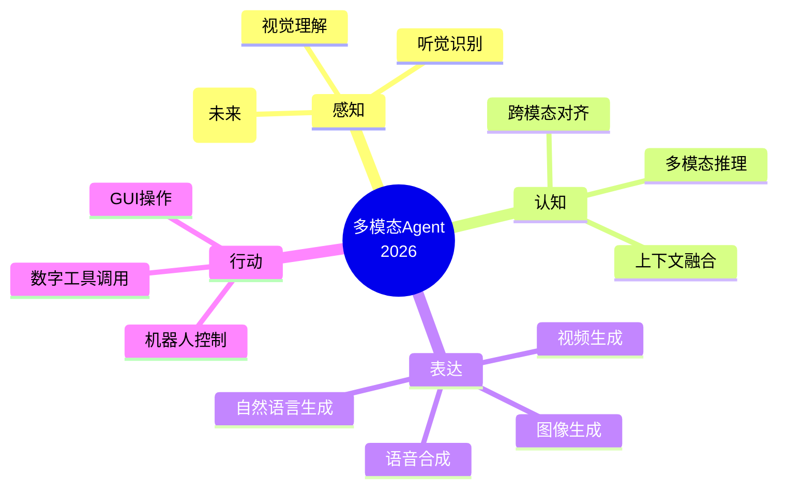
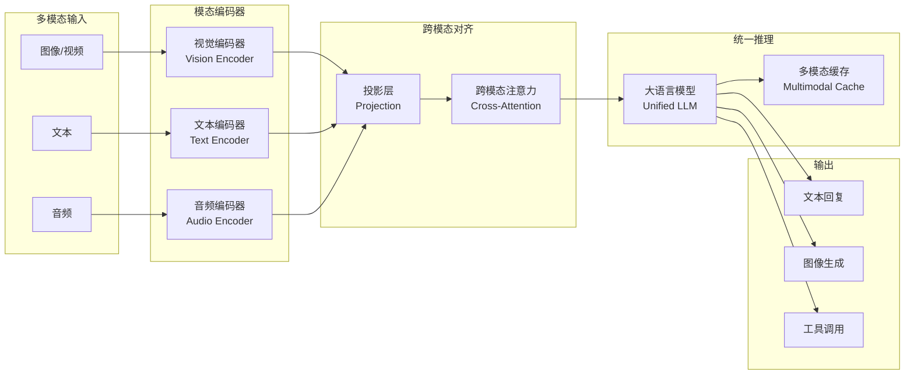
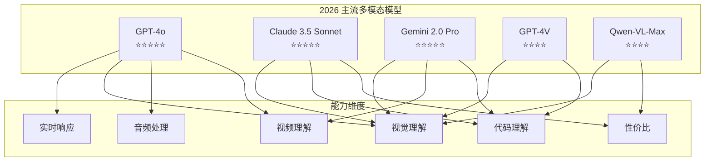
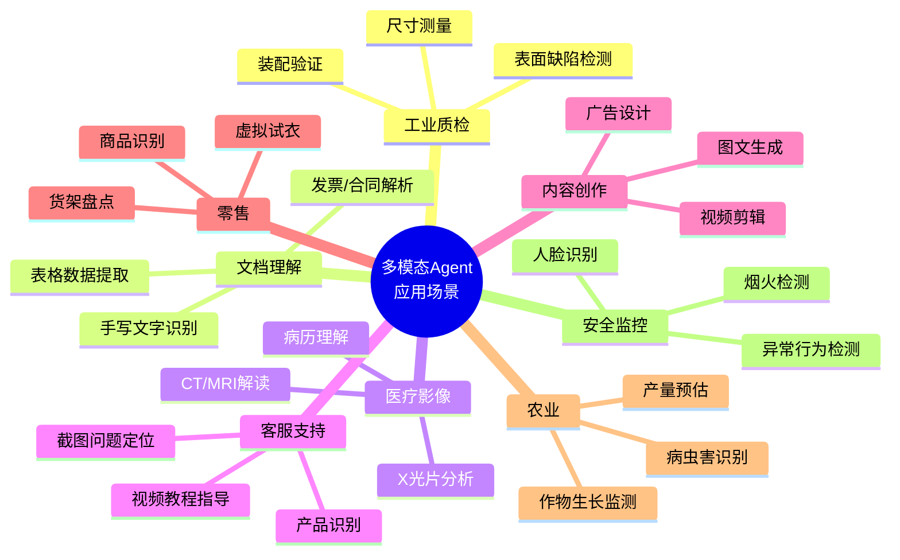
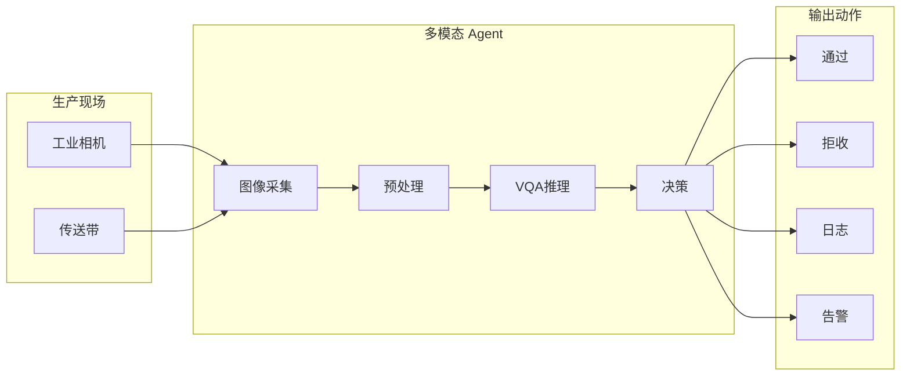
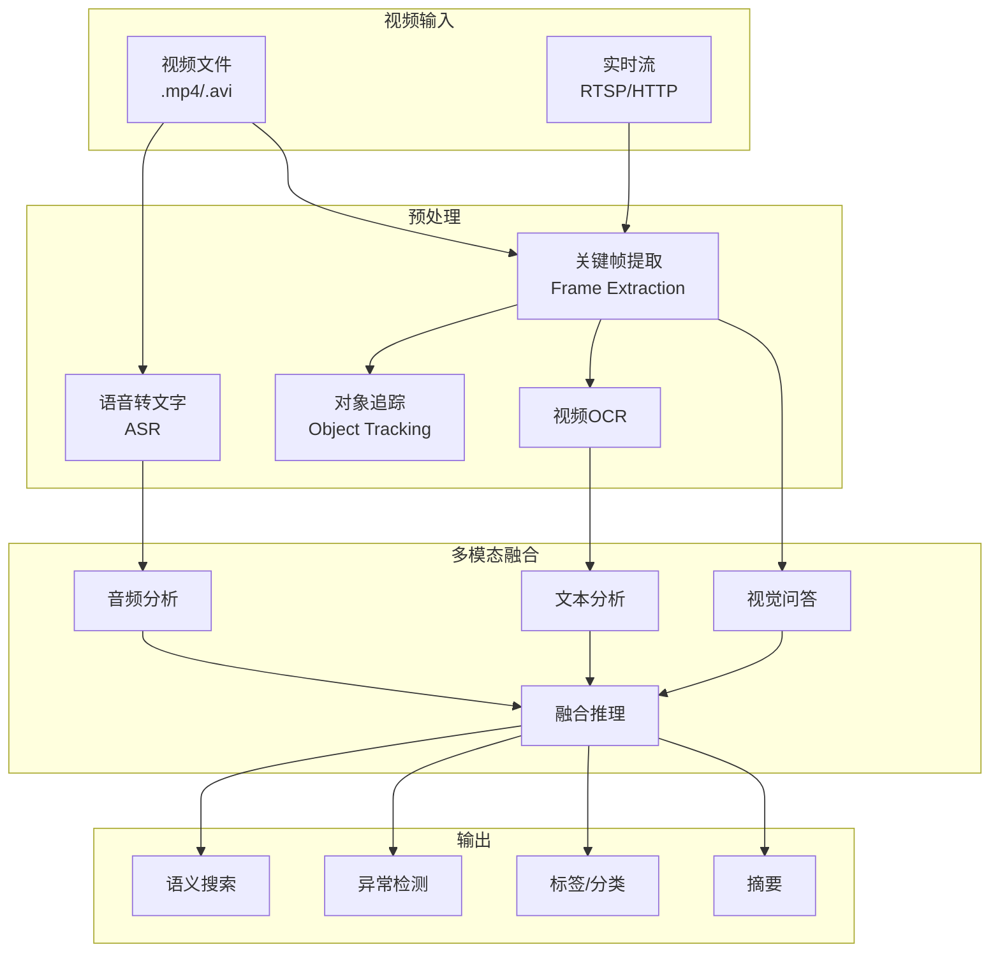
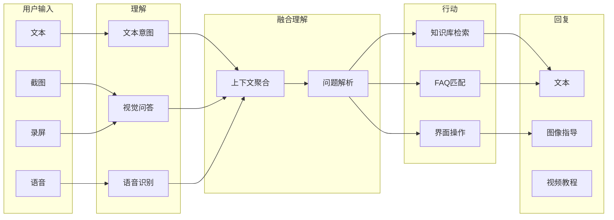
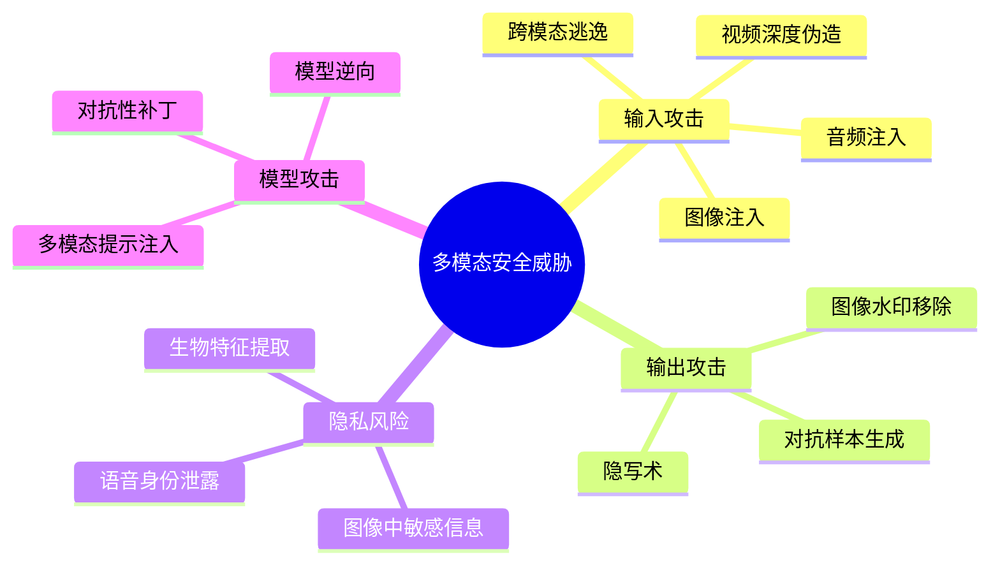
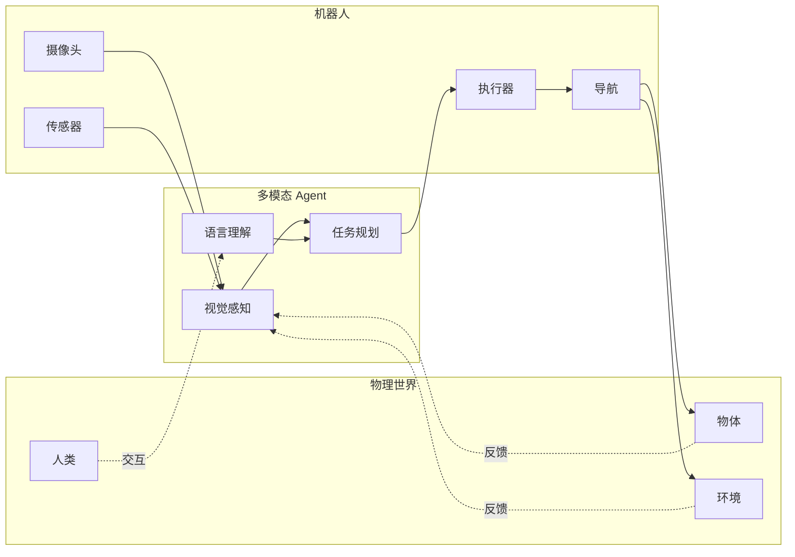

# 07 · 多模态 Agent 前沿（Multimodal Agent Frontier）

> 阶段：6 前沿 · 难度：⭐⭐⭐⭐⭐ · 预计：2026 Q3
> 前置：[阶段 5 毕业](../阶段5-架构师/06-项目P5-企业客服平台.md)
> 产出：理解多模态 Agent 的架构设计与工程实现路径

---

## 为什么多模态 Agent 是 2026 最热前沿

> 来源：[OpenAI GPT-4o System Card](https://openai.com/research/gpt-4o-system-card) + [Google Gemini 2.0 多模态报告](https://deepmind.google/technologies/gemini/)

**2026 年的 Agent 不再只是"文本机器人"**——它能看、听、说、写，理解物理世界，甚至操作数字界面。

### 终极愿景：统一智能体



**核心价值**：

| 单模态 Agent | 多模态 Agent | 业务影响 |
|------------|-------------|---------|
| 用户需要描述问题 | 直接截图/拍照 | 交互效率提升 3-5× |
| 无法处理非结构化数据 | 理解文档/图表/视频 | 新业务场景解锁 |
| 需要人工转换格式 | 原始输入即可处理 | 流程自动化度提升 |

**为什么 Java 工程师应该关注**：

- Spring AI 2026 将原生支持多模态 API
- 企业场景：文档理解、质检、医疗影像、保险理赔
- 竞争优势：率先落地多模态应用

---

## 多模态理解架构

### 核心架构



### 关键技术组件

| 组件 | 作用 | 代表实现 |
|-----|------|---------|
| **Vision Encoder** | 图像→向量表示 | CLIP, ViT, SigLIP |
| **Cross-Attention** | 融合不同模态信息 | Flamingo, BLIP-2 |
| **Projection Layer** | 统一到同一向量空间 | Linear Projection, Q-Former |
| **Multimodal Cache** | 缓存多模态表示 | KV Cache with Image Tokens |

---

## 主流多模态模型对比



### 详细对比

| 模型 | 视觉理解 | 音频 | 视频 | 实时性 | 价格 | API 成熟度 |
|-----|---------|------|------|--------|------|-----------|
| **GPT-4o** | ⭐⭐⭐⭐⭐ | ✅ 原生 | ✅ | <200ms | 中 | ⭐⭐⭐⭐⭐ |
| **Claude 3.5** | ⭐⭐⭐⭐⭐ | ❌ | ✅ | ~1s | 低 | ⭐⭐⭐⭐⭐ |
| **Gemini 2.0** | ⭐⭐⭐⭐⭐ | ✅ 原生 | ✅ | <500ms | 低 | ⭐⭐⭐⭐ |
| **GPT-4V** | ⭐⭐⭐⭐ | ❌ | ✅ | ~2s | 高 | ⭐⭐⭐⭐⭐ |
| **Qwen-VL** | ⭐⭐⭐⭐ | ❌ | ✅ | ~1s | 极低 | ⭐⭐⭐ |

**选型建议**：
- 需要实时语音对话 → GPT-4o
- 高性价比视觉理解 → Claude 3.5 / Qwen-VL
- 原生视频处理 → Gemini 2.0
- 中文优化 → Qwen-VL-Max

---

## 多模态 Agent 应用场景全景



---

## 深度场景 1：视觉问答（VQA）在工业场景

### 场景：制造业智能质检



### 实现代码

```java
package com.example.multimodal;

import org.springframework.ai.chat.client.ChatClient;
import org.springframework.ai.chat.messages.*;
import org.springframework.ai.chat.prompt.Prompt;
import org.springframework.ai.openai.*;
import org.springframework.core.io.*;
import java.util.*;

/**
 * 多模态质检 Agent
 */
@Service
public class QualityInspectionAgent {

    private final ChatClient chatClient;
    private final ImageLogger imageLogger;  // 存储质检图像
    private final AlertService alertService;

    public QualityInspectionAgent(ChatClient.Builder chatClientBuilder,
                                 ImageLogger imageLogger,
                                 AlertService alertService) {
        this.chatClient = chatClientBuilder.build();
        this.imageLogger = imageLogger;
        this.alertService = alertService;
    }

    /**
     * 执行质检
     * @param imageResourceId 图像资源（来自工业相机）
     * @param inspectionType 检查类型（如"表面缺陷"、"尺寸验证"）
     * @param productId 产品ID
     * @return 检查结果
     */
    public InspectionResult inspect(Resource imageResourceId,
                                    String inspectionType,
                                    String productId) {
        // 1. 构建多模态 Prompt
        Prompt inspectionPrompt = buildInspectionPrompt(imageResourceId, inspectionType);

        // 2. 调用多模态模型
        String response = chatClient.prompt()
            .user(inspectionPrompt)
            .call()
            .content();

        // 3. 解析结构化输出
        InspectionResult result = parseInspectionResult(response);

        // 4. 记录图像（用于后续分析）
        imageLogger.log(productId, imageResourceId, result);

        // 5. 根据结果触发动作
        handleInspectionResult(result, productId);

        return result;
    }

    private Prompt buildInspectionPrompt(Resource image, String inspectionType) {
        String systemPrompt = switch (inspectionType) {
            case "表面缺陷" -> """
                你是一个工业质检专家。分析图像中的产品表面是否有缺陷。
                返回 JSON 格式：
                {
                  "hasDefect": true/false,
                  "defectType": "划痕/凹陷/污渍/气泡/无",
                  "severity": "轻微/中等/严重",
                  "confidence": 0.95,
                  "boundingBoxes": [
                    {"x": 100, "y": 200, "width": 50, "height": 30, "label": "划痕"}
                  ],
                  "recommendation": "通过/返工/报废"
                }
                """;
            case "尺寸验证" -> """
                你是一个尺寸测量专家。分析图像中的产品尺寸是否符合标准。
                返回 JSON 格式：
                {
                  "dimensionOk": true/false,
                  "measuredValue": 10.5,
                  "expectedValue": 10.0,
                  "tolerance": 0.2,
                  "deviation": 0.5,
                  "passOrFail": "FAIL",
                  "recommendation": "调整参数后重测"
                }
                """;
            case "装配验证" -> """
                你是一个装配检查专家。验证产品装配是否正确。
                返回 JSON 格式：
                {
                  "assemblyOk": true/false,
                  "missingComponents": ["螺丝A", "垫片B"],
                  "misalignedComponents": ["零件C"],
                  "confidence": 0.92,
                  "recommendation": "补装缺失组件"
                }
                """;
            default -> "分析图像并描述你看到的内容。";
        };

        UserMessage userMessage = new UserMessage(
            systemPrompt,
            List.of(new MediaData(MimeTypeUtils.IMAGE_JPEG, image))
        );

        return new Prompt(List.of(userMessage));
    }

    private InspectionResult parseInspectionResult(String response) {
        // 使用 Jackson 或 Gson 解析 JSON
        // 简化示例：
        ObjectMapper mapper = new ObjectMapper();
        try {
            return mapper.readValue(response, InspectionResult.class);
        } catch (Exception e) {
            // 降级：尝试提取 JSON 块
            return extractJsonFromResponse(response);
        }
    }

    private void handleInspectionResult(InspectionResult result, String productId) {
        if (!result.isPass()) {
            // 触发告警
            alertService.sendAlert(AlertLevel.HIGH,
                "产品 " + productId + " 质检失败：" + result.getRecommendation());

            // 记录到质量管理系统
            qualityManagementSystem.recordFailure(productId, result);

            // 如果严重缺陷，停止生产线
            if (result.getSeverity() == Severity.SEVERE) {
                productionLine.emergencyStop();
            }
        } else {
            // 通过 → 继续生产
            productionLine.allowNextProduct();
        }
    }
}

/**
 * 质检结果数据类
 */
record InspectionResult(
    boolean pass,
    String defectType,
    Severity severity,
    double confidence,
    List<BoundingBox> boundingBoxes,
    String recommendation
) {}

enum Severity { MILD, MODERATE, SEVERATE }

record BoundingBox(int x, int y, int width, int height, String label) {}
```

### 高级特性：批量质检与趋势分析

```java
/**
 * 批量质检 Agent：分析多个产品并识别质量趋势
 */
@Service
public class BatchInspectionAgent {

    /**
     * 批量检查并生成趋势报告
     */
    public QualityTrendReport analyzeBatch(List<Resource> images,
                                          String inspectionType) {
        // 1. 并行检查每个图像
        List<InspectionResult> results = images.parallelStream()
            .map(img -> inspectionAgent.inspect(img, inspectionType, null))
            .toList();

        // 2. 汇总统计
        QualityStatistics stats = computeStatistics(results);

        // 3. 识别模式
        List<QualityPattern> patterns = identifyPatterns(results);

        // 4. 生成报告（多模态：文本 + 可视化图表）
        return QualityTrendReport.builder()
            .statistics(stats)
            .patterns(patterns)
            .recommendations(generateRecommendations(patterns))
            .visualizations(generateCharts(results))
            .build();
    }

    /**
     * 使用多模态模型识别质量模式
     */
    private List<QualityPattern> identifyPatterns(List<InspectionResult> results) {
        // 将结果转换为可视化图像（缺陷分布热力图）
        Resource heatmap = generateDefectHeatmap(results);

        // 让模型分析热力图识别模式
        String analysis = chatClient.prompt()
            .user(u -> u
                .text("分析这个质检热力图，识别质量问题的模式和趋势。")
                .media(MimeTypeUtils.IMAGE_PNG, heatmap))
            .call()
            .content();

        return parsePatterns(analysis);
    }
}
```

---

## 深度场景 2：视频理解 Agent

### 长视频分析架构



### 实现代码：视频理解 Agent

```java
package com.example.multimodal.video;

import org.springframework.ai.chat.client.ChatClient;
import org.springframework.ai.chat.messages.*;
import org.springframework.ai.openai.*;
import org.springframework.core.io.*;
import org.springframework.stereotype.*;
import java.util.*;
import java.time.*;

/**
 * 视频理解 Agent
 */
@Service
public class VideoUnderstandingAgent {

    private final ChatClient chatClient;
    private final FrameExtractor frameExtractor;
    private final VideoOCR videoOCR;
    private final SpeechRecognition asr;

    /**
     * 分析视频内容
     */
    public VideoAnalysisResult analyzeVideo(VideoInput video,
                                          AnalysisOptions options) {
        // 1. 提取关键帧
        List<Resource> keyFrames = frameExtractor.extract(video, options);

        // 2. 并行提取多模态信息
        VideoMultimodalFeatures features = extractFeatures(video, keyFrames, options);

        // 3. 融合推理
        return performAnalysis(features, options);
    }

    /**
     * 提取视频的多模态特征
     */
    private VideoMultimodalFeatures extractFeatures(VideoInput video,
                                                   List<Resource> frames,
                                                   AnalysisOptions options) {
        // 并行执行
        CompletableFuture<List<OCRResult>> ocrFuture =
            CompletableFuture.supplyAsync(() -> extractOCR(frames));

        CompletableFuture<String> transcriptionFuture =
            CompletableFuture.supplyAsync(() -> transcribeAudio(video));

        CompletableFuture<List<ObjectDetection>> objectsFuture =
            CompletableFuture.supplyAsync(() -> detectObjects(frames));

        // 等待所有完成
        CompletableFuture.allOf(ocrFuture, transcriptionFuture, objectsFuture).join();

        return new VideoMultimodalFeatures(
            frames,
            ocrFuture.join(),
            transcriptionFuture.join(),
            objectsFuture.join()
        );
    }

    /**
     * 执行融合分析
     */
    private VideoAnalysisResult performAnalysis(VideoMultimodalFeatures features,
                                                AnalysisOptions options) {
        // 构建多模态 Prompt
        Prompt prompt = buildVideoAnalysisPrompt(features, options);

        String response = chatClient.prompt()
            .user(prompt)
            .call()
            .content();

        return parseVideoAnalysisResult(response);
    }

    /**
     * 构建视频分析 Prompt（包含图像 + 文本 + 音频转录）
     */
    private Prompt buildVideoAnalysisPrompt(VideoMultimodalFeatures features,
                                          AnalysisOptions options) {
        StringBuilder sb = new StringBuilder();
        sb.append("分析这个视频，返回 JSON 格式：\n");
        sb.append("""
            {
              "summary": "视频内容摘要",
              "mainTopics": ["主题1", "主题2"],
              "keyEvents": [
                {"timestamp": "00:01:23", "description": "事件描述", "frame": 5}
              ],
              "objects": ["对象1", "对象2"],
              "textDetected": ["文本1", "文本2"],
              "speechSummary": "语音内容摘要",
              "sentiment": "积极/中性/消极",
              "tags": ["标签1", "标签2"],
              "category": "类别",
              "anomalyDetected": false,
              "anomalies": []
            }
            """);

        // 添加上下文信息
        if (options.getFocusArea() != null) {
            sb.append("\n\n重点关注：").append(options.getFocusArea());
        }

        // 创建多模态消息
        List<MediaData> mediaData = new ArrayList<>();

        // 添加关键帧（最多10帧，控制token）
        int maxFrames = Math.min(features.frames().size(), 10);
        for (int i = 0; i < maxFrames; i++) {
            mediaData.add(new MediaData(MimeTypeUtils.IMAGE_JPEG, features.frames().get(i)));
        }

        // 添加 OCR 结果
        if (!features.ocrResults().isEmpty()) {
            sb.append("\n\n检测到的文字：");
            features.ocrResults().forEach(ocr ->
                sb.append("\n- 帧 ").append(ocr.frameIndex()).append(": ").append(ocr.text())
            );
        }

        // 添加语音转录
        if (features.transcription() != null && !features.transcription().isBlank()) {
            sb.append("\n\n语音转录：\n").append(features.transcription());
        }

        // 添加检测结果
        if (!features.detectedObjects().isEmpty()) {
            sb.append("\n\n检测到的对象：");
            features.detectedObjects().forEach(obj ->
                sb.append("\n- ").append(obj.label()).append(" (").append(obj.confidence()).append(")")
            );
        }

        UserMessage userMessage = new UserMessage(
            sb.toString(),
            mediaData
        );

        return new Prompt(List.of(userMessage));
    }

    /**
     * 实时视频流分析
     */
    public Flux<FrameAnalysisResult> analyzeLiveStream(Flux<Resource> frameStream) {
        return frameStream
            .sample(Duration.ofSeconds(1))  // 每秒分析一帧
            .flatMap(frame -> {
                // 快速分析单帧
                return analyzeFrame(frame);
            })
            .buffer(Duration.ofSeconds(5))   // 5秒窗口聚合
            .flatMap(this::analyzeTemporalPattern);  // 时序模式分析
    }

    /**
     * 分析帧间时序模式（检测异常行为）
     */
    private Mono<FrameAnalysisResult> analyzeTemporalPattern(List<FrameAnalysisResult> window) {
        String prompt = """
            分析这些连续帧，检测是否有异常行为模式。
            返回 JSON：
            {
              "anomalyDetected": true/false,
              "anomalyType": "徘徊/打架/跌倒/入侵/无",
              "confidence": 0.95,
              "description": "异常行为描述",
              "actionRequired": "需要人工介入/继续观察/无需处理"
            }
            """;

        // 将窗口中的关键信息汇总
        String context = window.stream()
            .map(r -> "帧" + r.frameIndex() + ": " + r.summary())
            .reduce((a, b) -> a + "\n" + b)
            .orElse("");

        String response = chatClient.prompt()
            .user(u -> u.text(prompt + "\n\n" + context))
            .call()
            .content();

        return Mono.just(parseAnomalyResult(response));
    }
}

/**
 * 多模态特征数据类
 */
record VideoMultimodalFeatures(
    List<Resource> frames,
    List<OCRResult> ocrResults,
    String transcription,
    List<ObjectDetection> detectedObjects
) {}

record OCRResult(int frameIndex, String text, BoundingBox boundingBox) {}

record ObjectDetection(String label, double confidence, BoundingBox box) {}

record VideoAnalysisResult(
    String summary,
    List<String> mainTopics,
    List<KeyEvent> keyEvents,
    List<String> objects,
    String sentiment,
    List<String> tags,
    String category
) {}
```

---

## 深度场景 3：多模态客服 Agent

### 架构



### 实现代码

```java
package com.example.multimodal.cs;

import org.springframework.ai.chat.client.ChatClient;
import org.springframework.ai.chat.messages.*;
import org.springframework.core.io.*;
import org.springframework.stereotype.*;
import java.util.*;

/**
 * 多模态客服 Agent
 */
@Service
public class MultimodalCustomerServiceAgent {

    private final ChatClient chatClient;
    private final KnowledgeBaseRetriever kbRetriever;
    private final ScreenCaptureService screenService;

    /**
     * 处理用户咨询
     */
    public ServiceResponse handleInquiry(CustomerInquiry inquiry) {
        // 1. 理解问题（多模态）
        ProblemUnderstanding understanding = understandProblem(inquiry);

        // 2. 检索解决方案
        List<Solution> solutions = findSolutions(understanding);

        // 3. 生成回复（可能是多模态）
        return generateResponse(understanding, solutions);
    }

    /**
     * 多模态问题理解
     */
    private ProblemUnderstanding understandProblem(CustomerInquiry inquiry) {
        // 构建多模态 Prompt
        Prompt prompt = buildUnderstandingPrompt(inquiry);

        String response = chatClient.prompt()
            .user(prompt)
            .call()
            .content();

        return parseUnderstanding(response);
    }

    private Prompt buildUnderstandingPrompt(CustomerInquiry inquiry) {
        StringBuilder sb = new StringBuilder();
        sb.append("分析用户的问题，返回 JSON：\n");
        sb.append("""
            {
              "problemCategory": "技术问题/账户问题/产品咨询/投诉",
              "urgency": "紧急/一般/低",
              "mainIssue": "主要问题描述",
              "visualElements": ["截图中看到的关键元素"],
              "suggestedKeywords": ["关键词1", "关键词2"],
              "needsVisualGuide": true/false,
              "needsScreenshots": true/false
            }
            """);

        List<MediaData> mediaData = new ArrayList<>();

        // 添加截图
        if (inquiry.getScreenshot() != null) {
            mediaData.add(new MediaData(MimeTypeUtils.IMAGE_PNG, inquiry.getScreenshot()));
            sb.append("\n\n用户提供了截图。");
        }

        // 添加录屏帧
        if (inquiry.getScreenRecording() != null) {
            List<Resource> frames = extractKeyFrames(inquiry.getScreenRecording());
            for (Resource frame : frames.subList(0, Math.min(5, frames.size()))) {
                mediaData.add(new MediaData(MimeTypeUtils.IMAGE_JPEG, frame));
            }
            sb.append("\n\n用户提供了录屏，已提取关键帧。");
        }

        // 添加文本描述
        if (inquiry.getTextDescription() != null) {
            sb.append("\n\n用户描述：").append(inquiry.getTextDescription());
        }

        UserMessage userMessage = new UserMessage(sb.toString(), mediaData);
        return new Prompt(List.of(userMessage));
    }

    /**
     * 生成多模态回复
     */
    private ServiceResponse generateResponse(ProblemUnderstanding understanding,
                                            List<Solution> solutions) {
        ServiceResponse.Builder builder = ServiceResponse.builder();

        // 1. 文本回复
        builder.textAnswer(generateTextAnswer(understanding, solutions));

        // 2. 如果需要，生成视觉指导
        if (understanding.needsVisualGuide()) {
            // 方案1：从知识库检索预制的示意图
            Resource guideImage = kbRetriever.retrieveGuideImage(understanding);
            if (guideImage != null) {
                builder.visualGuide(guideImage);
            }

            // 方案2：实时生成指导图（使用 DALL-E 3）
            Resource generatedGuide = generateGuideImage(understanding);
            if (generatedGuide != null) {
                builder.visualGuide(generatedGuide);
            }

            // 方案3：生成操作步骤的可视化流程图
            Resource flowchart = generateFlowchart(understanding, solutions);
            builder.flowchart(flowchart);
        }

        // 3. 如果需要，生成截图标注
        if (understanding.needsScreenshots() && inquiry.getScreenshot() != null) {
            Resource annotated = annotateScreenshot(inquiry.getScreenshot(), solutions);
            builder.annotatedScreenshot(annotated);
        }

        return builder.build();
    }

    /**
     * 生成指导图像
     */
    private Resource generateGuideImage(ProblemUnderstanding understanding) {
        // 使用图像生成模型
        String prompt = String.format("""
            生成一个清晰的指导图，展示如何解决以下问题：
            问题：%s

            要求：
            - 简洁明了的步骤图解
            - 每个步骤有编号
            - 使用箭头指示流程
            - 风格：现代、专业、蓝色配色
            """, understanding.getMainIssue());

        // 调用图像生成 API（如 DALL-E 3）
        return imageGenerationService.generate(prompt);
    }

    /**
     * 截图标注：在用户截图上标注关键区域
     */
    private Resource annotateScreenshot(Resource originalScreenshot,
                                      List<Solution> solutions) {
        // 让模型分析截图，生成标注数据
        String prompt = """
            分析这个截图，识别用户需要关注的区域。
            返回 JSON：
            {
              "annotations": [
                {
                  "type": "circle/rectangle/arrow",
                  "coordinates": {"x": 100, "y": 200, "width": 50, "height": 30},
                  "label": "点击这里",
                  "number": 1,
                  "color": "red"
                }
              ]
            }
            """;

        String response = chatClient.prompt()
            .user(u -> u
                .text(prompt)
                .media(MimeTypeUtils.IMAGE_PNG, originalScreenshot))
            .call()
            .content();

        List<Annotation> annotations = parseAnnotations(response);

        // 使用图像处理库（如 JavaFX 或通过 Python 脚本）绘制标注
        return imageAnnotationService.annotate(originalScreenshot, annotations);
    }
}

/**
 * 客服咨询数据类
 */
class CustomerInquiry {
    private String textDescription;
    private Resource screenshot;
    private Resource screenRecording;
    private String voiceMessage;
    // getters & setters
}

/**
 * 服务回复数据类
 */
class ServiceResponse {
    private String textAnswer;
    private Resource visualGuide;
    private Resource flowchart;
    private Resource annotatedScreenshot;
    // getters & setters
}
```

---

## 多模态安全挑战

### 威胁全景



### 防御措施

```java
package com.example.multimodal.security;

import org.springframework.stereotype.*;
import org.springframework.ai.chat.client.*;
import org.springframework.core.io.*;
import java.util.*;

/**
 * 多模态安全过滤器
 */
@Service
public class MultimodalSecurityFilter {

    /**
     * 输入过滤
     */
    public FilterResult filterInput(Resource image, String text) {
        FilterResult.Builder builder = FilterResult.builder();

        // 1. 图像安全检查
        ImageSafetyResult imageSafety = checkImageSafety(image);
        if (!imageSafety.isSafe()) {
            return builder.rejected("图像不安全: " + imageSafety.getReason())
                          .build();
        }

        // 2. 文本安全检查
        TextSafetyResult textSafety = checkTextSafety(text);
        if (!textSafety.isSafe()) {
            return builder.rejected("文本不安全: " + textSafety.getReason())
                          .build();
        }

        // 3. 跨模态一致性检查
        CrossModalConsistency consistency = checkCrossModalConsistency(image, text);
        if (!consistency.isConsistent()) {
            // 可疑：文本描述与图像内容不符
            return builder
                .warning("跨模态不一致，可能存在攻击")
                .sanitizedText(consistency.getSafeText())
                .build();
        }

        return builder.approved().build();
    }

    /**
     * 图像安全检查
     */
    private ImageSafetyResult checkImageSafety(Resource image) {
        // 使用 CLIP 等模型检测恶意图像
        String prompt = """
            分析这张图像是否包含以下任何内容：
            1. 对抗性补丁（专门设计的图案）
            2. 隐蔽的文字注入（微小文字）
            3. 深度伪造痕迹
            4. 敏感信息（身份证、银行卡等）

            返回 JSON：
            {
              "safe": true/false,
              "reason": "不安全原因",
              "detectedElements": ["元素1", "元素2"],
              "confidence": 0.95
            }
            """;

        String response = chatClient.prompt()
            .user(u -> u.text(prompt).media(MimeTypeUtils.IMAGE_JPEG, image))
            .call()
            .content();

        return parseSafetyResult(response);
    }

    /**
     * 跨模态一致性检查
     */
    private CrossModalConsistency checkCrossModalConsistency(Resource image, String text) {
        String prompt = String.format("""
            比较图像和文本描述，判断是否一致。
            图像：[已提供]
            文本描述：%s

            返回 JSON：
            {
              "consistent": true/false,
              "discrepancies": ["差异1", "差异2"],
              "attackSuspected": true/false,
              "safeText": "修正后的安全文本"
            }
            """, text);

        String response = chatClient.prompt()
            .user(u -> u.text(prompt).media(MimeTypeUtils.IMAGE_JPEG, image))
            .call()
            .content();

        return parseConsistencyResult(response);
    }
}
```

---

## 未来展望：具身智能（Embodied AI）

### 多模态 Agent 与机器人的融合



**关键进展方向**：

| 领域 | 2026 状态 | 2027+ 展望 |
|-----|----------|-----------|
| **视觉-语言-行动** | VLA 模型初现 | 统一 VLA 架构 |
| **机器人操作** | 简单抓取 | 复杂操作序列 |
| **人机交互** | 语音/手势 | 自然多模态对话 |
| **场景理解** | 3D 重建 | 语义场景理解 |

---

## Java 实现展望与 API 设计

### Spring AI 多模态支持

```java
// Spring AI 2026 多模态 API（展望）

@Service
public class MultimodalAgentService {

    private final ChatClient chatClient;

    /**
     * 多模态对话 API
     */
    public String chat(MultimodalMessage message) {
        return chatClient.prompt()
            .user(user -> {
                // 文本
                user.text(message.getText());

                // 图像
                if (message.getImages() != null) {
                    message.getImages().forEach(img ->
                        user.media(MimeTypeUtils.IMAGE_JPEG, img)
                    );
                }

                // 音频
                if (message.getAudio() != null) {
                    user.media(MimeTypeUtils.Audio.AUDIO_MP3, message.getAudio());
                }

                // 视频
                if (message.getVideo() != null) {
                    user.media(MimeTypeUtils.VIDEO.MP4, message.getVideo());
                }
            })
            .call()
            .content();
    }
}

/**
 * 多模态请求体
 */
record MultimodalMessage(
    String text,
    List<Resource> images,
    Resource audio,
    Resource video,
    Map<String, Object> metadata
) {}
```

### 实践建议

1. **成本控制**：多模态 API 成本是纯文本的 5-10 倍
   - 实施预处理：压缩图像、提取关键帧
   - 模型路由：简单任务用小模型

2. **性能优化**：
   - 并行提取多个模态特征
   - 缓存多模态表示
   - 使用流式响应

3. **安全第一**：
   - 实施多模态输入过滤
   - 监控异常输入模式
   - 输出内容安全检查

4. **渐进式落地**：
   - Phase 1：文本 + 单图像（VQA）
   - Phase 2：文本 + 多图像
   - Phase 3：文本 + 视频
   - Phase 4：全模态（含音频）

---

## 检查清单

在实施多模态 Agent 时，确认以下要点：

- [ ] 明确业务价值（多模态 vs 单模态的 ROI）
- [ ] 评估模型选型（GPT-4o / Claude / Gemini / Qwen-VL）
- [ ] 设计多模态输入管道
- [ ] 实施跨模态对齐逻辑
- [ ] 建立多模态安全过滤
- [ ] 规划成本控制策略
- [ ] 设计性能监控指标
- [ ] 准备降级方案（多模态→单模态）
- [ ] 建立多模态测试数据集
- [ ] 遵守数据隐私法规（GDPR/个人信息保护法）

---

## 参考资源

- OpenAI GPT-4o Technical Report: https://openai.com/research/gpt-4o
- Google Gemini 2.0: https://deepmind.google/technologies/gemini/
- CLIP Paper: https://openai.com/research/clip
- Flamingo Paper: https://deepmind.google/research/flamingo/
- Spring AI Multimodal Docs: https://docs.spring.io/spring-ai/reference/multimodal.html

---

> 下一步：[模型蒸馏与小模型部署](08-模型蒸馏与小模型部署.md) —— 降低成本、提升性能的必经之路
