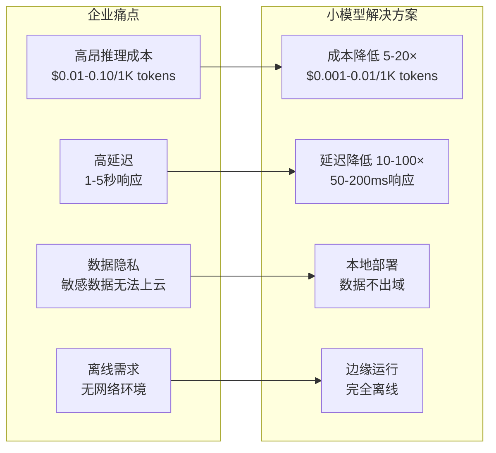
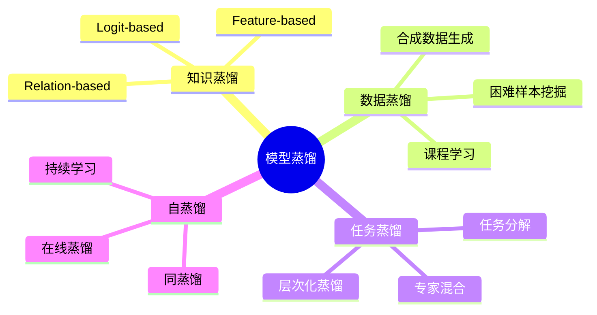
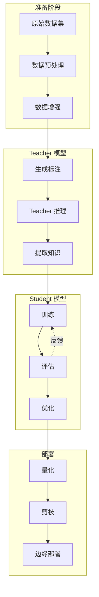
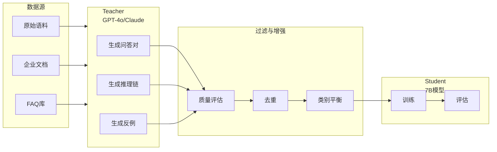
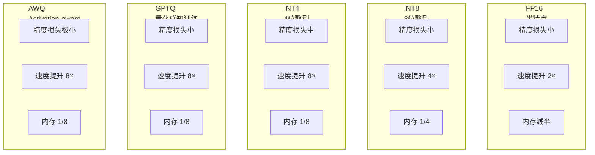
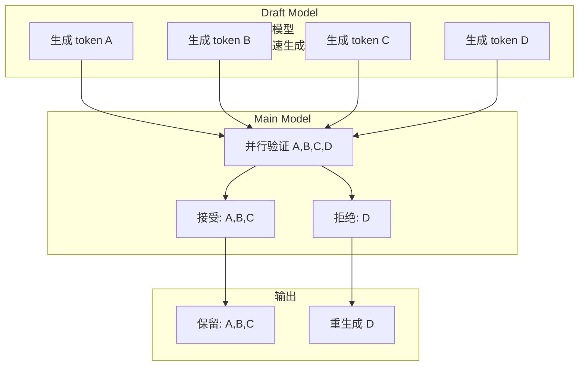
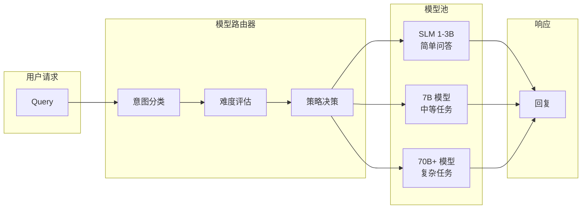
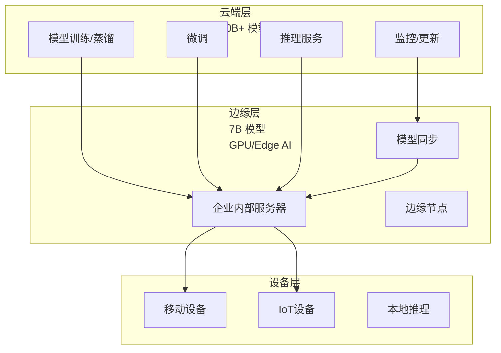
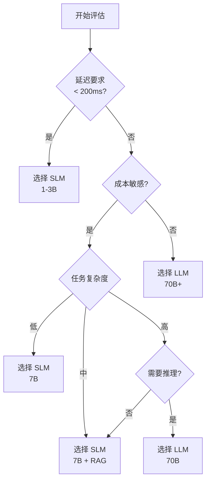

# 08 · 模型蒸馏与小模型部署（Model Distillation & Edge AI）

> 阶段：6 前沿 · 难度：⭐⭐⭐⭐⭐ · 预计：2026 Q3
> 前置：[阶段 5 毕业](../阶段5-架构师/06-项目P5-企业客服平台.md)
> 产出：掌握模型蒸馏技术与小模型部署架构

---

## 为什么需要小模型

> 来源：[Arxiv: The Bitter Lesson](http://www.incompleteideas.net/IncIdeas/BitterLesson.html) + [Hugging Face Small Models](https://huggingface.co/models?pipeline_tag=text-generation&sort=downloads)

**2026 年的现实**：不是所有任务都需要 175B 参数的大模型。

### 企业痛点



### 成本对比（2026 年预估）

| 模型规模 | 参数量 | 推理成本（1K tokens） | 延迟 | 适用场景 |
|---------|--------|---------------------|------|---------|
| GPT-4o | 1.7T | $0.05 | 1-2s | 复杂推理、创意任务 |
| Claude 3.5 | ~200B | $0.03 | 1s | 代码、分析 |
| Llama-3-70B | 70B | $0.01 | 500ms | 企业级通用任务 |
| **Llama-3-8B** | 8B | $0.001 | 100ms | **客服问答、文档理解** |
| **Qwen2-7B** | 7B | $0.001 | 100ms | **中文任务、分类** |
| **Phi-3-mini** | 3.8B | $0.0005 | 50ms | **简单问答、指令执行** |
| **Gemma-2-2B** | 2B | $0.0002 | 30ms | **本地部署、边缘AI** |

**关键洞察**：70% 的企业 Agent 任务可以用 7B 以下模型完成。

---

## 模型蒸馏方法论全景



### 三大蒸馏范式对比

| 蒸馏类型 | 核心思想 | 适用场景 | 难度 | 效果 |
|---------|---------|---------|------|------|
| **知识蒸馏** | Teacher 的输出 → Student 学习 | 通用任务 | ⭐⭐ | 高 |
| **数据蒸馏** | 大模型生成训练数据 → 小模型学习 | 数据稀缺场景 | ⭐⭐⭐ | 中高 |
| **任务蒸馏** | 分解复杂任务 → 专门小模型 | 多步骤任务 | ⭐⭐⭐⭐ | 高 |

---

## Teacher-Student 蒸馏管线

### 完整流程



### 知识蒸馏损失函数

```java
package com.example.distillation;

import org.springframework.stereotype.*;
import java.util.*;

/**
 * 知识蒸馏训练器
 */
@Service
public class KnowledgeDistillationTrainer {

    /**
     * 蒸馏损失计算
     *
     * Loss = α * L_ce + (1-α) * L_kl
     * - L_ce: 交叉熵损失（真实标签）
     * - L_kl: KL 散度损失（Teacher 知识）
     * - α: 平衡系数
     */
    public DistillationLoss computeDistillationLoss(
            List<Float> studentLogits,
            List<Float> teacherLogits,
            int trueLabel,
            double temperature,
            double alpha) {

        // 1. 计算 softened probabilities（使用 temperature）
        List<Float> studentSoft = softmaxWithTemperature(studentLogits, temperature);
        List<Float> teacherSoft = softmaxWithTemperature(teacherLogits, temperature);

        // 2. 计算交叉熵损失（与真实标签）
        double ceLoss = crossEntropy(studentLogits, trueLabel);

        // 3. 计算 KL 散度损失（学习 Teacher）
        double klLoss = klDivergence(studentSoft, teacherSoft);

        // 4. 加权组合
        double totalLoss = alpha * ceLoss + (1 - alpha) * klLoss;

        return new DistillationLoss(totalLoss, ceLoss, klLoss);
    }

    /**
     * 带温度的 Softmax
     * temperature > 1 使分布更平滑（传递更多知识）
     */
    private List<Float> softmaxWithTemperature(List<Float> logits, double temperature) {
        List<Float> result = new ArrayList<>();
        float maxLogit = Collections.max(logits);

        float sum = 0.0f;
        for (float logit : logits) {
            float scaled = (logit - maxLogit) / (float) temperature;
            float exp = (float) Math.exp(scaled);
            result.add(exp);
            sum += exp;
        }

        // 归一化
        for (int i = 0; i < result.size(); i++) {
            result.set(i, result.get(i) / sum);
        }
        return result;
    }

    /**
     * KL 散度计算
     * KL(P||Q) = Σ P(x) * log(P(x) / Q(x))
     */
    private double klDivergence(List<Float> p, List<Float> q) {
        double kl = 0.0;
        for (int i = 0; i < p.size(); i++) {
            double pi = p.get(i);
            double qi = Math.max(q.get(i), 1e-10);  // 避免 log(0)
            if (pi > 1e-10) {
                kl += pi * Math.log(pi / qi);
            }
        }
        return kl;
    }
}
```

---

## 大模型→小模型的数据蒸馏

### 核心思想

用大模型生成高质量的合成数据，用来训练小模型。



### Java 实现：数据蒸馏管线

```java
package com.example.distillation;

import org.springframework.ai.chat.client.*;
import org.springframework.stereotype.*;
import java.util.*;
import java.util.concurrent.*;
import java.util.stream.*;

/**
 * 数据蒸馏服务
 * 使用大模型生成训练数据
 */
@Service
public class DataDistillationService {

    private final ChatClient teacherClient;  // 大模型
    private final QualityFilter qualityFilter;

    /**
     * 从文档蒸馏训练数据
     */
    public List<TrainingExample> distillFromDocuments(
            List<Document> documents,
            int examplesPerDoc) {

        // 1. 并行处理文档
        ExecutorService executor = Executors.newFixedThreadPool(10);
        List<Future<List<TrainingExample>>> futures = documents.stream()
            .map(doc -> executor.submit(() ->
                distillFromDocument(doc, examplesPerDoc)))
            .toList();

        // 2. 收集结果
        List<TrainingExample> allExamples = new ArrayList<>();
        for (Future<List<TrainingExample>> future : futures) {
            try {
                allExamples.addAll(future.get());
            } catch (Exception e) {
                log.error("蒸馏失败", e);
            }
        }
        executor.shutdown();

        // 3. 质量过滤
        List<TrainingExample> filtered = qualityFilter.filter(allExamples);

        // 4. 去重
        List<TrainingExample> deduped = deduplicate(filtered);

        // 5. 平衡类别
        return balanceClasses(deduped);
    }

    /**
     * 从单个文档蒸馏数据
     */
    private List<TrainingExample> distillFromDocument(Document doc, int count) {
        String prompt = String.format("""
            基于以下文档，生成 %d 个高质量的问答对。

            要求：
            1. 问题应该多样化（事实型、概念型、推理型）
            2. 答案应该基于文档内容
            3. 包含困难样本（需要推理的）
            4. 返回 JSON 格式

            文档内容：
            %s

            返回格式：
            {
              "examples": [
                {
                  "question": "问题",
                  "answer": "答案",
                  "difficulty": "easy/medium/hard",
                  "reasoning": "推理过程（如果有）",
                  "category": "类别"
                }
              ]
            }
            """, count, doc.getContent());

        String response = teacherClient.prompt()
            .user(prompt)
            .call()
            .content();

        return parseTrainingExamples(response);
    }

    /**
     * 生成反例（负样本）
     * 用于训练模型识别错误
     */
    public List<TrainingExample> generateNegativeExamples(
            List<TrainingExample> positiveExamples) {

        String prompt = String.format("""
            基于以下正例，生成对应的高质量负例（错误答案）。

            正例：
            %s

            要求：
            1. 负例应该包含常见的错误理解
            2. 包含部分正确的迷惑性答案
            3. 包含完全无关的答案
            4. 标注错误类型

            返回 JSON：
            {
              "negatives": [
                {
                  "question": "原问题",
                  "wrongAnswer": "错误答案",
                  "errorType": "误解/无关/不完整",
                  "correctAnswer": "正确答案"
                }
              ]
            }
            """,
            positiveExamples.stream()
                .map(e -> String.format("Q: %s\nA: %s", e.question(), e.answer()))
                .collect(Collectors.joining("\n\n"))
        );

        String response = teacherClient.prompt()
            .user(prompt)
            .call()
            .content();

        return parseNegativeExamples(response);
    }

    /**
     * 课程学习：按难度排序数据
     */
    public List<TrainingExample> curriculumLearning(
            List<TrainingExample> examples) {
        // 1. 评估每个样本的难度
        Map<TrainingExample, Double> difficultyMap = new ConcurrentHashMap<>();
        examples.parallelStream().forEach(example -> {
            double difficulty = estimateDifficulty(example);
            difficultyMap.put(example, difficulty);
        });

        // 2. 按难度排序
        return examples.stream()
            .sorted(Comparator.comparing(difficultyMap::get))
            .toList();
    }

    /**
     * 估计样本难度
     */
    private double estimateDifficulty(TrainingExample example) {
        String prompt = String.format("""
            评估这个问答对的难度（0-1之间）。

            问题：%s
            答案：%s

            返回 JSON：
            {
              "difficulty": 0.75,
              "reasoning": "为什么这个难度"
            }
            """, example.question(), example.answer());

        String response = teacherClient.prompt()
            .user(prompt)
            .call()
            .content();

        // 解析难度值
        return parseDifficulty(response);
    }
}

/**
 * 训练样本
 */
record TrainingExample(
    String question,
    String answer,
    Difficulty difficulty,
    String reasoning,
    String category
) {}

enum Difficulty { EASY, MEDIUM, HARD }
```

---

## 量化技术全景

### 量化方法对比



### 详细对比

| 方法 | 精度损失 | 速度提升 | 内存节省 | 训练成本 | 推荐场景 |
|-----|---------|---------|---------|---------|---------|
| FP16 | <1% | 2× | 50% | 无 | GPU 部署 |
| INT8 | 1-2% | 4× | 75% | 低 | 通用部署 |
| INT4 | 2-5% | 8× | 87.5% | 低 | 边缘设备 |
| GPTQ | 1-3% | 8× | 87.5% | 中 | 高质量需求 |
| AWQ | <2% | 8× | 87.5% | 中 | 最佳性价比 |
| Sparsity | 0-1% | 2-4× | - | 高 | 稀疏模型 |

---

## Speculative Decoding（投机解码）

### 核心原理



**加速原理**：小模型快速草稿 + 大模型并行验证

| 配置 | 加速比 | 质量 | 备注 |
|-----|-------|------|------|
| 草稿 8 tokens | 2-3× | 无损失 | 最佳配置 |
| 草稿 16 tokens | 3-4× | 轻微损失 | 平衡选择 |
| 草稿 32 tokens | 4-5× | 中等损失 | 激进配置 |

---

## 小模型在 Agent 中的角色

### 模型路由架构



### Java 实现：智能模型路由

```java
package com.example.routing;

import org.springframework.stereotype.*;
import java.util.*;

/**
 * 模型路由器
 * 根据任务复杂度选择合适的模型
 */
@Service
public class ModelRouter {

    private final ChatClient smallModel;   // 3B - 快速
    private final ChatClient mediumModel;  // 7B - 平衡
    private final ChatClient largeModel;   // 70B - 强力

    /**
     * 智能路由
     */
    public String route(String query, RoutingContext context) {
        // 1. 分析任务
        TaskAnalysis analysis = analyzeTask(query, context);

        // 2. 选择模型
        ModelSelection selection = selectModel(analysis);

        // 3. 执行
        return executeWithModel(selection, query, context);
    }

    /**
     * 任务分析
     */
    private TaskAnalysis analyzeTask(String query, RoutingContext context) {
        // 快速分类
        String category = classifyIntent(query);

        // 评估复杂度
        Complexity complexity = estimateComplexity(query, category);

        // 检查约束
        Constraints constraints = checkConstraints(context);

        return new TaskAnalysis(category, complexity, constraints);
    }

    /**
     * 意图分类（使用小模型快速分类）
     */
    private String classifyIntent(String query) {
        return smallModel.prompt()
            .user(u -> u.text("""
                分类这个查询的意图（单个词）：
                查询：%s

                意图类型：simple_qa, classification, summarization,
                reasoning, code_generation, creative_writing

                只返回意图类型名称。
                """, query))
            .call()
            .content()
            .trim()
            .toLowerCase();
    }

    /**
     * 复杂度评估
     */
    private Complexity estimateComplexity(String query, String intent) {
        Complexity.Builder builder = Complexity.builder();

        // 1. 文本长度
        builder.length(query.length());

        // 2. 意图复杂度
        IntentComplexity intentComplexity = switch (intent) {
            case "simple_qa" -> IntentComplexity.LOW;
            case "classification" -> IntentComplexity.LOW;
            case "summarization" -> IntentComplexity.MEDIUM;
            case "reasoning" -> IntentComplexity.HIGH;
            case "code_generation" -> IntentComplexity.HIGH;
            case "creative_writing" -> IntentComplexity.MEDIUM;
            default -> IntentComplexity.MEDIUM;
        };
        builder.intentComplexity(intentComplexity);

        // 3. 使用小模型快速评估
        String eval = smallModel.prompt()
            .user(u -> u.text("""
                评估这个查询的复杂度（1-10）：
                %s

                只返回一个数字。
                """, query))
            .call()
            .content()
            .trim();

        builder.estimatedScore(Double.parseDouble(eval));

        return builder.build();
    }

    /**
     * 模型选择策略
     */
    private ModelSelection selectModel(TaskAnalysis analysis) {
        // 规则引擎
        if (analysis.complexity().estimatedScore() <= 3) {
            return ModelSelection.small();
        }
        if (analysis.complexity().estimatedScore() <= 7) {
            return ModelSelection.medium();
        }
        return ModelSelection.large();
    }

    /**
     * 使用选定的模型执行
     */
    private String executeWithModel(ModelSelection selection,
                                   String query,
                                   RoutingContext context) {
        ChatClient client = switch (selection.model()) {
            case SMALL -> smallModel;
            case MEDIUM -> mediumModel;
            case LARGE -> largeModel;
        };

        // 记录路由决策
        metrics.recordRouting(selection, query);

        return client.prompt()
            .user(query)
            .call()
            .content();
    }
}

/**
 * 路由上下文
 */
record RoutingContext(
    String userId,
    String sessionId,
    Map<String, String> metadata,
    Constraints constraints
) {}

/**
 * 任务分析结果
 */
record TaskAnalysis(
    String category,
    Complexity complexity,
    Constraints constraints
) {}

/**
 * 复杂度评估
 */
record Complexity(
    int length,
    IntentComplexity intentComplexity,
    double estimatedScore
) {
    record Builder {}
}

enum IntentComplexity { LOW, MEDIUM, HIGH }

/**
 * 模型选择
 */
record ModelSelection(Model model, String reason) {
    static ModelSelection small() {
        return new ModelSelection(Model.SMALL, "低复杂度任务");
    }
    static ModelSelection medium() {
        return new ModelSelection(Model.MEDIUM, "中等复杂度任务");
    }
    static ModelSelection large() {
        return new ModelSelection(Model.LARGE, "高复杂度任务");
    }
}

enum Model { SMALL, MEDIUM, LARGE }
```

---

## 边缘部署架构

### 云-边-端三层架构



### Java 实现：边缘部署管理

```java
package com.example.deployment;

import org.springframework.stereotype.*;
import java.util.*;

/**
 * 边缘模型部署管理
 */
@Service
public class EdgeDeploymentManager {

    private final ModelRepository modelRepository;
    private final DeviceRegistry deviceRegistry;

    /**
     * 部署模型到边缘设备
     */
    public DeploymentResult deployToEdge(ModelVersion model,
                                       List<Device> targetDevices) {
        // 1. 检查模型是否已量化
        if (!model.isQuantized()) {
            model = quantizeModel(model, QuantizationLevel.INT8);
        }

        // 2. 检查设备兼容性
        List<Device> compatible = targetDevices.stream()
            .filter(d -> d.supportsModel(model))
            .toList();

        // 3. 分阶段推送
        DeploymentPlan plan = createDeploymentPlan(model, compatible);

        // 4. 执行部署
        return executeDeployment(plan);
    }

    /**
     * 模型量化
     */
    private ModelVersion quantizeModel(ModelVersion model,
                                      QuantizationLevel level) {
        // 调用量化服务
        return quantizationService.quantize(model, level);
    }

    /**
     * 创建部署计划
     */
    private DeploymentPlan createDeploymentPlan(ModelVersion model,
                                             List<Device> devices) {
        // 按设备分组（相同配置的设备一起部署）
        Map<DeviceProfile, List<Device>> grouped = devices.stream()
            .collect(Collectors.groupingBy(Device::profile));

        // 创建阶段
        List<DeploymentPhase> phases = new ArrayList<>();
        int phaseNum = 1;

        for (Map.Entry<DeviceProfile, List<Device>> entry : grouped.entrySet()) {
            phases.add(new DeploymentPhase(
                "Phase " + phaseNum++,
                entry.getValue(),
                calculateRolloutPercentage(entry.getValue().size())
            ));
        }

        return new DeploymentPlan(model, phases);
    }

    /**
     * A/B 测试部署
     */
    public void deployForABTest(ModelVersion modelA,
                               ModelVersion modelB,
                               double trafficSplit) {
        List<Device> allDevices = deviceRegistry.getAllDevices();

        // 随机分组
        Collections.shuffle(allDevices);
        int splitPoint = (int) (allDevices.size() * trafficSplit);

        List<Device> groupA = allDevices.subList(0, splitPoint);
        List<Device> groupB = allDevices.subList(splitPoint, allDevices.size());

        // 并发部署
        CompletableFuture<DeploymentResult> futureA =
            CompletableFuture.supplyAsync(() -> deployToEdge(modelA, groupA));

        CompletableFuture<DeploymentResult> futureB =
            CompletableFuture.supplyAsync(() -> deployToEdge(modelB, groupB));

        // 等待完成
        CompletableFuture.allOf(futureA, futureB).join();
    }

    /**
     * 监控边缘部署
     */
    public EdgeDeploymentStatus monitorDeployment(DeploymentId deploymentId) {
        // 收集所有设备的状态
        List<DeviceStatus> statuses = deviceRegistry.getDeploymentDevices(deploymentId)
            .stream()
            .map(Device::getStatus)
            .toList();

        // 汇总
        return EdgeDeploymentStatus.builder()
            .deploymentId(deploymentId)
            .totalDevices(statuses.size())
            .successful(countWithStatus(statuses, DeploymentStatus.SUCCESS))
            .failed(countWithStatus(statuses, DeploymentStatus.FAILED))
            .pending(countWithStatus(statuses, DeploymentStatus.PENDING))
            .averageLatency(calculateAverageLatency(statuses))
            .build();
    }
}

/**
 * 设备注册表
 */
interface DeviceRegistry {
    List<Device> getAllDevices();
    List<Device> getDeploymentDevices(DeploymentId id);
}

/**
 * 设备
 */
record Device(String id, DeviceProfile profile) {
    boolean supportsModel(ModelVersion model) {
        return profile.compatibleModels().contains(model.architecture());
    }

    DeviceStatus getStatus() {
        // 获取设备状态
        return deviceStatusService.getStatus(this);
    }
}

record DeviceProfile(
    String hardware,
    List<String> compatibleModels,
    int memoryMB,
    int cores
) {}
```

---

## SLM vs LLM 选型决策框架

### 决策树



### 选型指南

| 场景 | 推荐 | 理由 |
|-----|------|------|
| 客服问答 | 7B | 成本低，质量够用 |
| 文档分类 | 3B | 简单任务 |
| 复杂推理 | 70B | 需要深度推理 |
| 实时对话 | 3B | 低延迟 |
| 离线部署 | 1-3B | 资源受限 |
| 代码生成 | 70B | 需要准确性 |

---

## 检查清单

在实施模型蒸馏和小模型部署时：

- [ ] 明确性能-成本-质量的权衡点
- [ ] 评估哪些任务适合小模型
- [ ] 设计模型路由策略
- [ ] 建立蒸馏数据管线
- [ ] 选择合适的量化方案
- [ ] 规划边缘部署架构
- [ ] 实施 A/B 测试验证效果
- [ ] 建立监控和回滚机制
- [ ] 计算实际 ROI（成本节省）
- [ ] 遵守模型许可证要求

---

## 参考资源

- Distilling Step-by-Step: https://arxiv.org/abs/2305.02301
- GPTQ: Accurate Quantization: https://arxiv.org/abs/2210.17313
- AWQ: Activation-aware Quantization: https://arxiv.org/abs/2306.00978
- Speculative Decoding: https://arxiv.org/abs/2211.17199
- vLLM: https://github.com/vllm-project/vllm

---

> 下一步：[Agent 联邦学习与隐私计算](09-Agent联邦学习与隐私计算.md) —— 数据不出域的协作AI
