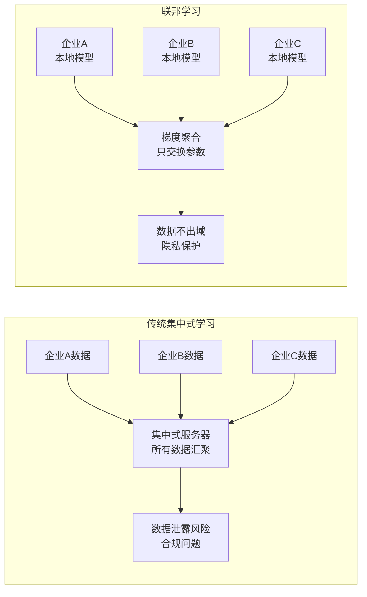
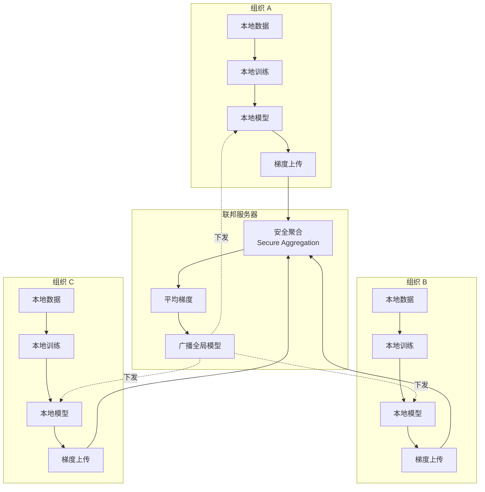
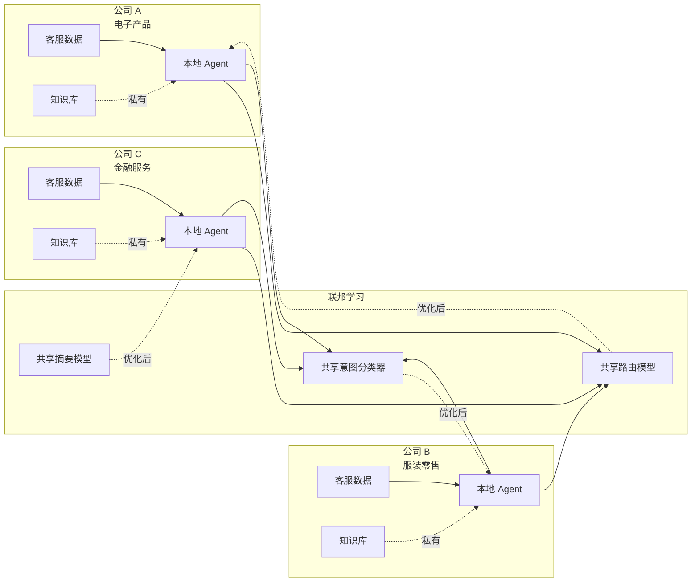
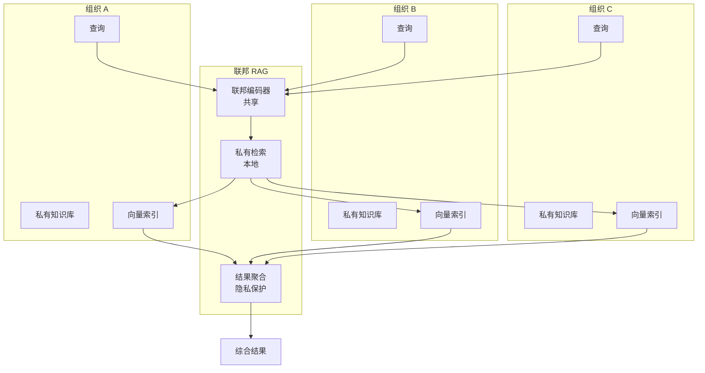
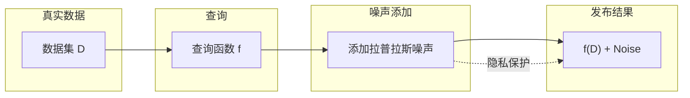
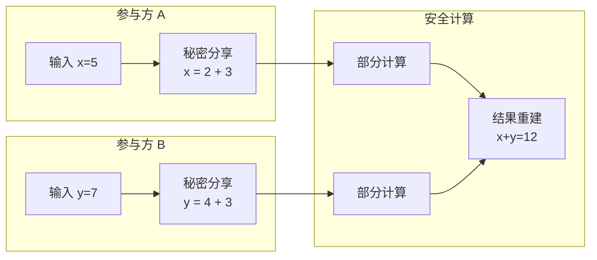
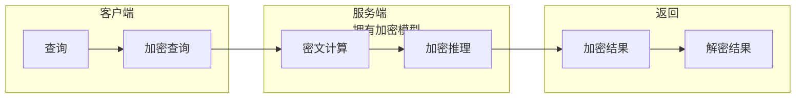
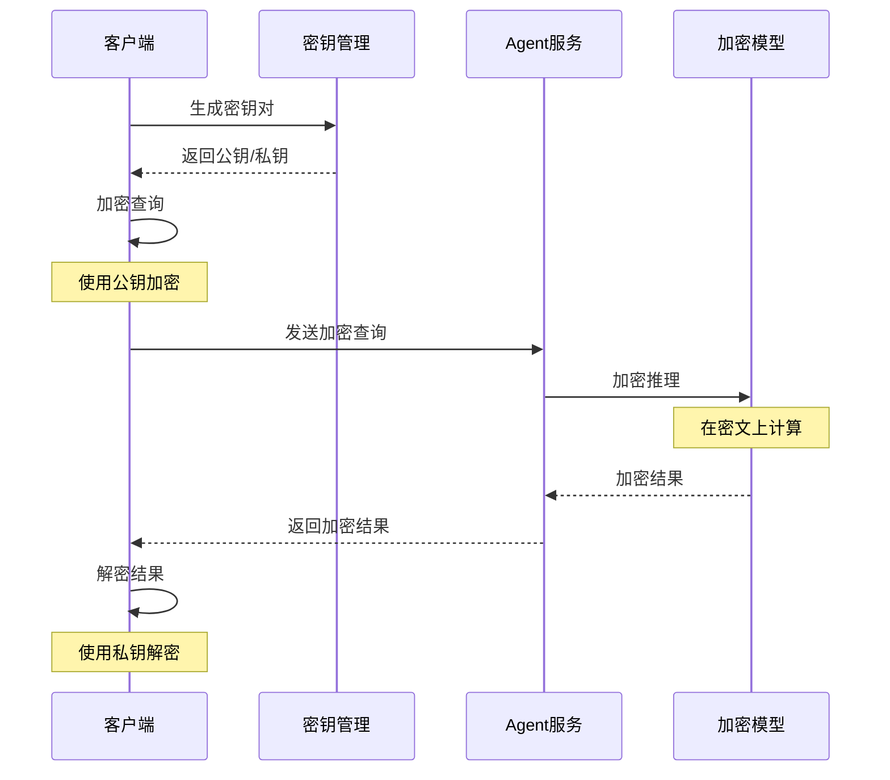

# 09 · Agent 联邦学习与隐私计算（Federated Learning & Privacy-Preserving AI）

> 阶段：6 前沿 · 难度：⭐⭐⭐⭐⭐ · 预计：2026 Q4
> 前置：[阶段 5 毕业](../阶段5-架构师/06-项目P5-企业客服平台.md)
> 产出：掌握联邦学习架构与隐私保护技术

---

## 为什么 Agent 需要联邦学习

> 来源：[Google Federated Learning](https://ai.googleblog.com/2017/04/federated-learning-collaborative.html) + [OpenMined](https://openmined.org/)

**核心矛盾**：企业希望共享 AI 能力，但绝不能共享数据。



### 企业场景

| 场景 | 隐私要求 | 联邦学习价值 |
|-----|---------|------------|
| **跨企业知识共享** | 极高 | 共享模型能力，不共享客户数据 |
| **医疗 AI 协作** | 法律强制 | 符合 HIPAA/GDPR 要求 |
| **金融风控联盟** | 极高 | 联合反欺诈，保护交易数据 |
| **供应链协同** | 高 | 共享预测模型，保护商业机密 |
| **政府跨部门** | 极高 | 跨部门 AI 协同，数据隔离 |

---

## 联邦学习架构

### 完整架构



### Java 实现：联邦学习框架

```java
package com.example.federated;

import org.springframework.stereotype.*;
import java.util.*;
import java.util.concurrent.*;

/**
 * 联邦学习协调器
 * 运行在中央服务器，协调联邦学习过程
 */
@Service
public class FederatedLearningCoordinator {

    private final ModelAggregator aggregator;
    private final SecureAggregation secureAgg;
    private final List<FederatedClient> clients;

    /**
     * 执行一轮联邦学习
     */
    public FederatedRoundResult executeRound(FederatedConfig config) {
        // 1. 选择参与客户端
        List<FederatedClient> selectedClients = selectClients(config.fraction(), config.minClients());

        // 2. 发送当前全局模型
        GlobalModel currentModel = getCurrentGlobalModel();
        selectedClients.forEach(client ->
            client.receiveGlobalModel(currentModel)
        );

        // 3. 客户端本地训练
        CompletableFuture<Map<FederatedClient, ModelUpdate>> trainingFuture =
            CompletableFuture.supplyAsync(() ->
                parallelLocalTraining(selectedClients, config)
            );

        // 4. 等待所有客户端完成
        Map<FederatedClient, ModelUpdate> updates = trainingFuture.join();

        // 5. 安全聚合
        ModelUpdate aggregatedUpdate = secureAgg.aggregate(updates, config);

        // 6. 更新全局模型
        GlobalModel newModel = aggregator.applyUpdate(currentModel, aggregatedUpdate);

        // 7. 评估全局模型
        double evaluation = evaluateGlobalModel(newModel, config.getValidationSet());

        // 8. 记录本轮
        return new FederatedRoundResult(
            config.roundNumber(),
            selectedClients.size(),
            aggregatedUpdate,
            newModel,
            evaluation
        );
    }

    /**
     * 选择参与客户端
     * 策略：随机采样 + 确保多样性
     */
    private List<FederatedClient> selectClients(double fraction, int minClients) {
        List<FederatedClient> allClients = new ArrayList<>(clients);
        Collections.shuffle(allClients);

        int targetSize = Math.max(minClients, (int) (allClients.size() * fraction));

        // 确保多样性：不同行业、不同地区
        return ensureDiversity(allClients.subList(0, targetSize));
    }

    /**
     * 并行本地训练
     */
    private Map<FederatedClient, ModelUpdate> parallelLocalTraining(
            List<FederatedClient> clients,
            FederatedConfig config) {

        ExecutorService executor = Executors.newFixedThreadPool(clients.size());

        Map<FederatedClient, CompletableFuture<ModelUpdate>> futures = new HashMap<>();

        for (FederatedClient client : clients) {
            CompletableFuture<ModelUpdate> future = CompletableFuture.supplyAsync(() -> {
                return client.trainLocally(config.localEpochs());
            }, executor);
            futures.put(client, future);
        }

        // 等待所有完成
        Map<FederatedClient, ModelUpdate> results = new HashMap<>();
        futures.forEach((client, future) -> {
            try {
                results.put(client, future.get());
            } catch (Exception e) {
                log.error("客户端 {} 训练失败", client.getId(), e);
            }
        });

        executor.shutdown();
        return results;
    }
}

/**
 * 联邦学习客户端
 * 运行在各组织本地
 */
public class FederatedClient {

    private final String organizationId;
    private final LocalDataset localData;
    private final LocalModel localModel;
    private final DifferentialPrivacy dp;

    /**
     * 本地训练
     */
    public ModelUpdate trainLocally(int epochs) {
        // 1. 加载全局模型参数
        localModel.loadParameters(getCurrentGlobalParameters());

        // 2. 本地训练
        for (int epoch = 0; epoch < epochs; epoch++) {
            for (Batch batch : localData.getBatches()) {
                localModel.trainStep(batch);
            }
        }

        // 3. 计算更新（梯度）
        ModelUpdate update = localModel.computeUpdate();

        // 4. 应用差分隐私
        ModelUpdate privateUpdate = dp.addNoise(update, epsilon = 1.0);

        // 5. 返回
        return privateUpdate;
    }

    /**
     * 接收全局模型
     */
    public void receiveGlobalModel(GlobalModel model) {
        localModel.loadParameters(model.getParameters());
    }
}

/**
 * 安全聚合器
 * 使用密码学确保只能看到聚合后的梯度
 */
@Component
class SecureAggregation {

    /**
     * 安全聚合多个客户端的更新
     * 使用协议：只能看到聚合结果，无法推断单个客户端的贡献
     */
    public ModelUpdate aggregate(Map<FederatedClient, ModelUpdate> updates,
                               FederatedConfig config) {
        // 1. 秘密分享（Secret Sharing）
        Map<FederatedClient, List<Share>> shares = distributeShares(updates);

        // 2. 客户端之间交换分享
        Map<FederatedClient, List<Share>> receivedShares = exchangeShares(shares);

        // 3. 重建聚合
        return reconstructAggregation(updates, receivedShares);
    }

    /**
     * 秘密分享分配
     * 每个更新被分成 n-1 个分享
     */
    private Map<FederatedClient, List<Share>> distributeShares(
            Map<FederatedClient, ModelUpdate> updates) {

        List<FederatedClient> clients = new ArrayList<>(updates.keySet());
        Map<FederatedClient, List<Share>> shares = new HashMap<>();

        for (FederatedClient client : clients) {
            List<Share> clientShares = new ArrayList<>();

            // 为每个其他客户端创建一个分享
            for (FederatedClient other : clients) {
                if (!other.equals(client)) {
                    Share share = createShare(updates.get(client), other);
                    clientShares.add(share);
                }
            }

            shares.put(client, clientShares);
        }

        return shares;
    }
}

/**
 * 模型聚合器
 */
@Component
class ModelAggregator {

    /**
     * FedAvg: 联邦平均
     * 新模型 = 旧模型 + 平均梯度
     */
    public GlobalModel applyUpdate(GlobalModel current,
                                  ModelUpdate aggregatedUpdate) {
        Map<String, float[]> newParams = new HashMap<>();

        for (String layerName : current.getParameters().keySet()) {
            float[] currentWeights = current.getParameters().get(layerName);
            float[] gradients = aggregatedUpdate.getGradients().get(layerName);

            // 应用学习率
            float[] newWeights = new float[currentWeights.length];
            for (int i = 0; i < currentWeights.length; i++) {
                newWeights[i] = currentWeights[i] +
                               aggregatedUpdate.learningRate() * gradients[i];
            }

            newParams.put(layerName, newWeights);
        }

        return new GlobalModel(newParams);
    }

    /**
     * FedProx: 近端优化
     * 解决异构数据问题
     */
    public GlobalModel applyProxUpdate(GlobalModel current,
                                       ModelUpdate aggregatedUpdate,
                                       double mu) {
        // FedAvg + 近端项，防止本地模型漂移太远
        // 类似于正则化
        // ... 实现
    }
}
```

---

## Agent 联邦学习场景

### 场景 1：跨企业知识共享



**共享什么**：
- ✅ 通用能力：意图分类、路由策略、摘要生成
- ❌ 专有知识：产品信息、客户数据、商业机密

### 场景 2：联邦 RAG



### Java 实现：联邦 RAG

```java
package com.example.federated.rag;

import org.springframework.stereotype.*;
import java.util.*;

/**
 * 联邦 RAG 服务
 * 多组织协作，但各自保留私有知识库
 */
@Service
public class FederatedRAGService {

    private final FederatedEncoder encoder;  // 联邦学习的共享编码器
    private final List<OrganizationMember> members;

    /**
     * 联邦检索
     */
    public FederatedRetrievalResult retrieve(String query,
                                            RetrieverConfig config) {
        // 1. 使用联邦编码器编码查询
        float[] queryEmbedding = encoder.encode(query);

        // 2. 并行在各组织检索
        List<CompletableFuture<LocalRetrievalResult>> futures = members.stream()
            .map(member -> CompletableFuture.supplyAsync(() ->
                member.retrieve(queryEmbedding, config)))
            .toList();

        // 3. 等待所有结果
        List<LocalRetrievalResult> localResults = futures.stream()
            .map(CompletableFuture::join)
            .toList();

        // 4. 隐私保护的聚合
        return aggregatePrivately(localResults, config);
    }

    /**
     * 隐私保护聚合
     * 只返回文档内容，不泄露来源组织
     */
    private FederatedRetrievalResult aggregatePrivately(
            List<LocalRetrievalResult> localResults,
            RetrieverConfig config) {

        // 1. 收集所有文档
        List<Document> allDocs = localResults.stream()
            .flatMap(r -> r.getDocuments().stream())
            .toList();

        // 2. 重排序（使用联邦学习的重排序模型）
        List<Document> reranked = rerank(allDocs, queryEmbedding);

        // 3. 去重
        List<Document> deduped = deduplicate(reranked);

        // 4. 应用隐私过滤
        List<Document> filtered = applyPrivacyFilter(deduped, config);

        return new FederatedRetrievalResult(
            filtered,
            true,  // aggregated
            localResults.size()  // 来自多少组织
        );
    }

    /**
     * 联邦学习：优化编码器
     */
    public void trainEncoder(List<TrainingExample> examples) {
        // 各组织使用各自私有数据训练编码器
        // 只交换梯度，不交换数据
        // ... 联邦学习流程
    }
}

/**
 * 组织成员
 */
class OrganizationMember {

    private final String organizationId;
    private final VectorIndex localIndex;

    /**
     * 本地检索
     */
    public LocalRetrievalResult retrieve(float[] queryEmbedding,
                                        RetrieverConfig config) {
        // 在本地向量索引中检索
        List<Document> docs = localIndex.search(queryEmbedding, config.topK());

        // 返回结果（不透露组织信息）
        return new LocalRetrievalResult(docs, organizationId);
    }
}
```

---

## 差分隐私（Differential Privacy）

### 核心概念

**ε-differential privacy**：查询结果对单个数据的变化不敏感。



### Java 实现：差分隐私

```java
package com.example.privacy;

import org.springframework.stereotype.*;
import java.util.*;
import java.security.SecureRandom;

/**
 * 差分隐私工具
 */
@Component
public class DifferentialPrivacy {

    private final SecureRandom random = new SecureRandom();

    /**
     * 添加拉普拉斯噪声
     *
     * @param trueValue 真实值
     * @param sensitivity 函数敏感度 Δf
     * @param epsilon 隐私参数 ε
     * @return 带噪声的值
     */
    public double addLaplaceNoise(double trueValue,
                                  double sensitivity,
                                  double epsilon) {
        // 拉普噪声采样
        double scale = sensitivity / epsilon;
        double noise = sampleLaplace(scale);

        return trueValue + noise;
    }

    /**
     * 拉普分布采样
     * 使用指数分布变换：Lap(0, b) = Exp1 - Exp2
     */
    private double sampleLaplace(double scale) {
        double u = random.nextDouble() - 0.5;
        return -scale * Math.signum(u) * Math.log(1 - 2 * Math.abs(u));
    }

    /**
     * 向量的差分隐私
     * 为梯度等向量添加噪声
     */
    public float[] addVectorNoise(float[] vector,
                                  double sensitivity,
                                  double epsilon) {
        float[] noisy = new float[vector.length];
        double perDimensionEpsilon = epsilon / vector.length;

        for (int i = 0; i < vector.length; i++) {
            noisy[i] = (float) addLaplaceNoise(
                vector[i],
                sensitivity,
                perDimensionEpsilon
            );
        }

        return noisy;
    }

    /**
     * 高斯机制
     * 用于 (ε, δ)-dp
     */
    public double addGaussianNoise(double trueValue,
                                  double sensitivity,
                                  double epsilon,
                                  double delta) {
        double sigma = sensitivity * Math.sqrt(2 * Math.log(1.25 / delta)) / epsilon;
        double noise = random.nextGaussian() * sigma;

        return trueValue + noise;
    }
}

/**
 * 在联邦学习中使用差分隐私
 */
class PrivateFederatedClient extends FederatedClient {

    private final DifferentialPrivacy dp;

    @Override
    public ModelUpdate trainLocally(int epochs) {
        // 本地训练
        ModelUpdate update = super.trainLocally(epochs);

        // 计算敏感度
        double sensitivity = computeSensitivity(update);

        // 添加噪声
        return dp.addGradientNoise(update, sensitivity, epsilon = 1.0);
    }

    /**
     * 计算梯度敏感度
     * 取决于梯度裁剪
     */
    private double computeSensitivity(ModelUpdate update) {
        // 梯度裁剪到 L2 ≤ C
        // 敏感度 = 2C
        double clipNorm = 1.0;
        clipGradients(update, clipNorm);
        return 2 * clipNorm;
    }
}
```

### ε 参数选择

| ε | 隐私级别 | 适用场景 |
|---|--------|---------|
| 0.1 | 极强隐私 | 医疗数据、财务数据 |
| 1.0 | 强隐私 | 一般敏感数据 |
| 10 | 中等隐私 | 公开统计数据 |
| ∞ | 无隐私 | 公开模型 |

---

## 安全多方计算（SMPC）基础

### 核心概念

多方在不泄露各自输入的情况下计算函数。



### Java 实现：简单 SMPC

```java
package com.example.smpc;

import org.springframework.stereotype.*;
import java.util.*;
import java.math.BigInteger;

/**
 * 简单的 SMPC 实现
 * 演示安全加法
 */
@Service
public class SecureMultiPartyComputation {

    /**
     * 安全加法协议
     * 三个方各自有私有数字，计算和而不泄露各自数字
     */
    public BigInteger secureAddition(BigInteger input1,
                                     BigInteger input2,
                                     BigInteger input3) {
        // 1. 生成随机分享
        BigInteger[] shares1 = splitSecret(input1, 3);
        BigInteger[] shares2 = splitSecret(input2, 3);
        BigInteger[] shares3 = splitSecret(input3, 3);

        // 2. 每方收到部分分享
        BigInteger party1Sum = shares1[0].add(shares2[0]).add(shares3[0]);
        BigInteger party2Sum = shares1[1].add(shares2[1]).add(shares3[1]);
        BigInteger party3Sum = shares1[2].add(shares2[2]).add(shares3[2]);

        // 3. 重构总和
        return reconstructSum(List.of(party1Sum, party2Sum, party3Sum));
    }

    /**
     * 秘密分享：加法秘密分享
     * s = s1 + s2 + ... + sn
     */
    private BigInteger[] splitSecret(BigInteger secret, int n) {
        BigInteger[] shares = new BigInteger[n];
        Random random = new Random();

        // 前 n-1 个分享随机生成
        BigInteger sum = BigInteger.ZERO;
        for (int i = 0; i < n - 1; i++) {
            shares[i] = new BigInteger(secret.bitLength(), random);
            sum = sum.add(shares[i]);
        }

        // 最后一个分享确保总和等于秘密
        shares[n - 1] = secret.subtract(sum);

        return shares;
    }

    /**
     * 重构秘密
     */
    private BigInteger reconstructSum(List<BigInteger> shares) {
        return shares.stream().reduce(BigInteger.ZERO, BigInteger::add);
    }

    /**
     * 安全比较协议（Yao's GC 简化版）
     * 比较两个数的大小而不泄露具体值
     */
    public ComparisonResult secureCompare(BigInteger value1,
                                         BigInteger value2) {
        // 实际实现需要使用混淆电路（Garbled Circuit）
        // 这里简化说明
        // ... YaoGC 协议实现
        return new ComparisonResult(value1.compareTo(value2));
    }
}
```

---

## 同态加密 Agent 查询

### 全同态加密（FHE）



### Java 实现：同态加密 Agent

```java
package com.example.homomorphic;

import org.springframework.stereotype.*;
import java.util.*;
import java.math.BigInteger;

/**
 * 同态加密 Agent 服务
 * 使用简化版同态加密（实际应使用 HElib/Microsoft SEAL）
 */
@Service
public class HomomorphicAgentService {

    private final EncryptedModel encryptedModel;
    private final KeyPair keyPair;

    /**
     * 加密查询
     */
    public EncryptedQuery encryptQuery(String plainQuery) {
        // 使用公钥加密
        BigInteger encrypted = HomomorphicEncryption.encrypt(
            plainQuery,
            keyPair.publicKey()
        );

        return new EncryptedQuery(encrypted);
    }

    /**
     * 在加密数据上推理
     */
    public EncryptedResponse query(EncryptedQuery encryptedQuery) {
        // 1. 解密查询（在真实场景中，这是密文计算）
        // 这里简化：实际 FHE 可以直接在密文上计算

        // 2. 加密推理
        BigInteger encryptedResult = encryptedModel.predict(
            encryptedQuery.ciphertext()
        );

        // 3. 返回加密结果
        return new EncryptedResponse(encryptedResult);
    }

    /**
     * 客户端解密
     */
    public String decryptResponse(EncryptedResponse response) {
        return HomomorphicEncryption.decrypt(
            response.ciphertext(),
            keyPair.privateKey()
        );
    }
}

/**
 * 加密模型
 * 模型参数是加密的
 */
class EncryptedModel {

    private final List<BigInteger> encryptedWeights;
    private final BigInteger encryptedBias;

    /**
     * 加密预测
     * 简化版：线性变换
     * 真实场景使用全同态加密
     */
    public BigInteger predict(BigInteger encryptedInput) {
        // 在密文上执行：y = wx + b
        // 使用同态加法和乘法
        BigInteger result = encryptedBias;

        for (int i = 0; i < encryptedWeights.size(); i++) {
            // 同态乘法
            BigInteger term = homomorphicMultiply(
                encryptedWeights.get(i),
                extractInputComponent(encryptedInput, i)
            );
            // 同态加法
            result = homomorphicAdd(result, term);
        }

        return result;
    }

    private BigInteger homomorphicMultiply(BigInteger a, BigInteger b) {
        // 简化：实际 FHE 更复杂
        return a.multiply(b);
    }

    private BigInteger homomorphicAdd(BigInteger a, BigInteger b) {
        return a.add(b);
    }
}
```

### 时序图：同态加密 Agent 查询



---

## 落地挑战与解决方案

### 挑战 1：通信开销

| 问题 | 解决方案 |
|-----|---------|
| 模型参数量大 | 模型压缩、量化 |
| 频繁通信 | 增加本地训练轮次 |
| 异构网络 | 自适应聚合频率 |

### 挑战 2：数据异构性

| 问题 | 解决方案 |
|-----|---------|
| Non-IID 数据 | FedProx、FedNova |
| 类别不平衡 | 采样策略调整 |
| 质量差异 | 加权聚合 |

### 挑战 3：系统异构性

| 问题 | 解决方案 |
|-----|---------|
| 计算能力差异 | 异步聚合 |
| 网络不稳定 | 容错机制 |
| 设备离线 | 持久化状态 |

---

## 检查清单

在实施联邦学习时：

- [ ] 明确隐私保护级别要求
- [ ] 评估是否真的需要联邦学习（vs 集中式）
- [ ] 选择合适的聚合算法
- [ ] 实施差分隐私保护
- [ ] 建立安全多方计算协议
- [ ] 评估通信开销
- [ ] 处理数据异构性
- [ ] 建立激励机制（鼓励参与）
- [ ] 确保符合法规（GDPR/个人信息保护法）
- [ ] 实施审计和监控

---

## 参考资源

- Google Federated Learning: https://ai.googleblog.com/2017/04/federated-learning-collaborative.html
- OpenMined PySyft: https://github.com/OpenMined/PySyft
- Differential Privacy: https://www.cs.cornell.edu/~shmat/shmat_cornell_finance_triples.pdf
- Microsoft SEAL: https://github.com/microsoft/SEAL
- FedML: https://fedml.ai/

---

> 下一步：[Agent 推理优化前沿](10-Agent推理优化前沿.md) —— 让 Agent 更快、更便宜
