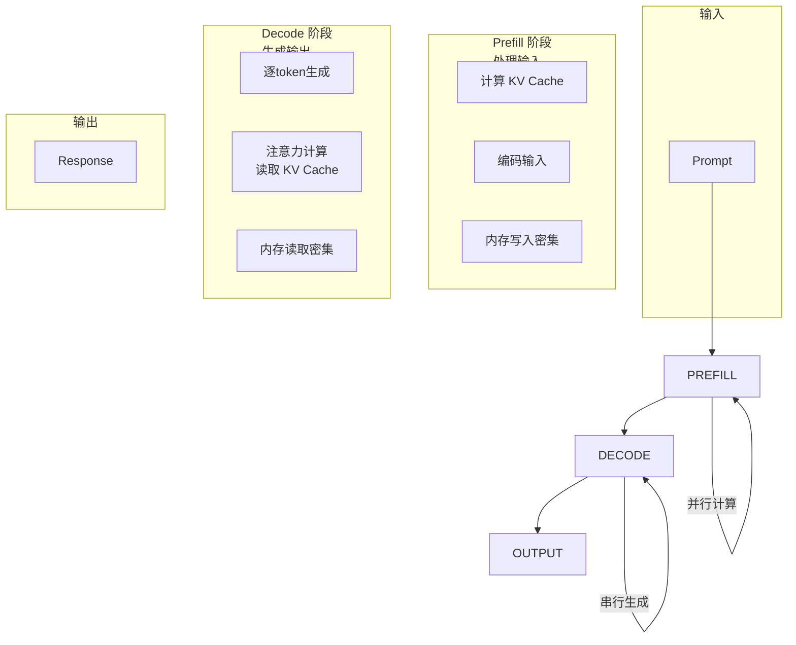
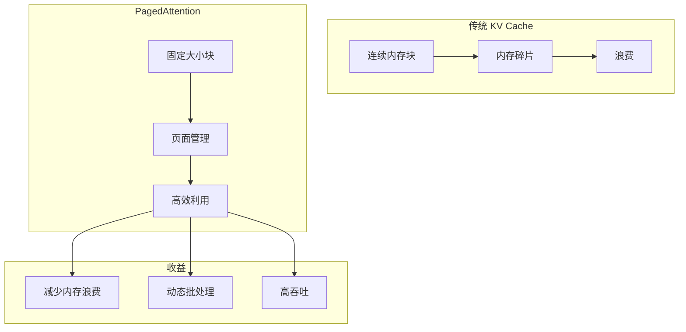
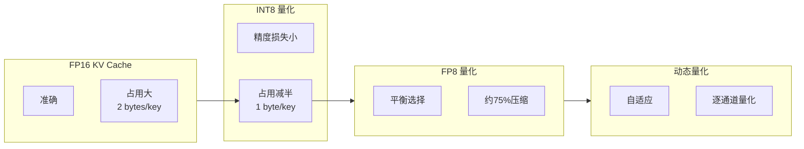
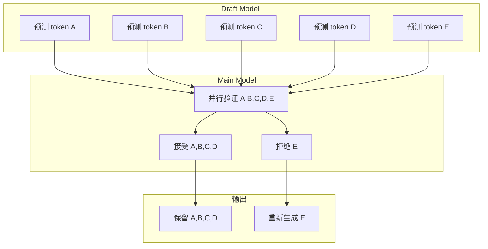
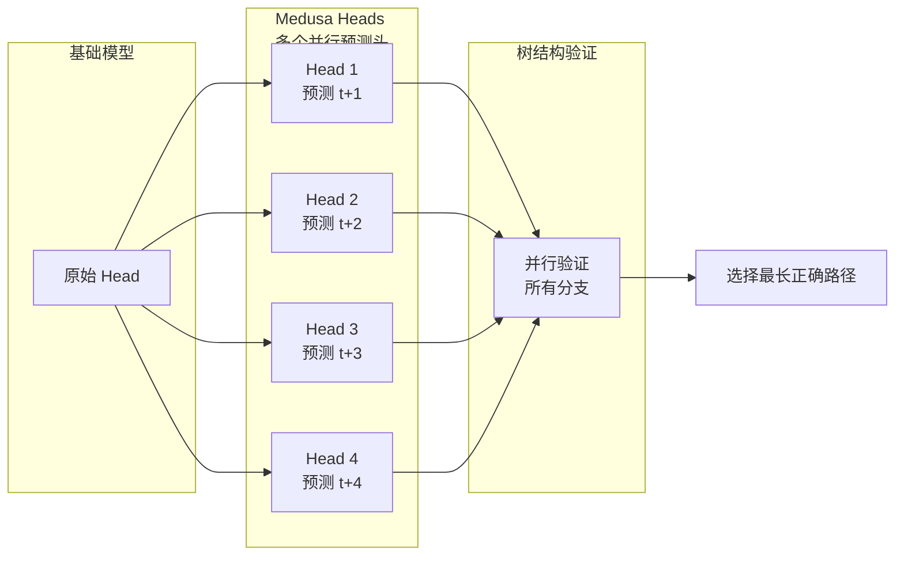
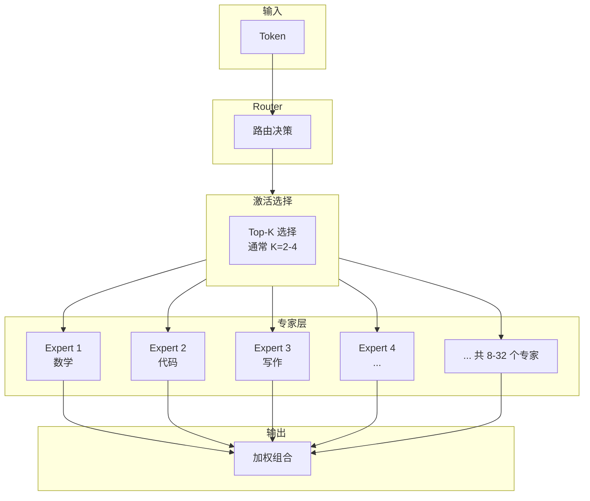
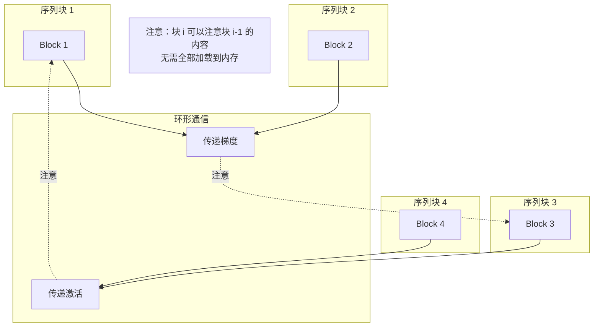
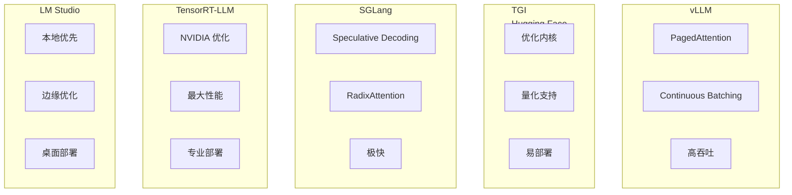
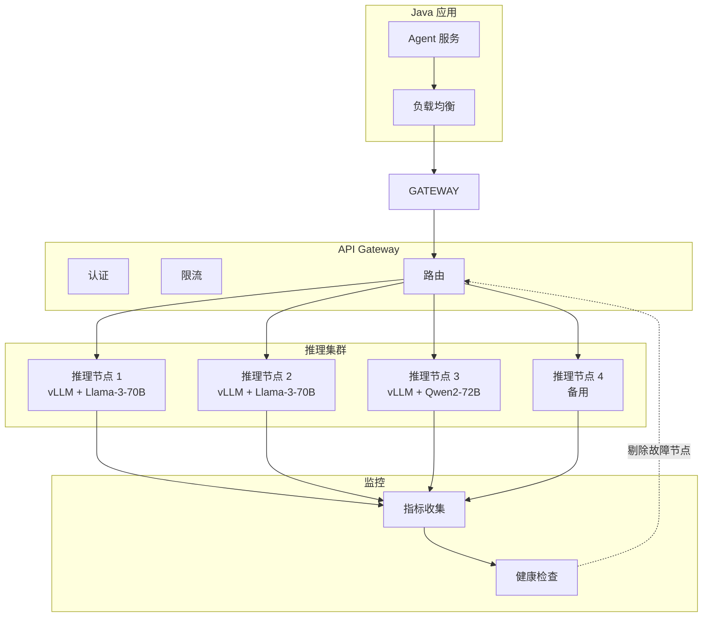
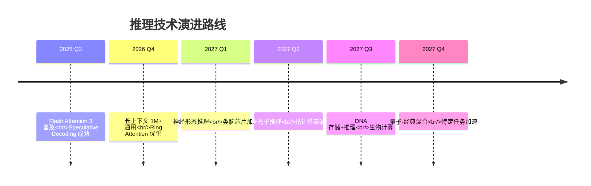

# 10 · Agent 推理优化前沿（Inference Optimization Frontier）

> 阶段：6 前沿 · 难度：⭐⭐⭐⭐⭐ · 预计：2026 Q3
> 前置：[阶段 5 毕业](../阶段5-架构师/06-项目P5-企业客服平台.md)
> 产出：深入理解 LLM 推理优化技术栈

---

## LLM 推理优化的底层原理

### 两阶段分析



### 性能瓶颈分析

| 阶段 | 计算模式 | 内存模式 | 瓶颈 | 优化方向 |
|-----|---------|---------|------|---------|
| **Prefill** | 并行 | 写入密集 | 计算受限 | Flash Attention、批处理 |
| **Decode** | 串行 | 读取密集 | 内存受限 | KV Cache 优化、投机解码 |

**关键公式**：
- **Prefill 时间** ∝ 输入 token 数 × 模型大小 / 并行度
- **Decode 时间** ∝ 输出 token 数 × 内存带宽

---

## KV Cache 优化全景

### PagedAttention



### KV Cache 量化



### Java 集成：vLLM 推理服务

```java
package com.example.inference;

import org.springframework.stereotype.*;
import org.springframework.web.reactive.*;
import java.util.*;

/**
 * vLLM 推理客户端
 * 连接优化后的推理服务
 */
@Service
public class VLLMInferenceClient {

    private final WebClient webClient;
    private final String vllmEndpoint;

    /**
     * 流式推理
     */
    public Flux<String> streamInference(InferenceRequest request) {
        return webClient.post()
            .uri(vllmEndpoint + "/v1/completions")
            .bodyValue(buildVLLMRequest(request))
            .retrieve()
            .bodyToFlux(String.class)
            .filter(s -> !s.isBlank());  // 过滤 SSE 控制帧
    }

    /**
     * 批量推理
     * vLLM 自动处理连续批处理
     */
    public Flux<InferenceResponse> batchInference(
            List<InferenceRequest> requests) {

        // vLLM 的 Continuous Batching 自动组合请求
        return webClient.post()
            .uri(vllmEndpoint + "/v1/completions")
            .bodyValue(buildBatchRequest(requests))
            .retrieve()
            .bodyToFlux(InferenceResponse.class);
    }

    /**
     * 构建请求
     */
    private Map<String, Object> buildVLLMRequest(InferenceRequest request) {
        return Map.of(
            "model", request.getModel(),
            "prompt", request.getPrompt(),
            "max_tokens", request.getMaxTokens(),
            "temperature", request.getTemperature(),
            "stream", true,
            // vLLM 特定参数
            "n", 1,
            "best_of", 1,
            "use_beam_search", false,
            "stop", List.of()
        );
    }

    /**
     * 预填充优化：长输入处理
     */
    public Mono<Long> estimatePrefillTime(InferenceRequest request) {
        // 根据 vLLM 的预填充性能估算
        int inputTokens = request.getInputTokens();
        int modelSize = getModelSize(request.getModel());

        // 经验公式：Prefill 时间（ms）≈ tokens × size / (GPU 吞吐量)
        double prefillMs = (inputTokens * modelSize) / getThroughput();

        return Mono.just((long) prefillMs);
    }
}
```

---

## Continuous Batching 深度解析

### 时序图展示

```mermaid
sequenceDiagram
    participant R1 as Request 1<br/>短输出
    participant R2 as Request 2<br/>长输出
    participant R3 as Request 3<br/>中等输出
    participant Batch as Batch Manager
    participant GPU as GPU

    Note over Batch: 初始状态
    R1->>Batch: Prompt A (10 tokens)
    Batch->>GPU: 开始 Prefill
    Note over GPU: [A: 10/10 prefilled]

    Note over Batch: Request 2 到达
    R2->>Batch: Prompt B (15 tokens)
    Batch-x-GPU: 继续 A 的 Decode
    Note over GPU: [A: 5 gen, B: 15 prefilled]

    Note over Batch: Request 3 到达
    R3->>Batch: Prompt C (8 tokens)
    Batch->>GPU: 混合 Batch
    Note over GPU: [A: 5 gen, B: 10 gen, C: 8 prefilled]

    Note over Batch: A 完成
    GPU-->>R1: 完成 A (5 tokens)
    Note over GPU: [B: 10 gen, C: 8 gen]

    Note over Batch: 动态调整
    Batch->>GPU: 只处理 B, C
    Note over GPU: [B: 15 gen, C: 12 gen]

    GPU-->>R2: 完成 B (15 tokens)
    GPU-->>R3: 完成 C (12 tokens)
```

### 与静态批处理对比

| 特性 | 静态批处理 | Continuous Batching |
|-----|-----------|---------------------|
| **批组成** | 固定时刻 | 动态调整 |
| **完成处理** | 等待全部完成 | 完成即释放 |
| **吞吐量** | 受限于最慢请求 | 更高 |
| **延迟** | 不均匀 | 更均匀 |
| **实现复杂度** | 低 | 高 |

---

## Speculative Decoding 与 Medusa Heads

### 投机解码原理



**加速比**：投机解码的加速 ≈ 草稿模型速度 / 主模型速度

### Medusa Heads



---

## MoE（Mixture of Experts）推理优化

### 架构



### Java 实现：MoE 模型路由

```java
package com.example.moe;

import org.springframework.stereotype.*;
import java.util.*;

/**
 * Mixture of Experts 路由器
 */
@Service
public class MoERouter {

    private final List<ExpertModel> experts;
    private final GateNetwork gateNetwork;

    /**
     * MoE 推理
     */
    public String inference(String input, MoEConfig config) {
        // 1. 门控网络计算权重
        float[] gateScores = gateNetwork.compute(input, experts.size());

        // 2. Top-K 选择
        List<ExpertSelection> selectedExperts = selectTopExperts(
            gateScores, config.topK()
        );

        // 3. 并行调用选中的专家
        List<CompletableFuture<ExpertOutput>> futures =
            selectedExperts.stream()
                .map(selection ->
                    CompletableFuture.supplyAsync(() ->
                        selection.expert().process(input),
                        selection.expert().getExecutor()
                    )
                )
                .toList();

        // 4. 等待并组合结果
        List<ExpertOutput> outputs = futures.stream()
            .map(CompletableFuture::join)
            .toList();

        // 5. 加权组合
        return combineOutputs(outputs, selectedExperts);
    }

    /**
     * Top-K 专家选择
     */
    private List<ExpertSelection> selectTopExperts(float[] scores, int k) {
        // 按分数排序
        List<Integer> indices = new ArrayList<>();
        for (int i = 0; i < scores.length; i++) {
            indices.add(i);
        }
        indices.sort((a, b) -> Float.compare(scores[b], scores[a]));

        // 选择前 K 个
        List<ExpertSelection> selected = new ArrayList<>();
        for (int i = 0; i < Math.min(k, indices.size()); i++) {
            int idx = indices.get(i);
            selected.add(new ExpertSelection(
                experts.get(idx),
                scores[idx]
            ));
        }

        return selected;
    }

    /**
     * 加权组合输出
     */
    private String combineOutputs(List<ExpertOutput> outputs,
                                 List<ExpertSelection> selections) {
        // 简单加权平均
        // 实际可能更复杂（投票、拼接等）
        StringBuilder combined = new StringBuilder();
        float totalWeight = selections.stream()
            .map(ExpertSelection::weight)
            .reduce(0.0f, Float::sum);

        for (int i = 0; i < outputs.size(); i++) {
            float weight = selections.get(i).weight() / totalWeight;
            String output = outputs.get(i).text();

            // 可以按权重采样或加权拼接
            combined.append(output).append(" ");
        }

        return combined.toString().trim();
    }
}

/**
 * 专家模型
 */
class ExpertModel {
    private final String specialization;
    private final ExecutorService executor;

    public ExpertOutput process(String input) {
        // 使用专门的专家模型处理
        return modelService.infer(input, this.specialization);
    }
}
```

---

## 长上下文优化

### Ring Attention



### Flash Attention 3

| 特性 | Flash Attention 2 | Flash Attention 3 |
|-----|------------------|-------------------|
| **硬件支持** | H100 | H100+ |
| **内核融合** | 部分 | 完全 |
| **吞吐提升** | 2× | 3× |
| **上下文长度** | 128K | 200K+ |

---

## 推理框架对比

### 对比图



### 详细对比

| 框架 | 优势 | 劣势 | 适用场景 |
|-----|------|------|---------|
| **vLLM** | 吞吐量最高、PagedAttention | 内存占用高 | 高吞吐服务 |
| **TGI** | 功能丰富、易用 | 性能中等 | 企业部署 |
| **SGLang** | 极低延迟 | 社区较小 | 实时应用 |
| **TensorRT-LLM** | 最佳性能 | 仅限 NVIDIA | GPU 优化 |
| **LM Studio** | 本地部署 | 规模受限 | 边缘设备 |

---

## 推理成本数学模型

### 成本分解

```
总成本 = GPU 成本 + 带宽成本 + 存储成本 + 运维成本

GPU 成本 = (请求数/秒) × (Prefill 时间 + Decode 时间) / GPU 吞吐量 × GPU 单价

其中：
- Prefill 时间 = 输入 tokens × Prefill 系数
- Decode 时间 = 输出 tokens × Decode 系数
- GPU 吞吐量取决于：模型大小、批大小、硬件型号
```

### 成本优化策略

| 策略 | 成本节省 | 质量/延迟影响 |
|-----|---------|-------------|
| 模型量化（FP16→INT8） | 50% | <1% |
| Continuous Batching | 30-50% | 无 |
| Speculative Decoding | 2-3× 加速 | 无 |
| PagedAttention | 20-30% | 无 |
| 输入压缩 | 10-20% | 视情况 |
| 模型路由（混合大/小） | 50-70% | 任务相关 |

---

## Java 微服务调用自建推理集群

### 架构



### Java 实现：推理服务客户端

```java
package com.example.inference;

import org.springframework.stereotype.*;
import org.springframework.web.reactive.function.client.*;
import java.util.*;
import java.util.concurrent.*;

/**
 * 自建推理集群客户端
 */
@Service
public class InferenceClusterClient {

    private final WebClient webClient;
    private final List<InferenceEndpoint> endpoints;
    private final LoadBalancer loadBalancer;
    private final CircuitBreaker circuitBreaker;

    /**
     * 推理请求
     */
    public Mono<String> inference(InferenceRequest request) {
        // 1. 选择健康的端点
        InferenceEndpoint endpoint = loadBalancer.selectEndpoint(
            request.getModel(),
            endpoints
        );

        // 2. 执行请求（带熔断）
        return circuitBreaker.execute(() ->
            endpoint.inference(request)
                .retryWhen(Retry.backoff(3, Duration.ofMillis(100)))
        ).onErrorResume(throwable -> {
            // 3. 失败时切换到其他端点
            log.warn("端点 {} 失败，切换", endpoint.getId());
            return tryFallback(request);
        });
    }

    /**
     * 批量推理
     * 自动分批到多个端点
     */
    public Flux<InferenceResponse> batchInference(
            List<InferenceRequest> requests) {

        // 1. 按模型分组
        Map<String, List<InferenceRequest>> grouped = groupByModel(requests);

        // 2. 并行处理各组
        List<Flux<InferenceResponse>> resultFluxes = new ArrayList<>();

        for (Map.Entry<String, List<InferenceRequest>> entry : grouped.entrySet()) {
            String model = entry.getKey();
            List<InferenceRequest> modelRequests = entry.getValue();

            // 分批
            List<List<InferenceRequest>> batches = splitBatches(
                modelRequests, 32  // 每批32个请求
            );

            // 并行发送各批
            for (List<InferenceRequest> batch : batches) {
                Flux<InferenceResponse> batchFlux = sendBatch(batch, model);
                resultFluxes.add(batchFlux);
            }
        }

        // 3. 合并所有结果
        return Flux.merge(resultFluxes);
    }

    /**
     * 流式推理
     */
    public Flux<String> streamInference(InferenceRequest request) {
        InferenceEndpoint endpoint = loadBalancer.selectEndpoint(
            request.getModel(),
            endpoints
        );

        return endpoint.streamInference(request)
            .doOnSubscribe(subscription ->
                metrics.recordInferenceStart(endpoint, request)
            )
            .doOnComplete(() ->
                metrics.recordInferenceSuccess(endpoint, request)
            )
            .doOnError(error ->
                metrics.recordInferenceFailure(endpoint, request, error)
            );
    }

    /**
     * 健康检查
     */
    @Scheduled(fixedRate = 30000)  // 每30秒
    public void healthCheck() {
        endpoints.parallelStream().forEach(endpoint -> {
            boolean healthy = endpoint.healthCheck().block();
            endpoint.setHealthy(healthy);

            if (!healthy) {
                log.warn("端点 {} 不健康", endpoint.getId());
                loadBalancer.markUnhealthy(endpoint);
            }
        });
    }
}

/**
 * 推理端点
 */
class InferenceEndpoint {
    private final String id;
    private final String baseUrl;
    private final Set<String> supportedModels;
    private volatile boolean healthy = true;
    private final WebClient webClient;

    public Mono<String> inference(InferenceRequest request) {
        return webClient.post()
            .uri(baseUrl + "/v1/completions")
            .bodyValue(request)
            .retrieve()
            .bodyToMono(String.class)
            .timeout(Duration.ofSeconds(30));
    }

    public Flux<String> streamInference(InferenceRequest request) {
        return webClient.post()
            .uri(baseUrl + "/v1/completions")
            .bodyValue(request.toBuilder().stream(true).build())
            .retrieve()
            .bodyToFlux(String.class);
    }

    public Mono<Boolean> healthCheck() {
        return webClient.get()
            .uri(baseUrl + "/health")
            .retrieve()
            .bodyToMono(Boolean.class)
            .onErrorReturn(false);
    }
}
```

---

## 未来推理技术展望

### 2027+ 展望



### 关键方向

| 技术 | 状态 | 2027 预期 |
|-----|------|----------|
| **光子计算** | 实验室 | 原型系统 |
| **神经形态** | 早期 | 小规模商用 |
| **量子增强** | 理论 | 混合系统 |
| **DNA 存储** | 研究 | 概念验证 |
| **3D 堆叠内存** | 高端 | 较普及 |

---

## 检查清单

在优化推理性能时：

- [ ] 测量基线性能（Prefill vs Decode）
- [ ] 选择合适的推理框架
- [ ] 实施 KV Cache 优化
- [ ] 启用 Continuous Batching
- [ ] 评估 Speculative Decoding 收益
- [ ] 考虑模型量化
- [ ] 优化长上下文处理
- [ ] 实施负载均衡和健康检查
- [ ] 监控推理成本
- [ ] 建立性能回归测试

---

## 参考资源

- vLLM: https://github.com/vllm-project/vllm
- TGI: https://github.com/huggingface/text-generation-inference
- SGLang: https://github.com/sgl-project/sglang
- Flash Attention: https://github.com/Dao-AILab/flash-attention
- PagedAttention Paper: https://arxiv.org/abs/2309.06180

---

> 下一步：[Agent 安全攻防前沿](11-Agent安全攻防前沿.md) —— 保护 Agent 不被攻击
