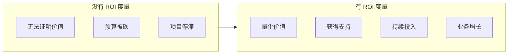
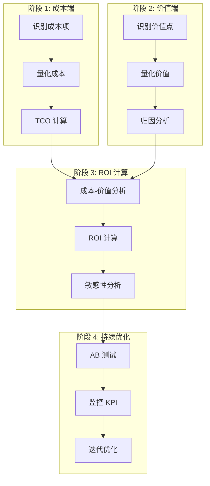
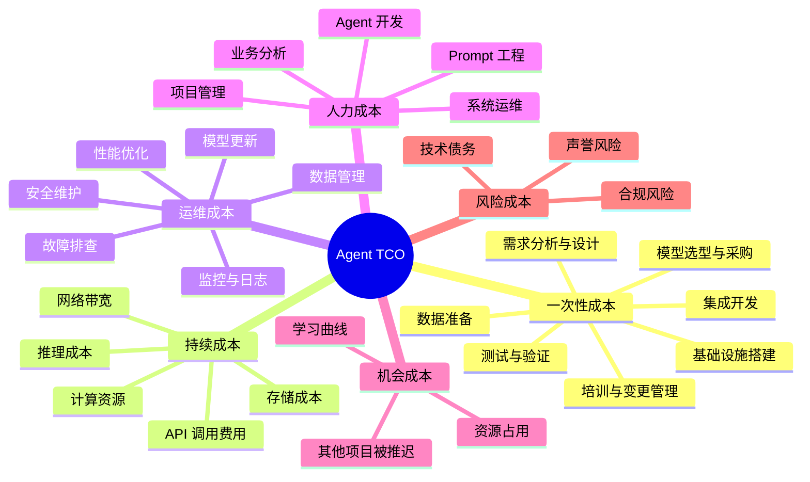
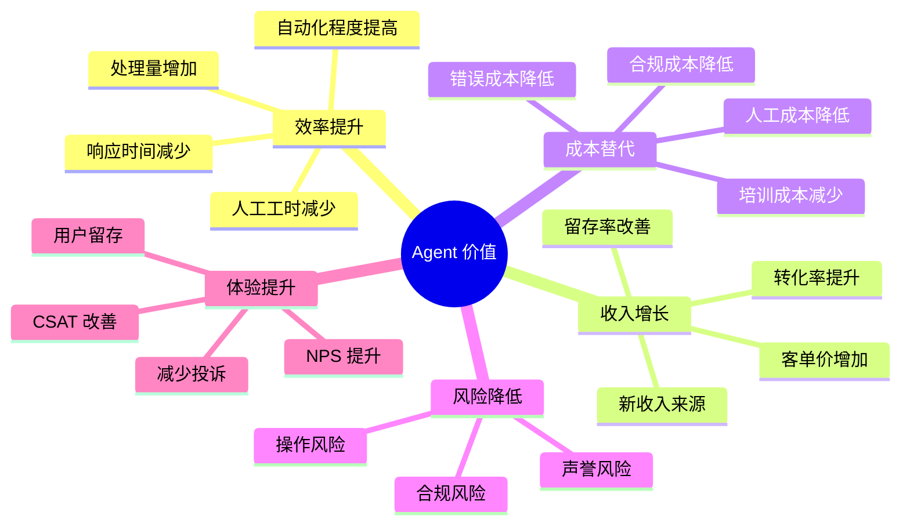
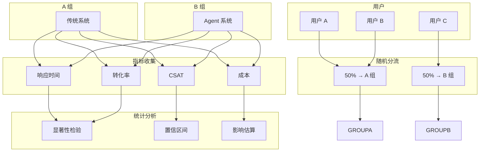
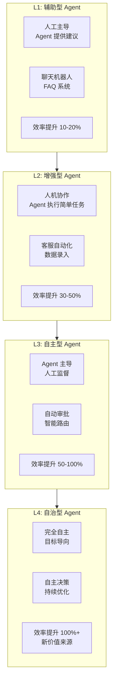
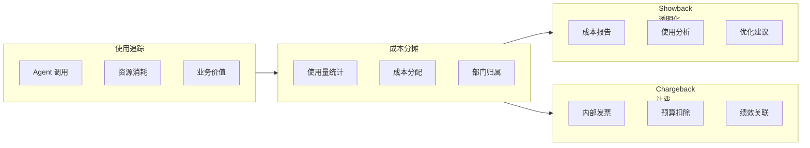
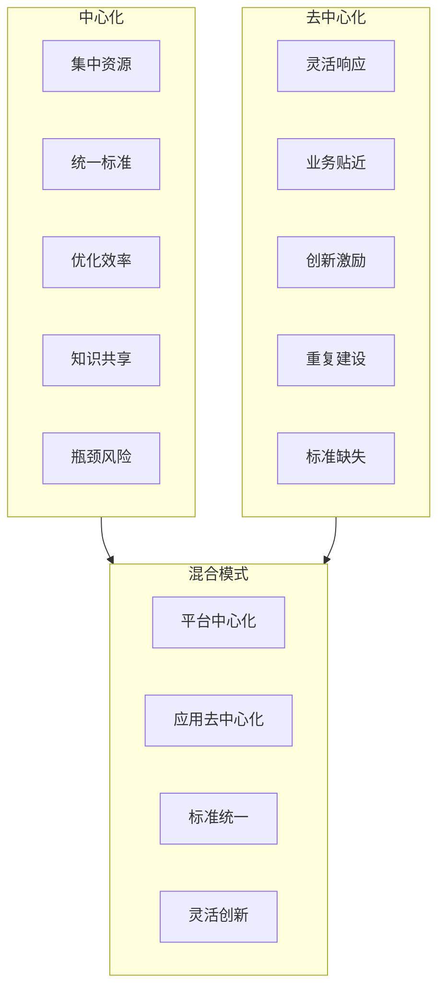

# 12 · Agent 商业 ROI 与价值度量（Business ROI & Value Measurement）

> 阶段：6 前沿 · 难度：⭐⭐⭐⭐ · 预计：2026 Q4
> 前置：[阶段 5 毕业](../阶段5-架构师/06-项目P5-企业客服平台.md)
> 产出：掌握 Agent 项目 ROI 度量方法与商业论证

---

## 为什么 Agent 项目需要 ROI 度量

> 来源：[McKinsey AI ROI Study](https://www.mckinsey.com/capabilities/quantumblack/our-insights/the-roi-of-ai) + [Gartner AI Adoption 2026](https://www.gartner.com/en/artificial-intelligence)

**2026 年的现实**：企业不再为 "AI" 概念买单，而是为可验证的 ROI 投资。



### CTO/CIO 的核心问题

| 角色 | 关注点 | 需要的数据 |
|-----|-------|----------|
| **CEO** | 收入增长、战略价值 | ROI、收入影响、竞争优势 |
| **CFO** | 成本控制、投资回报 | TCO、盈亏平衡点、现金流 |
| **CTO** | 技术可行性、架构 | 技术债务、可维护性、扩展性 |
| **业务负责人** | 效率提升、用户体验 | 效率指标、用户满意度 |

---

## Agent 价值量化框架

### 完整流程



### 成本端全景



### 成本计算模型

```java
package com.example.roi;

import org.springframework.stereotype.*;
import java.util.*;
import java.time.*;

/**
 * Agent TCO 计算器
 */
@Service
public class AgentTCOCalculator {

    /**
     * 计算三年 TCO
     */
    public TCOReport calculateThreeYearTCO(AgentConfig config) {
        TCOReport.Builder report = TCOReport.builder();

        // 1. 一次性成本
        OneTimeCosts oneTime = calculateOneTimeCosts(config);
        report.oneTimeCosts(oneTime);

        // 2. 年度持续成本
        List<AnnualCosts> annualCosts = new ArrayList<>();
        for (int year = 1; year <= 3; year++) {
            AnnualCosts annual = calculateAnnualCosts(config, year);
            annualCosts.add(annual);
        }
        report.annualCosts(annualCosts);

        // 3. 计算现值（NPV）
        double discountRate = config.getDiscountRate();
        double npv = calculateNPV(oneTime, annualCosts, discountRate);
        report.netPresentValue(npv);

        // 4. 分解成本
        CostBreakdown breakdown = breakdownCosts(oneTime, annualCosts);
        report.breakdown(breakdown);

        return report.build();
    }

    /**
     * 计算一次性成本
     */
    private OneTimeCosts calculateOneTimeCosts(AgentConfig config) {
        return OneTimeCosts.builder()
            .requirementsAnalysis(calculateRequirementsAnalysis(config))
            .designCost(calculateDesignCost(config))
            .infrastructureSetup(calculateInfrastructureSetup(config))
            .dataPreparation(calculateDataPreparation(config))
            .integrationDevelopment(calculateIntegrationDevelopment(config))
            .testingValidation(calculateTestingValidation(config))
            .trainingChangeManagement(calculateTraining(config))
            .build();
    }

    /**
     * 计算年度持续成本
     */
    private AnnualCosts calculateAnnualCosts(AgentConfig config, int year) {
        // 第一年可能更高（学习曲线）
        double yearMultiplier = year == 1 ? 1.5 : 1.0;

        return AnnualCosts.builder()
            .year(year)
            .inferenceCost(calculateInferenceCost(config) * yearMultiplier)
            .apiCallCost(calculateApiCallCost(config) * yearMultiplier)
            .computeCost(calculateComputeCost(config) * yearMultiplier)
            .storageCost(calculateStorageCost(config))
            .networkCost(calculateNetworkCost(config))
            .monitoringCost(calculateMonitoringCost(config))
            .maintenanceCost(calculateMaintenanceCost(config))
            .personnelCost(calculatePersonnelCost(config) * yearMultiplier)
            .riskCost(calculateRiskCost(config))
            .build();
    }

    /**
     * 推理成本计算
     * 这是 Agent 项目的主要成本
     */
    private double calculateInferenceCost(AgentConfig config) {
        // 公式：请求数/月 × 平均 tokens × 价格/1K tokens × 12

        double requestsPerMonth = config.getExpectedRequestsPerMonth();
        double avgInputTokens = config.getAvgInputTokens();
        double avgOutputTokens = config.getAvgOutputTokens();
        double pricePer1KInput = config.getModelPricing().inputPrice();
        double pricePer1KOutput = config.getModelPricing().outputPrice();

        // 月度成本
        double monthlyCost = requestsPerMonth *
            ((avgInputTokens / 1000) * pricePer1KInput +
             (avgOutputTokens / 1000) * pricePer1KOutput);

        // 年度成本
        return monthlyCost * 12;
    }

    /**
     * 计算现值
     */
    private double calculateNPV(OneTimeCosts oneTime,
                               List<AnnualCosts> annualCosts,
                               double discountRate) {
        double npv = oneTime.total();

        for (int i = 0; i < annualCosts.size(); i++) {
            AnnualCosts annual = annualCosts.get(i);
            double discountedValue = annual.total() /
                Math.pow(1 + discountRate, i + 1);
            npv += discountedValue;
        }

        return npv;
    }
}
```

---

## 价值端量化方法

### 价值维度



### 价值计算示例

```java
package com.example.roi;

import org.springframework.stereotype.*;
import java.util.*;

/**
 * Agent 价值量化器
 */
@Service
public class AgentValueQuantifier {

    /**
     * 计算年度价值
     */
    public ValueReport calculateAnnualValue(AgentConfig config,
                                           BaselineMetrics baseline,
                                           CurrentMetrics current) {
        ValueReport.Builder report = ValueReport.builder();

        // 1. 效率提升价值
        EfficiencyValue efficiency = calculateEfficiencyValue(
            config, baseline, current
        );
        report.efficiencyValue(efficiency);

        // 2. 收入增长价值
        RevenueValue revenue = calculateRevenueValue(
            config, baseline, current
        );
        report.revenueValue(revenue);

        // 3. 成本替代价值
        CostAvoidanceValue costAvoidance = calculateCostAvoidanceValue(
            config, baseline, current
        );
        report.costAvoidanceValue(costAvoidance);

        // 4. 风险降低价值
        RiskReductionValue riskReduction = calculateRiskReductionValue(
            config, baseline, current
        );
        report.riskReductionValue(riskReduction);

        // 5. 体验提升价值
        ExperienceValue experience = calculateExperienceValue(
            config, baseline, current
        );
        report.experienceValue(experience);

        return report.build();
    }

    /**
     * 效率提升价值
     */
    private EfficiencyValue calculateEfficiencyValue(AgentConfig config,
                                                     BaselineMetrics baseline,
                                                     CurrentMetrics current) {
        // 1. 响应时间改善
        double responseTimeImprovement = baseline.avgResponseTime() -
                                        current.avgResponseTime();
        double responseTimeValue = calculateResponseTimeValue(
            responseTimeImprovement,
            config.getHourlyRate(),
            current.getNumberOfInteractions()
        );

        // 2. 自动化率提升
        double automationImprovement = current.automationRate() -
                                      baseline.automationRate();
        double automationValue = calculateAutomationValue(
            automationImprovement,
            config.getAvgHandlingTime(),
            config.getHourlyRate(),
            current.getNumberOfInteractions()
        );

        // 3. 处理量增加
        double volumeIncrease = current.processedVolume() -
                               baseline.processedVolume();
        double volumeValue = calculateVolumeValue(
            volumeIncrease,
            config.getCostPerInteraction(),
            config.getRevenuePerInteraction()
        );

        return EfficiencyValue.builder()
            .responseTimeValue(responseTimeValue)
            .automationValue(automationValue)
            .volumeValue(volumeValue)
            .total(responseTimeValue + automationValue + volumeValue)
            .build();
    }

    /**
     * 收入增长价值
     */
    private RevenueValue calculateRevenueValue(AgentConfig config,
                                             BaselineMetrics baseline,
                                             CurrentMetrics current) {
        // 1. 转化率提升
        double conversionImprovement = current.conversionRate() -
                                      baseline.conversionRate();
        double conversionValue = conversionImprovement *
                                 current.getNumberOfInteractions() *
                                 config.getAvgOrderValue();

        // 2. 客单价提升
        double basketSizeImprovement = current.avgBasketSize() -
                                      baseline.avgBasketSize();
        double basketSizeValue = basketSizeImprovement *
                                 current.getNumberOfConversions() *
                                 config.getAvgOrderValue();

        // 3. 新收入来源
        double newRevenue = current.newRevenueStreams() -
                          baseline.newRevenueStreams();

        // 4. 留存率改善
        double retentionImprovement = current.retentionRate() -
                                     baseline.retentionRate();
        double retentionValue = calculateRetentionValue(
            retentionImprovement,
            config.getChurnedCustomerValue(),
            config.getCustomerBase()
        );

        return RevenueValue.builder()
            .conversionValue(conversionValue)
            .basketSizeValue(basketSizeValue)
            .newRevenueValue(newRevenue)
            .retentionValue(retentionValue)
            .total(conversionValue + basketSizeValue + newRevenue + retentionValue)
            .build();
    }

    /**
     * 成本替代价值
     */
    private CostAvoidanceValue calculateCostAvoidanceValue(AgentConfig config,
                                                          BaselineMetrics baseline,
                                                          CurrentMetrics current) {
        // 1. 人工成本替代
        double staffCostAvoidance = calculateStaffCostAvoidance(
            baseline.staffCount(),
            current.staffCount(),
            config.getAvgSalary()
        );

        // 2. 培训成本降低
        double trainingCostAvoidance = baseline.trainingCost() -
                                      current.trainingCost();

        // 3. 错误成本降低
        double errorCostAvoidance = calculateErrorCostAvoidance(
            baseline.errorRate(),
            current.errorRate(),
            config.getCostPerError(),
            current.getNumberOfInteractions()
        );

        // 4. 合规成本降低
        double complianceCostAvoidance = baseline.complianceCost() -
                                        current.complianceCost();

        return CostAvoidanceValue.builder()
            .staffCostAvoidance(staffCostAvoidance)
            .trainingCostAvoidance(trainingCostAvoidance)
            .errorCostAvoidance(errorCostAvoidance)
            .complianceCostAvoidance(complianceCostAvoidance)
            .total(staffCostAvoidance + trainingCostAvoidance +
                   errorCostAvoidance + complianceCostAvoidance)
            .build();
    }

    /**
     * 归因分析
     * 确保价值确实来自 Agent
     */
    private AttributionReport performAttribution(AgentConfig config,
                                                BaselineMetrics baseline,
                                                CurrentMetrics current) {
        // 1. 选择合适的归因模型
        AttributionModel model = selectAttributionModel(config);

        // 2. 分析贡献
        List<AttributionFactor> factors = model.analyze(
            config, baseline, current
        );

        // 3. 计算 Agent 贡献
        double agentContribution = factors.stream()
            .filter(f -> f.source() == AttributionSource.AGENT)
            .mapToDouble(AttributionFactor::contribution)
            .sum();

        // 4. 计算归因比例
        double attributionRatio = agentContribution /
                                 factors.stream()
                                     .mapToDouble(AttributionFactor::contribution)
                                     .sum();

        return AttributionReport.builder()
            .factors(factors)
            .agentContribution(agentContribution)
            .attributionRatio(attributionRatio)
            .adjustmentFactor(attributionRatio)
            .build();
    }
}
```

---

## Agent 项目 ROI 计算模型

### ROI 公式

```
基本 ROI = (总价值 - 总成本) / 总成本 × 100%

三年 ROI = (三年价值现值 - 三年成本现值) / 三年成本现值 × 100%

盈亏平衡时间 = 累积价值 ≥ 累积成本 的月份
```

### 对比表

| 指标 | 保守估计 | 基准估计 | 乐观估计 |
|-----|---------|---------|---------|
| **年度成本** | $500K | $400K | $300K |
| **年度价值** | $600K | $800K | $1.2M |
| **年度净价值** | $100K | $400K | $900K |
| **ROI** | 20% | 100% | 300% |
| **盈亏平衡** | 18 个月 | 8 个月 | 4 个月 |
| **三年 NPV** | $200K | $1.2M | $2.7M |

### Java 实现：ROI 计算器

```java
package com.example.roi;

import org.springframework.stereotype.*;
import java.util.*;

/**
 * Agent ROI 计算器
 */
@Service
public class AgentROICalculator {

    /**
     * 计算三年 ROI
     */
    public ROIReport calculateROI(AgentConfig config,
                                 BaselineMetrics baseline,
                                 List<CurrentMetrics> yearlyMetrics) {

        // 1. 计算成本
        TCOReport tco = tcoCalculator.calculateThreeYearTCO(config);
        double totalCostNPV = tco.getNetPresentValue();

        // 2. 计算价值
        List<ValueReport> yearlyValues = new ArrayList<>();
        for (int i = 0; i < yearlyMetrics.size(); i++) {
            ValueReport value = valueQuantifier.calculateAnnualValue(
                config, baseline, yearlyMetrics.get(i)
            );
            yearlyValues.add(value);
        }

        double totalValueNPV = calculateValueNPV(yearlyValues, config.getDiscountRate());

        // 3. 计算 ROI
        double roi = (totalValueNPV - totalCostNPV) / totalCostNPV * 100;

        // 4. 计算盈亏平衡点
        int breakEvenMonth = calculateBreakEven(tco, yearlyValues);

        // 5. 敏感性分析
        Map<String, SensitivityResult> sensitivity = performSensitivityAnalysis(
            config, baseline, yearlyMetrics
        );

        return ROIReport.builder()
            .roi(roi)
            .totalCostNPV(totalCostNPV)
            .totalValueNPV(totalValueNPV)
            .netValue(totalValueNPV - totalCostNPV)
            .breakEvenMonth(breakEvenMonth)
            .yearlyROI(calculateYearlyROI(tco, yearlyValues))
            .sensitivity(sensitivity)
            .build();
    }

    /**
     * 盈亏平衡点计算
     */
    private int calculateBreakEven(TCOReport tco,
                                 List<ValueReport> yearlyValues) {
        double cumulativeCost = 0;
        double cumulativeValue = 0;
        int month = 0;

        // 一次性成本
        cumulativeCost += tco.getOneTimeCosts().total();

        // 逐月计算
        for (int year = 0; year < yearlyValues.size(); year++) {
            ValueReport yearlyValue = yearlyValues.get(year);
            AnnualCosts yearlyCost = tco.getAnnualCosts().get(year);

            for (int m = 0; m < 12; m++) {
                month++;
                cumulativeValue += yearlyValue.total() / 12;
                cumulativeCost += yearlyCost.total() / 12;

                if (cumulativeValue >= cumulativeCost) {
                    return month;
                }
            }
        }

        return -1;  // 未盈亏平衡
    }

    /**
     * 敏感性分析
     * 分析关键假设变化对 ROI 的影响
     */
    private Map<String, SensitivityResult> performSensitivityAnalysis(
            AgentConfig config,
            BaselineMetrics baseline,
            List<CurrentMetrics> yearlyMetrics) {

        Map<String, SensitivityResult> results = new HashMap<>();

        // 1. 推理成本敏感性
        results.put("inference_cost",
            analyzeSensitivity(
                config,
                baseline,
                yearlyMetrics,
                "inferenceCost",
                0.5,   // -50%
                2.0    // +100%
            ));

        // 2. 请求数量敏感性
        results.put("request_volume",
            analyzeSensitivity(
                config,
                baseline,
                yearlyMetrics,
                "requestVolume",
                0.7,   // -30%
                1.3    // +30%
            ));

        // 3. 自动化率敏感性
        results.put("automation_rate",
            analyzeSensitivity(
                config,
                baseline,
                yearlyMetrics,
                "automationRate",
                0.8,   // -20%
                1.2    // +20%
            ));

        // 4. 转化率敏感性
        results.put("conversion_rate",
            analyzeSensitivity(
                config,
                baseline,
                yearlyMetrics,
                "conversionRate",
                0.9,   // -10%
                1.1    // +10%
            ));

        return results;
    }
}
```

---

## AB 测试驱动的价值验证

### AB 测试架构



### Java 实现：AB 测试框架

```java
package com.example.roi.abtest;

import org.springframework.stereotype.*;
import java.util.*;
import java.util.concurrent.*;

/**
 * AB 测试框架
 */
@Service
public class ABTestingFramework {

    private final ExperimentRegistry registry;
    private final MetricsCollector metrics;
    private final StatisticalAnalyzer analyzer;

    /**
     * 创建实验
     */
    public Experiment createExperiment(ExperimentConfig config) {
        // 1. 验证配置
        validateConfig(config);

        // 2. 创建实验
        Experiment experiment = Experiment.builder()
            .id(UUID.randomUUID())
            .name(config.getName())
            .description(config.getDescription())
            .hypothesis(config.getHypothesis())
            .variations(config.getVariations())
            .trafficAllocation(config.getTrafficAllocation())
            .metrics(config.getMetrics())
            .duration(config.getDuration())
            .startTime(Instant.now())
            .status(ExperimentStatus.RUNNING)
            .build();

        // 3. 注册实验
        registry.register(experiment);

        return experiment;
    }

    /**
     * 分流用户
     */
    public Variation assignUser(String userId, String experimentId) {
        Experiment experiment = registry.get(experimentId);

        // 1. 检查实验是否运行
        if (experiment.getStatus() != ExperimentStatus.RUNNING) {
            return experiment.getControlVariation();
        }

        // 2. 一致性哈希（确保用户始终看到同一版本）
        int hash = consistentHash(userId, experimentId);
        double bucket = (hash % 100) / 100.0;

        // 3. 根据流量分配选择变体
        double cumulative = 0.0;
        for (Variation variation : experiment.getVariations()) {
            cumulative += variation.getTrafficSplit();
            if (bucket <= cumulative) {
                // 记录分配
                metrics.recordAssignment(experimentId, userId, variation.getId());
                return variation;
            }
        }

        // 默认返回对照组
        return experiment.getControlVariation();
    }

    /**
     * 分析实验结果
     */
    public ExperimentResults analyzeResults(String experimentId) {
        Experiment experiment = registry.get(experimentId);

        // 1. 收集指标
        Map<String, VariationMetrics> variationMetrics = new HashMap<>();
        for (Variation variation : experiment.getVariations()) {
            VariationMetrics metrics = this.metrics.getMetrics(
                experimentId, variation.getId()
            );
            variationMetrics.put(variation.getId(), metrics);
        }

        // 2. 统计分析
        StatisticalAnalysis analysis = analyzer.analyze(
            experiment, variationMetrics
        );

        // 3. 计算影响
        Map<String, ImpactEstimate> impacts = new HashMap<>();
        for (String metricName : experiment.getMetrics()) {
            ImpactEstimate impact = calculateImpact(
                metricName,
                variationMetrics.get(experiment.getControlVariation().getId()),
                variationMetrics.get(experiment.getTreatmentVariation().getId()),
                analysis
            );
            impacts.put(metricName, impact);
        }

        // 4. 生成建议
        Recommendation recommendation = generateRecommendation(
            experiment, analysis, impacts
        );

        return ExperimentResults.builder()
            .experimentId(experimentId)
            .variationMetrics(variationMetrics)
            .statisticalAnalysis(analysis)
            .impacts(impacts)
            .recommendation(recommendation)
            .build();
    }

    /**
     * 计算影响估算
     */
    private ImpactEstimate calculateImpact(String metricName,
                                          VariationMetrics control,
                                          VariationMetrics treatment,
                                          StatisticalAnalysis analysis) {
        double controlMean = control.getMetricMean(metricName);
        double treatmentMean = treatment.getMetricMean(metricName);

        double absoluteDifference = treatmentMean - controlMean;
        double relativeDifference = (absoluteDifference / controlMean) * 100;

        // 置信区间
        ConfidenceInterval ci = analysis.getConfidenceInterval(metricName);

        return ImpactEstimate.builder()
            .metricName(metricName)
            .controlMean(controlMean)
            .treatmentMean(treatmentMean)
            .absoluteDifference(absoluteDifference)
            .relativeDifference(relativeDifference)
            .confidenceInterval(ci)
            .statisticallySignificant(analysis.isSignificant(metricName))
            .build();
    }
}
```

---

## Agent 成熟度模型



### 成熟度评估

```java
package com.example.roi.maturity;

import org.springframework.stereotype.*;
import java.util.*;

/**
 * Agent 成熟度评估
 */
@Service
public class AgentMaturityAssessment {

    /**
     * 评估成熟度
     */
    public MaturityLevel assess(AgentSystem system) {
        int score = 0;

        // 1. 自主性评估
        score += assessAutonomy(system);

        // 2. 智能性评估
        score += assessIntelligence(system);

        // 3. 集成度评估
        score += assessIntegration(system);

        // 4. 可靠性评估
        score += assessReliability(system);

        // 5. 可观测性评估
        score += assessObservability(system);

        // 6. 安全性评估
        score += assessSecurity(system);

        // 7. 可维护性评估
        score += assessMaintainability(system);

        // 8. 可扩展性评估
        score += assessScalability(system);

        // 根据总分确定成熟度级别
        if (score >= 80) return MaturityLevel.AUTONOMOUS;
        if (score >= 60) return MaturityLevel.AUTOMATED;
        if (score >= 40) return MaturityLevel.AUGMENTED;
        return MaturityLevel.ASSISTED;
    }

    /**
     * 评估自主性
     */
    private int assessAutonomy(AgentSystem system) {
        int score = 0;

        // 是否能独立执行任务
        if (system.canExecuteTasksIndependently()) score += 2;

        // 是否能处理异常
        if (system.canHandleExceptions()) score += 2;

        // 是否能学习和改进
        if (system.canLearnFromFeedback()) score += 2;

        // 是否能主动建议
        if (system.canProactivelySuggest()) score += 2;

        // 是否能设定目标
        if (system.canSetGoals()) score += 2;

        return score;
    }

    /**
     * 评估智能性
     */
    private int assessIntelligence(AgentSystem system) {
        int score = 0;

        // 理解能力
        score += assessUnderstanding(system);

        // 推理能力
        score += assessReasoning(system);

        // 学习能力
        score += assessLearning(system);

        // 适应性
        score += assessAdaptability(system);

        return Math.min(score, 10);
    }
}
```

---

## 内部计费模型

### Showback vs Chargeback



### Java 实现：内部计费

```java
package com.example.roi.billing;

import org.springframework.stereotype.*;
import java.util.*;

/**
 * 内部计费服务
 */
@Service
public class InternalBillingService {

    private final UsageTracker usageTracker;
    private final CostAllocator costAllocator;

    /**
     * 生成月度账单
     */
    public MonthlyBill generateMonthlyBill(String departmentId,
                                          YearMonth month) {
        // 1. 收集使用数据
        List<UsageRecord> usage = usageTracker.getUsage(
            departmentId, month
        );

        // 2. 分配成本
        CostAllocation allocation = costAllocator.allocate(usage);

        // 3. 生成账单
        return MonthlyBill.builder()
            .departmentId(departmentId)
            .period(month)
            .usageSummary(buildUsageSummary(usage))
            .costBreakdown(allocation.getBreakdown())
            .totalCost(allocation.getTotalCost())
            .chargeableItems(allocation.getChargeableItems())
            .optimizationSuggestions(generateOptimizationSuggestions(usage))
            .build();
    }

    /**
     * Showback 报告
     * 只展示成本，不实际收费
     */
    public ShowbackReport generateShowback(String departmentId,
                                          YearMonth month) {
        MonthlyBill bill = generateMonthlyBill(departmentId, month);

        return ShowbackReport.builder()
            .departmentId(departmentId)
            .period(month)
            .totalCost(bill.getTotalCost())
            .costPerTransaction(bill.getTotalCost() /
                               bill.getUsageSummary().getTotalTransactions())
            .comparisonWithPrevious(compareWithPrevious(departmentId, month))
            .departmentBenchmark(compareWithDepartments(departmentId, month))
            .trendAnalysis(analyzeTrend(departmentId, month.minusMonths(6), month))
            .build();
    }

    /**
     * Chargeback 账单
     * 实际扣除预算
     */
    public void processChargeback(String departmentId,
                                  YearMonth month) {
        MonthlyBill bill = generateMonthlyBill(departmentId, month);

        // 1. 验证预算
        Budget budget = budgetService.getBudget(departmentId, month);
        if (budget.getRemaining() < bill.getTotalCost()) {
            throw new InsufficientBudgetException(
                "部门 " + departmentId + " 预算不足"
            );
        }

        // 2. 扣除预算
        budgetService.deduct(departmentId, month, bill.getTotalCost());

        // 3. 生成内部发票
        InternalInvoice invoice = generateInternalInvoice(bill);

        // 4. 发送给财务
        financeService.recordInternalInvoice(invoice);

        // 5. 通知部门
        notificationService.notifyDepartment(departmentId, invoice);
    }

    /**
     * 比较与上月的差异
     */
    private MonthOverMonth compareWithPrevious(String departmentId,
                                              YearMonth month) {
        MonthlyBill current = generateMonthlyBill(departmentId, month);
        MonthlyBill previous = generateMonthlyBill(
            departmentId, month.minusMonths(1)
        );

        double costChange = current.getTotalCost() - previous.getTotalCost();
        double percentChange = (costChange / previous.getTotalCost()) * 100;

        List<String> drivers = identifyCostDrivers(current, previous);

        return MonthOverMonth.builder()
            .previousCost(previous.getTotalCost())
            .currentCost(current.getTotalCost())
            .absoluteChange(costChange)
            .percentChange(percentChange)
            .drivers(drivers)
            .build();
    }
}
```

---

## Agent 中心化 vs 去中心化的组织决策



### 决策框架

| 因素 | 中心化 | 去中心化 | 混合 |
|-----|-------|---------|-----|
| **规模** | >1000 人 | <100 人 | 100-1000 人 |
| **需求多样性** | 低 | 高 | 中 |
| **技术能力** | 中心强 | 分布强 | 混合 |
| **合规要求** | 统一监管 | 本地合规 | 混合 |
| **创新速度** | 慢 | 快 | 中 |

---

## 检查清单

在实施 Agent ROI 度量时：

- [ ] 定义清晰的度量指标
- [ ] 建立基线数据
- [ ] 选择合适的归因模型
- [ ] 实施 AB 测试
- [ ] 建立持续监控
- [ ] 计算三年 ROI
- [ ] 进行敏感性分析
- [ ] 建立内部计费
- [ ] 定期复盘优化
- [ ] 向管理层报告

---

## 参考资源

- McKinsey AI ROI: https://www.mckinsey.com/capabilities/quantumblack/our-insights/the-roi-of-ai
- Gartner AI Value Realization: https://www.gartner.com/en/artificial-insights
- AB Testing Best Practices: https://optimizely.com/ab-testing/

---

> 阶段 6 前沿完成！接下来可以：回顾[阶段 5 架构师](../阶段5-架构师/)或探索[企业级大型项目](../项目/)
