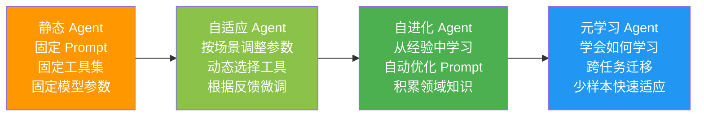
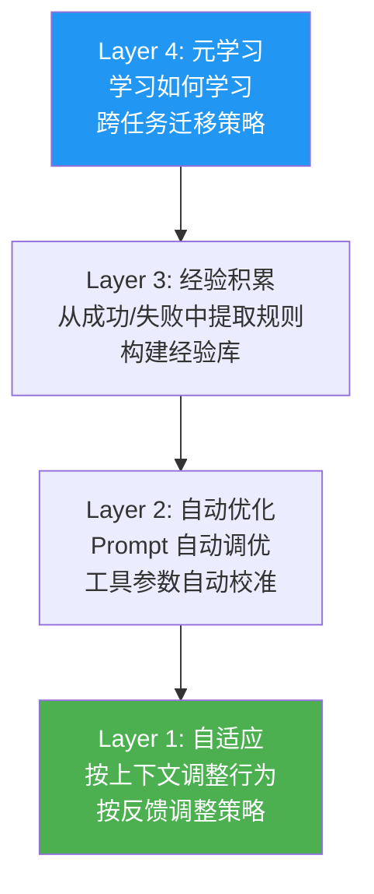

# Agent 自进化与元学习

> **一句话**：终极的 Agent 不是"你教它做"——而是"它自己学会做得更好"。

---

## 从静态 Agent 到自进化 Agent



---

## 自进化四层架构



---

## 核心实现

### 1. 经验积累引擎

```java
package com.enterprise.evolution;

import org.springframework.stereotype.Component;
import java.util.*;

/**
 * 经验积累引擎
 *
 * Agent 每次执行后，自动总结经验教训：
 * - 成功的策略 → 保留并强化
 * - 失败的策略 → 标记并避免
 */
@Component
public class ExperienceAccumulator {

    private final List<Experience> experiences = Collections.synchronizedList(new ArrayList<>());

    /**
     * 记录一次执行经验
     */
    public void record(Experience experience) {
        experiences.add(experience);

        // 超过上限时，删除最旧的低价值经验
        if (experiences.size() > 10000) {
            experiences.sort(Comparator.comparingDouble(Experience::value).reversed());
            while (experiences.size() > 8000) {
                experiences.remove(experiences.size() - 1);
            }
        }
    }

    /**
     * 检索相似经验
     */
    public List<Experience> findSimilar(String taskDescription, int topK) {
        return experiences.stream()
            .sorted(Comparator.comparingDouble(
                (Experience e) -> similarity(e.taskDescription(), taskDescription)
            ).reversed())
            .limit(topK)
            .toList();
    }

    /**
     * 提取经验规则
     */
    public List<ExperienceRule> extractRules() {
        Map<String, List<Experience>> grouped = new HashMap<>();

        // 按任务类型分组
        for (Experience exp : experiences) {
            grouped.computeIfAbsent(exp.taskType(), k -> new ArrayList<>()).add(exp);
        }

        List<ExperienceRule> rules = new ArrayList<>();
        for (Map.Entry<String, List<Experience>> entry : grouped.entrySet()) {
            List<Experience> group = entry.getValue();
            long successCount = group.stream().filter(e -> e.success()).count();
            double successRate = (double) successCount / group.size();

            if (successRate > 0.8) {
                // 高成功率 → 提取成功模式
                rules.add(new ExperienceRule(
                    entry.getKey(),
                    "RECOMMENDED",
                    extractPattern(group, true),
                    successRate
                ));
            } else if (successRate < 0.3) {
                // 低成功率 → 标记为避免模式
                rules.add(new ExperienceRule(
                    entry.getKey(),
                    "AVOID",
                    extractPattern(group, false),
                    successRate
                ));
            }
        }
        return rules;
    }

    private String extractPattern(List<Experience> group, boolean success) {
        // 从成功/失败经验中提取共同模式
        // 实际可用 LLM 做模式提取
        return group.stream()
            .filter(e -> e.success() == success)
            .map(Experience::strategy)
            .distinct()
            .reduce((a, b) -> a + "; " + b)
            .orElse("");
    }

    private double similarity(String a, String b) {
        Set<String> setA = Set.of(a.toLowerCase().split("\\s+"));
        Set<String> setB = Set.of(b.toLowerCase().split("\\s+"));
        Set<String> intersection = new HashSet<>(setA);
        intersection.retainAll(setB);
        Set<String> union = new HashSet<>(setA);
        union.addAll(setB);
        return union.isEmpty() ? 0 : (double) intersection.size() / union.size();
    }

    public record Experience(
        String id,
        String taskType,
        String taskDescription,
        String strategy,
        boolean success,
        double qualityScore,
        double value,           // 经验价值分
        Instant timestamp,
        Map<String, Object> context
    ) {}

    public record ExperienceRule(
        String taskType,
        String recommendation,  // RECOMMENDED / AVOID
        String pattern,
        double confidence
    ) {}
}
```

### 2. Prompt 自动优化器

```java
package com.enterprise.evolution;

import org.springframework.stereotype.Component;
import java.util.*;

/**
 * Prompt 自动优化器
 *
 * 基于评估结果自动优化 Prompt
 *
 * 方法：DSPy-style 自动化 Prompt 优化
 * 1. 在 eval set 上评估当前 Prompt
 * 2. LLM 分析失败案例 → 提出改进建议
 * 3. 生成候选 Prompt 变体
 * 4. 在 eval set 上评估变体
 * 5. 选择最优变体
 */
@Component
public class PromptAutoOptimizer {

    /**
     * 自动优化 Prompt
     */
    public OptimizationResult optimize(
            String currentPrompt,
            List<EvalCase> evalCases,
            int maxIterations) {

        String bestPrompt = currentPrompt;
        double bestScore = evaluate(bestPrompt, evalCases);

        for (int i = 0; i < maxIterations; i++) {
            // 1. 分析失败案例
            List<EvalCase> failures = findFailures(bestPrompt, evalCases);

            if (failures.isEmpty()) {
                break;  // 已经全通过了
            }

            // 2. LLM 分析失败原因 + 生成改进版
            String improvedPrompt = generateImprovement(bestPrompt, failures);

            // 3. 评估改进版
            double improvedScore = evaluate(improvedPrompt, evalCases);

            // 4. 只在提升时更新
            if (improvedScore > bestScore) {
                bestPrompt = improvedPrompt;
                bestScore = improvedScore;
            }
        }

        double improvement = bestScore - evaluate(currentPrompt, evalCases);
        return new OptimizationResult(
            currentPrompt, bestPrompt,
            evaluate(currentPrompt, evalCases),
            bestScore,
            improvement
        );
    }

    /**
     * LLM 生成改进版 Prompt
     */
    private String generateImprovement(String prompt, List<EvalCase> failures) {
        StringBuilder failureExamples = new StringBuilder();
        for (EvalCase f : failures.subList(0, Math.min(5, failures.size()))) {
            failureExamples.append(String.format(
                "输入: %s\n期望输出: %s\n实际输出: %s\n评分: %.2f\n\n",
                f.input(), f.expected(), f.actual(), f.score()
            ));
        }

        String metaPrompt = """
            你是一个 Prompt 优化专家。分析以下 Prompt 和失败案例，生成改进版 Prompt。

            当前 Prompt：
            %s

            失败案例：
            %s

            要求：
            1. 保持 Prompt 的整体结构不变
            2. 针对失败案例的问题进行改进
            3. 不要过度拟合失败案例
            4. 直接返回改进后的 Prompt（不要解释）

            改进版 Prompt：
            """.formatted(prompt, failureExamples);

        return chatClient.prompt().user(metaPrompt).call().content();
    }

    private double evaluate(String prompt, List<EvalCase> cases) {
        double totalScore = 0;
        for (EvalCase c : cases) {
            String output = chatClient.prompt()
                .system(prompt)
                .user(c.input())
                .call().content();
            double score = evaluator.score(c.input(), output, c.expected());
            c.setActual(output);
            c.setScore(score);
            totalScore += score;
        }
        return totalScore / cases.size();
    }

    private List<EvalCase> findFailures(String prompt, List<EvalCase> cases) {
        evaluate(prompt, cases);
        return cases.stream().filter(c -> c.score() < 0.7).toList();
    }

    public record OptimizationResult(
        String originalPrompt,
        String optimizedPrompt,
        double originalScore,
        double optimizedScore,
        double improvement
    ) {}

    public static class EvalCase {
        private String input;
        private String expected;
        private String actual;
        private double score;
        // getters/setters omitted
    }
}
```

---

## 元学习：学会如何学习

```mermaid
flowchart TD
    Task1["任务 1: 代码评审<br/>学了 100 次学会"] --> Meta["元学习引擎<br/>提取"怎么学"的策略"]
    Task2["任务 2: 文档摘要<br/>学了 80 次学会"] --> Meta
    Task3["任务 3: 翻译校对<br/>学了 60 次学会"] --> Meta

    Meta --> Strategy["学习策略<br/>"先看示例再动手"<br/>"失败后调整 Prompt"<br/>"保持简洁优先""]

    Task4["任务 4: 新任务"] --> Apply["应用学习策略"]
    Strategy --> Apply
    Apply --> Fast["只学了 20 次就学会 ✅"]

    style Fast fill:#4caf50,color:#fff
```

| 阶段 | 能力 | 效果 |
|------|------|------|
| 静态 Agent | 固定行为 | 基线 |
| 自适应 Agent | 按场景调整 | +20% |
| 自进化 Agent | 从经验学习 | +40% |
| 元学习 Agent | 学会学习 | +60%（新任务快速适应）|

→ 返回 [阶段6 目录](../00-README.md)
