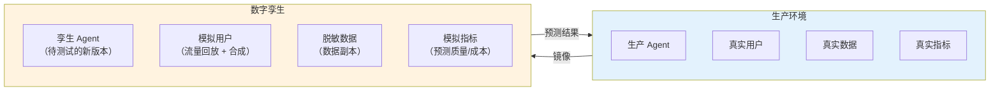
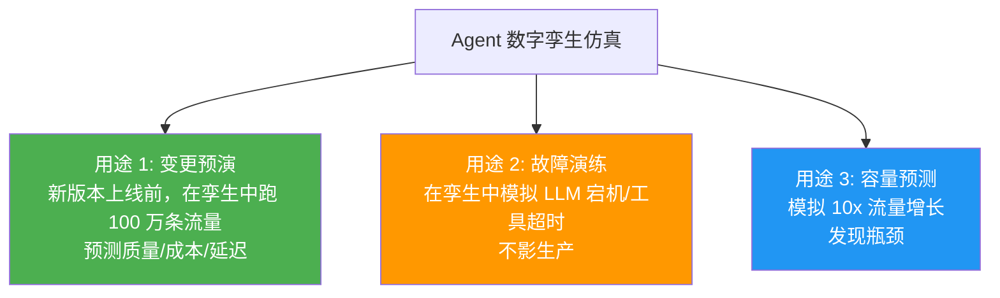
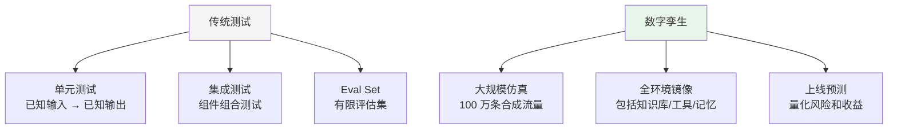

# Agent 数字孪生与仿真

> **一句话**：你不敢在生产环境测试新 Agent——但如果有一个和你生产环境一模一样的"数字孪生"，你可以在里面随便实验。

---

## 什么是 Agent 数字孪生？



---

## 仿真的三种用途



---

## 核心实现

### 1. 数字孪生环境构建器

```java
package com.enterprise.twin;

import org.springframework.stereotype.Component;
import java.util.*;

/**
 * 数字孪生环境构建器
 *
 * 创建一个与生产环境完全一致的仿真环境
 * 但使用脱敏数据 + 模拟流量
 */
@Component
public class TwinEnvironmentBuilder {

    /**
     * 构建数字孪生
     */
    public TwinEnvironment build(TwinConfig config) {
        // 1. 克隆 Agent 配置（含待测试的新版本）
        AgentConfig agentConfig = configStore.cloneForTwin(config.agentId());
        agentConfig.setVersion(config.candidateVersion());

        // 2. 克隆知识库（脱敏）
        VectorStore twinKB = cloneAndMaskKnowledgeBase(config.agentId());

        // 3. 克隆工具配置（mock 模式）
        Map<String, ToolConfig> toolConfigs = cloneToolsInMockMode(config.agentId());

        // 4. 准备模拟流量
        TrafficGenerator trafficGen = new TrafficGenerator(
            config.trafficSource(),    // RECORDED / SYNTHETIC / MIXED
            config.trafficVolume()
        );

        return new TwinEnvironment(
            config.twinId(),
            agentConfig,
            twinKB,
            toolConfigs,
            trafficGen,
            config.duration()
        );
    }

    /**
     * 克隆并脱敏知识库
     */
    private VectorStore cloneAndMaskKnowledgeBase(String agentId) {
        VectorStore original = kbManager.get(agentId);
        VectorStore twin = new InMemoryVectorStore(original.dimension());

        // 复制所有文档，但 PII 被替换
        for (Document doc : original.getAllDocuments()) {
            String masked = piiMasker.mask(doc.content());
            twin.add(Document.of(masked, doc.metadata()));
        }

        return twin;
    }

    /**
     * 克隆工具为 Mock 模式
     */
    private Map<String, ToolConfig> cloneToolsInMockMode(String agentId) {
        Map<String, ToolConfig> mocks = new HashMap<>();
        for (Map.Entry<String, ToolConfig> entry : toolManager.getAll(agentId).entrySet()) {
            ToolConfig mock = ToolConfig.mock(entry.getValue());
            mocks.put(entry.getKey(), mock);
        }
        return mocks;
    }

    public record TwinConfig(
        String twinId,
        String agentId,
        String candidateVersion,
        TrafficSource trafficSource,
        int trafficVolume,
        Duration duration
    ) {}

    public record TwinEnvironment(
        String twinId,
        AgentConfig agentConfig,
        VectorStore knowledgeBase,
        Map<String, ToolConfig> toolConfigs,
        TrafficGenerator trafficGenerator,
        Duration duration
    ) {}

    public enum TrafficSource {
        RECORDED,    // 录制的真实流量
        SYNTHETIC,   // LLM 合成的模拟流量
        MIXED        // 混合
    }
}
```

### 2. 合成流量生成器

```java
package com.enterprise.twin;

import org.springframework.stereotype.Component;
import java.util.*;

/**
 * 合成流量生成器
 *
 * 用 LLM 生成多样化的模拟用户输入
 * 覆盖：常见场景、边界场景、对抗场景
 */
@Component
public class SyntheticTrafficGenerator {

    private final ChatClient llm;

    /**
     * 生成合成流量
     */
    public List<TrafficItem> generate(GenerateConfig config) {
        List<TrafficItem> items = new ArrayList<>();

        // 1. 生成常见场景
        items.addAll(generateByCategory("常见问题", config.agentDescription(),
            config.volume() / 3));

        // 2. 生成边界场景
        items.addAll(generateByCategory("边界情况（极端输入/超长/多语言混合）",
            config.agentDescription(), config.volume() / 3));

        // 3. 生成对抗场景
        items.addAll(generateByCategory("对抗性输入（Prompt 注入/越界请求）",
            config.agentDescription(), config.volume() / 3));

        return items;
    }

    private List<TrafficItem> generateByCategory(
            String category, String agentDescription, int count) {
        String prompt = """
            你是一个测试工程师。为以下 Agent 生成 %d 条%s 的测试输入。

            Agent 描述：%s

            要求：
            1. 每条输入一行
            2. 多样化，不要重复
            3. 贴近真实用户输入风格
            4. 只返回测试输入，不要解释
            """.formatted(count, category, agentDescription);

        String response = llm.prompt().user(prompt).call().content();

        List<TrafficItem> items = new ArrayList<>();
        for (String line : response.split("\n")) {
            String trimmed = line.trim();
            if (!trimmed.isEmpty()) {
                items.add(new TrafficItem(trimmed, category));
            }
        }
        return items;
    }

    public record TrafficItem(String input, String category) {}

    public record GenerateConfig(
        String agentDescription, int volume
    ) {}
}
```

### 3. 仿真结果预测器

```java
package com.enterprise.twin;

import org.springframework.stereotype.Component;
import java.util.*;

/**
 * 仿真结果预测器
 *
 * 在孪生环境中执行后，分析结果并预测上线后的表现
 */
@Component
public class SimulationResultPredictor {

    /**
     * 分析仿真结果，预测上线表现
     */
    public SimulationReport predict(TwinEnvironment twin,
                                     List<SimulationRun> runs) {
        // 1. 质量统计
        double avgQuality = runs.stream()
            .mapToDouble(SimulationRun::qualityScore).average().orElse(0);
        double qualityStdDev = stdDev(
            runs.stream().map(SimulationRun::qualityScore).toList());

        // 2. 延迟统计
        double avgLatency = runs.stream()
            .mapToLong(SimulationRun::latencyMs).average().orElse(0);
        long p95Latency = percentile(
            runs.stream().map(SimulationRun::latencyMs).toList(), 95);

        // 3. 成本统计
        double avgCost = runs.stream()
            .mapToDouble(SimulationRun::cost).average().orElse(0);
        double projectedMonthlyCost = avgCost * config.getDailyTrafficVolume() * 30;

        // 4. 安全统计
        long safetyViolations = runs.stream()
            .filter(SimulationRun::hasSafetyViolation).count();
        double safetyViolationRate = (double) safetyViolations / runs.size();

        // 5. 预测
        GoLivePrediction prediction = predictGoLive(
            avgQuality, qualityStdDev, avgLatency, p95Latency,
            projectedMonthlyCost, safetyViolationRate);

        return new SimulationReport(
            twin.twinId(),
            runs.size(),
            avgQuality, qualityStdDev,
            avgLatency, p95Latency,
            avgCost, projectedMonthlyCost,
            safetyViolationRate,
            prediction
        );
    }

    private GoLivePrediction predictGoLive(
            double quality, double qualityStd,
            double avgLatency, long p95Latency,
            double monthlyCost, double safetyRate) {

        List<String> risks = new ArrayList<>();
        double confidence = 1.0;

        if (quality < 0.7) {
            risks.add("质量评分偏低（" + String.format("%.1f%%", quality * 100) + "）");
            confidence -= 0.3;
        }
        if (qualityStd > 0.2) {
            risks.add("质量不稳定（标准差 " + String.format("%.2f", qualityStd) + "）");
            confidence -= 0.2;
        }
        if (p95Latency > 10000) {
            risks.add("P95 延迟过高（" + p95Latency + "ms）");
            confidence -= 0.2;
        }
        if (safetyRate > 0.01) {
            risks.add("安全违规率 > 1%");
            confidence -= 0.5;
        }

        Recommendation recommendation = confidence > 0.8
            ? Recommendation.GO_LIVE
            : confidence > 0.5
                ? Recommendation.MONITOR_CLOSELY
                : Recommendation.DO_NOT_GO_LIVE;

        return new GoLivePrediction(recommendation, confidence, risks);
    }

    private double stdDev(List<Double> values) {
        double mean = values.stream().mapToDouble(d -> d).average().orElse(0);
        return Math.sqrt(values.stream()
            .mapToDouble(d -> Math.pow(d - mean, 2)).average().orElse(0));
    }

    private long percentile(List<Long> values, int p) {
        List<Long> sorted = values.stream().sorted().toList();
        return sorted.get(sorted.size() * p / 100);
    }

    // --- Types ---

    public record SimulationRun(
        String input, String output,
        double qualityScore, long latencyMs,
        double cost, boolean hasSafetyViolation
    ) {}

    public record SimulationReport(
        String twinId, int totalRuns,
        double avgQuality, double qualityStdDev,
        double avgLatencyMs, long p95LatencyMs,
        double avgCostPerRequest, double projectedMonthlyCost,
        double safetyViolationRate,
        GoLivePrediction goLivePrediction
    ) {}

    public record GoLivePrediction(
        Recommendation recommendation,
        double confidence,
        List<String> risks
    ) {}

    public enum Recommendation {
        GO_LIVE,            // 可以上线
        MONITOR_CLOSELY,    // 上线但密切监控
        DO_NOT_GO_LIVE      // 不要上线
    }
}
```

---

## 数字孪生 vs 传统测试



| 维度 | 传统测试 | 数字孪生 |
|------|---------|---------|
| 流量规模 | 100-1000 条 | 100 万+ |
| 覆盖场景 | 已知场景 | 合成 + 未知场景 |
| 环境 | Mock | 全环境镜像 |
| 预测能力 | 定性 | 定量预测 |
| 执行时间 | 分钟级 | 小时级 |

→ 返回 [阶段6 目录](../00-README.md)
