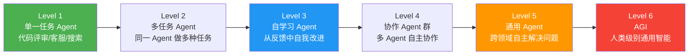
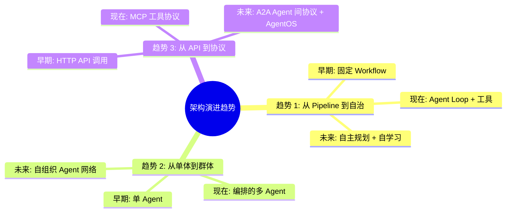
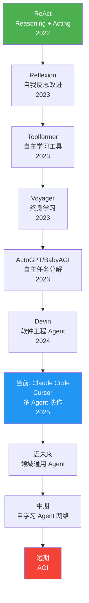
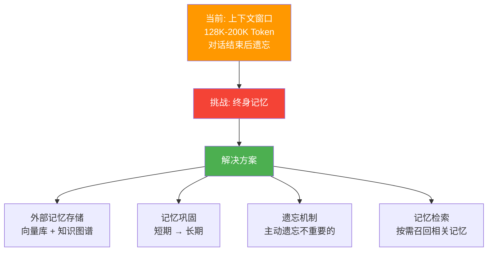
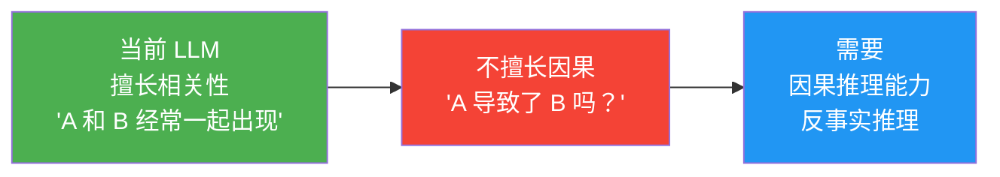
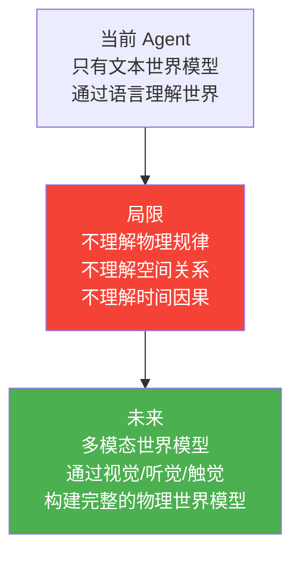
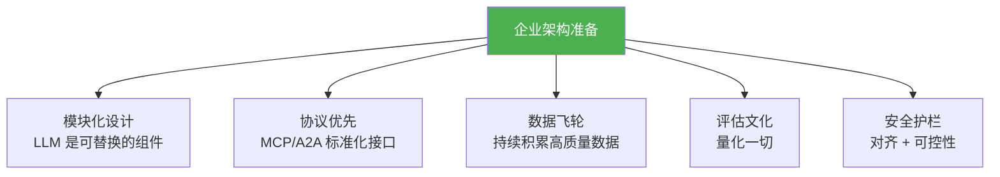
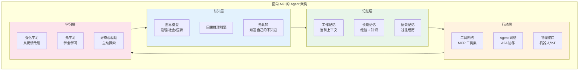

# AGI 路径与 Agent 架构演进

> **一句话**：今天我们造的是"工具型 Agent"——明天可能要造的是"通用型 Agent"——架构演进的终极方向是什么？

---

## Agent 能力演进路线

| 等级 | 核心能力 | 当前进度 | 预计实现 |
|------|---------|---------|---------|
| L1 单一任务 | 一个领域内自主 | ✅ 已实现 | 2024 |
| L2 多任务 | 跨领域迁移 | 🔬 实验中 | 2025-2026 |
| L3 自学习 | 从经验改进 | 🔬 早期 | 2026-2028 |
| L4 协作群 | 多 Agent 自组织 | 🔬 研究 | 2027-2030 |
| L5 通用 | 跨领域自主 | 🧪 理论 | 2030+ |
| L6 AGI | 人类级别 | 💭 推测 | 未知 |

---

## 架构演进三大趋势

---

## 从 ReAct 到 AGI 的技术路线

---

## AGI 路径上的关键技术挑战

### 挑战 1：长期记忆与知识积累

### 挑战 2：因果推理

### 挑战 3：世界模型

---

## 企业如何为 AGI 时代做架构准备

| 准备方向 | 今天做什么 | 为什么重要 |
|---------|----------|-----------|
| 模块化 | Agent 逻辑与 LLM 解耦 | LLM 两年后必然换 |
| 协议化 | 工具用 MCP，Agent 间用 A2A | 避免锁定 |
| 数据飞轮 | 积累生产 Trace + 标注 | 自学习需要数据 |
| 评估体系 | 建立 Eval Set 和质量看板 | 无法改进无法衡量的东西 |
| 安全架构 | 分层防御 + 人在回路 | 能力越强风险越大 |

---

## 面向未来的 Agent 架构图

→ 返回 [阶段6 目录](../00-README.md)
