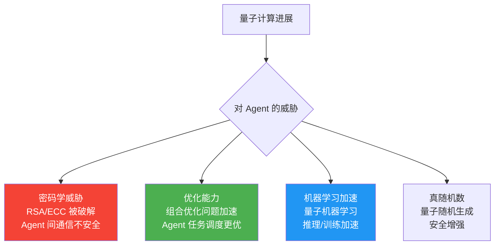
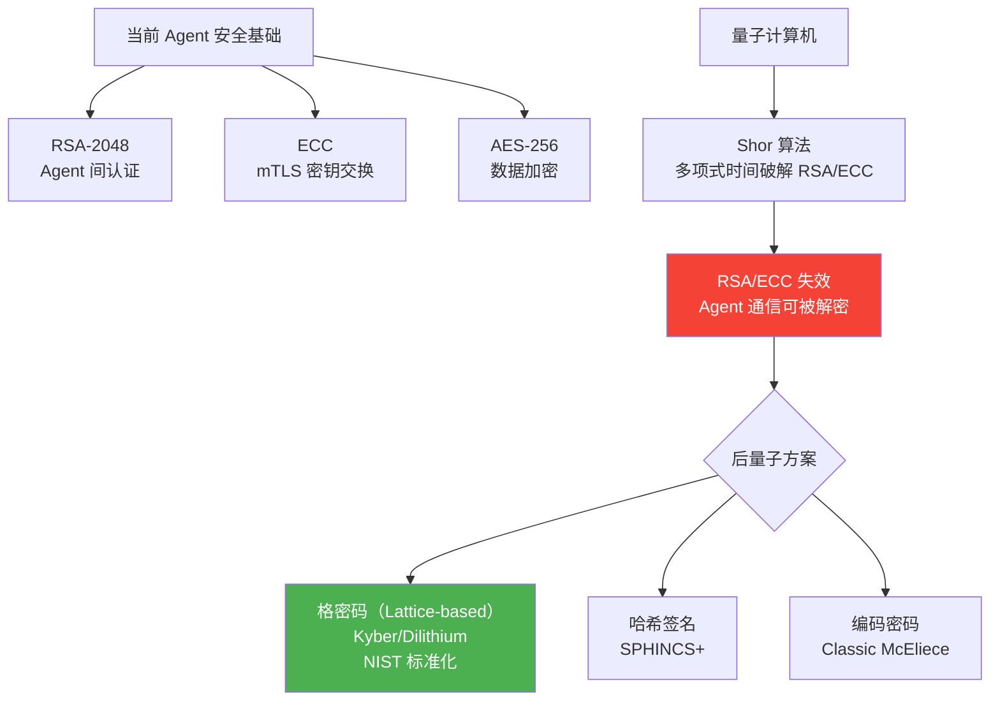
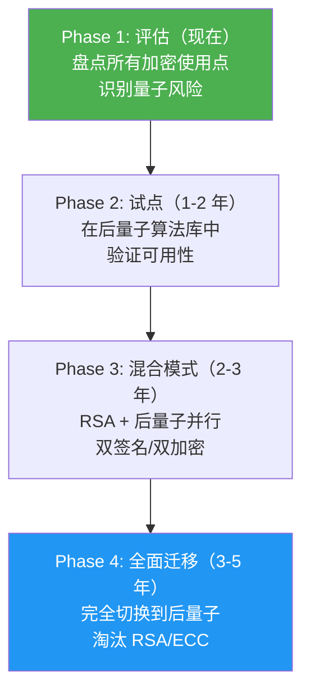
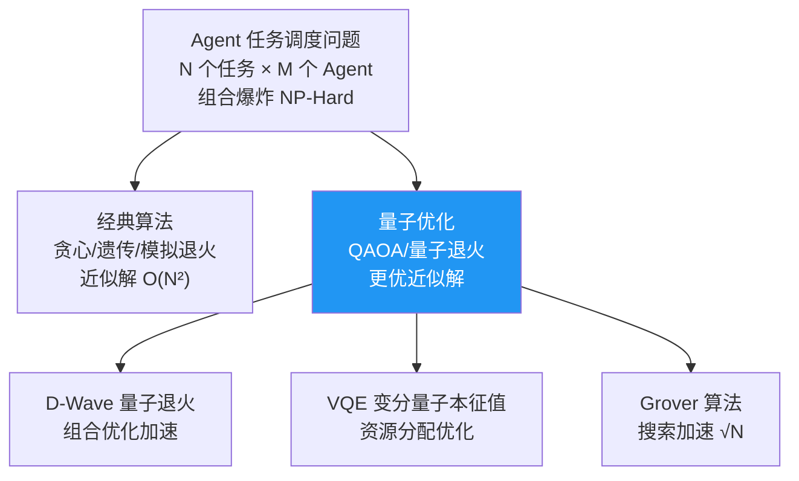
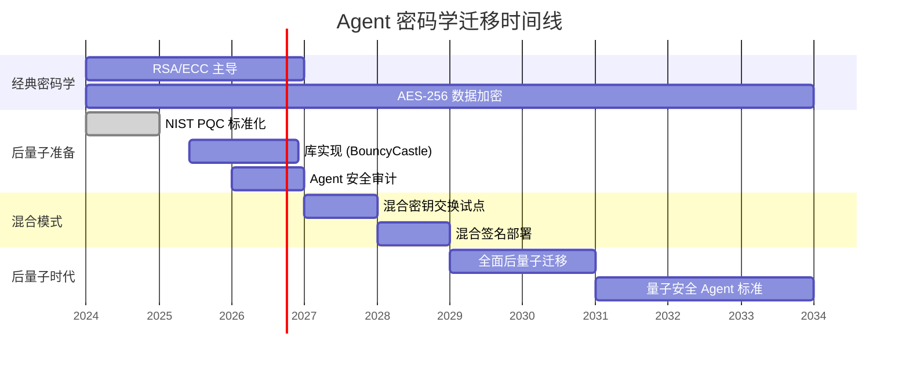

# Agent 量子计算与后密码学

> **一句话**：量子计算机来了，现有的加密全失效——Agent 之间通信的安全基础需要彻底重建。

---

## 为什么 Agent 架构师要关心量子计算？



---

## 后量子密码学（PQC）对 Agent 的影响



| 密码学算法 | 当前用途 | 量子威胁 | 后量子替代 |
|-----------|---------|---------|-----------|
| RSA-2048 | Agent 认证 | ❌ 被破解 | Dilithium |
| ECC-256 | 密钥交换 | ❌ 被破解 | Kyber |
| AES-256 | 数据加密 | ⚠️ 安全性减半 | AES-512 |
| SHA-256 | 哈希签名 | ⚠️ 安全性减半 | SHA-384+ |

---

## Agent 量子安全迁移路线



---

## 量子计算对 Agent 优化的潜力

### 任务调度优化



### 量子机器学习（QML）

| 应用 | 经典方法 | 量子优势 | 状态 |
|------|---------|---------|------|
| Embedding 加速 | 经典神经网络 | 量子核方法 | 理论阶段 |
| 大规模搜索 | KNN/ANN | Grover 加速 | 理论阶段 |
| 参数优化 | 梯度下降 | 量子优化 | 实验阶段 |
| 模型训练 | GPU 训练 | 量子线路训练 | 早期实验 |

---

## 核心实现：后量子安全 Agent 通信

```java
package com.enterprise.quantum;

import org.springframework.stereotype.Component;
import java.security.*;
import java.util.*;

/**
 * 后量子安全 Agent 通信
 *
 * 使用混合模式：经典 + 后量子双重保护
 * 即使量子计算机出现，后量子层仍然安全
 */
@Component
public class PostQuantumAgentChannel {

    /**
     * 混合密钥交换：ECC + Kyber
     *
     * 生成两个共享密钥：
     * - 经典密钥（ECC）：当前安全
     * - 后量子密钥（Kyber）：量子安全
     * 最终密钥 = Hash(ECC密钥 || Kyber密钥)
     */
    public HybridKeyExchange initiateKeyExchange(String peerAgentId) {
        // 1. 经典密钥交换（ECC）
        KeyPair eccKeyPair = eccGenerateKeyPair();

        // 2. 后量子密钥交换（Kyber）
        // 实际使用 Bouncy Castle PQC 或 NIST 参考实现
        KyberKeyPair kyberKeyPair = kyberGenerateKeyPair();

        // 3. 组合公钥
        CombinedPublicKey combinedPub = new CombinedPublicKey(
            eccKeyPair.getPublic(),
            kyberKeyPair.publicKey()
        );

        return new HybridKeyExchange(
            peerAgentId,
            combinedPub,
            eccKeyPair.getPrivate(),
            kyberKeyPair.secretKey()
        );
    }

    /**
     * 接收方完成密钥交换
     */
    public SharedSecret completeKeyExchange(
            HybridKeyExchange exchange,
            CombinedPublicKey peerPublicKey) {

        // 1. 经典密钥协商
        byte[] eccSecret = eccComputeSharedSecret(
            exchange.eccPrivateKey(), peerPublicKey.eccPublicKey());

        // 2. 后量子密钥协商
        byte[] kyberSecret = kyberDecapsulate(
            exchange.kyberSecretKey(), peerPublicKey.kyberCiphertext());

        // 3. 组合密钥
        byte[] combinedSecret = concatenate(eccSecret, kyberSecret);
        byte[] finalKey = sha256(combinedSecret);

        return new SharedSecret(finalKey, KeyAlgorithm.HYBRID);
    }

    /**
     * 混合签名：ECDSA + Dilithium
     */
    public byte[] sign(byte[] message, SigningKeyPair keyPair) {
        // 经典签名
        byte[] ecdsaSig = ecdsaSign(message, keyPair.ecdsaPrivateKey());
        // 后量子签名
        byte[] dilithiumSig = dilithiumSign(message, keyPair.dilithiumSecretKey());

        // 组合签名
        return concatenate(ecdsaSig, dilithiumSig);
    }

    /**
     * 验证混合签名
     */
    public boolean verify(byte[] message, byte[] signature,
                          VerificationKeyPair keyPair) {
        byte[][] sigs = splitSignature(signature);

        // 两个签名都必须通过
        boolean ecdsaValid = ecdsaVerify(message, sigs[0], keyPair.ecdsaPublicKey());
        boolean dilithiumValid = dilithiumVerify(message, sigs[1],
                                                  keyPair.dilithiumPublicKey());

        // 过渡期：只要后量子签名通过即可
        // 最终：两个都必须通过
        return dilithiumValid;  // 过渡期策略
    }

    // --- Types ---

    public record HybridKeyExchange(
        String peerAgentId,
        CombinedPublicKey combinedPublicKey,
        PrivateKey eccPrivateKey,
        byte[] kyberSecretKey
    ) {}

    public record CombinedPublicKey(
        PublicKey eccPublicKey,
        byte[] kyberPublicKey
    ) {}

    public record SharedSecret(byte[] key, KeyAlgorithm algorithm) {}

    public record KyberKeyPair(byte[] publicKey, byte[] secretKey) {}

    public record SigningKeyPair(
        PrivateKey ecdsaPrivateKey,
        byte[] dilithiumSecretKey
    ) {}

    public record VerificationKeyPair(
        PublicKey ecdsaPublicKey,
        byte[] dilithiumPublicKey
    ) {}

    public enum KeyAlgorithm { ECC, KYBER, HYBRID }
}
```

---

## Agent 安全演进时间线



| 时间 | 里程碑 | Agent 影响 |
|------|--------|-----------|
| 2024-2025 | NIST PQC 标准发布 | 开始评估 |
| 2026-2027 | 安全库支持 PQC | 试点验证 |
| 2027-2028 | 混合模式部署 | Agent 通信升级 |
| 2029-2030 | 量子计算机初步可用 | 必须迁移 |
| 2031+ | 后量子标准全面采用 | RSA/ECC 淘汰 |

→ 返回 [阶段6 目录](../00-README.md)
