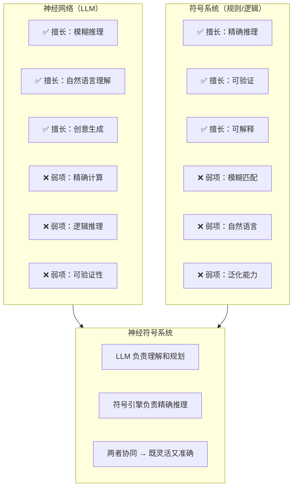
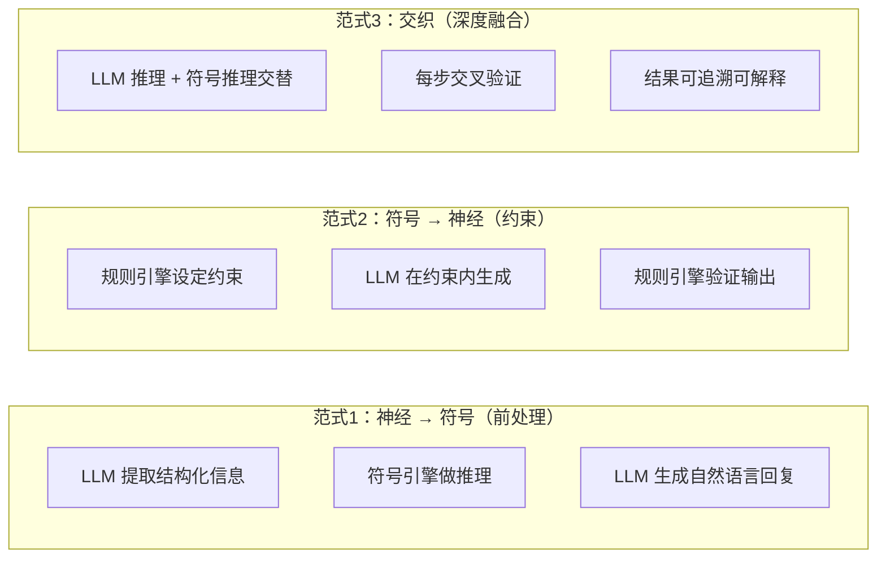
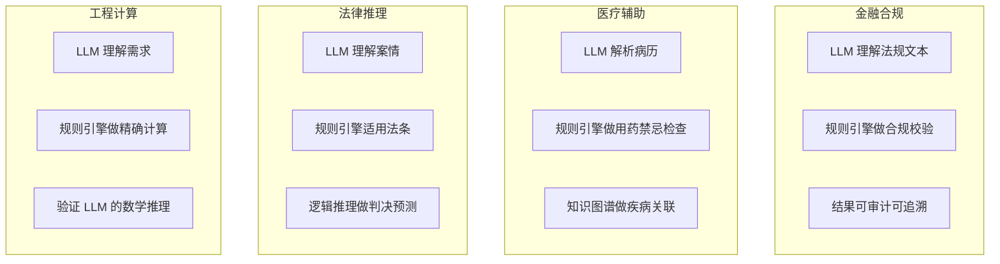

# 17 · Agent 神经符号系统

> 阶段：6 前沿 · 难度：⭐⭐⭐⭐⭐ · 预计：3 天
> 产出：理解神经符号 AI（Neuro-Symbolic AI）如何将 LLM 的模糊推理与符号逻辑的精确推理结合

---

## 你将学会

- 神经网络 vs 符号系统：各自的优缺点
- 神经符号融合的三种范式
- 在 Agent 中实现神经符号推理管线
- LLM + 规则引擎 + 知识图谱的协同方案

---

## 为什么要神经符号



---

## 知识讲解

### 1. 三种融合范式



### 2. 神经符号推理管线

```java
package demo.demo06.neurosymbolic;

import org.springframework.stereotype.Component;
import java.util.*;

/**
 * 神经符号推理引擎
 * LLM（神经）+ 规则引擎（符号）+ 知识图谱（符号）协同
 */
@Component
public class NeuroSymbolicEngine {

    private final LlmClient llmClient;
    private final RuleEngine ruleEngine;
    private final KnowledgeGraph kg;

    /**
     * 神经符号推理流程
     *
     * 示例问题："张三的部门的月度预算超标了多少？"
     *
     * Step 1: LLM 理解问题 → 提取意图和实体（神经）
     * Step 2: 知识图谱查询 → 获取"张三→部门→预算"（符号）
     * Step 3: 规则引擎计算 → 预算 - 实际 = 差值（符号）
     * Step 4: LLM 生成回复 → 自然语言总结（神经）
     */
    public ReasoningResult reason(String question, String sessionId) {
        // Step 1: LLM 提取结构化信息
        ExtractedInfo info = llmClient.extract(question);
        // info = { intent: "budget_query", entities: { person: "张三" } }

        // Step 2: 知识图谱查询
        KgResult kgResult = kg.query(info);
        // kgResult = { department: "技术部", budget: 100000, actual: 120000 }

        // Step 3: 规则引擎精确推理
        RuleResult ruleResult = ruleEngine.evaluate(kgResult);
        // ruleResult = { overBudget: true, amount: 20000, percentage: 20.0 }

        // Step 4: LLM 生成自然语言回复
        String answer = llmClient.summarize(question, ruleResult);
        // answer = "张三所在的技术部月度预算超支了 20000 元，超出 20%"

        // 返回完整的推理链（可追溯可解释）
        return new ReasoningResult(answer, List.of(
            new ReasoningStep("神经-提取", info),
            new ReasoningStep("符号-图谱查询", kgResult),
            new ReasoningStep("符号-规则计算", ruleResult),
            new ReasoningStep("神经-语言生成", answer)
        ));
    }

    /**
     * 带验证的推理（LLM 输出由符号引擎校验）
     */
    public ReasoningResult reasonWithVerification(String question) {
        // LLM 先给出答案
        String llmAnswer = llmClient.chat(question);

        // 符号引擎验证答案中的事实性陈述
        VerificationResult verification = ruleEngine.verify(llmAnswer);

        if (verification.allPassed()) {
            return ReasoningResult.direct(llmAnswer);
        }

        // 有错误 → 符号引擎纠正
        if (verification.hasFactualErrors()) {
            String corrected = llmClient.correct(llmAnswer, verification.errors());
            return ReasoningResult.corrected(llmAnswer, corrected, verification.errors());
        }

        return ReasoningResult.direct(llmAnswer);
    }
}

record ReasoningResult(
    String answer,
    List<ReasoningStep> chain,
    boolean corrected,
    List<String> errors
) {
    static ReasoningResult direct(String answer) {
        return new ReasoningResult(answer, List.of(), false, List.of());
    }
    static ReasoningResult corrected(String original, String corrected, List<String> errors) {
        return new ReasoningResult(corrected, List.of(), true, errors);
    }
}

record ReasoningStep(String type, Object data) {}
record ExtractedInfo(String intent, Map<String, Object> entities) {}
record KgResult(Map<String, Object> data) {}
record RuleResult(Map<String, Object> data) {}
record VerificationResult(boolean passed, List<String> errors) {
    boolean allPassed() { return errors.isEmpty(); }
    boolean hasFactualErrors() { return !errors.isEmpty(); }
}
```

### 3. 规则引擎集成

```java
package demo.demo06.neurosymbolic;

import org.springframework.stereotype.Component;
import java.util.*;

/**
 * 符号规则引擎
 * 精确的逻辑推理和数学计算
 */
@Component
public class RuleEngine {

    private final List<Rule> rules = new ArrayList<>();

    /**
     * 注册规则（Drools / easy-rules / 自定义）
     */
    public void register(Rule rule) {
        rules.add(rule);
    }

    /**
     * 评估：根据事实执行匹配的规则
     */
    public RuleResult evaluate(KgResult facts) {
        Map<String, Object> results = new HashMap<>(facts.data());

        for (Rule rule : rules) {
            if (rule.matches(results)) {
                Object computed = rule.execute(results);
                results.put(rule.outputKey(), computed);
            }
        }

        return new RuleResult(results);
    }

    /**
     * 验证：检查 LLM 输出中的事实性陈述
     */
    public VerificationResult verify(String llmAnswer) {
        List<String> errors = new ArrayList<>();

        // 提取 LLM 回答中的数字性陈述
        List<NumericClaim> claims = extractNumericClaims(llmAnswer);

        for (NumericClaim claim : claims) {
            // 用规则验证：计算正确答案
            Object expected = computeExpected(claim);

            if (!matches(claim.value(), expected)) {
                errors.add("数字错误：" + claim.statement()
                    + "（应为 " + expected + "，LLM 说的 " + claim.value() + "）");
            }
        }

        return new VerificationResult(errors.isEmpty(), errors);
    }

    record Rule(
        String name,
        java.util.function.Predicate<Map<String, Object>> condition,
        java.util.function.Function<Map<String, Object>, Object> action,
        String outputKey
    ) {
        boolean matches(Map<String, Object> facts) { return condition.test(facts); }
        Object execute(Map<String, Object> facts) { return action.apply(facts); }
    }

    private List<NumericClaim> extractNumericClaims(String text) {
        // 简化：用正则提取 "超支了 20000 元" 中的数字
        return List.of();
    }

    private Object computeExpected(NumericClaim claim) { return null; }
    private boolean matches(Object a, Object b) { return false; }
}

record NumericClaim(String statement, Object value) {}
```

### 4. 典型应用场景



---

## 常见坑

- ❌ **完全依赖 LLM 做计算** → LLM 算 1234 × 5678 经常出错。必须用符号引擎做精确计算
- ❌ **规则引擎太死板** → 每种情况都写规则，维护爆炸。规则只覆盖核心逻辑
- ❌ **没有验证环节** → LLM 的输出直接给用户，事实错误没有纠正
- ❌ **推理链不可追溯** → 出了问题不知道哪一步错了。必须记录完整推理链

---

## 验收检查

- [ ] 能解释神经网络与符号系统各自的优缺点
- [ ] 能实现 LLM + 规则引擎的协同推理管线
- [ ] 符号引擎能验证 LLM 输出中的事实性陈述
- [ ] 推理链可追溯可解释

---

## 下一步

→ 下一篇：[18 Agent 具身智能与机器人](18-Agent具身智能与机器人.md)
