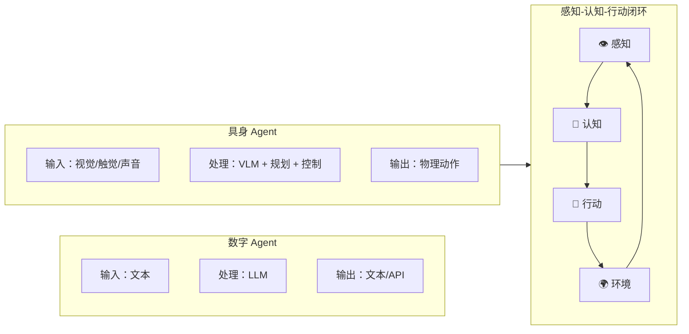
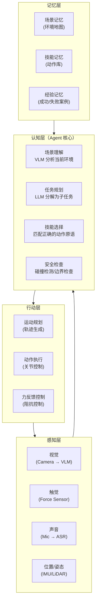
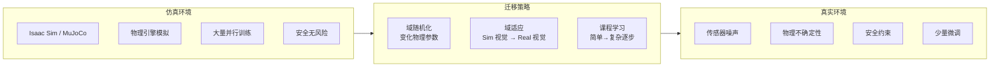
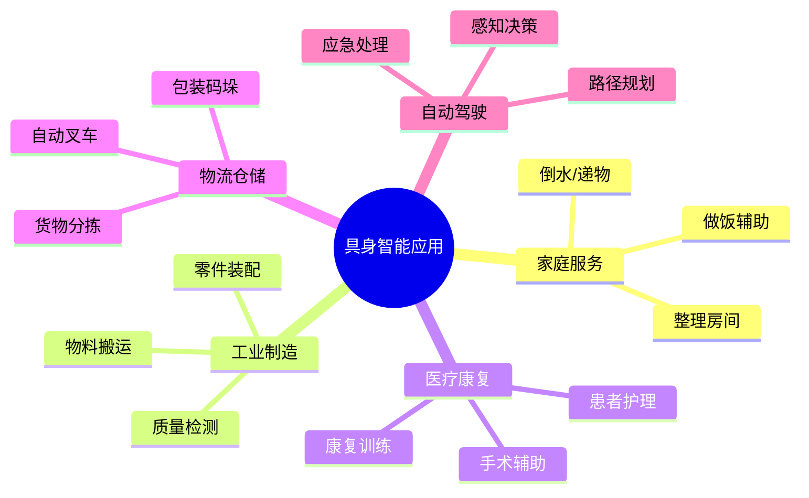

# 18 · Agent 具身智能与机器人

> 阶段：6 前沿 · 难度：⭐⭐⭐⭐⭐ · 预计：2 天
> 产出：理解具身智能（Embodied AI）如何让 Agent 从虚拟世界走向物理世界

---

## 你将学会

- 具身智能的核心概念（感知 → 认知 → 行动闭环）
- LLM/VLM 在机器人控制中的应用
- Sim-to-Real：从仿真到现实部署
- 具身 Agent 的架构设计

---

## 什么是具身智能

传统 Agent 活在数字世界——读文本、写代码、查数据库。具身智能 Agent 活在物理世界——看、听、抓取、移动。



---

## 知识讲解

### 1. 具身 Agent 架构



### 2. LLM 作为机器人大脑

```java
package demo.demo06.embodied;

import org.springframework.stereotype.Component;
import java.util.*;

/**
 * LLM 驱动的机器人任务规划器
 *
 * 示例："请帮我倒一杯水"
 * → LLM 分解为：找杯子 → 移动到杯子位置 → 抓取杯子 → 移动到饮水机 → 放置杯子 → 按出水按钮 → 取回杯子
 */
@Component
public class LlmTaskPlanner {

    /**
     * 将自然语言指令分解为可执行的技能序列
     */
    public TaskPlan plan(String instruction, SceneObservation observation) {
        // 1. VLM 分析当前场景
        String sceneDescription = describeScene(observation);

        // 2. LLM 规划
        String planPrompt = """
            你是一个机器人任务规划器。
            用户指令：%s
            当前场景：%s
            可用技能：%s

            将任务分解为技能序列。每个步骤包含：
            - skill: 技能名称
            - params: 参数
            - precondition: 前置条件
            - expected_result: 预期结果

            以 JSON 数组返回。
            """.formatted(instruction, sceneDescription, availableSkills());

        String planJson = llmClient.chat(planPrompt);
        List<TaskStep> steps = parsePlan(planJson);

        // 3. 安全校验：每个步骤都检查是否安全
        for (TaskStep step : steps) {
            SafetyCheck check = safetyChecker.check(step, observation);
            if (!check.safe()) {
                // 插入安全修正步骤
                steps.add(steps.indexOf(step), check.correctionStep());
            }
        }

        return new TaskPlan(instruction, steps);
    }

    /**
     * 执行过程中遇到意外时的重规划
     */
    public TaskPlan replan(TaskPlan originalPlan, int failedStepIndex,
                           ExecutionFailure failure) {
        String replanPrompt = """
            任务执行失败，需要调整计划。
            原始计划：%s
            失败步骤：%s
            失败原因：%s

            请生成调整后的后续步骤。
            """.formatted(originalPlan, failedStepIndex, failure.reason());

        String newSteps = llmClient.chat(replanPrompt);
        List<TaskStep> remaining = parsePlan(newSteps);

        // 保留成功的步骤 + 新的后续步骤
        List<TaskStep> combined = new ArrayList<>(
            originalPlan.steps().subList(0, failedStepIndex)
        );
        combined.addAll(remaining);

        return new TaskPlan(originalPlan.instruction(), combined);
    }

    private String describeScene(SceneObservation obs) {
        // 调用 VLM（如 GPT-4o）描述场景
        return "桌子上有一个白色杯子和一台饮水机";
    }

    private String availableSkills() {
        return "[move_to, grab, place, push, pour, open, close, lift]";
    }

    private List<TaskStep> parsePlan(String json) { return List.of(); }
}

record TaskPlan(String instruction, List<TaskStep> steps) {}
record TaskStep(String skill, Map<String, Object> params,
                String precondition, String expectedResult) {}
record SceneObservation(byte[] image, Map<String, Object> sensorData) {}
record SafetyCheck(boolean safe, TaskStep correctionStep) {}
record ExecutionFailure(String reason, Map<String, Object> context) {}
```

### 3. 动作技能库

```java
package demo.demo06.embodied;

import java.util.*;

/**
 * 机器人技能库
 * 每个技能是一个参数化的动作原语
 */
public class SkillLibrary {

    private final Map<String, Skill> skills = new HashMap<>();

    public SkillLibrary() {
        // 基础移动
        register(Skill.builder("move_to")
            .param("x", "double", "目标 X 坐标")
            .param("y", "double", "目标 Y 坐标")
            .param("speed", "double", "移动速度 m/s")
            .build());

        // 抓取
        register(Skill.builder("grab")
            .param("object", "string", "目标物体名称")
            .param("force", "double", "抓取力度 N")
            .build());

        // 放置
        register(Skill.builder("place")
            .param("object", "string", "物体名称")
            .param("location", "string", "放置位置")
            .build());

        // 倾倒
        register(Skill.builder("pour")
            .param("container", "string", "容器")
            .param("duration", "double", "倾倒时长 s")
            .build());

        // 开门
        register(Skill.builder("open_door")
            .param("direction", "string", "push/pull")
            .build());
    }

    public void register(Skill skill) {
        skills.put(skill.name(), skill);
    }

    public Skill get(String name) {
        return skills.get(name);
    }

    public List<String> listNames() {
        return new ArrayList<>(skills.keySet());
    }
}

record Skill(
    String name,
    Map<String, ParamDef> params,
    Preconditions preconditions,
    Postconditions postconditions
) {
    static Builder builder(String name) { return new Builder(name); }
    static class Builder {
        // 简化 builder
        Builder(String name) {}
        Builder param(String n, String t, String d) { return this; }
        Skill build() { return null; }
    }
}
record ParamDef(String name, String type, String description) {}
record Preconditions(List<String> conditions) {}
record Postconditions(List<String> conditions) {}
```

### 4. Sim-to-Real 迁移



---

## 典型应用场景



---

## 常见挑战

| 挑战 | 说明 | 当前进展 |
|------|------|---------|
| 感知精度 | 光照/遮挡/噪声 | VLM 大幅提升 |
| 精细操作 | 抓取/插入/旋转 | 仍主要靠模仿学习 |
| 长程规划 | 50 步以上任务 | LLM 可规划但可靠性不足 |
| 物理理解 | 重力/摩擦/弹性 | 物理引擎建模进步中 |
| 安全性 | 避免伤人/损物 | 安全是第一优先级 |

---

## 验收检查

- [ ] 能解释感知-认知-行动闭环
- [ ] 能用 LLM 将自然语言指令分解为技能序列
- [ ] 理解 Sim-to-Real 迁移的挑战
- [ ] 了解具身智能的典型应用场景

---

## 下一步

→ 下一篇：[19 Agent 脑机接口前沿](19-Agent脑机接口前沿.md)
