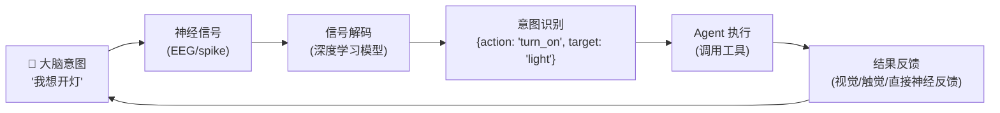
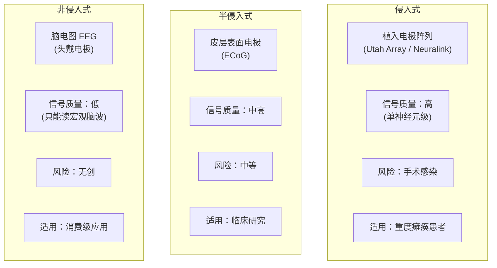
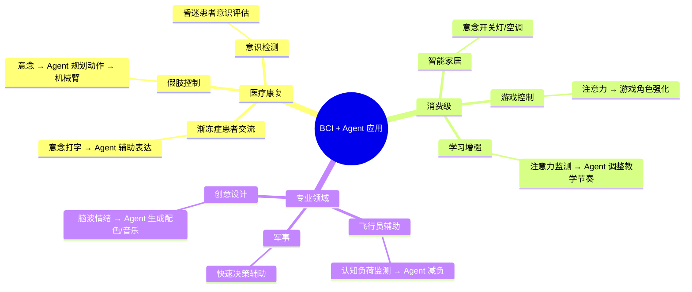
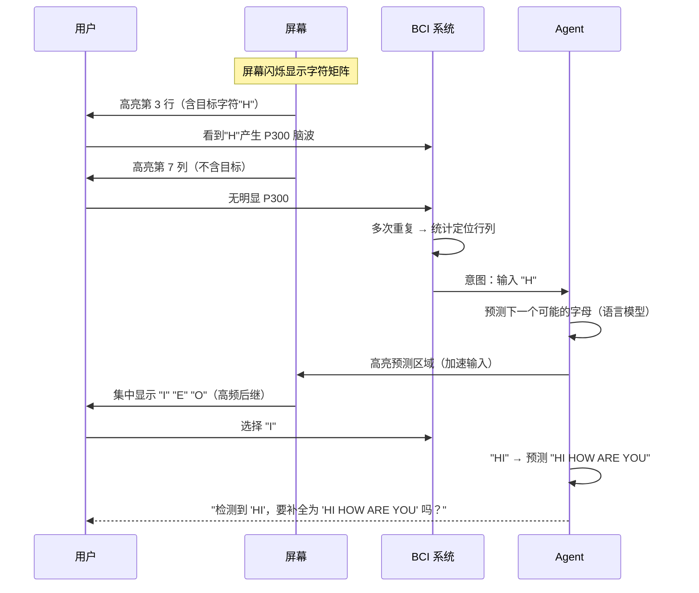
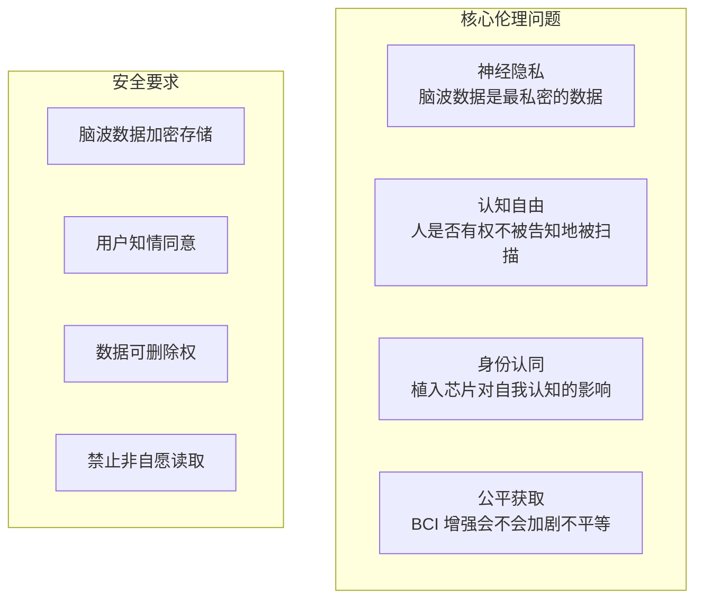

# 19 · Agent 脑机接口前沿

> 阶段：6 前沿 · 难度：⭐⭐⭐⭐⭐ · 预计：1 天
> 产出：理解脑机接口（BCI）如何与 Agent 结合，实现"意念控制 AI"

---

## 你将学会

- 脑机接口的基本原理与分类
- BCI + Agent 的协同架构
- 非侵入式 BCI 的当前能力与局限
- 伦理与隐私考量

---

## 什么是脑机接口

脑机接口（Brain-Computer Interface）直接读取大脑神经信号，绕过语言和肢体，实现**思维与机器的直接通信**。



---

## 知识讲解

### 1. BCI 分类



### 2. BCI + Agent 架构

```java
package demo.demo06.bci;

import org.springframework.stereotype.Component;
import java.util.*;

/**
 * BCI 驱动的 Agent 系统
 *
 * 流程：脑波信号 → 意图解码 → Agent 执行 → 反馈
 */
@Component
public class BciAgentSystem {

    private final IntentDecoder decoder;
    private final AgentExecutor executor;

    /**
     * 处理一帧脑波数据
     */
    public BciResponse process(BciSignal signal) {
        // 1. 信号预处理（去噪、滤波）
        BciSignal cleaned = preprocess(signal);

        // 2. 意图解码（深度学习模型）
        Intent intent = decoder.decode(cleaned);

        // 3. 置信度判断
        if (intent.confidence() < 0.7) {
            // 低置信度：请求确认（视觉提示）
            return BciResponse.confirm("检测到意图：" + intent.action()
                + "，请确认（连续两次眨眼）");
        }

        // 4. Agent 执行
        AgentResult result = executor.execute(intent);

        // 5. 反馈
        return BciResponse.success(result);
    }

    private BciSignal preprocess(BciSignal raw) {
        // 带通滤波（0.5-50Hz）、去工频干扰（50/60Hz notch）
        return raw;
    }
}

/**
 * 意图解码器
 * 将脑波信号映射为结构化意图
 */
@Component
class IntentDecoder {

    /**
     * 当前可识别的意图类型：
     * - 运动想象（左/右手/脚）→ 方向控制
     * - P300 信号 → 选择确认
     * - SSVEP（稳态视觉诱发电位）→ 多项选择
     * - 注意力水平 → 开关控制
     */
    Intent decode(BciSignal signal) {
        // 深度学习模型推理
        // EEGNet / DeepConvNet 等

        // 简化：返回模拟结果
        String action = inferAction(signal);
        double confidence = computeConfidence(signal);

        return new Intent(action, confidence, System.currentTimeMillis());
    }

    private String inferAction(BciSignal s) { return "select"; }
    private double computeConfidence(BciSignal s) { return 0.85; }
}

record BciSignal(
    float[][] channels,  // [channel][time] 多通道时序数据
    int sampleRate,       // 采样率（通常 250/500/1000 Hz）
    int channelCount      // 通道数（EEG 通常 8/16/32/64）
) {}

record Intent(String action, double confidence, long timestamp) {}
record BciResponse(String type, String message, Object data) {
    static BciResponse confirm(String msg) { return new BciResponse("confirm", msg, null); }
    static BciResponse success(Object data) { return new BciResponse("success", null, data); }
}
record AgentResult(String action, boolean success, Object output) {}
```

### 3. 典型 BCI + Agent 场景



### 4. P300 拼写器（经典 BCI 应用）



---

## 当前能力与局限

| 能力 | 当前水平 | 说明 |
|------|---------|------|
| 二分类选择 | 85-95% | 是/否、左/右 |
| 多分类（4-6类） | 70-80% | 方向控制 |
| 意念打字 | 5-20 字/分钟 | P300/SSVEP |
| 连续控制 | 初步 | 机械臂连续轨迹 |
| 语义理解 | 不可行 | 无法直接读取"想法" |

> ⚠️ BCI **不能读心**。它读取的是神经信号模式，不是语义内容。用户需要经过训练才能产生可区分的脑波模式。

---

## 伦理与隐私



---

## 验收检查

- [ ] 能解释 BCI 的三种类型（侵入式/半侵入式/非侵入式）
- [ ] 理解 BCI + Agent 的协同流程
- [ ] 知道当前非侵入式 BCI 的能力边界
- [ ] 了解 BCI 的伦理与隐私挑战

---

## 下一步

→ 下一篇：[20 Agent 可解释 AI 前沿](20-Agent可解释AI前沿.md)
