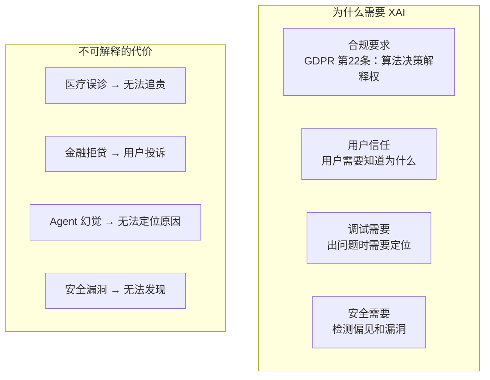
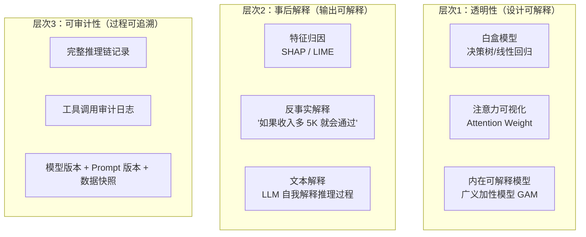
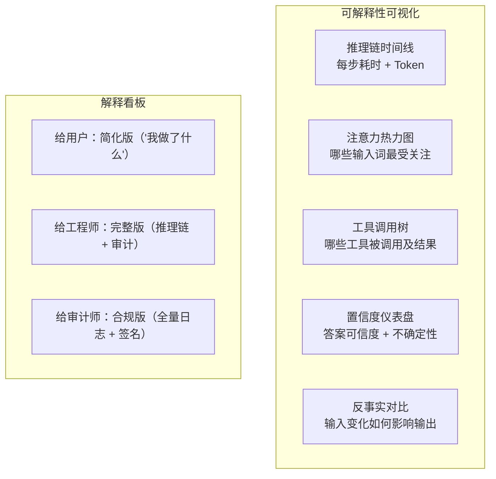
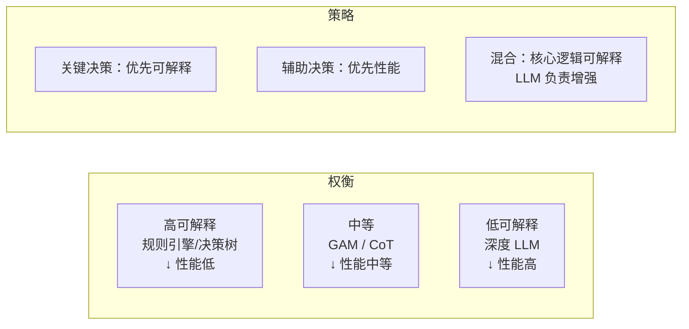

# 20 · Agent 可解释 AI 前沿

> 阶段：6 前沿 · 难度：⭐⭐⭐⭐ · 预计：2 天
> 产出：掌握 Agent 可解释性（XAI）的前沿方法——从"黑盒"到"玻璃盒"

---

## 你将学会

- 可解释 AI 的三个层次（透明性 / 可解释性 / 可审计性）
- 内在可解释 vs 事后解释
- Agent 决策的可视化与追溯
- 可解释性 vs 性能的权衡

---

## 为什么 Agent 需要可解释性



---

## 知识讲解

### 1. 可解释性三个层次



### 2. Agent 决策链追溯

```java
package demo.demo06.xai;

import org.springframework.stereotype.Component;
import java.util.*;

/**
 * Agent 决策追溯器
 * 记录 Agent 每一步决策的完整上下文，支持事后审查
 */
@Component
public class DecisionTracer {

    /**
     * 记录一次完整的 Agent 决策过程
     */
    public DecisionRecord trace(String sessionId, String turnId,
                                 List<DecisionStep> steps) {
        return new DecisionRecord(
            sessionId,
            turnId,
            steps,
            System.currentTimeMillis(),
            extractSummary(steps)
        );
    }

    /**
     * 生成决策摘要（给用户看）
     */
    public String userFriendlyExplanation(DecisionRecord record) {
        StringBuilder sb = new StringBuilder();
        sb.append("我做了以下步骤：\n");

        for (int i = 0; i < record.steps().size(); i++) {
            DecisionStep step = record.steps().get(i);
            sb.append(i + 1).append(". ").append(step.userDescription()).append("\n");
        }

        return sb.toString();
    }

    /**
     * 生成技术审计报告（给工程师看）
     */
    public AuditReport auditReport(DecisionRecord record) {
        return new AuditReport(
            record.sessionId(),
            record.turnId(),
            record.steps().size(),
            record.steps().stream()
                .map(s -> new StepAudit(
                    s.toolName(),
                    s.input(),
                    s.output(),
                    s.durationMs(),
                    s.tokenConsumed(),
                    validateOutput(s)
                )).toList(),
            calculateTotalTokens(record),
            calculateTotalCost(record)
        );
    }

    private String extractSummary(List<DecisionStep> steps) {
        return steps.size() + " steps";
    }

    private boolean validateOutput(DecisionStep step) {
        // 验证工具输出是否合理
        return true;
    }

    private int calculateTotalTokens(DecisionRecord r) {
        return r.steps().stream().mapToInt(DecisionStep::tokenConsumed).sum();
    }

    private double calculateTotalCost(DecisionRecord r) {
        return calculateTotalTokens(r) * 0.00001;
    }
}

record DecisionRecord(
    String sessionId,
    String turnId,
    List<DecisionStep> steps,
    long timestamp,
    String summary
) {}

record DecisionStep(
    String toolName,
    String input,
    String output,
    long durationMs,
    int tokenConsumed,
    String userDescription,  // 人类可读描述
    String llmReasoning      // LLM 当时为什么选这个工具
) {}

record AuditReport(
    String sessionId,
    String turnId,
    int stepCount,
    List<StepAudit> steps,
    int totalTokens,
    double totalCost
) {}

record StepAudit(String tool, String input, String output,
                 long durationMs, int tokens, boolean valid) {}
```

### 3. Chain-of-Thought 可解释性

```java
package demo.demo06.xai;

/**
 * CoT 可解释性增强
 * 让 LLM 在推理过程中显式输出思考链
 */
@Component
public class ExplainableChainOfThought {

    /**
     * 带显式推理链的 Prompt
     */
    public ExplainableResponse explainableChat(String userQuery) {
        String prompt = """
            用户问题：%s

            请按以下格式回答：
            <thinking>
            1. 分析问题：用户想知道什么
            2. 信息需求：需要哪些信息
            3. 检索策略：从哪里获取信息
            4. 推理过程：一步步推导
            5. 结论：最终答案
            </thinking>
            <answer>
            基于以上推理，回答用户问题。
            </answer>
            <sources>
            列出信息来源
            </sources>
            <confidence>
            对答案的置信度（0-1）和不确定性来源
            </confidence>
            """.formatted(userQuery);

        String response = llmClient.chat(prompt);

        // 解析结构化输出
        String thinking = extractTag(response, "thinking");
        String answer = extractTag(response, "answer");
        String sources = extractTag(response, "sources");
        String confidence = extractTag(response, "confidence");

        return new ExplainableResponse(answer, thinking, sources, confidence);
    }

    private String extractTag(String text, String tag) {
        int start = text.indexOf("<" + tag + ">") + tag.length() + 2;
        int end = text.indexOf("</" + tag + ">");
        if (start < 0 || end < 0 || start >= end) return "";
        return text.substring(start, end).trim();
    }

    private String llmClient = null; // 简化
    private String llmClient(String s) { return ""; }
}

record ExplainableResponse(
    String answer,       // 最终答案
    String reasoning,    // 完整推理链
    String sources,      // 信息来源
    String confidence    // 置信度分析
) {}
```

### 4. 特征归因（SHAP 风格）

```java
package demo.demo06.xai;

import java.util.*;

/**
 * 输入特征归因
 * 分析 LLM 输出的哪些部分受输入哪些部分影响最大
 */
@Component
public class FeatureAttribution {

    /**
     * 扰动法：逐个遮蔽输入的某些部分，观察输出变化
     */
    public List<Attribution> attribute(String input, String output) {
        List<Attribution> attributions = new ArrayList<>();

        // 将输入分成语义单元
        List<String> units = splitSemantic(input); // 按句子/段落分

        for (int i = 0; i < units.size(); i++) {
            // 遮蔽第 i 个单元
            String masked = maskUnit(input, i, units);
            String maskedOutput = llmChat(masked);

            // 计算输出差异
            double change = semanticDistance(output, maskedOutput);

            attributions.add(new Attribution(
                units.get(i),
                change,
                change > 0.5 ? "关键" : change > 0.2 ? "重要" : "次要"
            ));
        }

        // 按影响排序
        attributions.sort((a, b) -> Double.compare(b.impact(), a.impact()));

        return attributions;
    }

    /**
     * 反事实解释
     * "如果输入稍微改变，结果会怎样？"
     */
    public List<Counterfactual> counterfactuals(String input, String output) {
        List<Counterfactual> results = new ArrayList<>();

        // 生成多个微调版本
        List<String> variations = generateVariations(input);

        for (String variation : variations) {
            String varOutput = llmChat(variation);
            double similarity = semanticDistance(output, varOutput);

            if (similarity > 0.3) {
                // 输出显著不同 → 这个变化是关键因素
                results.add(new Counterfactual(
                    variation,
                    varOutput,
                    similarity,
                    "如果输入改为 '" + variation + "'，输出会变成 '" + varOutput + "'"
                ));
            }
        }

        return results;
    }

    private List<String> splitSemantic(String text) {
        return List.of(text.split("[。.！!？?]"));
    }

    private String maskUnit(String text, int idx, List<String> units) {
        return text.replace(units.get(idx), "[MASKED]");
    }

    private double semanticDistance(String a, String b) {
        // 简化：用嵌入余弦距离
        return 0.3;
    }

    private String llmChat(String input) { return ""; }
    private List<String> generateVariations(String input) { return List.of(); }
}

record Attribution(String inputUnit, double impact, String importance) {}
record Counterfactual(String changedInput, String changedOutput,
                      double divergence, String explanation) {}
```

### 5. 可解释性可视化



---

## 可解释性 vs 性能权衡



---

## 常见坑

- ❌ **解释不忠实** → LLM 给出的"解释"可能不是真实的推理过程（它擅长编造合理的故事）
- ❌ **过度简化** → 给用户的解释丢失了关键信息，造成误解
- ❌ **解释不可操作** → 解释了"为什么"但没有告诉用户"怎么办"
- ❌ **只解释成功案例** → 失败案例更需要解释，但往往被忽略

---

## 验收检查

- [ ] Agent 每步决策有完整记录（工具选择、输入、输出、耗时）
- [ ] 用户能看到简化版的决策解释（"我做了什么"）
- [ ] 工程师能看到完整的推理链和审计日志
- [ ] 有关键决策的特征归因分析
- [ ] 支持 CoT 格式的结构化推理输出

---

## 下一步

→ 理论字典：[API 网关](../理论字典/API网关.md) · [插件系统](../理论字典/插件系统.md) · [内容安全](../理论字典/内容安全审核.md)
