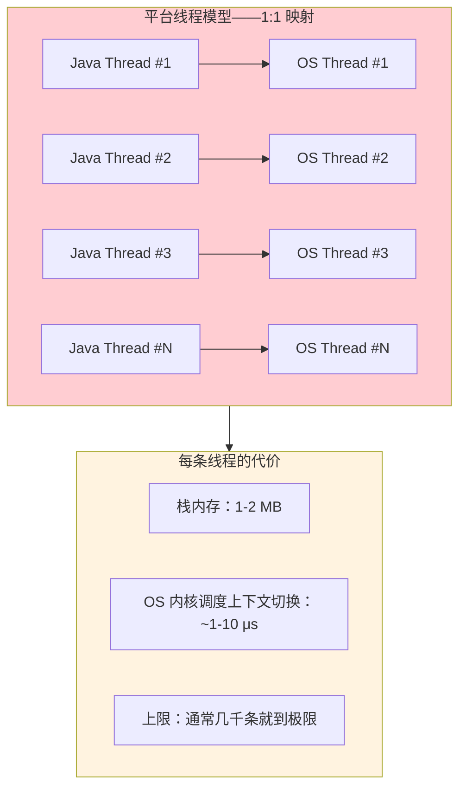
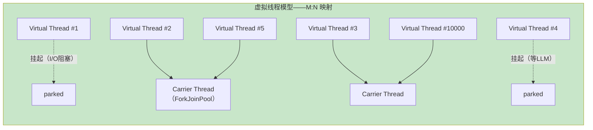
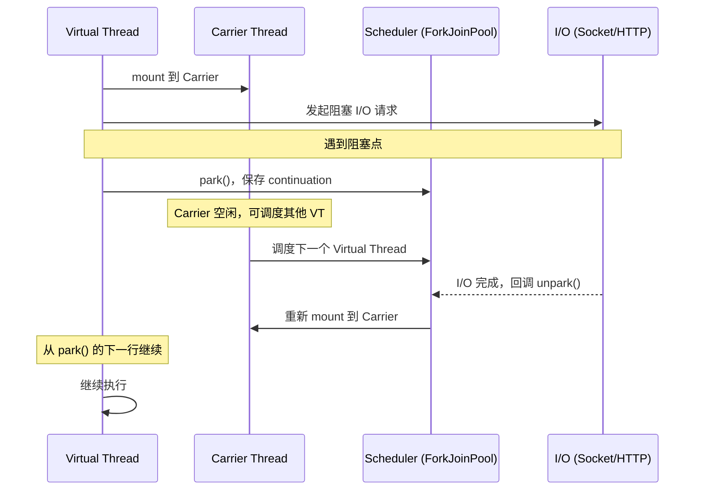
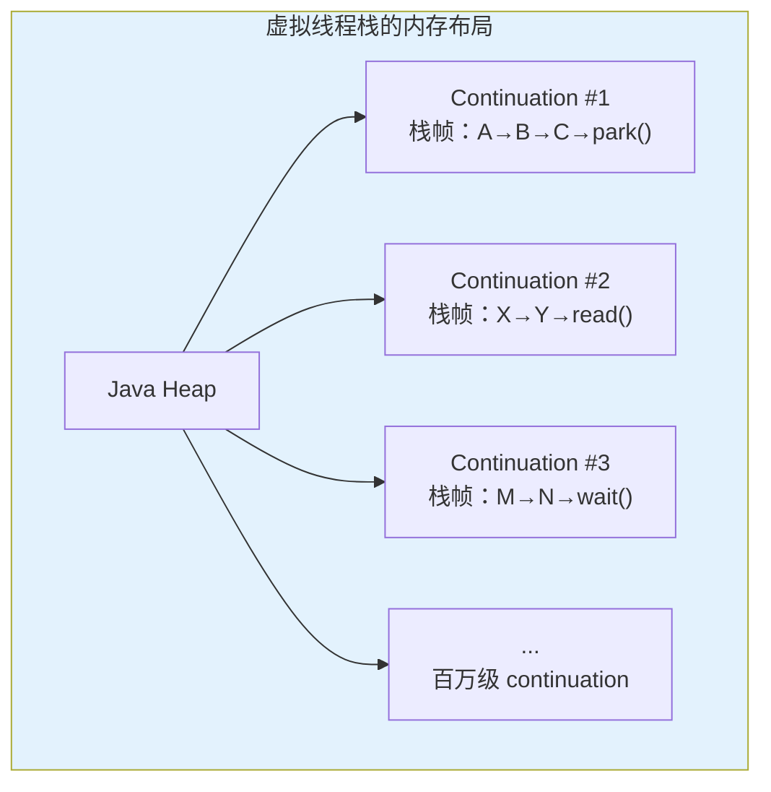
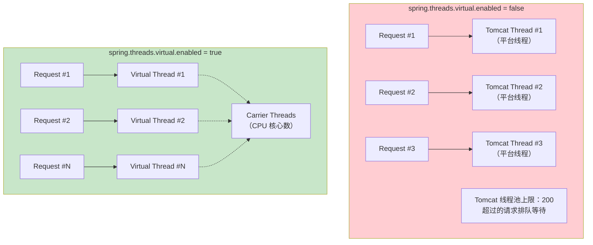
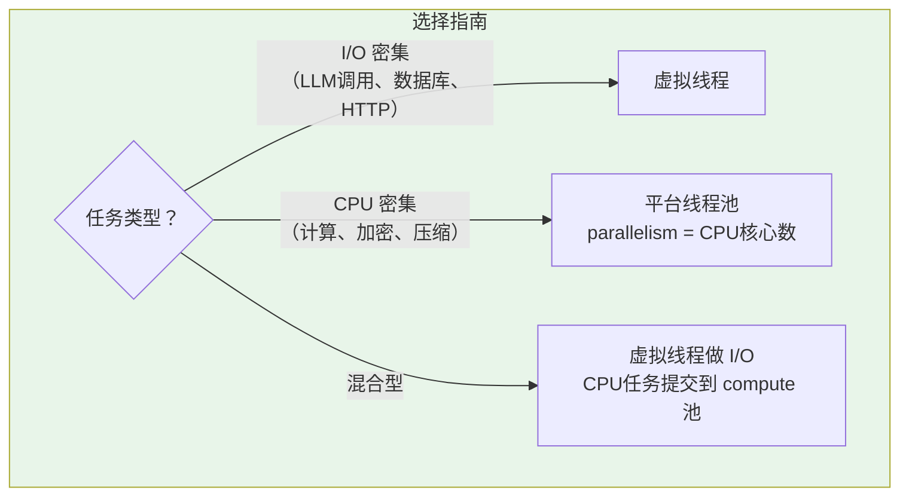
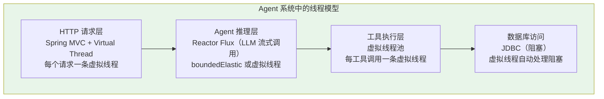

# 虚拟线程（Virtual Thread）深度解析

> 「本文是对 [教程 02-SpringAI核心机制/06-SSE流式通信 §1-§3] 的深入展开」

> **定位**：系统讲解 Java 21 Virtual Thread 的底层原理、调度机制、与平台线程的本质区别，以及在 Agent 高并发场景（SSE 流式推送、多 Agent 并行调用）中的实战应用。
>
> **读者画像**：有 Java 并发编程基础，需要理解虚拟线程在 AI Agent 架构中如何提升吞吐量的开发者。

---

## 1. 为什么需要虚拟线程

### 1.1 平台线程的瓶颈

传统 Java 线程（Platform Thread）是对操作系统线程的 1:1 封装。操作系统线程是**重量级资源**：



一个典型的 Agent 场景：用户通过 SSE 连接到服务器，每个连接占用一条线程。LLM 推理可能耗时 10-30 秒，这段时间线程在 **I/O 阻塞**中白白占用资源。10000 个并发用户 = 10000 条线程 = 10-20 GB 仅栈内存——不现实。

### 1.2 Reactor 已经解决了这个问题？

WebFlux + Reactor 确实用异步非阻塞 I/O 解决了这个问题——少量 Event Loop 线程即可支撑高并发。但代价是：

- **反应式编程的认知负荷**：`Mono`/`Flux` 操作符链难以调试、难以理解
- **"回调地狱"变体**：`flatMap` 嵌套、错误传播复杂
- **与阻塞式库的兼容性差**：JDBC、某些 SDK 仍然是阻塞的，需要 `subscribeOn(boundedElastic())`

虚拟线程给出了**第三条路**——用同步阻塞式的代码风格，获得异步非阻塞的 I/O 性能。

### 1.3 虚拟线程的核心思想



| 特性 | 平台线程 | 虚拟线程 |
|------|---------|---------|
| **映射关系** | 1:1 对 OS 线程 | M:N，多个 VT 共享少数 Carrier Thread |
| **栈内存** | 固定 1-2 MB | 劘态，按需分配（初始 ~几 KB） |
| **创建成本** | ~1 ms | ~1 μs |
| **上下文切换** | OS 内核态切换 ~1-10 μs | JVM 用户态切换 ~100 ns |
| **数量上限** | 几千 | 数百万 |
| **阻塞行为** | 阻塞 = 浪费 OS 线程 | 阻塞 = 让出 Carrier，几乎零成本 |

---

## 2. 虚拟线程的底层原理

### 2.1 continuation 与挂起点

虚拟线程的核心是一个叫做 **continuation** 的概念。你可以把 continuation 理解为"可暂停可恢复的执行栈"。

```java
// 虚拟线程的伪代码逻辑（JVM 内部实现简化）
public final class VirtualThread extends Thread {

    // continuation 封装了执行栈
    private Continuation continuation;

    // 当虚拟线程遇到阻塞操作（如 I/O read）
    void park() {
        // 1. 把当前执行栈快照保存到 continuation
        continuation.saveStack();
        // 2. 从 Carrier Thread 上卸载（unmount）
        carrierThread.currentVirtualThread = null;
        // 3. Carrier Thread 可以调度其他虚拟线程
        carrierThread.runNextVirtualThread();
    }

    // 当阻塞操作完成（如数据到达）
    void unpark() {
        // 1. 把 continuation 重新加入调度队列
        scheduler.submit(() -> {
            // 2. 在某个 Carrier Thread 上恢复（mount）
            continuation.restoreStack();
            // 3. 从 park() 的下一行继续执行
        });
    }
}
```

### 2.2 调度器：ForkJoinPool

虚拟线程默认由一个共享的 `ForkJoinPool` 调度，其 parallelism = `CPU 核心数`。这意味着：

- 同一时刻真正在 CPU 上运行的虚拟线程 = CPU 核心数
- 其余虚拟线程要么在 I/O 阻塞（已 unmount），要么在调度队列中等待



### 2.3 栈的存储：堆上的 continuation

平台线程的栈分配在 OS 的栈内存区域。虚拟线程的 continuation 存储在 **Java 堆**上：



这就是虚拟线程可以创建百万级的根本原因——continuation 的初始大小只有几 KB，远小于平台线程的 1-2 MB。

---

## 3. 创建和使用虚拟线程

### 3.1 基础 API

```java
import java.util.concurrent.Executors;

// 方式一：直接创建虚拟线程
Thread vt = Thread.ofVirtual().start(() -> {
    System.out.println("Running on: " + Thread.currentThread());
});

// 方式二：使用 newVirtualThreadPerTaskExecutor（最常用）
try (var executor = Executors.newVirtualThreadPerTaskExecutor()) {
    // 每提交一个任务，创建一条新的虚拟线程
    executor.submit(() -> callLlm("用户问题1"));
    executor.submit(() -> callLlm("用户问题2"));
    executor.submit(() -> callLlm("用户问题3"));
} // try-with-resources 自动等待所有任务完成

// 方式三：工厂方法
Thread.startVirtualThread(() -> {
    // 异步执行
});
```

### 3.2 在 Spring Boot 4.1 中启用虚拟线程

Spring Boot 从 3.2 开始原生支持虚拟线程。在 `application.yml` 中：

```yaml
spring:
  threads:
    virtual:
      enabled: true  # Tomcat/Jetty 将为每个请求创建虚拟线程
```

启用后，Spring MVC（基于 Servlet 的阻塞式模型）也能获得接近 WebFlux 的 I/O 吞吐量——因为每个 HTTP 请求跑在虚拟线程上，I/O 阻塞时自动让出 Carrier Thread。



---

## 4. 虚拟线程在 Agent 并发中的实战

### 4.1 多 Agent 并行调用

Agent 场景：用户提问后，需要同时调用多个 Agent（检索 Agent、分析 Agent、总结 Agent），然后合并结果。

```java
@Service
public class MultiAgentService {

    private final ChatClient chatClient;

    // 使用虚拟线程并行调用三个 Agent
    public AgentResult parallelAgentCall(String userQuery) {
        try (var executor = Executors.newVirtualThreadPerTaskExecutor()) {
            // 提交三个并行任务，每条都是虚拟线程
            var retrievalFuture = executor.submit(() ->
                chatClient.prompt()
                    .system("你是检索专家...")
                    .user(userQuery)
                    .call()
                    .content()
            );

            var analysisFuture = executor.submit(() ->
                chatClient.prompt()
                    .system("你是分析专家...")
                    .user(userQuery)
                    .call()
                    .content()
            );

            var summaryFuture = executor.submit(() ->
                chatClient.prompt()
                    .system("你是总结专家...")
                    .user(userQuery)
                    .call()
                    .content()
            );

            // 等待所有结果——虚拟线程阻塞等待几乎零成本
            return new AgentResult(
                retrievalFuture.get(),
                analysisFuture.get(),
                summaryFuture.get()
            );
        } catch (ExecutionException | InterruptedException e) {
            throw new AgentException("并行调用失败", e);
        }
    }
}
```

**关键点**：`retrievalFuture.get()` 是阻塞调用。在平台线程模型下，3 次 `get()` 会让 3 条线程在等待中白白浪费。在虚拟线程模型下，park 时 Carrier Thread 立即调度其他任务，三条 LLM 调用真正并行执行。

### 4.2 SSE 流式推送 + 虚拟线程

在 SSE 场景中，虚拟线程让每个用户的 SSE 连接占用极少的系统资源：

```java
@RestController
public class SseController {

    private final ChatClient chatClient;

    // Spring MVC + 虚拟线程模式下的 SSE
    // spring.threads.virtual.enabled = true 时，
    // 这个端点自动运行在虚拟线程上
    @GetMapping(value = "/chat/stream", produces = MediaType.TEXT_EVENT_STREAM_VALUE)
    public SseEmitter streamChat(@RequestParam String message) {
        // 每个连接创建一个 emitter，超时 5 分钟
        SseEmitter emitter = new SseEmitter(300_000L);

        // 在虚拟线程中执行 LLM 调用
        Thread.startVirtualThread(() -> {
            try {
                chatClient.prompt()
                    .user(message)
                    .stream()
                    .content()
                    .subscribe(chunk -> {
                        try {
                            emitter.send(SseEmitter.event().data(chunk));
                        } catch (IOException e) {
                            emitter.completeWithError(e);
                        }
                    }, emitter::complete, emitter::completeWithError);
            } catch (Exception e) {
                emitter.completeWithError(e);
            }
        });

        return emitter;
    }
}
```

### 4.3 并发工具调用

Agent 一次推理可能决定调用多个工具（如同时查天气和查股票）。虚拟线程让并行工具调用变得简单：

```java
public List<ToolResult> callToolsConcurrently(List<ToolRequest> requests) {
    try (var executor = Executors.newVirtualThreadPerTaskExecutor()) {
        // 提交所有工具调用
        var futures = requests.stream()
            .map(req -> executor.submit(() -> executeTool(req)))
            .toList();

        // 等待所有结果
        return futures.stream()
            .map(this::safeGet)
            .toList();
    }
}

private ToolResult safeGet(Future<ToolResult> future) {
    try {
        return future.get(30, TimeUnit.SECONDS);
    } catch (Exception e) {
        return ToolResult.error("工具执行超时或失败: " + e.getMessage());
    }
}
```

---

## 5. 虚拟线程的"坑"——什么操作不会 unmount

虚拟线程在遇到**常规阻塞 I/O**（Socket read/write、`InputStream.read`、`Thread.sleep`）时会自动 unmount。但有几种情况不会：

### 5.1 `synchronized` 块内阻塞

```java
// 问题：synchronized 块内的 I/O 阻塞会导致虚拟线程"pin"
// 虚拟线程被"钉"在 Carrier Thread 上，无法 unmount
public synchronized String fetchData() {  // synchronized 方法
    return httpClient.send(request, BodyHandlers.ofString()); // 阻塞 I/O 在锁内
    // 此时虚拟线程无法 unmount，Carrier Thread 被占用
}
```

**解决方案**：使用 `ReentrantLock` 替代 `synchronized`：

```java
private final ReentrantLock lock = new ReentrantLock();

public String fetchData() {
    lock.lock();
    try {
        return httpClient.send(request, BodyHandlers.ofString());
        // ReentrantLock 内的阻塞不会 pin 虚拟线程
    } finally {
        lock.unlock();
    }
}
```

> **注意**：Java 21 中 `synchronized` 会导致 pin。Java 24（JEP 491）移除了这一限制，但如果你使用 Java 21 LTS，仍需注意。

### 5.2 JNI / 本地方法中的阻塞

调用本地方法（JNI）时的阻塞操作不会触发 unmount。这在 Agent 场景中不常见，但需注意某些原生 SDK。

### 5.3 CPU 密集型任务

虚拟线程的收益在于 **I/O 阻塞场景**。如果你的任务是 CPU 密集型（如大矩阵计算），虚拟线程不会带来任何收益——CPU 就那么多，Carrier Thread 也就那么多。CPU 密集型任务应该用 `ForkJoinPool` 或平台线程池。



---

## 6. 性能基准：虚拟线程 vs 平台线程 vs WebFlux

以下是 Agent 场景（每请求 = 一次 LLM 调用，耗时约 3 秒）的典型基准数据：

| 模型 | 1000 并发 | 5000 并发 | 10000 并发 | 内存消耗 | 编程模型复杂度 |
|------|----------|----------|-----------|---------|--------------|
| **Spring MVC + 平台线程** | 正常 | 线程池耗尽，请求排队 | 线程池耗尽，大量超时 | 高（200 × 2MB = 400MB 栈） | 同步阻塞，最简单 |
| **Spring WebFlux + Reactor** | 正常 | 正常 | 正常 | 低（Event Loop ~几十 MB） | 异步反应式，复杂 |
| **Spring MVC + 虚拟线程** | 正常 | 正常 | 正常 | 低（10000 × 几 KB = 几十 MB） | 同步阻塞，最简单 |

**关键结论**：虚拟线程让"同步阻塞式编程"获得了"异步非阻塞式性能"，是 Agent 应用并发处理的**最佳选择**。

---

## 7. 虚拟线程在 Agent 架构中的整体位置



Agent 系统的每一层都大量存在 I/O 阻塞（HTTP 请求等待、LLM 推理等待、工具调用等待、数据库查询等待）。虚拟线程在这些场景下都能自动 unmount，让 Carrier Thread 去服务其他请求。

---

## 8. 与 WebFlux 的协作

一个常见问题：**开启了虚拟线程还需要 WebFlux 吗？** 两者并不互斥：

| 场景 | 推荐 |
|------|------|
| 新项目，主要做 CRUD + 简单 LLM 调用 | Spring MVC + Virtual Thread（同步风格更简洁） |
| 需要 SSE 流式推送 + 复杂流操作（merge、combine、backpressure） | WebFlux + Reactor（流式操作更强大） |
| 混合场景 | WebFlux 做流式编排，内部用 `flatMap` 提交到虚拟线程做阻塞操作 |

在 Spring AI 中，`ChatClient.stream()` 返回 `Flux<ChatClientResponse>`（每个元素是包装了 `ChatResponse` 的流式块），通过 `.content()` 才能拿到 `Flux<String>` 文本流。即使你的主框架是 Spring MVC + Virtual Thread，在需要流式输出的 Controller 中仍然可以使用 Flux：

```java
// Spring MVC + Virtual Thread 也能返回 Flux
@GetMapping(value = "/chat/stream", produces = MediaType.TEXT_EVENT_STREAM_VALUE)
public Flux<String> streamChat(@RequestParam String message) {
    return chatClient.prompt()
        .user(message)
        .stream()
        .content();
    // Spring MVC 会自动把 Flux 转为 SSE 流
}
```

---

## 9. 监控和调试虚拟线程

### 9.1 查看虚拟线程状态

```bash
# jcmd 可以查看虚拟线程信息
jcmd <pid> Thread.dump_to_file -format=json threads.json

# jstack / jcmd Thread.print 会标记虚拟线程
jcmd <pid> Thread.print
```

### 9.2 Micrometer 监控

Spring Boot 4.1 通过 Micrometer 自动暴露虚拟线程相关指标：

```java
@Bean
public MeterBinder virtualThreadMetrics() {
    return registry -> {
        // jvm.threads.virtual.live
        // jvm.threads.virtual.peak
        // 这些指标会自动注册
    };
}
```

在 Grafana 中可以看到虚拟线程的活跃数量、峰值，帮助你判断系统的并发负载。

---

## 10. 总结

虚拟线程是 Java 并发编程的一次范式转换。在 Agent 应用中，它解决了最核心的矛盾——**I/O 密集场景下的高并发吞吐 vs 编程简单性**。

核心要点回顾：

1. **原理**：虚拟线程通过 continuation 实现 M:N 调度，阻塞时自动 unmount，Carrier Thread 可服务其他虚拟线程
2. **启用**：Spring Boot 4.1 只需 `spring.threads.virtual.enabled=true`
3. **Agent 并发**：多 Agent 并行调用、工具并发执行、SSE 连接管理，都能用同步阻塞风格编写
4. **注意事项**：Java 21 中 `synchronized` 块内阻塞会 pin 虚拟线程，用 `ReentrantLock` 替代
5. **与 WebFlux 关系**：虚拟线程不替代 WebFlux，两者互补——WebFlux 擅长流编排，虚拟线程擅长简化阻塞 I/O 代码

在后续教程中，SSE 流式通信的并发管理、多 Agent 协作的并行调度，都可以直接享受虚拟线程带来的简洁和高效。
