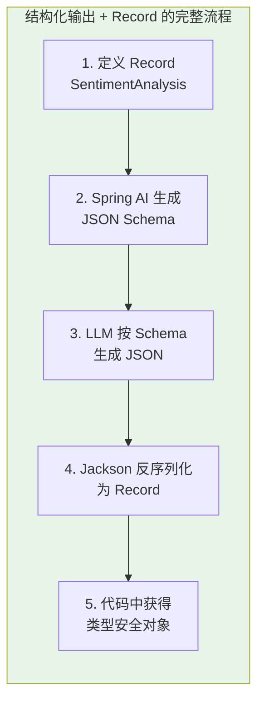
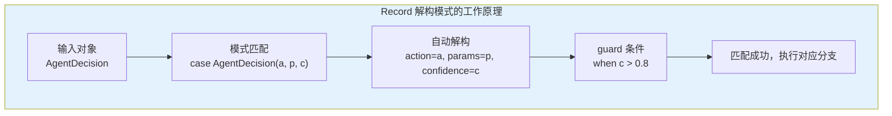
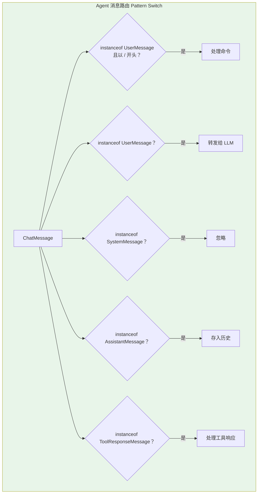
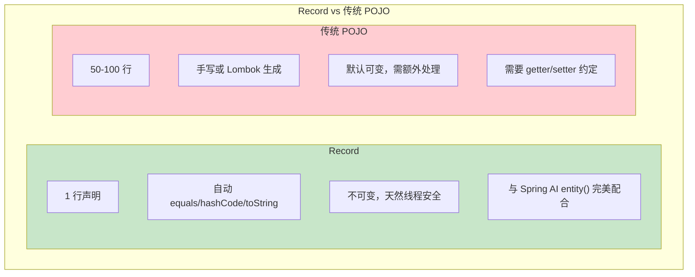

# Record、Pattern Matching 与 Switch 表达式在 Agent 领域模型中的应用

> 「本文是对 [教程 13-结构化输出 §2-§4] 的深入展开」

> **定位**：系统讲解 Java 21 的 Record、Pattern Matching（模式匹配）、Switch 表达式三大特性，以及它们在 Agent 领域模型设计、结构化输出映射、消息类型建模中的实际应用。
>
> **读者画像**：有 Java 基础，想了解新特性如何让 Agent 代码更简洁、更安全的开发者。

---

## 1. Record：不可变数据载体的革命

### 1.1 传统 Java 数据类的问题

在 Agent 系统中，到处都是"数据对象"——用户消息、Agent 决策、工具调用结果、LLM 响应。用传统 Java 类写：

```java
// 传统写法：70+ 行只为描述一个简单的数据结构
public class AgentDecision {
    private final String action;
    private final Map<String, Object> parameters;
    private final String reasoning;
    private final double confidence;

    public AgentDecision(String action, Map<String, Object> parameters,
                        String reasoning, double confidence) {
        this.action = action;
        this.parameters = parameters;
        this.reasoning = reasoning;
        this.confidence = confidence;
    }

    public String getAction() { return action; }
    public Map<String, Object> getParameters() { return parameters; }
    public String getReasoning() { return reasoning; }
    public double getConfidence() { return confidence; }

    @Override
    public boolean equals(Object o) { /* 30 行 */ }

    @Override
    public int hashCode() { /* 10 行 */ }

    @Override
    public String toString() { /* 10 行 */ }
}
```

### 1.2 Record 的简洁写法

```java
// Record 写法：1 行
public record AgentDecision(
    String action,
    Map<String, Object> parameters,
    String reasoning,
    double confidence
) {}
```

一行代码，编译器自动生成：构造方法、访问器（`action()` 而非 `getAction()`）、`equals()`、`hashCode()`、`toString()`。

### 1.3 Record 在 Agent 结构化输出中的实战

Spring AI 的结构化输出（Structured Output）天然契合 Record。LLM 返回 JSON，Spring AI 直接反序列化为 Record：

```java
// 定义结构化输出的 Record
public record SentimentAnalysis(
    String sentiment,       // POSITIVE / NEGATIVE / NEUTRAL
    double confidence,      // 0.0 - 1.0
    List<String> keywords,  // 关键词列表
    String summary          // 摘要
) {}

// ChatClient 直接映射
@GetMapping("/analyze")
public SentimentAnalysis analyze(@RequestParam String text) {
    return chatClient.prompt()
        .system("分析用户输入文本的情感倾向，以JSON格式返回。")
        .user(text)
        .call()
        .entity(SentimentAnalysis.class);  // 直接得到 Record
}
```



### 1.4 紧凑构造器：参数验证

Agent 系统对数据正确性要求很高。Record 的紧凑构造器（Compact Constructor）可以加入验证逻辑：

```java
public record AgentDecision(
    String action,
    Map<String, Object> parameters,
    String reasoning,
    double confidence
) {
    // 紧凑构造器：验证逻辑
    public AgentDecision {
        Objects.requireNonNull(action, "action 不能为空");
        Objects.requireNonNull(reasoning, "reasoning 不能为空");
        if (confidence < 0.0 || confidence > 1.0) {
            throw new IllegalArgumentException(
                "confidence 必须在 0.0-1.0 之间，实际: " + confidence
            );
        }
        // 防御性拷贝
        parameters = parameters == null
            ? Map.of()
            : Map.copyOf(parameters); // 不可变拷贝
    }
}
```

### 1.5 Record 的关键限制

| 特性 | 支持？ | 说明 |
|------|--------|------|
| 继承其他类 | 不支持 | Record 隐式 final，不能 extends |
| 被其他类继承 | 不支持 | Record 隐式 final |
| 实现接口 | 支持 | `record Point(...) implements Comparable<Point>` |
| 可变字段 | 不支持 | 所有字段隐式 final |
| 添加额外字段 | 不支持（实例字段） | 只能有组件声明的字段 |
| 添加静态字段/方法 | 支持 | 可以添加 static 成员 |
| 添加实例方法 | 支持 | 可以添加自定义方法 |

---

## 2. Pattern Matching：类型安全的解构

### 2.1 instanceof 模式匹配

Agent 系统中经常需要处理不同类型的消息。传统写法：

```java
// 传统写法：冗余的类型转换
public String handleMessage(Object message) {
    if (message instanceof UserMessage) {
        UserMessage um = (UserMessage) message;  // 显式转型
        return "用户: " + um.getText();
    } else if (message instanceof SystemMessage) {
        SystemMessage sm = (SystemMessage) message;
        return "系统: " + sm.getText();
    } else if (message instanceof AssistantMessage) {
        AssistantMessage am = (AssistantMessage) message;
        return "AI: " + am.getText();
    }
    return "未知消息";
}
```

Java 21 的模式匹配写法：

```java
// 模式匹配：类型 + 变量绑定一步到位
public String handleMessage(Object message) {
    if (message instanceof UserMessage um) {
        return "用户: " + um.getText();
    } else if (message instanceof SystemMessage sm) {
        return "系统: " + sm.getText();
    } else if (message instanceof AssistantMessage am) {
        return "AI: " + am.getText();
    }
    return "未知消息";
}
```

### 2.2 Record 解构模式（Java 21 预览特性）

Java 21 引入了 Record 解构模式，可以直接"拆开"Record：

```java
// 假设有如下 Record
public record AgentDecision(String action, Map<String, Object> params, double confidence) {}

// Record 解构模式（Java 21+, --enable-preview）
public String describe(Object obj) {
    return switch (obj) {
        case AgentDecision(String action, Map<String, Object> params, double conf)
            when conf > 0.8 -> "高置信决策: " + action;
        case AgentDecision(String action, Map<String, Object> params, double conf)
            when conf > 0.5 -> "中置信决策: " + action;
        case AgentDecision(String action, Map<String, Object> params, double conf)
            -> "低置信决策: " + action + "（需人工审核）";
        default -> "非决策对象";
    };
}
```



---

## 3. Switch 表达式：更强大的分支控制

### 3.1 传统 switch 的问题

```java
// 传统 switch：容易忘 break，无法返回值
public String handleAction(String action) {
    String result;
    switch (action) {
        case "SEARCH":
            result = executeSearch();
            break;  // 忘记 break 就会 fall-through！
        case "CALCULATE":
            result = executeCalc();
            break;
        case "REPLY":
            result = generateReply();
            break;
        default:
            result = "未知操作";
            break;
    }
    return result;
}
```

### 3.2 Switch 表达式（Java 14+ 稳定）

```java
// Switch 表达式：箭头语法，无 fall-through，可直接返回值
public String handleAction(String action) {
    return switch (action) {
        case "SEARCH" -> executeSearch();
        case "CALCULATE" -> executeCalc();
        case "REPLY" -> generateReply();
        default -> "未知操作";
    };
}
```

### 3.3 Pattern Switch：Agent 消息路由的终极武器

Java 21 的 switch 支持类型模式（Type Pattern），这是 Agent 消息路由的最佳工具：

```java
public Mono<String> routeMessage(ChatMessage message) {
    return switch (message) {
        // 类型 + 条件守卫
        case UserMessage um when um.getText().startsWith("/") -> {
            // 命令消息
            yield handleCommand(um.getText());
        }
        case UserMessage um -> {
            // 普通用户消息
            yield chatClient.prompt()
                .user(um.getText())
                .retrieve()
                .content();
        }
        case SystemMessage sm -> {
            // 系统消息不转发给 LLM
            yield Mono.just("[系统消息已忽略]");
        }
        case AssistantMessage am -> {
            // AI 之前的回复
            yield Mono.just("[历史回复: " + am.getText() + "]");
        }
        case ToolResponseMessage trm -> {
            // 工具响应消息
            yield handleToolResponse(trm);
        }
        default -> Mono.just("[未处理的消息类型]");
    };
}
```



### 3.4 穷举性检查（Exhaustiveness）

当 switch 的目标类型是密封类或 sealed interface 时，编译器会做穷举性检查——如果你遗漏了某个分支，编译器报错。这为 Agent 系统提供了**编译时安全保障**。

```java
// 假设 AgentState 是密封接口（见下一篇 Sealed Classes）
public String describeState(AgentState state) {
    return switch (state) {
        case Idle idle -> "Agent 空闲中";
        case Thinking thinking -> "Agent 正在推理";
        case ToolExecuting executing -> "Agent 正在执行工具";
        case WaitingApproval waiting -> "Agent 等待人工审批";
        case Completed completed -> "Agent 已完成";
        case Failed failed -> "Agent 执行失败";
        // 如果遗漏了任何一个子类，编译器报错！
    };
}
```

---

## 4. 实战：完整的 Agent 领域模型

让我们把 Record + Pattern Matching + Switch 三者结合，构建一个完整的 Agent 决策领域模型：

```java
// ==== 1. 领域模型：使用 Record 定义不可变数据 ====

// Agent 的结构化决策结果
public record AgentDecision(
    DecisionType type,
    String action,
    Map<String, Object> parameters,
    String reasoning,
    double confidence
) {
    public enum DecisionType {
        TOOL_CALL,      // 调用工具
        FINAL_ANSWER,   // 最终回答
        CLARIFICATION,  // 需要用户澄清
        ERROR           // 错误
    }

    public AgentDecision {
        Objects.requireNonNull(type);
        Objects.requireNonNull(action);
        parameters = parameters == null ? Map.of() : Map.copyOf(parameters);
        if (confidence < 0 || confidence > 1) {
            throw new IllegalArgumentException("confidence 范围错误");
        }
    }

    // 便捷工厂方法
    public static AgentDecision toolCall(String tool, Map<String, Object> params,
                                          String reason, double conf) {
        return new AgentDecision(DecisionType.TOOL_CALL, tool, params, reason, conf);
    }

    public static AgentDecision finalAnswer(String answer, String reason, double conf) {
        return new AgentDecision(DecisionType.FINAL_ANSWER, answer, Map.of(), reason, conf);
    }

    // 实例方法
    public boolean isHighConfidence() {
        return confidence >= 0.8;
    }
}

// ==== 2. 决策处理器：使用 Pattern Switch ====

public class DecisionHandler {

    public Mono<String> handle(AgentDecision decision) {
        return switch (decision.type()) {
            case TOOL_CALL -> handleToolCall(decision);
            case FINAL_ANSWER -> Mono.just(decision.action());
            case CLARIFICATION -> Mono.just("需要澄清: " + decision.action());
            case ERROR -> Mono.error(new AgentException(decision.action()));
        };
    }

    private Mono<String> handleToolCall(AgentDecision decision) {
        // 二级模式匹配：根据 action 进一步路由
        return switch (decision.action()) {
            case "search_web" -> executeWebSearch(decision.parameters());
            case "query_database" -> executeDbQuery(decision.parameters());
            case "send_email" -> executeEmail(decision.parameters());
            default -> Mono.error(new UnknownToolException(decision.action()));
        };
    }
}

// ==== 3. 与 Spring AI 结构化输出结合 ====

@RestController
@RequestMapping("/agent")
public class AgentController {

    private final ChatClient chatClient;
    private final DecisionHandler handler;

    @PostMapping("/decide")
    public Mono<String> decide(@RequestBody String userQuery) {
        // LLM 返回结构化决策
        AgentDecision decision = chatClient.prompt()
            .system("""
                你是一个 Agent 决策器。根据用户输入，决定下一步操作。
                可选动作：search_web, query_database, send_email, 或直接回答。
                """)
            .user(userQuery)
            .call()
            .entity(AgentDecision.class);

        // 使用 pattern switch 处理决策
        return handler.handle(decision);
    }
}
```

---

## 5. Record 与 JSON 序列化的注意事项

### 5.1 Jackson 对 Record 的支持

Jackson 2.12+ 完整支持 Record。但有一个关键点：**Jackson 默认使用构造方法参数名进行反序列化**，需要编译时保留参数名（`-parameters`）。

```xml
<plugin>
    <groupId>org.apache.maven.plugins</groupId>
    <artifactId>maven-compiler-plugin</artifactId>
    <configuration>
        <parameters>true</parameters>  <!-- 保留参数名 -->
    </configuration>
</plugin>
```

### 5.2 Record 与 JSON 别名

```java
// 有时 JSON 字段名与 Java 命名规范不同
public record AgentResponse(
    @JsonProperty("user_input") String userInput,
    @JsonProperty("ai_response") String aiResponse,
    @JsonProperty("tokens_used") int tokensUsed
) {}
```

### 5.3 嵌套 Record

Record 可以嵌套，构建复杂的领域模型：

```java
public record ChatSession(
    String sessionId,
    User user,
    List<Turn> turns,
    Metadata metadata
) {
    public record User(String id, String name, String role) {}
    public record Turn(UserMessage user, AssistantMessage assistant, List<ToolCall> tools) {}
    public record ToolCall(String name, Map<String, Object> arguments, String result) {}
    public record Metadata(Instant createdAt, int totalTokens, double cost) {}
}
```

---

## 6. 与传统 POJO 的对比



| 维度 | Record | 传统 POJO (Lombok) |
|------|--------|-------------------|
| 代码量 | 极少（1-3 行） | 中等（需 @Data 注解） |
| 不可变性 | 默认不可变 | 需要 @Value |
| 可继承性 | 不可继承/被继承 | 正常继承 |
| 序列化 | Jackson 原生支持 | Jackson 原生支持 |
| Spring AI entity() | 完美支持 | 完美支持 |
| 模式匹配解构 | 支持 | 不支持 |
| 灵活性 | 低（不可变） | 高（可变） |

**选型建议**：Agent 系统中的 DTO、VO、领域事件、结构化输出模型——优先用 Record。需要复杂继承体系或 JPA Entity 时，用传统类。

---

## 7. 总结

Java 21 的 Record、Pattern Matching 和 Switch 表达式三者协同，为 Agent 领域模型设计带来了质变：

1. **Record** 让数据载体的定义从 50 行降到 1 行，不可变性保证线程安全，完美适配 Spring AI 结构化输出
2. **Pattern Matching** 消除了类型检查后的冗余转型，Record 解构模式让数据提取一步到位
3. **Switch 表达式 + Pattern Switch** 让 Agent 消息路由、决策处理更加清晰安全，穷举性检查提供编译时保障

这三者的组合不是"语法糖"——它们改变了 Agent 领域模型的设计方式。在结构化输出（教程 12）、Agent 状态管理（教程 11）、多 Agent 协作（教程 08）中，Record + Pattern Matching 都是代码简洁性和类型安全性的基石。
